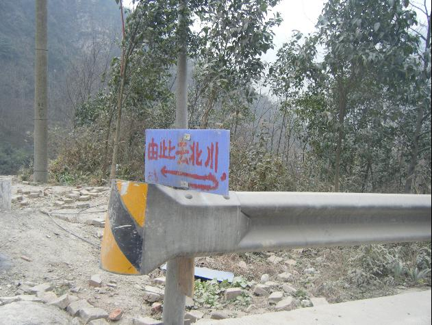
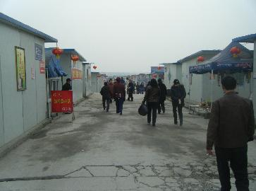
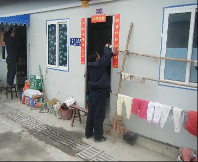

<!-- # 通往北川之路 -->

# 通往北川之路 ---地震八个月之后的灾区见闻（绵阳—安县—北川）

##  文 / 北京外国语学院学生

### 一． 访绵阳

时间是2009年1月21日上午，汶川地震大半年之后。伴随清晨朦胧的阳光，车队在薄雾中前行。我们从成都出发，载着一些过冬用的棉衣棉袜，前往初始目的地——绵阳市郊的永兴板房区。这里安置了大约六千名北川曲山镇难民。曲山镇原是北山县城所在，在地震中被三面崩塌的山石掩埋，大半的市民今天仍在瓦砾之下。

大约上午10点50左右，我们到达永兴板房区。据说因为离绵阳市区非常近，这是目前条件最好的板房区。板房均用白色轻钢搭建，覆以蓝色屋顶。平均一个家庭所拥有的空间大约20平米。一般布置是家居什物放门口一侧，另一侧放座椅板凳。内里拉上帘子，帘子后面放置床位。板房间间相依，形成聚落与小巷。歇息、储物与睡觉，是目前这些私人空间的基本功能。

我们顺着主路往中心广场走，浏览幸存者现在的生活环境受条件的限制，如厕、洗澡、做饭等需求只能采取公共厕所、厨房、浴室的办法解决。其数量分布大约是一条小街一个，即约十余二十户分享一个。

与生活设施同步的还有提供基本生存保障的水、电、气供应。

主要街道上有些摆摊的小贩，以贩卖蔬果鱼肉等食物居多，略有杂货，几乎没有衣物和大宗的商品。

时值春节前夕，板房区却显得略有萧条，入口处不断有年轻人提着行李离去。后来问及当地人他们的去向，说是过年要回曲山镇烧纸祭拜。与此相对，也有不少人留守，正忙着贴春联或在街上购置年货。灾难过去毕竟半年了，春节是照常要过的。观察街上的行人，留下来的大多是中老年人和孩子。他们也是此次援助的主要对象。

除去生活必须的设施和商品外，板房区亦有美容中心、储蓄所、计生用品店、网吧、苗圃等设施，各种社区服务看上去已经初具规模。沿途的墙壁上贴了不少趁机招工的广告，包括招聘远洋船员的，可能是因为当地人群起找工作带来的机遇。我们询问了一名当地卫生所的老大娘，她介绍说这里生活还行，有吃有住，而且冬天屋里不会冷。当她低头提到有多位亲人在地震中遇难时，我们没有再问下去。

我们路过社区居委会的办公室，这里的隔壁就是储藏救济物资的地方。主要物资是过冬的棉被。墙壁上有一个手写的物资分配方案，比较详细地将工作落实到人，并且列举了发放对象和领取的要求。

从储物仓库看进去，仍然有数十床棉被没有分发。不知是因为救灾物资太多还是由于一人没有领取必须的户籍卡。

靠近定居点中心有一处公共聚会的房间。我们到达的时候这里正在开展讲座，主题是灾后女性身心健康。在座的大多是中老年妇女，其中许多经历了丧子之痛，却因为年龄问题难以再生育。不久之后的报纸登道，在北川幸存者中，这样的妇女自杀比比皆是。

10点50左右，我们到达定居点中心。发放物资的地方是管委会办公室门前，这里有一个小广场可用来停车放置物品。发放物品的对象是中老年妇女，已经委托当地妇联主任提前通知时间和地点。

由于当地妇联未能准确通知，发放物品的活动推迟到了大约11点一刻进行。许多才得知消息的当地妇女在家人陪同下涌向广场，人数一时比较多。由于没有设置验证措施与区域划分，发放人员有些手忙脚乱。

还好活动进行得比较有序，活动初期到场的许多中老年妇女如愿领到了物资。

不过随着活动的继续，人越来越多而物品越来越少，局面开始有些不受控制。一些并非此次援助对象的年轻人开始偷拿物品。而当人们发现分发的箱子快空掉时，尤其是一些还亲属未拿到物资的年轻人，群起往前拥挤，有两度险些造成哄抢的场面，幸而制止及时，未出什么茬子。最后连箱子和装捆的绳子也被当地人分走，地上散落着包装盒与垃圾纸屑。

一同协助维持现场秩序的，除了当地管委会人员外，还有“希望九洲”志愿者团队。他们大多来自外地，有些甚至来自外省，都是年轻人，包括在校大学生。

我有幸结识一位来自成都、与自己年龄相仿的志愿者小陈。当时她推着轮椅送一名孤寡老人前来领取物品，周围的老人都向她报以善意的问候，仿佛问候自己的晚辈亲人。她领我们参观志愿者之家，课表上写着她负责教授的英语课程。

板房区为志愿者专辟了几间小屋以供住宿，与志愿者中心毗邻的是他们任教的“儿童友好家园”。教育儿童与照顾老人，是他们在此的主要志愿项目。临时学校有供孩子们上课的教室，一个小小的游戏池，一个乒乓球桌，一个鲜有乐器的音乐室，一个满是旧书的图书室，里面除了破破烂烂的旧书，最醒目的是一张写满祝福与关怀的宣传板。谈到板房区的境况时，她感叹说要过年了，大部分人都选择回家，能够留守的人屈指可数，只剩她们几个。闲聊中来回转悠，看到写满字的宣传板与简单可爱的课表，不禁鼻子有些酸。也许这些微弱而坚强的努力，正是“希望九洲志愿者”所指的希望所在。

坐车离开永安板房区的时候，已是大约中午12点半，走之前当地女工与妇联因为工作报酬的问题发生了争执，互相以家人遇难之不幸为争吵砝码。我们既不明就里也无力解决，只有默默离开。

此时薄雾散去，天空却阴霾依旧。车队就下一步的目标发生了分歧。最终我们两车人选择继续向北川前进，其他人打道回府。

### 二． 过安县

安县位于绵阳市区西边，南临北川。父亲年轻时下乡插队到这里，感情很深。地震之前他曾数次想带我看看这里，都为我拒绝。今日他插队的地方已大部分残破，再也无法见到父亲年轻时的第二故乡了。在安县治所安昌镇吃了顿饭，下午1点半左右，我们继续行车。窗外是尚显寻常的乡下景观，偶尔车窗外会划过一些破败小屋模糊的影像。道路一直灰蒙蒙的，如同两旁萧条的乡村。我们驶过那些半塌的草房，驶过那些凄凉的树干，驶过那些振奋人心的标语，灰色的阴天一路伴随我们。

通往北川的道路两旁又出现更多的板房区。我来不及看清这些安置点的境况，就与它们擦身而过。我们旁边的车辆不多，偶尔会有一辆部队的绿色卡车呼啸着往灾区中心开去。

安置点身后的青山伴随公路一直延绵，山上的绿色也随之而慢慢减少。某次我往窗外望去，看见一条土黄色的山体滑落带生生地印在青色的山峦上，宛如一条细长的伤口。

下午3点左右，我们经过永安镇。离北川越来越近，沿途的建筑渐渐多了起来。低矮的平房连成一大片，许多房子已经有所损毁。不少村民用砖石固定塑料布挡住破损的地方，仍旧住在里面。平房旁边有新修的重建房，清一色的洁白墙漆，羌族式样，不知灾民们什么时候能够搬进去。

尽管重建并未完成，已经有村民开始做起了农活，田里也是葱郁的一片。我们无处停车区详细询问他们的生活状况。不过可以肯定的是，他们还没有新房可住。一路上，我从未看见有人进出那些漂亮的洁白新房。

几分钟之后，我们驶过了路上最后一处稍有生机的居民点。除了道路，眼前的一切景物开始变得残破。没有堆积的棉被，没有漂亮的新房，没有葱郁的植被。几乎没有一处建筑是完好的，它们旁边那些用帆布和塑料搭建的临时小屋历历在目。

这些临时小屋外面都挂着晾晒的衣物，偶尔也有人进出。我奇怪为何地震结束那么久了，这里的人们连个像样的砖房都没有，也没人将他们安置在板房区里面。我担心这样用塑料、帆布、木头和竹席撑起来的小家能在风雨中支撑多久。

不仅房屋，两旁的交通设施也开始变得破败。我们路过一处断桥，桥的这边是倾斜的电线杆和龟裂的路肩，桥的那边是萧条的村镇和朦胧的青山。

终于，再也看没有所谓的路肩了。这里是曾经被掩埋的路段，到今天两旁的碎石与沙土都没有清理掉。扭曲的树枝交错在路边，大部分没有树叶。

薄雾有些消散。我们的视线努力越过路边的沙石，看见了刚才朦胧不清的远山。原本青葱的山坡上，一块巨大的伤痕告诉我们：北川快到了。

### 三．吊北川

15点10分，我们到达北川县境内。界牌附近植被稍微多些，天气依旧阴霾。

北川羌族自治县，是四川省内羌族人的主要聚居地之一，同时也是大禹传说中的故乡。县城内有一处记载羌族民俗历史的北川档案馆及多处关于大禹的景观。只是今日几乎都悉数埋于瓦砾山石之下。报载，此次被埋的档案文物总共8万多件，全部抢救挖掘得耗时4～5年。

进入北川的第一个定居点是凉风垭，然而这里似乎已无多少人烟。远处是伤痕累累的山脉，近处是颓败的破房，上覆竹席和塑料。瓦砾，乱石，门窗，玻璃，树木，它们似乎构成了这个小镇的一切。我尚且不知有多少人在这条泥泞的小道上断送了性命，然而扑鼻而来的消毒水味似乎让人不用再问。

驶出凉风垭，远山下仍是废墟。废墟中星星点点的蓝白板房是幸存者临时的家园。而青山上四处可见巨大的滑坡遗迹。时间是15点11，此处离北川县城曲山镇不足半小时车程。

凉风垭往北有一处巨大的采石场。地震截断了直行的道路，我们掉过头来，问及路过的当地人，找到这块简陋的路标，改走颠簸的小路。我们由此去北川。

15点23，我们从小道穿出。横亘在眼前的是无边的废墟。这里是曲山镇附近的擂鼓镇郊区，曾经有几处工厂。地震发生后，地势稍微平坦的这里又成了救灾指挥和安置的主要场所，时至今日还残留许多废弃的帐篷。天气越发阴沉。恍惚中想起鲁迅的话，“我只觉得所住的并非人间。”然而我们知道，这等惨状还不及曲山镇的十分之一。

唯一令人欣慰的是废墟边上井然有序的安置区，平房与板房混杂而处。尽管道路依旧破旧，居室依然简陋，结伴而行的孩子还是给这里增添了些许生气。希望他们尽早搬到结实一点的住所。

15点40，我们到达擂鼓镇。这个曲山镇脚下的小镇承载了灾难与随之而来的人口迁徙，加之多数楼房无法居住，新建了许多沿街的临时棚屋。这里相对之前经过的任何去处都要热闹。小贩沿街叫卖，山民来回进出，大红灯笼挂在每一家户头，警察则守在路边盘查来往的车辆行人，禁止一切拍照行为。道路通往曲山镇周围的山丘，中间被两道大铁门拦腰截断。铁门上贴着告示，大意是曲山镇已经封城，除了回去凭吊的当地居民，请勿入内及拍照。这让我们一筹莫展，只能偷拍了一张擂鼓镇的街景图。

停留了几分钟之后，我们偶然遇见两位搬着货物准备回家的当地居民，忙与之搭讪。其中一位大叔姓李，他说他们住在这山上，由于离着县城比较远，地震的时候幸免于难。我惊诧于他谈及那场灾难时轻松的表情，仿佛生活河水长流，这只是不大不小的一个涟漪。几分钟之后，他答应带我们通过山路铁门的检查。

15点50，我们托李大叔的帮助，下车进入封闭区。山路两旁已然被绿色的铁丝网拦住。透过网格可以看见对面光秃秃的山岭和模糊的房屋。这里是曲山镇外围的山居。

我尽力将相机举高，越过铁丝网拍下一个对面的全景。这里山岭依旧青翠，曾经被山体滑坡损毁的地方已经长出了新的植被。只是山脚下的楼房几乎都已化为齑粉，星星点点地散落在一片黄绿色之间。

在我们身后，并不是坚实的山壁，而是这样碎石与松土的组合。维系山壁稳定的植物早被连根拔起，坠落在我们面前的山涧中。巨石突兀，好像随时都会崩落。我们继续往山腰步行。我知道，我们就快到了。

望乡台。曲山镇四周山腰上一个最理想的眺望点。曾有曲山镇镇民在此设置防护栏，并替人照相，后被当地政府以“违章建筑”的名义拆除了防护栏。然而望乡台依旧一直有人拜访。有死者亲属上香烧纸祭拜尚在废墟中的亲人，有远方游客自发前来凭吊或是满足猎奇心，有本地小贩在这周围兜售地震纪念相册和光碟。由于风水不错，望乡台后本是几处坟茔所在，不想时至今日竟与一座城市的孤坟遥相呼应。

曲山镇（北川县城）残景。阴霾的雾气终究没有消散，我们在望乡台上向他们故乡的地方远眺。他们就睡在这些粉末状的废墟下面，山石与瓦砾成为他们永恒的墓碑。5月12日那天，整座城市三面被埋，山体崩塌下来掩埋了绝大部分的建筑，剩余的房屋也大多垮塌变型，破坏如此之大以至于时至今日要彻底清理这片废墟都近乎不可能。报载，地震前的北川县城大约有1万3千人口，地震后逃出生天的仅有4千余人。我尝看地震的纪录片，记录的地点分别是都江堰、德阳和北川。在都江堰和德阳，人们在灾难后的尚溢于言表。而北川，没有人号哭，没有人尖叫，没有人惊呼，有的只是一片几乎静默的木然。人们拖着受伤的肢体蹒跚或者呆坐。警察局、医院、学校、政府机关早在第一次山体崩塌中就已被掩埋。幸存者们是如何在这样的炼狱中活了下来，我委实无法想见。

都说青山埋忠骨，其实埋骨青山的不过都是平凡的人，就像他们在永兴板房区的亲属一样。他们豁达、淳朴、勤劳，也同样狭隘、狡猾、懒散，就像我们每个人一样。尘归尘，土归土，除了这条命，我们生不带来死不带去。想这些的时候，我所在的望乡台俨然已是观景台，活着的人或真诚或猎奇地注视着那些死去的人。而山上的天气越发阴寒，仿佛在我们看着死去的人时，他们也在看着我们。我们默默地回到擂鼓镇。

北川中学遗址，擂鼓镇，16点19分。从擂鼓镇回去的时候，我们路过这里。走上这条尚显青葱的林荫道，天气阴沉得令人无比压抑，空气中是湿冷的气味。这是北川中学唯一还和地震之前相似的地方了，孩子们还活着的时候，这里应该是人流如织欢笑不断吧。

这里是曾经的北川中学教学楼与操场，现在除了被围起来的瓦砾堆，什么也不剩了。篮球架、教室、课桌椅都纠结在一起。围栏外挂着花圈与悼念的横幅，地上满是上香与焚烧纸钱的痕迹。回望那条林荫道，校园里树木常青，可人都早已经逝去了。

那些焚烧纸钱的残迹中，偶尔有一两张半烧焦的纸业被风吹翻过来，多是少儿读物。想必那些前来祭奠的人中，很多是心碎欲裂的家长吧。不知他们的孩子能不能感到慰藉。

到底有多少学生和老师在这场地震中死去，又是怎样地死去，我们不得而知。而相关部门为何至今对此都没有一个统计名单，我们更不得而知。我单单知道，报载，仅北川中学两千多位师生中，就有超过一千人遇难。而地震的前一天，死者还与生者一起参加了运动会。我不知道他们的名字，甚而不知道和他们一道走的人到底有多少，只能冒昧地为他们上三炷香，烧一些纸，祈祷死者原谅我们这些生者的冷漠。

时至17点左右，我们已经在下山的路上。相机电池耗光，只能改用手机拍照。我们再次路过那些破败的满是消毒水气味的乡村，不过终于得以看到路这边的山岭。无意中我们发现青山上有一座新坟，视线随之往上，一座，两座，三座……

好像只是一瞬间的功夫，阳光透出云层，阴霾的天气变得晴朗，其时已是傍晚。想起弘一法师的《送别》。晚风拂柳笛声残，夕阳山外山。在这个多山的省份，青山之外仍旧是山。连绵的青山上，是那些无名无据的死者们森林般生长的孤坟。

走吧，我们回家，从这条通往北川之路。

### 后记

原谅我相隔四个月才将这次行程写成文字。我不知道为什么自己那么偏执地想去北川，应该不仅仅是猎奇，因为这不是一次愉快的旅程，尤其是想起在北川县城与北川中学的经历。当时的气氛十分阴森，我始终感觉有一种声音或说意念萦绕在身边。也许人就是这样开始相信一些东西的。不管相信什么，都得先相信一个东西。那就是人的命。这么多人的生命不会就这么不明不白地消失了。他们曾经活过，他们应该有数据，有名字，有纪念，有更多的人记住。只有当我们完善了这样一种共同记忆，作为整体的死者才真正死去，作为整体的生者也才真正活着。
