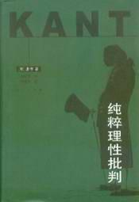

<!-- # 洞察你我身边的心灵杀手(中)——解密中国大学生的荒漠心灵 -->

**往期经**典

# 洞察你我身边的心灵杀手(中)

#  ——解密中国大学生的荒漠心灵

## 文/西哲猫眼

**4.生存与生活的微妙差异**

如果从群体活动的角度上分析，大学生的无聊首先肇始于对生活的遗忘。“生存与生活”之间存在着巨大差异，但是此差异却长期被人们所忽视。当然，这种忽视是有着深远的历史原因和文化原因的。对于历史的分析将让我们看到中国与欧洲之间耐人寻味的区别。

我更加偏爱于将八十年代中国大学生的存在状态称之为生活(living)，而将当代中国大学生的存在状态称之为生存(surviving)。也许有人会不同意我这种近乎于荒诞的区分，但是我首先要说，生活和生存在我的理论框架里是有特定意义的，它们的指称和日常的情况中稍有不同。生活是包含生存的，微生物在生存，动物、植物、人也在生存。然而只有人才懂得生活，因为生活不仅意味着肉体在生物学意义上保持存活(existence)，而且意味着精神在心理学意义上保持活力(vitality)。精神如何保持活力？抑或说精神到底需要哪些条件才称得上是“活着的（alive）”呢？这需要两个要素：首先是理性，然后是信仰。

西方哲学中的大多数问题最终都可以归结到关于人的问题。对“人凭借什么才能与动物完整地分离开来”这个问题的争论也长久地贯穿在西方哲学的演进历程中。当然，这个问题的争论的结果是少数几个令哲学家们欣慰的结果之一，因为哲学家们总喜欢通过自己的努力一劳永逸地解决问题。这个问题最终的争论结果是：理性。人凭借理性而使自己获得从其他动物当中分离出来的资格。从康德的意义上说，有理性的人能够客观冷静地认识物理世界，获取那些支配着物理世界的机械规律的相关知识；也能够自觉自愿地按照自己心中至高无上的道德律令来行为处事，并在道德律的支配之下获得自由。历史事实至少验证了康德关于理论理性（科学理性）的论断，即全世界那么多的文明里头，只有发源于古希腊爱琴海的大西洋文明，才创造出了现代科学和技术——而爱琴海文明是以强调理性为特征的。

信仰是除了科学理性以外，人类精神中的另外一个不可思议的组成部分。必须强调的是，信仰和康德所说的道德理性是有交集的。人虽然可以凭借理性（这里是指科学理性）发展出科学和技术，并以技术作为工具来探索世界、认识世界、改造世界、保护自己，但是即使技术让我们变得无所不能，我们依旧不能保证我们的精神不陷入苦难和黯淡。灵魂所遭遇的苦难是无法通过物质世界里的措施来解救的，人类精神的自毁性——亦即精神世界里本身就存在着的许多能使自身受伤的危险品——注定了灵魂的脆弱本质。所以我们需要某种东西来为我们提供一个坚强稳固的精神支柱，使得我们在灾难和痛苦降临之时能够变得足够坚强，而不至于让我们好不容易折腾出来的理性如普通玻璃一般脆弱易碎。这个伟大的东西就是信仰，它让我们的心灵更加强韧、灵魂更加硬朗。换言之，只有灵魂足够硬朗的人，才称得上是完整的人。因为人是先天地具备好奇心的，在理论理性的驱使之下，他是拥有求真的冲动的；人又是能够拥有善良的人性的，在实践理性的命令之下，他是能够拥有向善的冲动的。人类发展的历史告诉我们，没有任何一个民族可以在完全没有宗教和信仰的前提下持续稳定地发展下去。哪怕那个民族信仰再脆弱、再模糊、再黯淡，它也终究必须是存在的。

可以想象，如果没有了理性和信仰，那么人的精神还会剩下什么呢？答案是基本的理智和原始的本能。

按照传统的认识，一般的动物只有原始的本能，没有基本的理智。所以在传统的生态学里，如果两种生物在食物链里既没有竞争关系也没有捕食关系的话，那么它们就只能像擦肩而过的陌路人那样，相互间不会存在任何联系。但是当代科学的进步告诉我们动物除了原始的本能之外还有基本的理智，在基本的理智的驱使下，它们也会做出一些道德的行为。这样的例子近些年来很多。比如说，在美国的野生公园里，人们曾发现梅花鹿和野猫成为了朋友；在中国南方的某个地方，有环境保护工作者发现鸽子和小猩猩可以相依为命；去年在南美有一对鲸鱼母子在海滩附近搁浅，想去营救却无能为力的人们惊奇地发现一条海豚有了过去，并一边用叫声和鲸鱼母子交流一边引领着鲸鱼母子游出了浅滩。这些都是理智的带有道德性的行为。也就是说，没有信仰和理性的动物拥有原始的本能，同样它们也能够拥有基本的理智。

然后我们再看看，一群淡漠了理性，丢失了信仰的人将会有怎样的表现。古罗马帝国最后的日子里，这样的表现就已经详细地记载于史书中。没有多少人再追问那些有关于是什么，为什么的问题，也没有多少人再去敬畏曾经占据自己心灵重要位置的众神。虽然那个时候的人也还是拥有基本的理智的——正如上一段中所描述的动物的情况那样，但是无尽的享乐、投机和尔虞我诈却无可动摇地成为了人们生活的主旋律。

这个有趣的对比可以说明，如果没有了理性和信仰，人就真的和其它动物毫无区别了。

当群体的灵魂逐渐滥觞于享乐和虚无，群体的精神匍匐于无聊的黑幕之下时，一场思想的风暴就显得十分必要。尽管中世纪的欧洲在许多当代人看来是黑暗的，但如果从群体灵魂的自然史来看，基督教的掌控又是欧洲的幸运。因为那时的人们在对上帝的无限敬畏中找回了曾经丧失的信仰，所以才让启动于古罗马末代的欧洲精神死亡进程被强有力地刹住了车。信仰找回来了，接下来就必须等待外界的作用来帮助这个地域文化里的人们重新找回理性。而十一世纪左右发生的古希腊文明复潮让欧洲获得了一个重拾理性的机会，事实上这个机会也被欧洲把握住了。西方哲学史上，教父哲学向经院哲学的转变便铭刻下了这次伟大的回头。从宏观上讲，只有重拾理性，科学才可能继续发展，人们才有可能去更广阔地探索整个世界；从微观上讲，只有重拾理性，个人才可能去更加合适地建立与社会和世界的关系，个人才可能重新学会如何去像人本身一样生活而不是像其它动物一样活着。

欧洲在漫长的苦难中通过找回信仰，进而找回理性，这才拯救了自己，并在之后的漫长历史中通过科学技术和精神文化的优势而称霸了世界。由此可见理性与信仰在大尺度的历史上对于一个文明来说是多么的重要。反观中国的历史，我们就会发现本土民族的历史遭遇在国人的文化基因里留下的深刻烙印。这种作用又是无所不在的、幽暗晦涩的、难以言说的。我们只能找出其中最易于分析的部分来探讨。但是，这一小部分就可以让我们明白当今中国人背负着的是何等沉重的历史包袱，当然最重要的是让我们明白为什么中国人的视界里找不到生活与生存的区别。

自秦以降，中国历史发展的主旋律就是统一，而非分裂。始皇帝统一了疆土、货币、度量衡、语言，到了汉武帝时就更进一步——统一了思想。有了罢黜百家独尊儒术，这才有了接下来两千年根深蒂固的封建思想。其实当今很多批判中国传统里头没有理性的说法都是有问题的，至少是很值得商榷的。因为在秦始皇搞大统一之前，阴阳家、纵横家、道家等门派的思想中，理性早已萌芽并生长，也许假以时日就能真正成熟，并像西方的理性那样，成为民族思想中的不可或缺的部分。但是我们的命运实在是坏，坏就坏在中国历史在形式上总是过分地早熟。原本在社会、经济、文化、技术、农业等等所有方面的发展早期，全局应该是分裂的，在各个诸侯国的相互碰撞，各种亚文化相互交流、各家思想派相互切磋的过程中，新的进步才更加容易产生。可是，秦始皇就是足够厉害，靠军事和政治的手段统一了整个中国。打江山容易坐江山难，那么大的疆域那么多的人，一个皇帝一个朝廷怎么容易管？统一思想才能统一言辞，继而才能统一行动。儒家于百家之中是最擅长教人如何服从领导的，自然成了唯一的宠儿。这下子好了，所有臣民都忠君爱国了。要那么多思想干什么？要那么多灵感干什么？要那么多学说干什么？统统不要了，什么都不比我大秦的统一来得重要。

儒家思想对于中国历史进程最大的“贡献”就在于让所有中国人无比强烈地赞同已有的游戏规则，原先的那些主张去怀疑、反思、追问的思想早在秦代就被埋葬。于是，之后历史上的人即使再有能耐，顶多也是喊一声“王侯将相宁有种乎”，然后杀掉旧皇帝，自封新皇帝。每个人只要足够牛叉，都可以揭竿而起去和朝廷对抗。但是这种对抗的目的并不是要打破不平等，建立平等，而是为了在既有的格局中从劣势地位上升到优势地位。所以历史一路走来，在中国这个游戏场里，游戏规则始终没有变，变化的仅仅是具体的奴役者和被奴役者。在这样的历史演进模式下，“兴，百姓苦；亡，百姓苦”的状况也就是顺理成章的。在永无休止的猫捉老鼠的游戏之中，永远只能扮演老鼠角色的百姓彻底丢失了希望和梦想——倘若“猫”不再嗜杀成性，不再以玩弄自己的生命为乐，自己能够休养生息、怡然自乐、颐养天年，那就是最好的人生了。得以身处江湖之远原本已是前世修来的福分，何必再去思恋庙堂之高？当然，这也解释了为何中国人有着无比浓厚的实用主义倾向。历经无数的折腾和纷扰，我们的历史记忆早已被太多的沉重所填满。几千年来的漫长征途让我们的精神已普遍疲劳。何必再去做那些虚无缥缈形而上的纠缠？何必探讨什么形式逻辑？何必为了遨游天空而废寝忘食？吃好喝好玩好才是王道。

中国古代的科技领域里只有技术而没有科学，只有工科而没有理科，只有数术而没有数学，这种结构畸形是理论理性的缺失所产生的典型后果。另一方面，中国原本就没有真正的民族宗教而只有较弱的信仰，后来信仰还被一再地削弱，以至于最终变得无神可信。（当然我必须强调，“平时不烧香，临时抱佛脚”的行为本质上不是信仰，而只是在和一个虚拟的“阿拉丁神灯”做利益的等价交换：我有麻烦的时候，我就烧香恭敬你，你得施法保佑我；我没有麻烦的时候，咱们就神归神、人归人，井水不犯河水。这充其量也就是寻找个心理安慰，而不是真正的信神。真正的信仰，是不求回报的。）这两者，即求真和向善，是精神的最大冲动。当它们相继黯淡下去之后，灵魂的火焰也就失色了，生活不再是生活，而是退化为简单的生存。

但是恰恰就是这被我们长期忽略的区分，使得我们这个民族在深刻长久的历史苦难之后，在改革开放、经济增长、物质丰富了之后，其中的许多人就变成消费、享乐和纵欲的机器，而且是只有simple欲望而没有profound欲望。说的通俗一点就是像动物一样活着。这种像动物一样活着的生活状态同样也被当代的大学生们所分有。所以说我们如果在自己身边看到许多无所事事、游戏人生的学生，也就根本不奇怪了。在纯正的儒家传统下成长起来的这些青年在精神上是很悲惨的，因为早在孩提时代，他们的好奇心和求知欲就被扑杀得气若游丝了。老师永远是对的，教材永远是对的，长辈永远是对的。下级对于上级能且只能虔诚恭敬地仰视，这在基础教育里是最重要的潜知识。求真的精神没有了，科学理性自然也就无从谈起咯。另一方面，信仰这东西在当代也是无从谈起的。因为中国人自古就已显得脆弱的信仰在现代看来早已崩毁了。

相关阅读：

中国宗教与基督教 

作者: 秦家懿，孔汉思（汉斯.昆）

译者: 吴华 ISBN: 9787108003423 页数: 254 定价: 13.0 出版社: 三联书店

装帧: 平装

出版年: 1997-7-1 纯粹理性批判

作者: 康德

译者: 邓晓芒

/ 杨祖陶（校） ISBN: 9787010040592 页数: 760 出版社: 人民出版社

定价: 46.00 装帧: 精装(无盘)

出版年: 2004-10-01
