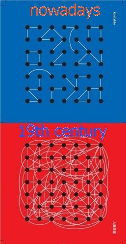
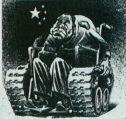

<!-- # 洞察你我身边的心灵杀手——解密中国大学生的荒漠心灵（下） -->

<!-- # 洞察你我身边的心灵杀手 -->

<!-- # ——解密中国大学生的荒漠心灵（下） -->

## 文/西哲猫眼

**5.一个国家主义式的历史遗留问题

**

西欧的大学里，学生在刚进入大学后一到两年里是要接受通识教育的，到了高年级才会分出具体的专业。而且那种通识教育是真正的通识教育，各个领域的知识都要接触。而且，相比于学习知识，更重要的是学习各个具体学科中的方法论。学生们也乐于修五花八门的通识课程，在通识教育中不断完善自己的个性和人格，世界观和价值观的基本定型也是完成于这个阶段的。古希腊先贤们所树立起来的“学以致知”的理念依旧作用于欧洲的大学生们。为真理而真理的人显然不会是抱着“为了捞取学分”的阴谋而参与进来的。

这种通识教育背后的理念是培养人格独立，自由思考，果断行动的学生。在本科教育结束后，一个合格的欧洲大学生应该成长为一个民主社会里的合格公民，他能够以理性的态度去对待生活、对待工作、对待社会、对待时政、对待自己国家的历史、对待自己民族的文化、对待拥有完全民事行为能力的自己。他既不应该是个对政治领袖言听计从的奴隶，也不应该是个对权势人物卑躬屈膝的走狗，更不应该是个对个人利益目空一切的小人。也就是说，他不仅应该是个科学理性的人，也得是个道德理性的人。知识是他的储备，需要使用时，不管是从头脑里头倒出来，还是从数据库里搜出来，总之他能够学以致用。

接下来让我们看看中国大学的人才培养理念。严格意义上说中国只是在十九世纪末才开始有了大学。时值大革命，人们多少还对未来抱有希望、憧憬、理想，也就是说总有那么一批书生不是为稻梁谋的。民国时代出了很多学术大师，这恰恰印证了当时知识分子们的理想主义冲动。同时，与入侵中国的帝国主义军队一同到来的传教士们也为中国建立了许多教会学校，这些学校和各大民国时代的名校一起造就了中国高等教育史的一个伟大时代。但是，中国大陆地区各所大学的校史里，迄今为止的最辉煌的一段日子恰恰也就是那个时代了。而接下去的时代里，社会统治者始终希望大学生们被培养成为机器——要么是拥有专业知识技能，能够拼命工作的建设型机器；要么是拥有赤诚革命热情，能够拼命闹腾的破坏型机器。

建国之后，在极权政治体制发展完备之后，大学的思想继而死亡。思想自由原本是作为大学标志之一的特质，但是在极权的背景下这就是原罪。行动自由受到越来越严苛的限制——大学生被要求像军人一样，完全听从领袖、领导的命令而不允许有任何的反思和辩驳。在极权主义随着文革的结束而进入退潮并降退为集权之后，这些因素的影响力就减弱了很多。但是，与之相关的另一个因素却直接地作用于当代的学生们，并将在国家的高等教育理念彻底改变之前继续而持久地困扰每一个大学生：这就是专业细分的问题。

苏联在社会主义阵营中首先实行的院系大调整也被中国于上世纪五十年代所效仿。全国范围内的大调整不仅完全打乱了原有的高教格局，也顺利地拆解了所有民国时代的名校。当然，这个调整的基本理念是“在高等教育中肃清西方资本主义的个人主义思想，要把学生培养成为‘拿起来就能用的技术专家’，要让学生毕业后迅速成为革命事业和建设事业的优秀建设者”。在许多毛时代的歌曲中，我们也可以看到对这种人才培养思想的生动描述：“我是革命一块砖，哪里需要哪里搬”；“毫不利己专门利人，做一颗永不生锈的螺丝钉，谦虚谨慎永远革命，做一个毛主席的好学生”。

然而，为什么这些极权统治之下的那群大学生们能够变得那么听话，那么顺从呢？青年人的反叛与不合作的年龄特性为何会消失得无影无踪？这里就必须引入马尔库塞的观点了。西方马克思主义哲学家马尔库塞曾经在他的论著《单向度的人》当中探讨过发达工业社会当中为数庞大的中产阶级和无产阶级的单调生存状态以及相应的意识形态状况。在发达工业社会里，由于工业化大生产的持续高速运转、社会的高度专业化分工、劳动者的人际关系的相对固定，这个机械化和技术化的时代就将这样的一幅画面展现给了我们：

第一部分。正如卓别林在《摩登时代》里所演绎的那样，普通的工人在高速的流水线作业当中动作逐渐僵化，思维逐渐凝固，情感逐渐麻木。人被迫无奈地将自己的存在状态钉死在机械化大生产里，后果就是在很短的时间里成为这个社会学意义上的整体生产机器的一个会说话的零件。

尽管他具备对环境的反应能力，并担负着调控整个生产机器的某些组成部分的责任，但是他此时已经远远不再是一个自由的人，而只是类似于动物有机体内的器官，执行调控生理活动的半智能性任务。

不难想象，在如此单调的工作程序下，人丰富的思考和情感将会快速凋零，冲动、梦想、欲望等心理能量统统都将被压抑成工作中的扭曲抑郁和工作之外的无意识游弋。

第二部分。在此要用物种分化模型来说明问题。达尔文在《物种起源》里曾提到：在漫长的进化史里，存在着所谓的“地理隔离”的现象——同一个物种的不同种群，因为外界原因而被分隔到两个不同的生存环境里，随着被分散种群对于各自所处的新环境的适应以及由此而出现的变异，这些种群逐渐远离成了不能交流、繁殖的不同物种。

为了追求绩效，资本主义后期的社会不得不引入劳动者高度专业分工的生产方式。然而在不知不觉中，劳动者的生活方式和运动技能就发生了越来越高度的专能化。这是因为人的能力和兴趣也和生物的各种生理机能一样，遵循“用进废退原则”。某一项技能长期使用而其它技能长期废弛，最后的结果就像第一幅场景里给出的结果那样，劳动的人变成为生产大机器上的一个活着的部件。但是第二幅图画与第一幅图画的不同之处在于，这里不同的人演变而来的是不同的部件，彼此无法互换，互通，互变。作为零件本身，它们（注意！此处已经变成了它们，而不是他们）更难以作出有效的交流。正如遭遇了地理隔离的一个古老物种的分裂一样，他们即使见面也难以进行心灵之间的交流，所以它们只能在异化的生存当中保持沉默。这也就是马尔库塞所说的“单向度的人”。

第三部分，单调而狭小的人际关系空间。在这个社会化大生产的时代，资金、信息、技术、物资等等经济要素都是高速大量流动的。为了应对这种流动，使其更好更稳定地运行，这背后的框架反而变得更加牢固了。这个框架是指劳动者所处的人际关系网。当然，首先这里讲到的是工作中的人际关系网。正如右图所示，在十九世纪以及之前，普通人的人际交流相对还是比较密切的。可是进入发达资本主义阶段之后，为了建立牢固稳定的经济体，企业的老板经理和员工们就形成了树形结构的人际关系网（当然这里的图片表述的不够准确）。在树形网里，每个人只要对上级、下属，以及为数不多的同级同事们熟悉并紧密合作就可以了。更重要的是工作之外的时间里，劳动者们往往已经十分疲劳，难有充足的精力也不会有充足的空间去和工作中接触不到的其他人交流。

而十九世纪的那种“镇上人们全部认识”的大型关系网模式已经很难看到了。这一情况加剧了劳动者的精神封闭和交流能力的退步。

这种狭小的交往空间和单调的工作方式、恒定的外部条件一起，构建出了一个无形的牢狱。的确，一切与之相接近的职业环境，比如军队、特工、苦力等等，其实都可以算是形形色色的无形监狱。在里面人是不可能具备自由的，更不可能有什么精神上的突越。

以上给出的三幅图画典型而震撼人心地描绘了发达工业社会中劳动者的处境，而且我们可以发现它也十分精妙地、一一对应地反映了当代中国大学生的存在状态。课程过多导致高频率的学习（当然对于大多数学生来说这一情况已经降级为了高强度的复习和考试）；通识教育缺失的基础上进行专业细分使得他们进入高度“零件化”的扭曲状态；集权体制下青年NGO的缺位使得原本就在前两个条件下挣扎求生的学生们陷入人际圈紧缩的困境。

单向度的人是生活在痛苦之中的，因为它难以与类型相异的单面人交流，而和类型相同的单面人相处时，又着实没有什么新东西值得交流。随着时间的推移和年龄的增大，心灵的天然属性会让单面人陷入无比的空虚和无聊，并在其中沦陷得越来越深。

当然，正如文章开篇时所说，集权体制的统治者必须使得这个国家的大学生成为单向度的人。因为这样才能使得这个群体的成员间变得彼此难以交流，难以形成真正的有共同理想和精神诉求的团体。这样一来，青年们就无法建立能够对现有社会格局和政治架构形成威胁的浪潮，国家的体制结构也就因此变得稳固了。与此同时，藉由本文中期提到的原因——将学生们丢到市场经济的浪潮当中去。这样一来，对于每一个作为个体的大学生，无论他在进入校园学习的精神生活领域，还是进入社会竞争的物质交换领域，他的处境都会像是茫茫大海中的一叶孤舟。于是我们现在的视界就是一望无际的海面上，许多飘荡着的小孤舟在漫无方向地航行。他们看上去浩浩汤汤，实际上根本不是一支共同的船队，只不过都承受着海风的吹打，经历着孤独的煎熬。

市场经济加集权统治，这是非常稳固的一种社会架构。另一方面，这样的社会往往也要包含有市场规则和传统文化之间的伦理错位。因为完全按照市场规则办事，那么就要遵循公平、公正、自由等基本原则，而这又是和集权统治相抵触的，所以必须有另一股力量来钳制市场经济的正常发育。在当下的中国，这股力量就来源于传统文化中的儒家思想。

这样的架构下，在文化、学术、经济、政治等等领域必然渗透了种种不公平的要素。而这种不公平有多半起源于家庭出身和背景的差异。在社会多层次的共同作用下，这种差异就在马尔库塞提到的三个因素的基础上，进一步分化、撕裂了原本应该朝气蓬勃的青年大学生群体。

于是悲惨世界就降临了。在社会和校园的接壤处，在理想和现实的夹缝中，青年大学生们实际上刚好站在了众多压力和困难的交界点上。精神世界的孤独与灰暗裹挟着物质世界的靡乱与膨胀，一起挤压着这群青年们尚且稚嫩的心灵。于是他们自然地想要逃避这可怕的一切。天性消极的人更想要寻找归属感和安全感，而天性积极的人则更想要寻找成就感和聚焦感。于是，网络里虚幻的情感恩怨和刺激的游戏厮杀便成为了他们赖以维持灵魂正常运行的原境，这原境之于他们，正如同锡安之于犹太人。

青年们在网络中寻求心灵避难实际上是一种自我麻醉的过程。人因为空虚而吸毒，因为痛苦而梦幻。但是这只会是一个恶性循环。马太效应的无情之手早已开始将这群义无反顾的自戕者们一步一步地拖进绝望的深渊。然而这堕落的过程在当事人的体验层面上看起来却是很畅快的。没办法，下坡永远比上坡来得舒服么！人如果变得像草履虫那样，只知对外界情况作出反馈，而不知主动调整、制定策略，那么实际上他已经完蛋了。

**6．从中西历史比较中做最后的总结

**

当代的中国和中世纪的欧洲有些相似。从政治架构上来看：共有亚里士多德的贵族式政治，共有专制，共有神学，共有护教，共有政教合一（只要把共产主义看成一种新兴宗教类型的普遍信仰就很容易理解了）；从民间的思潮来看：共有压抑，共有忌言，共有犬儒，共有实用。只不过展现在我们面前的这幅当代史图景比中世纪的那一幅更加生动而赤裸，更能暴露出权力、金钱和欲望的飞扬跋扈罢了。他们当时靠基督教维护社会的道德底线，全民在压抑中处于“糟糕的稳定”状态。

我所谓的“糟糕的稳定”是指这样一个状态——民众并没有多少幸福感；都信奉国事莫谈且只愿意为日常的柴米油盐操心；社会各阶层相互不信任甚至敌视；整个社会只能用一种即将被识破甚至已经被识破的谎言来维持表面的团结与和谐；这种谎言恰恰来源于统治者需要保有的意识形态发言权；而且还有很多人或是因为愚昧而被官方宣传所欺骗而顺应统治意志，或是因为想谋取利益而应声附和统治者的口径。虽然整个社会中还是有相当多的一部分人希望通过自己的努力而推动社会变革，但是无奈能量不够。所以整个社会的进步力量就像一只正在跳龙门的瘦弱鲤鱼一样，无论怎么努力都跳不上去，总是相对“稳定”地停留在那个龙门口上。这种情况很糟糕，让旁观者感觉很无奈，但就是难以得到改变——这就是“糟糕的稳定”的基本内容。

当代的一些拉美国家——比如查韦斯独裁下的委内瑞拉——就很接近这种糟糕的稳定。所以有很多中国学者很担心我们的祖国如果继续这么下去是否也会进入拉美化的状态。我们虽然不必有这样深远的担忧，不过青年们在这种“糟糕的稳定”状态下的精神痛楚已经不得不理疗了。彼时的欧洲是幸运的，因为在神性压抑下的人性虽然很憋屈，但是好在有上帝眷顾，14世纪阿拉伯人的入侵附带而来的古希腊文化复潮就已经埋下了文艺复兴的种子。而如今的中国青年，尤其是大学生也处于“糟糕的稳定”状态里。我们自己的文艺复兴又将在何时发生呢？或者说我们会不会迎来一次足矣拯救整个民族的文艺复兴？

请原谅我的浅薄，我无法抱着十足的信心去回答这两个问题。但是对于如何让我们青年在这种黯然的时代大背景之下走出那空虚无聊的心灵状态，我们还是有希望能让情况得以改善的。毕竟，精神层面的东西，当你开始关注它时，解决问题的第一个脚步就已经坚实地迈出了。

我们当代大学生的无聊主要出自于知识面狭隘、理想模糊、理性黯淡、信仰缺失、功利主义、纵欲享乐这六个方面。传统文化所给出的功利主义，加上教育体制所给出的知识封闭，再加上宣传机器强迫接受的政治灌输，思想领域里的三座大山连同这个精神死亡的时代本身，一齐将大学生们原本就脆弱的精神生态环境践踏得满目疮痍。我们希冀着，有识有志者可以反思这种践踏，并发动一次长征。那是从荒漠到草原的长征，是回到我们原本就拥有的，能够自由歌唱、撒欢奔跑的精神草原的长征。

参考阅读： 1.《单向度的人》，赫伯特•马尔库塞，上海译文出版社，2006 2．《摩登时代》，查尔斯•卓别林，1900 3．《物种起源》，查尔斯•达尔文，商务印书馆，1995 4.《拉美国家社会问题透视》，苏振兴，当代世界出版社，2001
