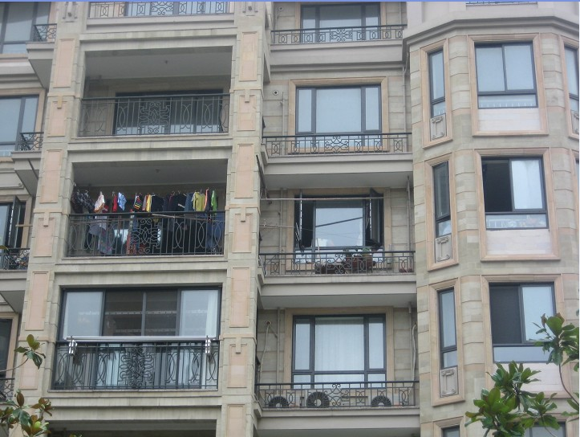
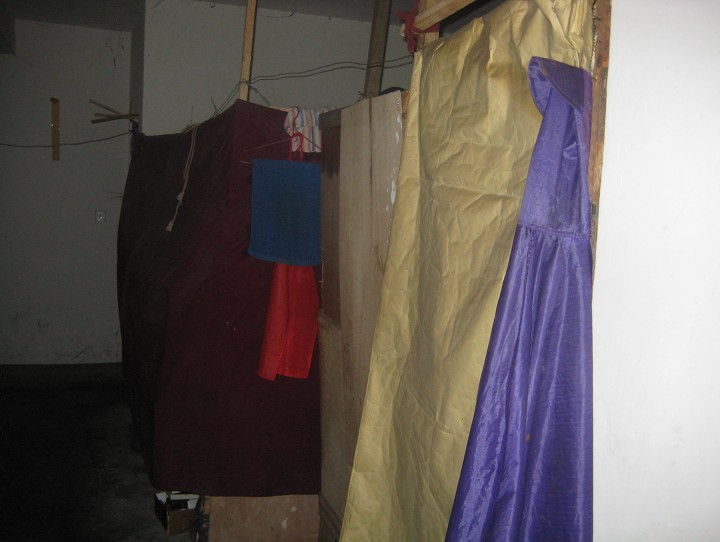

<!-- # 高档小区搭窝棚——走进上海群租房 -->

<!-- # 高档小区搭窝棚 -->

<!-- # ——走进上海群租房 -->

## 一舟楫浪

假如我毕业了，留在上海工作，月薪不到两千块，是租不起整套公寓的。假如与别人合租，我们两个人也租不起，三个人也租不起，四户五户甚至也租不起，结果只有更多户租住一套公寓，这就成了群租。然而上海有无数外来打工者，收入低得租不起房子，也就有了无数这样的群租户。一放假学校安排我们到不同的小区居委会实习，同学实习的那个小区正好有很多群租户，我们请居委会的社工带我们到群租户家里去看看了解一下。在此将这次简单走访的见闻与思考记录如下。 

上海Y小区位于杨浦区新江湾城街道，位置有点偏，但时价还是达到一万七一平，楼盘主要是小高层，像现在大多数商品房小区一样，欧式建筑，外观富丽。但哪幢楼哪户住着群租户从外面一眼就可以看出来：没装修，阳台上挂满了杂乱的衣物，窗户开着，看进去也是很杂乱。而普通住户一般是窗帘紧闭，窗台外面挂着几个空调外挂机。你寻着找上去却一般找不到群租户里的居民，他们上班早出晚归，待在家里的大部分时间都在睡觉。当然也许这种“家”只能提供一个睡觉的基本功能。

居委会的社工先带我们去了一套租住户数少比较整洁的群租房，推开房门还是感到了这扇门内外的反差。毛坯房，一切都是水泥的，客厅空着，只是摆了些自行车、木工工具。其余房间的门上都安上简陋的门板，这才是各家各户的房门。一个连着阳台的小卧室大概是公用的厨房，里面有沾满油垢的一台吸油烟机和一台燃气灶。我们看到一户内部的样子，两张床和很多杂物就是全部家当，还有好几台电风扇。阳台上有一个中年妇女和一个带着孩子的老大妈在闲聊，我们就过去做些访问。说了老半天才向她们解释清我们的来意，因为她们老是怀疑又警惕地跟我们说她们暂住证什么证都办好了。等我们和中年妇女攀谈起来，她说自己丈夫在上海打工做驾驶员，她只是来探望，自己和孩子还住在安徽乡下老家。本来他们夫妻来上海打工好多年了，孩子也在上海上过初中，但现在孩子要读高中了没法在上海入学她就陪着孩子回老家去。我们问起住在这里感觉怎么样，她说住在这里倒是很满意，水电都挺便利的，不像以前还住过很旧的筒子楼，条件很差。我们又问还有别的办法解决住宿问题吗，她说群租很久了，换了不少地方，在一个地方总不能待得久，住多久取决于房东的态度，如果能安顿下来就好了。现在每月五百块的房租是她家能勉强承受的了，“我们也很想自己住啊”，说这个的时候她神情淡然。我们又问回老家不就可以住自己的家了，她说回不去了啊，家里没地种没法生活。旁边的老大妈和这个中年不是一家的，但看起来颇为熟识亲切，群租户之间关系很融洽的，据她们说。当我们问起和小区普通业主居民的关系，她们说：“根本不接触。” 

离开了这家，居委会的社工带我们到另一个状况比较差的群租户去，进门之前社工嘱咐我们要做好心理准备，但推门进去我们还是被眼前吓了一跳。客厅里很挤，帐子围起两个隔间，大概这样就可以多住两户人家。帐子是用木棍、破布、报纸搭起来的，很简陋，透过缝隙可以看见里面的床上躺着人在酣睡。顺着狭窄的走道走进去，房间里阴暗、杂乱，一股厕所味。在一个阳台上，坐着个大叔在休息，我们在外面敲门的时候没人反应，我们走进来了他也没什么反应，对我们爱搭不理。社工说这套房里大概住了六七户。里面卫生间很脏很差，就是水泥地上安了个马桶，没看到厨房在哪里，所有小的空间都堆满了垃圾和杂物。

居委会的年轻社工不喜欢群租户，和群租户说话冷冰冰的，他们不想自己小区有些乱七八糟的“外地人”。外地来上海上大学的是外地学生，温州来买房的是外地老板，只有来打工的是“外地人”。外地学生会念书，外地老板会做生意，但是“外地人”就是又脏又穷素质又低的了。居委会对群租户的厌恶还源于让他们工作上平添很多不该有的麻烦，比如群租户如果被抓住有偷生小孩的，上级就要怪到居委会头上。还有居委会要忍受小区业主居民对群租邻居的抱怨。我们在小区里随便访问了一个业主居民，年轻女性，上海人。我们问起她对群租户的看法，她说自己家附近没有，但是看到这个小区有，对群租户很理解，“总要给人家住的地方吧”。不过，不知道等有群租户搬到她楼上时她是否还会如此宽宏大量，或者就像别的业主一样三番五次去居委会物业公司要求清退群租户。“他们影响小区形象，他们打扰别人生活，他们随地大小便。”社区各方面都不爱接纳群租户，那么他们怎么住进来的呢？“二房东”们促成了大规模群租的形成。“二房东”们从以炒房为目的的房东手中租借到房屋，成批制造了“群租房”，然后再租给只能租起这种房子的人，以此赚取差价，不得不说他们很有商业眼光。居委会的人跟我们说，房主不一定愿意把房子租给群租的人，但是他们人不在这里，只管从中介手里收房租开心了哪还管别的。 

后来我们又到了物业公司，物业公司的人说，群租户也很让他们头疼，麻烦多甚至还要多付一些小区维护成本。比如群租户没有楼下单元防盗门的钥匙，他们为了进出方便就要把防盗门破坏一下让它不能正常开关。群租户不注意也会对公共环境卫生造成一些压力，物业公司表示我们也没办法不是，业主愿意把房子租给他们我们就要让他们在这里住着。物业公司的一个工作人员说着说着说起他前几年在闵行区工作时参与的整治群租房的行动，他说那时候动真格的强制清退群租户，消防队都上了，把人家的东西搬出来就砸。“我不愿意参加那种事，你说他们（群租户）可怜伐？”“领导干什么都是喜欢一阵风的，整治了一番你还得让人家住。”

的确有过上文这位工作人员提到的这种强制整治群租行动。2007年9月在中远两湾城的整治群租行动被称为上海有史以来大规模整治群租房行动。在那次整治中，群租户都散去了，但不再群租的人只好辞职离沪到别处谋生，这是少数，大多数人还是继续找个别的地方群租或者等风声过了再回来。有的为了应付整治和监管想了很多办法，比如用布帘分隔了客厅，检查的来了就收起来，走了再放下。群租户栖身容易吗？而让他们不容易的就是体现政府态度的一个文件《关于加强居住房屋租赁管理的若干规定(试行)》。这个文件于2006年12月出台，其中规定“一间房只能出租给一个家庭或一个自然人居住”。2007年8月27日，上海市房地产局对2005年版的《业主公约》、《业主临时公约》示范文本增补条款提出，居住房屋租赁必须符合本市规定的房屋出租条件和人均承租面积标准，即不得低于5平方米。不得擅自改变房屋原设计功能和布局，对房屋进行分割搭建，按间或按床位出租或转租。政府也讨厌群租，群租容易出事。群租户煤气中毒、乱拉电线引起火灾的发生过很多，也许这是最不利于和谐的。但是这个行政规定，是无法律依据可循的。法律人士表示过：“群租这个问题是房门内的问题，应该是私法调整。既然是私法调整，那么作为公法调整的公权力，也就是我们常说的行政权力是不是应该在私法范围之外呢？”“房屋产权人的合法权益，对房子的自由处置，是受到法律保护的，不应该进行限制。”抛开法律依据的事不谈，不让人群租又体现政府惯有的那种可笑思维。就好像城管赶着摆摊的小贩，只因为不好看，可是并不是每个人都去超市买他们需要的所有东西，也并不是每个人都能找到好工作不必摆摊谋生了。低收入的外来务工人员为城市提供着他们廉价的劳动力，让城市能够繁荣下去，城市却连容身之所都没给他们。看不起“外地人”的，其实也离不了“外地人”。

很多集体打工的住在工棚里。我们在小区走访时就遇到过两个建筑公司的工人坐在绿地边休息。我们过去问他们是否也住在群租房里，他们羞涩地说自己住在单位的工棚里，很多人住在一起，很挤，条件不怎么好。

“群租房”在上海风行，其实反映的是在上海居住体系中留给外来低收入人员的位置不多。很多人又要说起建廉租房了，上海现在和许多大城市一样，也有政府提供的廉租房，但申请条件之一是“申请家庭的成员具有本市非农业常住户口且实际居住”，这把最需要廉租房的外来人员排除在外。而且，放眼望去都是为社会精英准备的高档住宅，我们需要的更多的廉租房又是在哪里安放呢？当然，也许有廉租房建起来的那一天，可是群租户们更关心的是，今天干完了活，他们能到哪里去休息。
