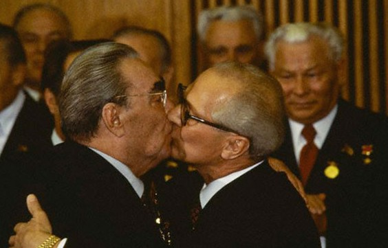
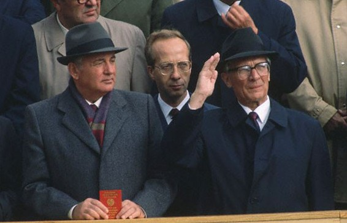

<!-- # 东欧剧变二十年——系列之二·Goodbye,DDR -->

**“这个月刚好是波兰第一次民主选举的20周年，回望这20年，

波兰的民主转型是成功的——它成功的完成了共产主义国家的第一次民主转型，建立起了一个公民社会；但波兰的转型同样充满了自我矛盾——团结工会引起的自由派内部倾轧，协议转型本身的不健全性，以及最最重要的，经济改革的波折。但是不管怎样，我们都希望波兰的经验能给以我们更多的启示，他们，始终是我们的先行者。”**

# 东欧剧变二十年

#  ——系列之二·Goodbye,DDR

## 图文/孟小你（中国科技大学）

民主德国，全称德意志民主共和国，写作Deutsche Demokratische Republik，简称DDR。有一部关于逝去的民主德国的纪录片的标题就是Goodbye,DDR，今天我就顺手把这个拿来作为这篇文章的标题，并借此纪念这个存在了41年的国家。

民主德国的来由我就不多说了，大家应该对这一段历史还是有所了解的，反正在经历了货币发行的战争、对西柏林的封锁和反封锁等一系列对立事件之后，1949年10月7日，民主德国的政府在德意志社会主义统一党的领导下正式成立了。

当然了，还是那样，经历了两三年的社会主义建设的经济繁荣期后，重视重工业轻视民生的政策的弊端开始显露出来。1953年

之前，在瓦尔特·乌布里希的领导下，民主德国成为了一个“更好的德国”：民主德国初代的小汽车坚固实用——虽然其大多数后来被用作逃往西柏林的工具；洗衣

机美观大方——后来的产品则不得不每两个月就检修一次，这都还算是质量好的。这不得不让人想要发问：德意志民族严谨认真的精神在那几十年中都跑到哪里去了？

然后是1953年，东德人民实在是受不了高涨的物价和不断提高的劳动定额，知识分子纷纷逃往西方的“自由世界”。在6月，

柏林的数千工人举行了游行示威，接下来总共约有三十万人参与到了这次斗争中来。最后，还是苏联老大哥的铁骑果断出击，平定了这次由一小撮别有用心的西方帝国主义特务煽动的威胁民主德国乃至全球共产主义运动的反革命暴动。顺便说一句，柏林的这次示威的主要聚集地是在东柏林主干道斯大林大道（后来改名为卡尔·

马克思大道），回过头来看，这个地名多少有些讽刺的意味。

同大多数东欧国家一样，民主德国进行着表面上的自由选举。然而当人们不能正常地用手投票的时候，他们就会用脚投票。从1945年到1961年，民主德国的群众不断的奔向西方资本主义的地狱。在此16年间，总共有约250万人跨过了东西德的边界，让东德的人口差不多减少了15%，

如果此前有不明真相的同学去看过这一段时间东德的人口数据，大概会赞叹他们计划生育工作搞得好吧（什么？你说作为德国，战后应该有婴儿潮？那我就不仅要问

你了，你究竟是为德国统一社会党说话呢，还是为东德人民说话呢？）。东德的领导人实在受不了了（不过我估计换谁都受不了，平均每周有3000人义无反顾地奔向和你意识形态敌对的兄弟国家，其中大部分还是受过教育的年轻知识分子，这是一种什么样的景观……）。终于，1961年8月13日，

举世闻名的柏林墙被民主德国的士兵们用水泥和铁丝网在一夜之间搭建了起来，并在此后数年间不断被加固，直至最后形成了拥有哨塔、电网、地雷、军犬、反车辆

壕沟等组成部分的“反法西斯防线”。民主德国的领导人们称柏林墙是“阻挡了西德法西斯的钢铁长城”，不过实际嘛……大家都知道，我就不说了。数据可以告诉

我们的是：在柏林墙28年又3个月的存在时间内，有近9000人试图翻越它进入西柏林，而最终成功的只有5000人。

不过话又说回来，“西德法西斯”这句话倒也不是信口开河，勃兰特（就是那个在波兰向犹太人起义纪念碑跪下的西德总理，后来因为东德间谍案下台）上台之前联邦

德国有一任总理名字叫基辛格（不是那个美国外交家基辛格博士），他……他是前纳粹党员兼高官，再往前还有一位总理国务秘书曾经是第三帝国时期反犹法案的起

草人——西德对前纳粹势力的宽容可见一斑。不过随着西德学生运动的风起云涌和勃兰特的上台，这些情况都有了大大的好转。

回过头来继续说东德，刚才我们讲道，东德的经济非常糟糕，有多糟糕呢？苏联、中国等搞国家建设的时候虽然是依照计划经济下的一个五年计划又接着一个五年计划来进行的，尽管有些落后，但是至少有个章法。而东德在制定了第三个五年计划后不到两年，为了“配合苏联和其他社会主义国家制订的七年计划”，砍掉了五年计划重新制定了东德版的七年计划，结果经济情况持续恶化，又迫不得已在七年计划进行了三年之后把它停掉了。如此折腾，国民经济如何可能好好建设？民主德国在

民生方面的积贫积弱使得如今的德国政府每年在东德地区不仅收不上税，还不得不往这些大窟窿中不断地投钱。联邦政府每年有大量的财政补贴倾向于东德地区，以至于有人哀叹，统一使得德国“倒退了五年……甚至是十年”。

然而，民主德国最为人诟病、也是最让人感到恐怖的，并不是它那贫穷的经济，而是其特务组织“史塔西”。在冷战期间，人口不到1800万的民主德国中有不下400万民主德国公民和200万外国人被情报部门留存档案。整个情报局的全职工作人员保持在10万人以上的规模（按比例换算的话，相当于在我国有超过700万

全职情报人员），业余情报员和线人则是数不胜数——你甚至根本不知道你的妻子，丈夫或者是父母是否就是那个负责盯梢你的人。电影《窃听风暴》对当时民主德国的这一恐怖气氛也有着栩栩如生的反映。某种意义上来讲，这种人性被扭曲的恐怖气氛也正是“史塔西”的领导者们所想要获得的结果。

冷战后期东德的象征，埃里希·昂纳克，在1971年当选为统一社会党第一书记，代替因中风而去世的乌布里希。他上台之后，民主德国在思想和艺术领域的控制也有所放宽，但是另一方面政府的中央集权和“史塔西”的管控也进一步地增强。在

经济建设方面，昂纳克政府也有一定的进展，但是随着后来形式的反转直下，民主德国不得不接受联邦德国的巨额贷款以维持国家的运转和民众的温饱。借着经济协

助的契机和勃兰特时期“东方政策”的底子，东西德之间的关系从敌对逐渐转向了合作，1973年，两个德国同时加入了联合国。日后两国领导人的互相访问，艺术文化领域的交流，（也许再加上不断逃往西德的东德公民？）这一切也都为日后两德的统一打下了基础。

在民主德国成立三十周年庆祝大会上，列昂尼德·伊里奇·勃列日涅夫与昂纳克激情拥吻。这张体现了“社会主义国家之间兄弟般的友谊”的照片流传甚广

进入到80年代，戈尔巴乔夫上台，民主德国的气氛也开始松动，在1988年汉城（首尔）奥运会上，所有的社会主义国家——除了朝鲜和古巴——都参与了这次奥运会，并借此机会和韩国建立了外交关系。由于同样处于分裂状态，德国人和韩国人显然对彼此的心情感同身受。

1988年汉城（首尔）奥运会东德入场式。

1989年初，东德开始实行更加宽松的边境管理政策，大量公民逃入西德，不久，捷克斯洛伐克和波匈两国相继发生政治动荡，东德又收紧了边境政策，结果，在这年的10月7日，也就是民主德国建国40周年的同一天，全国各地爆发了大规模抗议示威，民众的诉求也从边境管理逐渐扩大到政治领域。

1989年10月7日，昂纳克和戈尔巴乔夫在东德建国四十周年庆典上。几条街外就是抗议的人群。

40周年庆典刚过去11天，昂纳克就被迫辞去了统一社会党第一书记一职，并在不久后被开除出党。11月9日，一个时代的象征——柏林墙终于在屹立了近三十年后被拆毁（有意思的是，在1月的时候，昂纳克还称“如果建立的原因还没消除，柏林墙还将会屹立大约50年，甚至100年！”）。1年之后的10月3日，两个德国在经历了41年的分离之后，再度统一。统一社会党在改组成为左翼党之后也成为了德国几个较大政党之一，在议会保有不少的席位，不过颇具讽刺的是，如今德国其他几个主要政党都不怎么待见它。

两德统一后，德国政府拨付了大量的贷款用于前东德地区的建设（这个可以理解，否则以东德生活水平根本留不住人，如果不进行建设的话，将很有可能出现现代社会

中史无前例的无人区……），但是人们获得的却是数年的房地产泡沫和经济萧条，即便是最乐观的经济学家也认为，前东德地区想要达到德国的平均水平估计还要花上十五至二十年。

关于民主德国的一些小八卦：

·俄罗斯现任总理普京仍在克格勃担当特工时曾经于80年代在东德工作。

·联邦德国和民主德国的法律都承认了“两个德国”现实。

·昂纳克在下台之后先是逃往苏联，苏联解体后又到了智利避难，并最终在那里去世。
