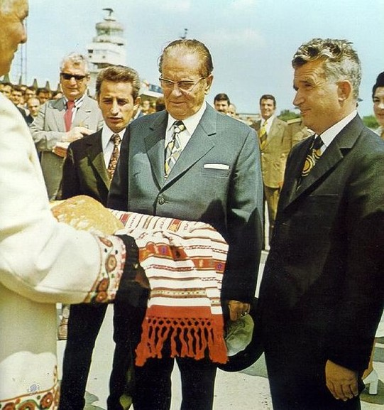
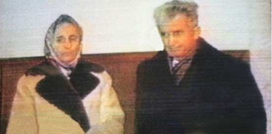

<!-- # 东欧剧变二十年 ——系列之三·静静的多瑙河 -->

**“在过去的这个世纪，罗马尼亚人经历了两次独裁统治，如今的他们尚在法制缺失、政治平衡脆弱的背景下寻找通向未来的路，然而直到今天，齐奥塞斯库时代的阴影还

没有散去，唯有美丽的多瑙河如今仍静静的流淌在这片广袤的土地上——不过即便是在这里，齐奥赛斯库时代建立的铁门峡大坝也依然在默默地为罗马尼亚人服务。”

**

#  东欧剧变二十年

#  ——系列之三·静静的多瑙河

## 图文/孟小你（中国科技大学）

罗马尼亚在二十世纪出了两个大独裁者——前一个是纳粹罗马尼亚的扬·安东尼斯库元帅，后一个就是鼎鼎大名的尼古拉·齐奥塞斯库。与其他东欧国家相比，罗马尼亚的特殊性恰恰在于这个出生于1918年的瓦拉几亚男孩。

齐奥塞斯库在共产主义世界是著名的年轻领袖——另一个是全球T恤事业的卓越贡献者格瓦拉——即便是他在1965年正式成为罗马尼亚领导人时也只有47岁，更不用说他在十一年前就爬到了中央政治局排名前几的位置，并在随后成为了乔治乌-德治的亲密副手。后来，毛泽东在和他会谈时也曾半开玩笑地说过“（齐奥塞斯库）是我们的年轻领袖，等我们死了，还得靠他和美国人斗呢。” 1965年，乔治乌-德治去世，齐奥塞斯库被选举为罗马尼亚共产党的新任总书记，在乔治乌-德治统治去世后的留下的权力真空的背景下，罗共党内高层之间起初弥漫着互相猜忌的气氛，不过大多数党内元老们都认为这个年轻人便于控制。然而，这一次，经历过两次大战的老人们都看低了齐奥塞斯库。不久后，齐奥塞斯库就显示出了自己的政治手腕并凸显了自己的领导地位：在1968年

“布拉格之春”事件中，齐奥塞斯库是唯一谴责了苏联军事行动的华约领导人，这在很大程度上提高了他在国际上的地位（西方世界把他视为继铁托之后又一个来自

社会主义阵营内部的苏联反对者），而齐氏的这一行为在国内也给他带来了一笔政治财富，那就是知识分子的支持——反对齐奥塞斯库的人在知识界会被视为亲苏分

子。齐奥塞斯库个人威望的空前提高使得他在1969年的罗共十大上主导修改了党章，从而使得齐奥塞斯库获得了更大的个人权力——他甚至可以凌驾在政治局之上。

齐奥塞斯库和前来罗马尼亚访问的铁托。

1971年，齐奥塞斯库先后访问了中国和朝鲜——这个细节值得注意，从后来的历史轨迹来看，相比于“文革”，齐奥塞斯库显然对朝鲜金日成式的统治更感兴趣。最终，1974年，

齐奥塞斯库就任罗马尼亚总统，集党政军大权于一手，成为了罗马尼亚的绝对权威。在随后的数年中，齐奥塞斯库把自己的妻子、兄弟和子女一个个地扶上了高位，

齐氏家族统治了罗马尼亚：齐奥塞斯库的妻子是罗马尼亚第一副总理兼罗共人事委员会主席，他的哥哥是国防部总政治部领导人，而弟弟是秘密警察部队人事总管，

最后则是他的儿子——如果不是后来的东欧剧变，他很可能会成为罗马尼亚的金正日。

金日成会见来朝鲜访问的齐奥塞斯库

。

同所有的独裁政权一样，齐奥塞斯库领导的罗马尼亚对独立的社会团体——无论是东正教会、工会，还是文学团体——打压极为严重。在1989年剧变前夕，整个罗马尼亚也只有两个有全国影响的独立团体，远远落后于保加利亚（13）和匈牙利（21），更不用说波兰（60）

了。在八十年代，罗马尼亚国内充盈着对齐奥塞斯库本人和其政治学说的吹捧，称他为“天才”“历史的创造者”“伟大英雄”。实际上，在齐奥塞斯库的统治后

期，几乎没有人——无论是国内还是国外——还认为罗马尼亚是一个共产主义国家了（相比而言，昂纳克或者雅鲁泽尔斯基仍然是教条的马克思主义者）。缺少国内

民主反对派的现实使得罗马尼亚内部的民众力量较为薄弱，在剧变中，起着主导地位的也是罗共党内对齐奥塞斯库君主式（用韦伯的话说是“苏丹式”）的统治感到

不满的反对派，而不是独立的民主团体。事实上，如果之前没有匈牙利、保加利亚等国一系列的变故，恐怕连党内反对派都不愿意站出来反对齐奥塞斯库。 1989年，罗马尼亚成为了东欧唯一一个经历了鲜血的剧变国家。众所周知，在齐氏失去对政权的掌握后，救国阵线委员会迅速逮捕了他和他的妻子，并以“屠杀罪”“破坏政权罪”“破坏公共财产罪”“损坏国民经济罪”“在外国银行存有10多亿美元并企图逃往国外”的罪名宣判齐氏夫妇死刑，并将执行死刑的录像传播到了全世界。

但是实际上，这整个过程，包括救国阵线委员会后来的行动，都充满了违法、欺骗和反人权。

被指控“屠杀了6万人”的齐奥塞斯库实际上并没有下达“屠杀”的命令（这一点类似我国在那一年的情况，那一天夜晚的广场上不断有广播通知要求人们离开），在行动中死亡的人数也不是6万而是2000——是齐氏的党内反对派在宣传中夸大了这一数字。同时，齐奥塞斯库在国外并没有存款，这条罪名完全是子虚乌有。而执行死刑的士兵甚至是在行刑队指挥官尚未赶到的情况下便开了枪。因此，后来有人评价，齐奥塞斯库是被“司法谋杀”的。

齐奥塞斯库夫妇接受特别法庭审判时的影像。

齐奥塞斯库死后，前罗马尼亚共青团第一书记、罗共中央书记（后被贬地方）、救国阵线委员会主席伊利埃斯库和他的盟友上台执政。回过头来看，罗马尼亚的剧变从民主转型的意义看，本身是不完整的：在齐氏死后的选举中，民主反对派没有赢得全国选举——在所有的农村和大城市罗共都赢得了绝对的胜利，参与了救国阵线委员会行动的罗共高官们在剧变后胜选并掌控了政权，并且还得以连任——这部分使得罗马尼亚国内在剧变后只注重了批判齐氏本人的个人崇拜，而忽视了对制度本身

的反思。在后来的民调中，人们所更多表现的也是对齐奥塞斯库统治时代的恐惧而不是对民主政治的向往。罗马尼亚国内政治也在相当长的一段时间内在脆弱的平衡之中摇摆不定。政客们互相逶迤所造成的结果之一就是：尽管与八十年代相比罗马尼亚的经济有了一定的进步，但是与邻国相比，它的人民的生活水平依然远远落后。如果不是保加利亚的支持，这一点差点就断绝了罗马尼亚加入欧盟的希望。

在过去的这个世纪，罗马尼亚人经历了两次独裁统治，如今的他们尚在法制缺失、政治平衡脆弱的背景下寻找通向未来的路，然而直到今天，齐奥塞斯库时代的阴影还

没有散去，唯有美丽的多瑙河如今仍静静的流淌在这片广袤的土地上——不过即便是在这里，齐奥赛斯库时代建立的铁门峡大坝也依然在默默地为罗马尼亚人服务。
