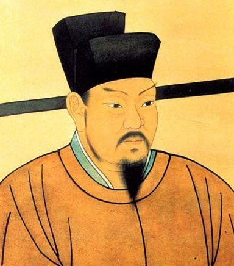

<!-- # 王安石的悲剧 -->

**“王安石是个天才，天才都有共同的特点：理性的自负。他们总喜欢将一切处于自己的控制之下，具有强烈的支配欲。王安石的变法，也带着他这种自负的个人烙印。”“王安石的变法的实质就是对市场运行的粗暴的干涉，貌似公平的外衣之下，蕴含的是国进民退，和对民间资本和市场价格的粗暴干涉。这种改革就算成功一时，也会由于对市场和价格的干涉而最终失败的。”**

# 王安石的悲剧

## 文/小菜鸟 （湖南大学）

王安石是个极有意思的人，不好美色，生活简朴，文章写的极好，作为地方官也有良好的政绩。但是另一方面，历代史家都将其视作北宋灭亡的罪魁祸首，因为章惇、吕惠卿、蔡京、蔡卞都是打着王安石新政的旗号上台的。宋徽宗的年号更是取做“继熙”，意思是继承神宗皇帝的变法遗志（神宗年号熙宁），应该说，在北宋的末代皇帝宋徽宗手中，王安石所拟定的各项改革措施得到了全面的施行，但是结果却与其原本的初衷相去甚远。吴楚侯兄弟认为：“王介甫名始盛时，老苏做《辨奸论》以讥之，讥其不近人情。后新法繁苛，流毒天下，终有靖康之变。”而冯梦龙在其《警世通言》的《拗相公饮恨半山堂》中，也借老头子之口痛骂王安石：“若见此好贼，必手刃其头，刳其心肝而食之。”这表明市井小民也对王安石的变法毫无好感可言。

但是无论大家对其的评价如何，几乎所有人都是将失败归咎于“用人不臧”，冯梦龙的一首诗较能代表这种观点：“好个聪明介甫翁，高才历任有清风。可怜覆谏因高位，只合终身翰苑中。”

然而，却很少有人对王安石的变法的本身的内容进行全面的反思，尤其到了近代，王安石更是被“伟大的革命导师“列宁目为“十一世纪的改革家”。导师金口一开，王安石从此便翻身变成了失败的英雄，大家普遍认为。新法是好的，只是执行的人不好，王安石同志是贯彻科学发展观，实践三个代表的杰出代表。

其实，能够得到列宁的称赞的王安石不是没有两把刷子的，他的新法政策估计能让列宁产生知音之感。二者都有一个共同的特点：与民争利。只不过，列宁做的更彻底一点，他不是争，而是干脆国有化了，天下为公，一了百了。

还是从王安石与其政敌司马光的一段争论说起吧，

王安石认为：国用不足，由未得善理财之人耳，善理财者，民不加赋而国用足。

司马光认为：天下安由此理？天地所生财货百物，不在民，则在官，彼设法争民，其害乃甚于加赋。

王安石的观点类似于凯恩斯，认为国用不足（经济衰退），只要采取适当的政府介入，比如政府的投资计划就可以改变这种状况。他的观点强调于政府的干预。难怪列宁会将其引为知音。而司马光的观点则类似于当代的古典主义学派，认为政府介入就是与民争利，会造成挤出效应。

不幸的是，司马光的观点，被历史证明是对的。王安石是个天才，天才都有共同的特点：理性的自负。他们总喜欢将一切处于自己的控制之下，具有强烈的支配欲。王安石的变法，也带着他这种自负的个人烙印。

纵观王安石变法的主要内容，不难发现王安石变法的实质可以概括为：国进民退，以国家资本代替民间资本，并对宏观经济的运行进行严格的管制。其所推行的三大法案：：《青苗法》、《市易法》和《均输法》可以概括为三大管制：利率管制、价格管制和采购管制。

青苗法是所有新法中争议最大的法案，司马光上台，第一件事就是废除青苗法，足见该法案争议之大。青苗法的的主要内容是政府以低于私人利率的利率向农民贷款，农民以地里的青苗为贷款抵押。其实质是政府垄断金融市场，禁止民间资本进入金融市场，且实施利率管制。稍有常识的同学就知道，这种政府垄断金融市场，管制利率的政策，是典型的金融压抑政策，其结果是信贷配给，农民融资难。而荒谬的政策加上不恰当的执行就造成了灾难性的后果。史书的记载也证明了这一点，据历史记载，王安石在当地方官时这种作法效果不错，在陕西推行时也颇受欢迎。但当推向全国时，却引发了灾难性后果。各地都有固定的贷款准备金，上级下达的任务是要全部贷出去，并完成百分之二十的增值。有了硬指标，官员们就要用硬手段。他们根据农户的经济状况，将之分为不同等级，各自要承担不同的贷款额度，而不论你是否需要。同时，为了保证还贷，又让富户与不同等级的农户结为利益共同体，由富户提供担保或抵押。青苗法实行后连年自然灾害，官员逼债，农户纷纷破产，连富户也无法幸免。王安石一直认为这种失败是由于用人不臧的问题，但是，即便他的法案得到了严格的执行，他的法案只会加剧农村地区的融资难问题，而不会改观。何况他的法案是强制执行，违背经济规律办事，其结果如何，也可想而知了。

《市易法》是吕惠卿的杰作，苏轼的弟弟苏辙也参与了这部法案的起草。这部大名鼎鼎的法案的主要内容是：由政府买进各地滞销的货物,再以低利或货物贷给贫穷的商人。其实质就是政府成立国有企业，直接介入商品流通领域，以控制物价水平。其平抑物价的初衷是好的，他看到了物价的暴涨对于百姓生活的巨大的伤害。但是，作为一个自负的天才，王安石却没有看到，政府无法对商品的价格的变化进行敏感的反应，当商品的价格下跌时，迟钝的政府不会降低商品的价格，而是会维持原价，以获取更高的利润。而当商品价格上升的时，政府的官吏则会想方设法的提价。如果大家还不了解这一点，就可以看看我们伟大的中石油，他们就是一个典型，油价上升时提价，油价下跌时，继续提价，厚颜无耻到了极点。北宋的官僚，想必好不到哪里去。历史的记载也证明了这一点，百姓不仅没有在其中没有得到任何好处，反而要忍受商品的短缺和更高的价格，唯一获得好处的，是那些类似于中石油那样的官办机构。

有学者以为，王介甫变法的实质在于敛财，这种说法虽然尖刻，但是也有一定的道理。以《均输法》为例，均输法的目的主要是“买”，也就是减少采购中不必要的支出以及提高在采购中的效率。然而，同市易法一样，政府介入商品的流通领域，果真可以节约开支么？或许能，因为政府可以从商品的垄断交易中获利，以收抵支，或许可以抵消一部分的开支。但是以政府替代商人，有政府撑腰的国营垄断企业，就像中国电信一样无法无天（电信上市了，但是依旧是政府背景的）。最终的结果，就是商业萎缩，经济不仅得不到发展，反而陷入衰退。有史料记载自从均输法实施后某些地方的产业的确有萎缩现象，民怨的沸腾最终导致了

“均输后迄不能成”（《宋史》）。有反对者提出的批评正好切中了这部法案的痛处：“（官吏）行奸卖平，农民重苦，女工再税，未见输之均也”。

综上所述，王安石的变法的实质就是对市场运行的粗暴的干涉，貌似公平的外衣之下，蕴含的是国进民退，和对民间资本和市场价格的粗暴干涉。这种改革就算成功一时，也会由于对市场和价格的干涉而最终失败的。

写到这里，突然又想起一件无聊的事情。在我的老家，当地政府为了规范市场，而对市场进行了种种规制，从液化气到豆腐，从网吧到肉制品，都制定了种类繁多的行政规制。结果是各种日用品市场都在政府规范市场的过程中走向了垄断。可笑的是，连卖豆腐都要经过政府严格审批，只有少部分人拿到了执照，大部分卖豆腐的只好象有执照者交付租金以获得卖豆腐的权力。结果是，“豆腐没有以前好吃了，而且价格也涨了”（我外婆语）。在这里，我又嗅到了一点王安石新法的气息。历史，总在重复昨天的故事。

王安石是天才，天才总是自负的，然而，我总是希望，此类高尚而危险的天才与自负，还是少些为好。
