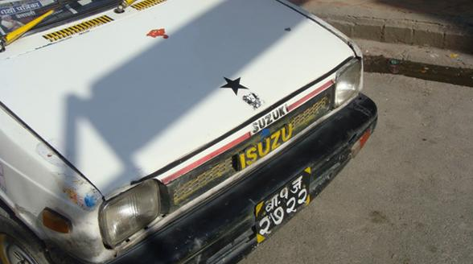
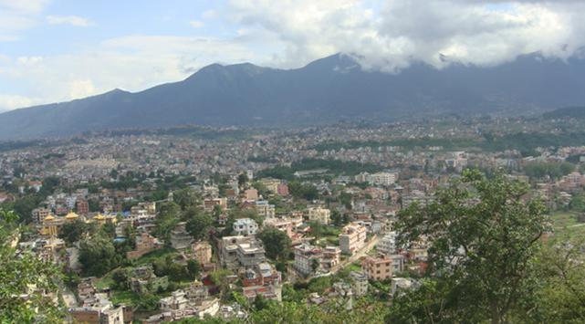
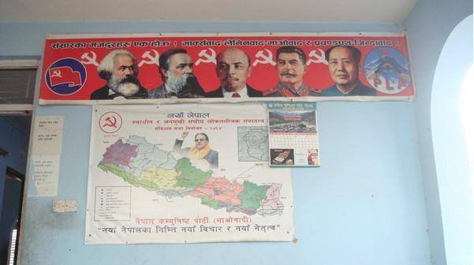
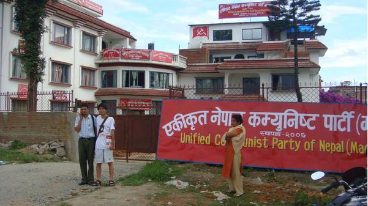
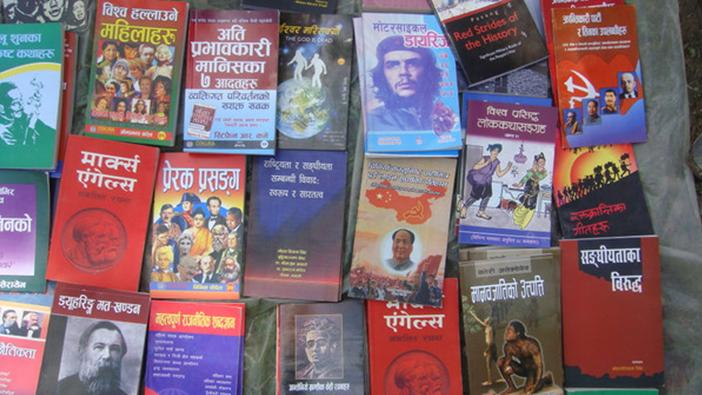
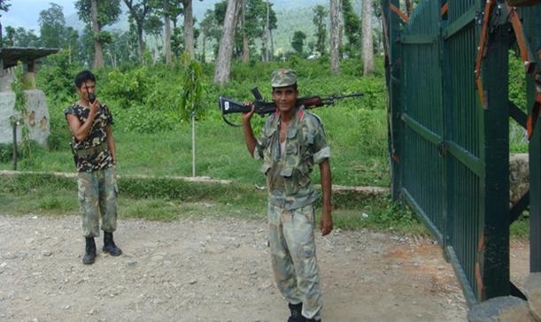
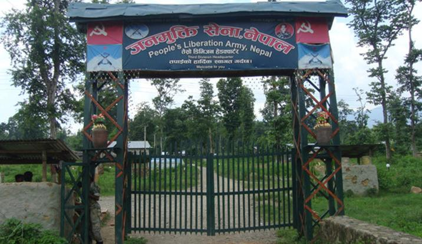
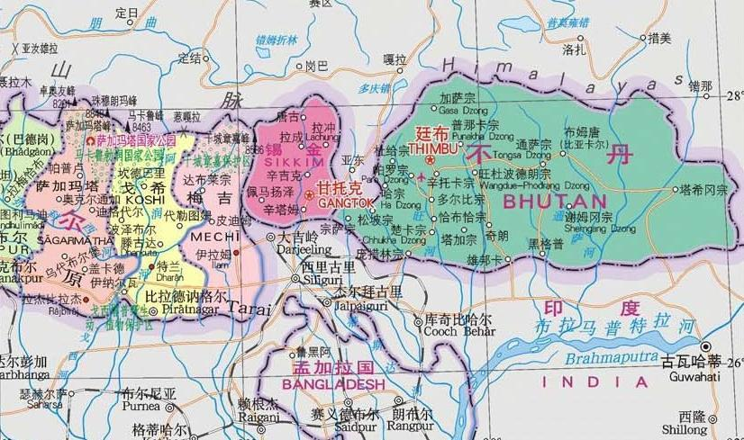

<!-- # 尼泊尔纪行之寻访毛派 -->

**“I am from China, I am a maoist, so I come here ”，这是我走进毛派central office的第一句话，也是我后来走入毛派游击队营地的第一句话。远远望见办公室，只是一栋独立的小楼，飘扬着镰刀斧头旗帜。没有门卫，我冒冒失失就闯了进去，迎面就看到亲切的“马恩列斯毛”的挂像，一幅尼泊尔地图和普拉昌达同志的画像，没错，就是这个地方。**

# 尼泊尔纪行之寻访毛派

## 文/alexmaoist

**其实毛派不用寻访，因为毛派遍地都是……一、

革命只为生存**

不论走在尼泊尔的城市乡间，到处可以见到贴有格瓦拉标志的车辆，路边不时可见结尾缀着镰刀斧头的标语，几乎每一个小镇都可以看到飘扬着镰刀斧头旗帜的毛派党部，还有去年竞选时留下的毛派竞选海报。这个平静美丽的小国到处涌动着革命的热情，而革命不是为了张扬个性，更不是为了折腾，革命只为生存。

这是个贫穷的国家，尼泊尔的人均 GDP 为 180 美元，在世界上处于倒数第二的水平。首都加德满都就像一个大农村，街头充斥着黑烟滚滚的摩托车，连这个国家引以为傲的杜巴（意为皇宫）广场上也堆满垃圾，连接中心城市的 highway 在我们看来大概还不如我们的县级公路。这是个落后的国家，没有什么像样的工业，用普拉昌达的话讲，连个皮鞋甚至都不能造，街头的汽车多是印度塔塔和日本的铃木，广告牌上多是我们熟悉的国外品牌，再就是诱人的出国留学广告。

尼泊尔存在着严重的贫富分化，占人口 10 ％的富人瓜分掉国民收入的 46.5 ％。 2700 余万人口中超过 40%

的生活在贫穷线以下，人均年收入低于 240 美元。特别是下层种姓、无种姓者、小数族裔、小宗教信徒的平均年收入更低，甚至低到 40 美元。由于大部分国民信仰印度教，大量的低种姓和贱民过着贫穷没有尊严的生活。

在尼泊尔的农村，大量的贫农没有自己的土地，土地被高种姓者甚至印度人占有，被废黜的国王曾经就是全国最大的地主之一，也是最大的富豪（在国王废黜之后，毛主义政府宣布将没收国王土地分给无地穷人）。

尼泊尔 80%

以上的人住在农村，土地仍属于少数人所有，绝大多数农民没有能实现“耕者有其田”，靠给别人当长工或短工来维持生活。 10%

的地主仍控制着 60%

的 土地，而且是最好的土地。统治乡村的大地主，还拥有自己的私人武装，贫苦的农民，受着地主和借贷人的深重剥削和压迫。特别是失去土地的雇农已沦落为农奴，他们租种地主的田地，稍遇天灾人祸，起早贪黑所获得的收入，除去交租后，剩余根本不够维持一家人的生活，于是卖儿卖女，或卖肾，就成了活命的希望。由于生活无着，大量的尼泊尔少女被拐卖到印度从事色情行业。在尼泊尔农村有一种称为“卡麦亚”的人，即契约劳工，实际上是奴隶。由于尼泊尔的土地占有制度没有改变，贫苦农民往往由于还不起祖祖辈辈拖欠的债务，不断沦为“卡麦亚”。虽然尼泊尔政府曾经宣布收养契约劳工为非法，但到现在还有 40000 名“卡麦亚”，没能获得解放。

这就是尼泊尔的现状，也是尼泊尔革命的根本原因。

丛林深处的尼泊尔游击队经过十年艰苦的浴血战争，尼泊尔才成为世界上最年轻的共和国，尼共毛派才最终成为第一大党，虽然迄今为止，革命任务还远未完成。

**

二、

毛派印象**

初到尼泊尔，我还颇为担心，除了在网络上看到的一些毛派资料，在尼泊尔没有任何线索，怎么寻找毛派并深入营地呢？

事实证明，完全不用担心，在尼泊尔的第一顿饭我们就碰到了毛派支持者。到达尼泊尔的第一天，住在繁华喧嚣的 thamel 区，我和同行的几个驴友闯入一家似乎颇为高档的露天餐馆，在和服务生的的交流中，我惊喜的发现他是一个毛派支持者，他熟练地写出了“ First start in village, after city （农村包围城市）”的字样，送他一枚毛主席像章，他非常高兴，其他几位服务生也纷纷前来索要，原来他们都是毛派支持者。服务生告诉我，在加德满都， 70%

的人都是毛派支持者。在询问他们为什么支持毛派时，他们的回答是毛派的政策非常好。第一天的经历给了我极大地信心，晚上挎着印有为人民服务的绿军包，穿上乌有之乡印有毛主席头像的 T 恤逛街，更是有不少人主动给我打招呼，说到毛泽东，他们都有所了解，称毛主席为“ a powerful man ”。

第二天乘坐出租车，我发现街头的很多车辆都贴有格瓦拉像，询问司机知道，凡是贴有格瓦拉像的都是毛派支持者。后来在尼泊尔的经历证明，毛派支持者确实到处都是，在靠近巴克塔布尔（ Bhaktapur ）的著名的旅游胜地纳加霍特（ Nagakot ），这是一个风景美丽，遍布酒店和旅馆的山顶小镇，在这个小镇上我也发现了飞扬的镰刀斧头旗帜，询问旅店老板，老板告诉我这是隶属于毛派组织的尼泊尔餐饮服务业工会，而老板也是一个毛派支持者。

在加德满都的杜巴广场上，我碰到一位穿着“纪念五一劳动节 120 周年” T 恤的三轮车夫，他和周围的几个三轮车夫都是工会成员，对我这位来自中国的同志也是非常热情，可惜我带的主席像章在军营里都已经散发光了，身上只剩下一枚，送给他们，也是非常欢喜。后来在泰米尔区也多次见过他们，都是非常热情的打招呼，其中一位大哥应该是工会活动的积极分子，身上还带有工会活动的登记表。我询问他们为什么支持毛派，他们的理由非常简单：因为毛派是为穷人服务的。

后来在蓝毗尼，住在韩国寺庙里，一个上海女人带着她的尼泊尔男朋友也住在那里，交流之中，发现他也是坚定的毛派支持者。我们讨论了中尼铁路从拉萨到加德满都的计划，他说尼泊尔人都非常盼望这条铁路的修通，但是他们现在的政府太软弱了，太害怕印度，尤其是现在的尼共（联合马列）政府，如果毛派上台就会好很多。言谈之中流露出对印度的诸多不满。在尼泊尔同其他人的交流中，他们都有类似的情绪，尼泊尔对印度的依赖实在太多了，而这同样意味着中国在尼泊尔应该有更多的作为。

乘坐 local bus 在尼泊尔旅行，路边都可以看到镰刀斧头标志的标语，路过的许多小镇都可以看到毛派的办公室。翻阅当地的英文报纸，每期上也必然有和毛派游击队有关的新闻。毛派在其控制区推进的土地改革政策惠泽穷苦大众，深受欢迎。在低收入群体和年轻人中拥有广泛的影响力，尼泊尔毛主义共产主义青年团拥有30万成员，在选举中发动了 417 万 6 千青年毛派支持者投入到选举决战中。在 07 年的选举中，毛派大获全胜。在选举中，毛派 60 ％的候选人来自弱势群体，毛派女性候选人也很多，其数量是联合马列和尼大会党的两倍。选举结果毛派成为议会第一大党，在全国大部分地区，得票率超过 60%

，虽然现在普拉昌达总理辞职，但是毛派在尼泊尔的强大影响力注定这个国家的革命热潮将持续下去。

**三、走进毛派总部**

在尼泊尔的第二天，在Pashupati Nath（帕斯帕提那）神庙广场，我远远就看到镰刀斧头的旗帜飞扬，有人拿着手提话筒大声宣传着什么，我兴奋地走过去同他们交流，果然是毛派同志，我当然要表示中国同志的支持，送上自己的心意。行人们不断有人上前捐款，捐款的目的是为了购买药品（由于双方英文都不够好，交流并不顺畅），他们得知我来自中国，也非常兴奋。我询问关于Primer Minister的问题，他们都非常自信地认为明年普拉昌达一定会重新上台。问到如何才能找到游击队，他们说是在很远很远的山里边。不过他们告知了我毛派总部在哪里，赠送像章，合影留念。

在我寻找毛派办公室的途中，几乎问到的每一个路人都知道毛派办公室，一个热心的支持者还告诉我了毛派办公室的新地址。我还是决定先去老地址探访一下。

“I am from China, I am a maoist, so I come here ”，这是我走进毛派central office的第一句话，也是我后来走入毛派游击队营地的第一句话。远远望见办公室，只是一栋独立的小楼，飘扬着镰刀斧头旗帜。没有门卫，我冒冒失失就闯了进去，迎面就看到亲切的“马恩列斯毛”的挂像，一幅尼泊尔地图和普拉昌达同志的画像，没错，就是这个地方。

新的办公地点也是一个独立的小院，非常简单，门口立着Unified Communist Party of Nepal(Maoist)的大牌子，不断有工作人员出入，进入也是挂有马恩列斯毛的头像，墙上还悬挂着众多牺牲和失踪同志们的头像，对这些同志表示纪念和敬意，表示不忘其革命遗志。给同志们赠送了主席像章，他们也给了我一些他们的宣传资料和杂志。一位腿上有伤的小伙子（似乎就是在游击战争中受伤的）接待了我，他胸前还挂着一枚印有中国和尼泊尔两国国旗的胸章，原来这是他随他们主席到中国访问的纪念品，这也让我倍感亲切。

作为一个资历尚浅的毛头小伙子，一个几乎没有任何身份证明的陌生人，在党部里受到的接待还是让我受宠若惊。身上乌有之乡的印有主席头像的文化衫，背有主席头像的黄军包，和胸前的主席像章让我们很快亲近起来。在国内我们会发现遇到革命同志会有天然的亲近感，走出国门，同样如此。当然他们也会问到我的身份和此行的目的，但看的出来，他们对中国有一种天然的友好，对革命同志更是有真诚的信赖并给予我热情的帮助。

由于我的英文实在不是很好，在沟通中遇到了不少障碍，仅仅就一些简单的问题进行了交流。在党部，我向大家赠送了主席像章，他们都非常高兴的立刻佩戴。我表示希望带一些东西回中国，他们拿出了基本英文的杂志，我看上边的定价，向他们表示我应该付钱，他们推辞的半天不收。我坚持要给，这时secretary先生微笑的问我像章多少钱一枚。顿时，大家都哈哈大笑，无奈之下，我只好收下。他们向我简单介绍了几个PLA的营地，全国一共有21处，离博卡拉比较近的有两个营地可以去，详细给我描述了乘车路线。

我第二次前往毛派总部的时候，发现门口有出售革命读物的书摊，非常高兴，凑上前去观看，都是尼泊尔文的读物。但我惊喜的发现了《青春之歌》那熟悉的封面还有鲁迅先生的头像，看来不少经典的中国革命作品也都被翻译为尼泊尔文。书摊上有马克思，恩格斯，列宁，毛泽东等革命领袖的著作，有关于格瓦拉，卡斯特罗，普拉昌达等人的书，也有关于尼泊尔革命战争历史，革命理论争论的书，我看到的书名标有英文的毛主席和关于中国的书有：《Chairman Mao talks to the people》、《History of two lines struggle within Communist Party of China in Nepali》等，看着这些书，颇为令人振奋，同时也说明尼泊尔革命同志对中国情况应该有所了解。

**四、深入解放军营地** 1996年2月13日，具有历史意义的尼泊尔人民战争正式开始，帕苏巴•卡麦尔•达哈尔，这个出身贫苦农民家庭的共产党人，带领一百多人进入尼泊尔西部的深山密林，走上“武装斗争”的道路。从此，他为自己取名普拉昌达，意为“愤怒之火”。他们唯一的武器是两把破旧不堪的短枪，有一把还是不能用的。在毛泽东同志人民战争、农村包围城市思想的指引下，尼泊尔毛派一步步迈向胜利。政府军虽然拥有印度，美国等外国政府的大力支持，但在人民战争中，他们只能沦落为人民解放军的运输大队。经过十年的“人民战争”(1996—2006)，人民解放军从两条破枪发展到拥有三个师的正规军，四万多的民兵，曾经令全尼泊尔1135个警局中仅有110个能履行职责，控制全国80％的农村地区，在三分之一的县建立了毛派政府。在2006年，已经开始进攻首都加德满都周边地区。

带着在党部同志们为我手绘的地图，我在博卡拉与同行的驴友们分别，孤身一人前往那个名叫shaktikhor的小地方，背着大包，独自一人在tandi下了汽车，果然是靠近印度的特莱平原，空气炙热，街头也是灰尘滚滚，随便吃了点东西。好不容易找到有人略懂英文，问清路线后登上当地的小巴士，车上坐的都是穷苦人，和我们中国的农民一样，都是满脸的沧桑，浑浊的眼球，一路上道路崎岖，车子没有后窗，车中烟尘飞扬，令人窒息。路两侧竟然大多种的是玉米，长势一般。此地的水热条件应该完全可以种一年三熟的高产稻，希望毛派执政以后，能在土地革命之后，推进农业合作化，大幅度进行水利建设和种子改良。

远远地看到有身穿迷彩服的人，营地就在眼前了。没有想象中的碉堡林立，铁丝网遍布，只有一扇木门，木门上英文竟然还写着“Welcome to you”,营地也只是在丛生的杂草林木之间搭起的一些临时的房子。营地前有儿童在嬉戏，不时有人骑摩托车从营地出入。我向门口的哨兵表明身份，还好他们是会讲一些英文的，对我也很友好。他们需要请示commander，我就在门口和他们聊天。他们都很年轻，年纪比我还要小，家并不在附近，这个营地也只是停火之后的临时营地。我还想把玩一下他们的枪械，但是被告知这是不允许的，并且在进入军营之后是禁止拍照的。在得到允许之后，哨兵带我进入营地，他们的首长并不在，几个人同我进行了简单的交流，问我的第一个问题竟然是：you want to join us or just a visit?我非常吃惊，连连表示只是visit而已。他们的英文都非常流利，对马恩列斯毛的著作都很熟悉，可见都是认真读过，关心的话题包括中国的一些情况，中国人对毛派解放军的看法等等。我一一进行了回答并且询问了一些关于军队的情况。我把身上带的像章全部送给了他们，由于首长不在，而我没有必要的介绍信等文件。他们表示不能留我在军营里，一位长官友好地送我出来。

按说拜访营地已经结束，但我在路口等了整整一个下午都没有等到回tandi的巴士，当地人更是没有一个会说英语，眼看天色已黑，我无奈之下又回到军营，询问能否留宿一晚。此时的哨兵已经换岗，换来的两位全然不懂英文。最后终于来了一位上尉，他详细查证了我的身份，我给他看了在党部拿到的一些资料和名片，他认真打电话进行了核实，并再次请示了commander，很遗憾的表示我不能住宿。此时我已经打定了在路边露宿一夜的准备，后来他接到一个电话，兴奋地告诉我可以住一晚上，但明天早上必须离开。我已经非常满意了，营地里住宿条件非常简陋，他还专门为我找了一些蚊香，并借来了一个风扇。他不断向我解释为什么我不能虽然住在营地的原因，真是关怀备至。第二天早上五点，他们的晨训声叫醒了我，收拾行李，起身离开，结束了我营地探访。

同样是由于英文不够好，在军队里了解到的情况大打折扣。他们目前的经费来源是政府拨付的，但费用只够吃饭而已。尼泊尔仍然有40%的农民没有任何的土地。问到他们对未来的打算，他们的回答是会服从上级命令，但针对游击队将被解散的消息他们表示否认，言谈之意似乎如今的状态可能只是在为新的人民战争做准备。

军营里有不少的女战士，并且营地里也有很多妇女和小孩，有些人的家应该也是在附近。相信如果人民战争真正胜利，战争真正结束，他们就可以回归安静平和的生活。而我的亲身经历也充分证明了这支军队严明的纪律和高度的警惕性，虽然战争目前已经停止，但战士们并没有松懈，早上的晨训仍旧是一丝不苟。

**五、革命尚未完成**

这次行程最大的一个遗憾就是没有得到有关尼泊尔革命的现状和前途足够的信息，由于本人那蹩脚的英语水平只够简单交流，要深入探讨理论问题实在不够用。在多次交流中，竟然憋得满头大汗，学好一门外语多么重要啊！！

目前的南亚，毛派武装已由星星之火渐成燎原之势，且不说尼泊尔的武装斗争已经如火如荼。在印度，毛派也已经六分天下有其一，处于其影响下的人口更是多达1.8亿。在《党章》中，印共（毛）决心以“马克思、列宁、毛泽东主义”作为其指导思想，坚持走农村包围城市的道路。从尼泊尔边界到比哈尔邦再到安得拉邦，红色革命区域已经连成一片，而毛派支持者更是遍布全国（更多内容，参见《印度毛主义的前世今生》）。

而在尼泊尔，左翼有诸多政党派系，尼共（马列）目前是国会第二大党，目前的政府总理也是出自该党，同样作为左翼共产党，尼共（马列）与尼联共（毛派）的分歧由来已久。至于两党的分析，其总理内帕尔在接受中国媒体《环球时报》采访中说得非常清楚：“首先是革命理念不同。现在根据尼泊尔国情，我们希望通过议会斗争实现本党主张，支持多党民主。而普拉昌达领导的尼联共（毛主义）长期坚持武装斗争，主张通过武力夺取政权，我们认为**这在21世纪的今天是不现实的**。……此外，我们两党的重要区别，**是我党衷心支持邓小平同志提出的改革开放道路，认为这是社会主义的创新，值得我们学习。而尼联共（毛主义）内部过去认为中国已经不是社会主义，而是"修正主义"。”

**我们厘清了尼共（马列）和尼联共（毛派）的分歧之后，现在在尼联共（毛派）内部出现的新的分歧我们又如何看待呢？

虽然我去了一趟尼泊尔，但我对尼共毛派内部的分歧依旧没有了解清楚，迄今得到的信息都是网络上的众说纷纭。

对尼共毛派中央路线最早的指责就是尼泊尔七党联盟与尼共（毛）签署了全面和平协议之后，现在看来，这个协议中确实存在着一些妥协，有人称其为右倾机会主义观点，并总结为三条：

**1、解除人民武装力量，企图将人民解放军并入政府军。2、废除土地革命，放弃社会主义道路，走修正主义道路。3、在政治谈判中一再妥协，丧失原则性，陷入议会陷阱。**

具体的措施中包括将人民解放军部分并入政府军，部分解散；**将在人民战争中所有夺得的3.3万公顷还给地主（本人觉得这条倒退最严重，让农民把革命果实还给地主？）；**在政体问题上放弃总统制，接受内阁制等等诸多妥协。

另外针对针对毛派部分高层领导人和普拉昌达本人的作风问题，也出现了诸多批评，“一名拥有价值千万卢比的汽车，或者是价值10万卢比的睡床的人，已经做不了人民的救星了”等等。

在以上诸多妥协中，以土地问题上的妥协最为严重。根据网络上的消息，由于基层毛派干部和革命农民的坚决抵制，归还没收土地政策举步艰难，并且基层毛主义干部群众不顾高层反对，继续夺取土地。

正是在土地改革问题上的分歧，原土地改革部长亚达夫（Matrika Prasad Yadav），2009年2月11日正式宣布退党，他指责普拉昌达领导的尼联共已经变成了“修正主义”和“改良主义”的党，宣布将重建真正的毛派政党——尼共（毛）。亚达夫已经在尼泊尔东区（尼泊尔一共有5个部分，分别是东区、中区、西区、中西区、远西区）扎根了，各地也纷纷有党员脱党宣布加入亚达夫的新党。尼共内部再次出现分裂。

针对尼共毛派的问题，印共（毛）也向其发了公开信，批评尼共（毛）放下武器，希望其能继续战斗。中国乌有之乡网站上也出现批评普拉昌达修正主义，希望其尽快回到革命道路的文章。

在探访中，我曾经两次问到有关亚达夫的问题（Matrika Prasad Yadav），一次对方表示不知道，一次对方在迟疑了一下之后，脸色稍微有些变化，表示不知道。普通党员似乎不愿意谈及这个问题，但是在尼联共（毛派）的机关刊物《The Worker》2009年3月号，首篇《Great opportunities and huge challenges》一文中，却是毫不讳言地提到党内两条路线的斗争。

国际共运一百多年的经验教训，我认为尼泊尔的革命同志都应该看到，尤其是作为毛派，如果对中国的革命史有足够的研究，应该对修正主义的危害有足够清醒的认识，对党内的错误思想有足够的警惕。普拉昌达同志熟读毛泽东的著作，在其《论毛主义》一文中明确指出：“毛泽东思想是当今世界的马列主义……随着毛去世后，随着右倾修正主义在国际共产主义运动中占据了统治地位和资本主义在中国的复辟，情况发生了变化。”毛派的革命口号也极为鲜明：打**倒尼泊尔封建专制、印度扩张主义、美国扩张主义、俄国社会帝国主义、中国修正主义及一切形式的反动主义！**在普拉昌达接受《环球时报》记者采访时说：“我的儿子普拉卡什到中国看了看，他去了上海、北京和湖南韶山，**对中国式社会主义有了亲身感受**。”我不知道这句话有什么隐含含义，但至少说明普拉昌达同志对中国现状应该有清醒的认识。

在《普拉昌达选集》的文章中，普拉昌达对“关于武装斗争并不完全排斥议会道路的理论”和“发展21世纪民主的理论”也有详细的论述，目前的尼泊尔毛派，在进行议会斗争的同时并未放弃发动群众和武装斗争，至少目前我看到的情况是这样。

毛主席告诉我们：凡是反动的东西，你不打，他就不倒。这也和扫地一样，扫帚不到，灰尘照例不会自己跑掉。尼泊尔当前的形势同样如此，虽然毛派选举获胜，国王已经下台，但国内外反动势力依旧强大，地主阶级不会心甘情愿放弃自己的剥削地位把土地分给农民。美国和印度更是无时无刻不想颠覆新生的毛派革命势力。普拉昌达总理辞职就是反动势力依然强大的充分证明。

土地问题必然是尼泊尔革命的中心问题之一，只要占全国80%的农民的土地问题没有解决，尼泊尔革命的任务就还远未完成。

尼泊尔革命的问题最终必须由尼泊尔人民自己解决，我认为，我们中国同志可以谈自己的看法，可以提我们的建议，但远没有权利对他们指手划脚。在革命的过程中，发生分歧是正常的，在中国革命的历史中，也有多达十次的路线斗争，关键是通过斗争，认清问题，最终找到正确的道路。

**六、尼泊尔与中国**

尼泊尔，古称廓尔喀，当年的尼泊尔廓尔喀王朝曾经在乾隆年间两次大举入侵西藏，一路攻至日喀则，洗劫了扎什伦布寺，乾隆派出大将福康安率军入藏，福康安大败廓尔喀军，深入尼泊尔境内七百里，进逼其首府加德满都，廓尔喀求和，向清政府称臣纳贡，乾隆将此胜列入自己“十大武功”。据说袁世凯上台时，还曾想邀请尼泊尔加入五族共和，可惜尼泊尔当时已为英印所控制。中国人如今读起这段历史，还颇可意淫一番。但如今的尼泊尔却是深受印度控制。

原来均为中国藩属的锡金，不丹，尼泊尔三国，如今锡金已经完全被印度吞并，中国也已经承认；不丹也在印度的威胁、利诱、封锁之下，与印度签署长期的不平等条约，正逐渐沦为印度的仆从国。而印度对尼泊尔更是紧抓不放，在边界、贸易、水资源分配、人员往来等问题上，印度长期压迫尼泊尔。1950年的《尼印友好条约》就是一例证，该条约规定印度和尼泊尔任何一国向第三国采购武器时，必须先向对方“征询”。印度是大国，在采购军备时从未征询过尼泊尔，但尼泊尔1989年向中国购买部分军备物资时，则被印度以此条约为理由对尼进行了长达半年多的制裁，最后以尼泊尔全面妥协告终。在尼泊尔人民战争时期，印度更是极力支持国王，提供武器弹药支持绞杀毛派武装。

尼泊尔主要的粮仓特莱平原与印度接壤，但是这个地区的土地都在400万和印度关系密切的马德西人手中，在特莱地区，印度货币可以通用，印度人出入尼泊尔不需要任何手续（原来生活在印度的藏人正是奉了达兰萨拉的命令从这条路线

前往尼泊尔和拉萨闹事）。并且目前尼泊尔的外贸主要通过印度的加尔各答港进行，石油、工业原料、粮食等战略物资都从印度进口（从西藏进入尼泊尔的中国货物

成本要高于从印度加尔各答入境的中国货物）。尼泊尔仅有的铁路也是通往印度。

尼泊尔与印度从孟加拉国侵占的领土西孟加拉邦直接相邻，有约50公里的边境接壤。连接印度东西部的铁路均由此通过。如果尼、孟两方协调，印度东西部联系极易被拦腰切断。印度对此颇为忌惮，对于中国修建中尼铁路的计划更是强烈反对，害怕之极。

（印度，尼泊尔，锡金，不丹，孟加拉国位置图，锡金如今已被印度吞并）

中国对于尼泊尔毛派的态度，我们可以从驻印大使孙玉玺针对印度毛派发言中可以明显看出：“

我们不清楚这些武装组织为何盗用中国领袖毛泽东的名字；而且我们也不喜欢这样。他们要这样称呼自己，我们也没有办法；但中国与他们从来没有任何关系，中国境内也没有任何组织或团体与他们有任何联系。”甚至在尼泊尔战争期间，还传出中国支援尼泊尔政府军武器的消息（不过我宁愿相信这是假的）。尼泊尔毛派总理普拉昌达上台以后，在中印之间更加倾向中国的，他表示热切盼望中国的青藏铁路能够延伸到尼泊尔，同时希望多修几条通往中国的公路。在打击藏独势力上也是毫不手软（去年3.14时，尼泊尔警察殴打藏独分子的照片被西方媒体拿去攻击中国，我们应该记忆深刻）。

尼泊尔人民长期对印度的压迫性政策不满，尼泊尔人民之中存在着反印情绪。但是尼泊尔作为两个大国之间的小国，必须保持平衡政策。在同尼泊尔同志的交流中，他们也多次讲到了这个观点。但是，无疑，针对目前尼泊尔的现状，中国是可以大有作为的。

希望尼泊尔革命取得最终胜利，祝愿尼泊尔人民的生活能越来越好！

（文章仅代表作者个人立场）

**参考及推荐文章：** [普拉昌达：我们将带尼泊尔走出苦难](http://www.wyzxsx.com/Article/Class20/200806/40951.html) [毛泽东主义在印度的前世今生](http://www.wyzxsx.com/article/class20/200705/18817.html) [尼泊尔共产党（毛主义）普拉昌达：论毛主义](http://hi.baidu.com/bit_coffee/blog/item/62559a4b98bdb7f582025cae.html) [《普拉昌达选集》简介](http://www.snzg.cn/article/show.php?itemid-14231/page-1.html) [尼泊尔：红旗还能打多久](http://www.wyzxsx.com/Article/Class20/200905/84371.html) [尼泊尔总理内帕尔尼共（马列）接受《环球时报》记者专访](http://www.wyzxsx.com/Article/Class20/200906/91157.html)
