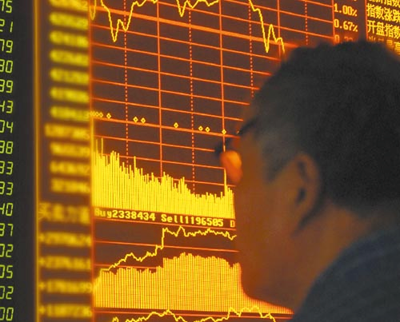

<!-- # 迷雾中的资本市场 -->

<!-- # 迷雾中的资本市场 -->

## 文/袁磊

一年多以来，我个人一直是看跌中国资本市场（尤其股票市场）的，当时在一些会议上和一些看涨的银行家们有过激烈的辩论，他们的主战观点依赖于政府的宽松货币政策和放大的政府杠杆效应，可是，固中奥秘只有那群大额授权的TRADER自己心中最清楚，因为做过一段时间的TRADER，所以对其内部的模式有所了解，这种高频的交易模式是很容易加剧资本市场的波动性的。

看涨的银行家们观点很明确，而且独立性很高，其对于政府信赖度之高极为可怕，可是，很可惜，当时在会议上我就直接指出了其致命弊端：缺乏可持续性。一名交通银行内部的经济学家反驳我，他说，现在只是为了激发活力而已，一旦激发出来了，那么可持续性自然会解决。我记得很清楚，当时我回应他很简单的一句话：国进民退和政府垄断模式挤压某些高额ROI行业的民性投资将使得可持续性链条被无情打断！

这其实是一个很简单的道理，即政府和民性投资之间会存在一个既得利益者同大众参与者分享利润不均匀的现象。这个问题短时间内将无法得到解决，所以短期内，资本市场的实体经济支撑性将得不到充足的补充，在一个物理模型内没有外部能量充斥进去的话，那么如果内部存在成本能量损耗，这样将使得整体能量的逐步损失，直至能量为零。中国的资本市场就是这个问题。

最近看到一个报道，企业整体的利润率降低了20%，我们一起来做一道很简单的数学题：如果3000点作为一个出发点的话（这个点已经很高了，假设我们很理想化），那么根据实体经济支撑虚拟经济的这个合理逻辑，那么PE下降20%也属于合乎情理之中，于是，3000点将至少跌去其20%，即剩下最多2400点。按照我的个人理解，根据企业的实际利润，我曾经和几个McKinsey、Goldman Sachs的朋友讨论过，中国股票的实际动能应该在2000点开始削弱，在1600点到1700点见底，这个观点看过我文章的朋友应该都知道，这是我一直以来都宣称的。

从外部角度来看，美国的储蓄率开始稳步提升，这将产生一个现象，那就是中国的中上层次的高赢利产品出口额将大幅度减少，而中下层次低利润产品的出口额将不会产生太大变化，因为对于必须消费商品的刚性需求始终的存在的。从侧面来看，这其实就是一个逻辑性问题在里面，我们出口额的大幅度减少其实体现在我们未来的主打行业出口产品上，即那些并非简单的加工产品。这对我们的出口行业模式转型将产生相当不好的影响，会抑制我们的可持续发展性特征。

全球资本市场的联动性已经开始逐渐趋同，因为从一些行业动态分析中，我们应该可以逐步了解到一些信息，全球化的发展已经使得相互之间的依赖度提高了不少，根据WORLD BANK（世界银行）的数据，新兴市场对于全球化依赖程度相比2005年，已经提高了87%。作为新兴市场的领头羊，我相信87%这个数据已经进行过严格的加权处理，那么我们可以预估中国依赖度提高应该已经远远高于这个平均数据了，我相信提高额度已经超过了100%。根据SOLOW的经济发展模型，这个出口导向型发展模式是可行的，这毫无争议，可是，如何把政府导向型出口发展模式向“国退民进”形式的出口导向发展，这才解决当前经济问题的当务之急。

当前的经济学模式，我们普遍存在于表面的意识形态，而对于一些本应该深入探究的东西却浅尝辄止，不能够抛开现象问题，总是忽略内生因素的本质性东西，细节的关注是很重要的，一个微小的点也容易产生巨大的经济、政治影响力，如同概率统计学中正态分布的FAT TAIL MODEL所表述的BLACK SWAN AFFAIR一般。所以，我相信，对于任何一个资本市场来说，基本面和企业利润所得将是股票价格分析的一个重要逻辑性因素，像其它的技术层面分析只是一个辅助作用，而且，我一直对于技术层面分析没什么太大的好感，因为其对于短期因素追求度太高，而短期因素的青睐度提高则从很大程度上即意味着SPECULATION（投机）现象的产生，其风险性外因很大，给我没有足够的安全感，所以内在价值评估一直具有其可信度，这从1930年以来都是如此，WARREN BUFFETT的老师Mr. GRAHAM不得不说是资本市场逻辑分析的鼻祖。

资本市场风起云涌，我们琢磨不透市场的走向，这个很正常，因为投机性因素和成交量因素会使得资本市场价格被“合理”扭曲，但是，市场总是会被修正的，偏幅越大，修幅也就越大，如同统计学中的REGRESSION回归分析一样。虽然市场无法做到“完全理性”的状态，但是，我们可以以一种虚拟其完全理性状态的点位分析，然后再向上以企业利润波动性为参数做一个向上修正，那么我相信这个模拟化的点位就能显现在诸位面前了，其他的，因为一些银行内部的限制性因素就不方便再说下去了，言尽于此，希望大家能有所受益。
