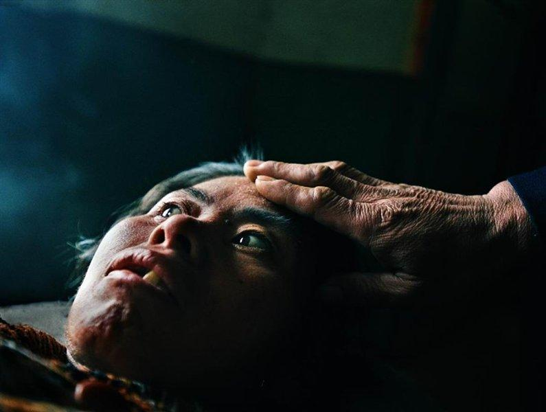
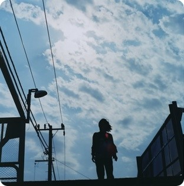
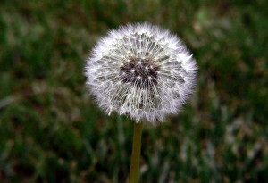

<!-- # 冰一的“麦田” -->

**“冰一曾经说过：对于国家的进步，中国的知识分子都在努力，并非只有我一个人。这让我想到李大钊的一句话：青年不死。”**

# 冰一的“麦田”

## 文/墨阳

“作为一名律师，我本可以走过去对她说‘别哭了，把你的诉状给我看看，把案情说给我听听，看看我能不能帮到你。’但是我没有。理想与现实之间的尴尬裂缝，令我手足无措”。

这是09年5月19日冰一在博客里写下的文字，缘于当天上午他在海淀法院的见闻。一名农村妇女在立案室里哭诉，她的儿子被人打得下不了床，法院却不给立案。

结尾，冰一写道“地藏王菩萨说，我不入地狱谁入地狱，他要渡尽所有地狱的苦难之身再升天堂。我们的人间呢？所有的苦难，有谁来渡？”

这个叫冰一的人，是北京一家律师事务所的实习律师。今年26岁。再平凡不过。

**好了，现在我开始承认，我是被割倒的麦子**

他曾以为他是能渡人过去的那根麦子，那时候他刚成为安徽大学一名法律系研究生，怀着对法律圣洁公正的憧憬，带着点自负与张扬。

然而上天给了他一次机会，让他见识到了一个隐蔽的世界，让他见识到了一群用尽生命的所有力量在不断收缩的网中苦苦挣扎的人。这群人有着一个共同的名字——上访者。这片北京南站附近的“十”字形街被称为“上访村”。它被几栋高大华丽的建筑合围着。《中国青年报》冰点周刊总编李大同曾说它“已然成为北京政治的癌瘤”。

时值06年暑假，冰一正住在中国人民大学他朋友那里。来见导师的他却因为朋友对一个陌生地名的提起而走进了一个微缩的底层社会，遭遇了一条汇集全国各地冤屈和苦难的上访之河。

早晨八点从人大出发，晚上六七点才坐着车往回赶。第一天去，他就被震撼到了，一段不长的街道上，竟或坐或卧地聚集了四五百个上访者，“上访者多得可以养活一条龙的产业”。摆地摊的卖着档案袋、公文包、《信访条例》等专供上访者使用的物品；供他们打字、复印材料的打印店起码有五六家；西瓜卖5毛一块，大碗面2元一碗；十几个人一间的“旅馆”一晚5元。

当然他也注意到了各处一米多高的窝棚，人弯下腰才能钻进去，那是没钱住“旅馆”的上访者用破烂搭起来的。村边的浴室门口写着——上访者不得入内。有些上访者‘以工养访’，工钱也只能拿到普通人的一半。他看见有人送了几斤肥肉给一位住窝棚的妇女，那妇女很高兴，立即支锅炼油，锅是用砖头支起的。于是满街都漂着一股油香味。“平常人家的幸福对于他们就像这油烟味一样稀有啊”，他想。

他用相机拍了贴在墙上的申诉书，有人过来问他：“你是记者吗？”渐渐的很多人围拢来，他有点恐慌，声明自己只是个做调查的大学生。他们显然对他的答复不满，但接着还是会把自己的案情和上访故事讲给他听。外围讲不到话的，就不断把上访材料递给他。他注意到他们递给他之前会把材料反复地理齐，把纸上的褶皱抚平，留下自己的电话，再小心翼翼地交到他手里，就像往邮筒投上一封重要的信件那般郑重。这种被当作救星的感觉，让他很难受，鼻子发酸，甚至有种想哭的冲动。他们中有劳力的男人，干活只能收一半工钱。村旁的公共浴室的大门上赫然写着“上访者不得入内”。

“他们最想要的，其实就是一个说法。”冰一跟我说，“譬如，对于一个母亲来说，她认为自己的儿子冤死了，她就是要为他讨个公道，给钱也不走。”

即便这样恶劣的环境，他们还在坚守着。流尽了泪水，拖垮了身体，耗尽了钱财，很可能连个信访受理通知书都等不到。最后，上访者彻底成了旁观者。就像秋天的最后一茬麦子，被收割了孕育了半辈子的希望。

不断有人告诫他“上访村很危险，不要沾。”他不听，一连去了八天。也是他幸运，没有碰到上访者“谈虎色变”的一群人——截访的。上访者们都格外保护这个能把他们的情况带给外界的人。经常不到天黑就有人劝他“小伙子，回去吧，想调查明天再来，天黑之前一定要走”。有两次时间晚了，几个上访者执意送他到车站。上了车，他觉得自己有点像个英雄，但转眼又为这种想法感到羞愧。他能够帮到他们什么呢？

“像做贼一样，胆怯而仓皇地逃离了现场”。8月8日的下午，在从未有过的无力和愧疚感中，冰一离开了。年底，他写完了七万字的调查报告《上访村札记》，准备自费出版，却没有一家出版社肯要。他大胆地把它挂在了自己的博客上。

“闪电，篝火，无垠的雪地，淋漓的鲜血，女人的啼哭和尖叫声划破夜空。我的脑海中常常浮现这些画面，以致夜不能寐。我甚至感觉到，几个屈死的幽灵从纸面上跃出来，卡着我的脖子问：‘你能不能帮我？你能不能帮我？’。”冰一在书中这样写道。

“不受限制的权力是导致社会不公平和灾难的根源，公权力是应该严加约束的，只有这样才不会侵犯私权利”冰一说他最信奉的理念，是在宪政框架之下，权力受到有效约束。他侃侃而谈，“民主”、“法治”、“公民社会”这些词从他口中接连冒出。他的思想在摸着社会的脉搏缓缓向前，越来越接近梦中寻觅的真理，眼神时而落寞如石，时而明亮如日。

这个26岁的青年，和无数白领们一样有着关于车子与房子的现实目标，也同时孕育着他那小小的理想。

**守着一望无际的麦田，我低下了高贵的头**

 08年，冰一又接触了一个更加绝望的群体——感染艾滋病的上访者。在毕业前，一家位于北京的知名艾滋病研究NGO聘用他为法律项目兼职研究员，希望他能对艾滋病感染者上访状况做一次全面的调查。从5月到8月，他与其他两名工作人员走访了安徽、江苏，河北，辽宁、吉林、黑龙江等地的感染者。最后完成的《艾滋病感染者上访情况调查报告》共分上、下两篇。

上篇是技术上的统计。在调查过程中，冰一证实了自己的观点：中国的艾滋病与世界其它地方有着很大差异，通过通过卖血、输血、使用血制品等血液途径感染艾滋病的比例非常之高（著名记者王克勤断言这个比例高达70—80%）。他感到震惊和愤怒的是，那么多无辜的人们，他们也许只是意外受了点伤就被输入了未作任何检验的血液，从此染上了万恶的病毒，也许只是分娩时因为医院的一句

“输了血健康”就糊里糊涂地签了协议，连孩子一起从手术台被人推向了万丈深渊。而卖血之人，必定出于贫困。可贫穷是罪吗？非得让他们以染上艾滋病相赎。染病后，通过法律途径诉讼维权又如此之难。冰一说，很多感染者的目标就是——“上访，让政府命令法院给立案”。

他们何尝不想通过法律途径解决问题。在冰一的调查报告里，106位感染者中有81例曾试图通过法律途径解决，比例为73.6%。可是，只有一半即42例予以立案。在这42例中，只有10例真正进过审理，而这10例中，大部分都以调解结束。最后胜诉的只有4例。以调解结束的案子，赔偿很不尽如人意，法院也将再不审理。诉讼维权如此之难，不难想象为什么有那么大一批的感染者都选择上访。

然而走上上访之路，就像走上了一条不归的旅程。辱骂、恐吓、殴打、监视，这群本已受着疾病折磨的人以及他们脆弱的亲属还要经历人造的恐怖。上访的结果是一部分人可以获得一些政府的补偿金和社会人士的捐助，这是有限的。病历的丢失和有关部门的打压使得真正的翻案，远不可能。

“一言以蔽之，中国艾滋病的蔓延，政府官员应负最主要之责任。中国政府虽然出台了“四免一关怀”政策对感染者进行医疗和救助，但从未追究过责任者的法律责任。”冰一在序言中一针见血地指出。谁也不想替他们解决。“河南地方政府纵容大量血站非法采血致使艾滋病在全省大规模爆发，地方官员有不可推卸的责任，所以，他们就严厉打击上访者，干预司法机关，不让法院立案，更不情愿为感染者解决问题。”这里面，参杂着太多的利益。这是行政权与司法权勾结的恶果。

书的下篇是冰一搜集、整理的几位感染者上访的故事。看过后，你会觉得即使用编年表的方法铺陈出他们前前后后的挫折、层层叠叠的伤痛，也还是一样地催人泪下。

“假如时间静止了，那么，在历史的横断面上，他们的不屈的形象无疑是恢宏纪念碑上一幅幅动人的浮雕。”——冰一

当被问起调查中印象最深刻的人和事，冰一说：“我们在吉林的时候，遇见了一位年轻的母亲，丈夫因为输血感染了艾滋病，生下的孩子也因此感染。最后丈夫和孩子都死了。她一个人住在冬天没有暖气的平房里。她看起来好像只有十七八岁的样子，单纯的就像个孩子。当我们说要帮助她，她用清澈而纯净的眼神望着我们，语气中满是信任和感恩。”他说那一刻，他和伙伴们非常感动。一个生命承受了如此的重压，依然单纯得像一朵白花一样。

“还有和我们在河北一起调查的蓄发明志的北钧，他的女儿有艾滋病，他们一起去镇上的饭店，人家都不接待。他觉得对女儿非常抱歉，每次他想带女儿去吃点好的，就开车到别的镇子去，因为那里的饭馆才会接待他们。”

“同样，在吉林市，我们搞了一个小型座谈会，和二十多个感染者一起吃饭。吃完饭，感染者们还没有尽兴，后来又去唱歌。他们一边唱一遍跳，和正常人一样快乐，甚至略带着一点疯狂。有几个女感染者跳舞扭动得很夸张，不知道为什么，我看着突然觉得很难受，觉得这是生命的狂舞。”

当一个人可以预知生命何时消逝的时候，会展露出人性最复杂的一面。“你既可以看到善良得让人心疼的人，也可以看见有些人以感染为资本谋取尽可能多的物质利益，甚至个别感染者转而报复社会。”对于后者，他提得不多。他说，当一个人马上就要失去生命的时候，会展露出人性最复杂的一面。你既可以看到善良的让人心疼的人，也可看见有些人因为家里和公安局有关系就疯狂的捞取补偿金，甚至可以看到有的女孩因为感染了这种病就到处去和别人睡……

冰一的叙述，语气平静、有条不紊。你很难想象那样一份血泪燃烧的调查报告是出自他之手。仿佛这已是另外一个世界不关他的事了。毕竟，他是一个每天都会接触新案件、新当事人的律师，是一个还没在这大城市中找到根的“北漂”，他不可能把自己烧成一壶开水，只能做一块默默散发着温润之光的玉石。

他提及自己很崇敬的一个人——许志永。“他是上书全国人大，呼吁废除收容法的三博士之一，创立了一家法律援助机构——公盟，通过它帮助了很多上访者和弱势群体。他曾竞选人大代表，最后成功了，是个很了不起的人。”

冰一一直觉得我们采访他没什么价值。“这个时代不缺乏有理想的青年人，缺乏有行动的青年人。我有一个曾在德国读法学博士的朋友，他认为中国公民社会的成熟必须中国人自己来做，就从德国回来加盟了一家本土NGO，希望把它建设成中国NGO的典范以推动公民社会的形成。”他觉得和朋友们相比，他没做过什么。

**我爱透了这个世界，时光你等待着我**

冰一还有一个身份，是安徽一家草根NGO的发起人之一，第一任执行官、理事。

“我们是由一个小小的QQ群发展壮大的，现在已有几百名志愿者了，公益项目已经持续开展了三年……”这是一个令他幸福的话题。

通过他我得知这家草根NGO是当地为数不多的关注留守儿童教育和健康的草根组织。因为找不到挂靠单位（我们国家对非政府组织实行双重审批制度，既需要民政部门许可还需要找一个挂靠单位），目前还没有注册，资金向社会人士募集。但他们的“留守儿童发展项目”已经运作的非常成熟了。“今年，我们主要致力于这个项目的推广”。

看着他参与设计、撰写的组织章程、愿景、项目计划书和筹资方案，我为他的才气和知识面的丰富所折服。他笑笑说“别忘了我本科是学社工的，NGO本来就是社工学生就业的平台”。

联盟的网站曾经被黑过，资料尽失，谁都没有备份。2007年3月20日，冰一在博客愤慨地写下“像我们这样的公益论坛，你黑它干什么？这天良丧尽的人，你黑它做什么？？？”

个中的辛苦，由此可见一斑。

“如果我一毕业，就能在一家有点规模的NGO工作，有人给我工资，那我肯定愿意。只是……”提到这个，他的语气又渐渐冷却了下来。

穿着刻板的细条纹衬衫，戴一副浅框眼镜，身上彷佛贴着小律师的标签。像都市无数的男男女女一样，过着格子间里的生活。期待有一所房子，把父母和女朋友接到北京来。这就是现实中的冰一。

冰一的老家，在皖北农村，父亲是一个电工，家庭条件还算不错。他说他从小就见到村子里贫穷的人家用电和吃盐的节省，“有的人家一月只用一度电”，“有些人家做的菜吃起来淡极了，因为不舍得放盐”。更令他印象深刻的，是他们对“命”的悭吝。

他读高中的时候，他的一个亲人在外打工感染了乙肝。起初他以为只是小病，就不舍得去医院看，不舒服就硬挺着，慢慢地，乙肝转化成了肝硬化、肝腹水，最后变成了肝癌。医生说手术或许还有希望。他的爱人就去找婆婆借钱——他的一个妹妹打工赚了几万块钱，放在他们母亲那里。婆婆说“钱倒是可以给你们用，但这是你妹挣来的嫁妆钱，万一钱花了病没看好，就什么都没有了。”他爱人无奈，空手而归。最后，这位亲人就在家里病死了。

这件事带给冰一的很大的震动：难道钱比生命重要吗？对于没有钱的人，他们的生命该怎样对抗疾病与死亡呢？

以后来到城里的他经常想：我是农村出来的孩子，而农民，这个庞大而朴实的群体，却一直被社会所漠视和遗忘。谁能为他们着想，替他们说话呢？

他说这就是他理想的源头。

小时候乡亲们总对他说“这孩子脑瓜儿聪明，将来肯定能成才”。的确，村里像他学历这么高的人，恐怕找不出第二个了。而他现在也不明白自己到底算不算成才，即便是成才了对家乡人又有什么帮助呢？

我问他，你身在法律界，应该很了解司法的现状，你会失去勇气吗？

他跟我说，大一时，他曾和老师讨论“人生的意义是什么”。他们的结论是“人是时间长河中的一粒沙、一滴水，只有将短暂的生命融入人类历史进步的长河才可能获得永恒的意义。纵使生命消失，但在人类的历史进程中，它也曾扮演过一个小小的推力。”

“面对民主与法治的残缺，光抱怨是没有用的，中国人的问题必须中国人自己解决，如果只说不做，又怎么可能改变呢。我是信仰法律的人，信仰是被用来坚守和皈依的。法治之光普照天下，人人生而平等、私权不被侵犯……这些法律人最美好的梦想，想到我曾为之尽力，也也就无怨无悔了。”

眼下，他正着手写一本书，来记录20年来中国人与疾病抗争的历史、医疗体制与社会保障制度的沿革与改革走向。

冰一曾经说过：对于国家的进步，中国的知识分子都在努力，并非只有我一个人。这让我想到李大钊的一句话：青年不死。

**你听到黑暗中的骚动，那是青年在歌唱，他们有着神一般的微笑，轻轻地哼唱，在黎明时分闭上嘴巴。**

后记：

他就是一个温和的人。偶尔低头，眼中便藏着一朵黛色的乌云。说话轻声慢语却都是思想的精华。听的歌都适于沉醉与沉思。他只是想做一个好人，他做过一些好事。

做被割倒的麦子，不要。做解脱了和等待着的守望者，也不要。那就做一个挥刀割麦的人吧。

像一个平凡的农夫，流着阳光味道的汗水，躺在他心爱的金色麦田。

（文中“冰一”为化名）
