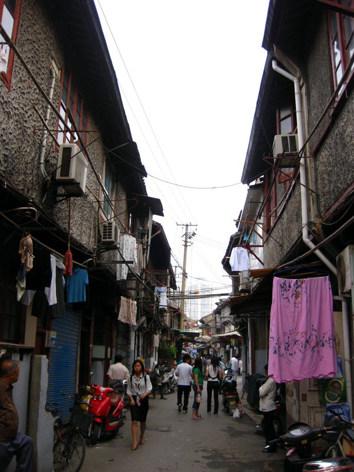

<!-- # 最为寂寞是上海 -->

# 最为寂寞是上海

# ——漫谈当今上海的地缘文化涅槃

## 文 / 江西特务

当今国土之上,哪个地方最为奢华？上海。哪个地方争议最多？上海。哪个地方故事最多？上海。但是，上海又是最复杂，最一言难尽，最让人看不透的城市。这里的气氛使得普通人无法坦然面对这个国家其他地域上的人和事，而其他地方的人们也很难坦然面对这里的一切。

在网络语言暴力日益泛滥的今天，由地域歧视所引发的唾沫横飞的谩骂随处可见。处在这一系列风暴中心的地方，从前是河南，今日是上海。其实，这山呼海啸般的骂声对于上海而言是不公正的。虽然身处上海之外的很多人并非真正了解那个城市，但是当他们参与到网络的对骂时，却全然是一幅苦大仇深的控诉者的样子。另一方面，作为对这种不负责言论的报复性回应，一些本土居民也毫不吝惜地给出了火药味十足的回击。许多将外地人贬得一文不值的回击也是害莫大焉。只是在这一来二去中，上海被愈发深重地孤立了。

这是难以表达的寂寞

每一个到过上海的外地人，大概都会有类似的经历。这个城市的外观干净、明亮，生活节奏密集、紧凑。全中国最好的城市形态可以说就在上海。于是乎你可以享受到最完整舒适的都市生活——当然前提是你要带好足够的资金。你能够极尽消费之能事，玩遍每一个寸土寸金的商业聚集地。然而，你唯一不能享受的就是与此不同的任何一种生活方式。倘若你一定要坚持，则很容易在一部分本地人面前还原为一个彻头彻尾的外地人。接下来，嘲笑和鄙夷往往接踵而至。最后则化为又一次的地域之争。

这类争论很普遍，但又是很无聊的。它的实质在某种程度上说其实是生活在两个完全不同环境下的人对于彼此完全陌生的生活方式的曲解，进而上升到相互歧视的过程。这个过程非常类似于民族之间的矛盾——除了对于生活空间和生存资源的争夺以外，最让矛盾中人接受不了的就是和另一群生活方式与行为习惯迥异的人隔墙而居。

当然，这个模型放到上海人与外地人的隔阂之上时，是需要调整的。因为双方对垒的具体情况其实十分微妙并且耐人寻味：

首先，从形式上看，上海所拥有的发达城市文明相比更加落后的内地，无疑要强势许多。当一个外地人走入上海市区，其能够体验到的基础设施服务必然远远超出他在内地其他地方的经验。基于此而生发出的对于上海人的羡慕情绪很难被克服和忽视。但是另一方面——从中国人特别偏爱的现象性思维方式出发——当他转念一想自己的家乡相比于眼前这片消费的乐土，竟然如此落后、破败、令人失望的时候，心中将会升起一种怎样复杂的情绪？对于故乡的失望和对于自身来自故乡所产生的自卑，很可能在两个生活世界巨大的反差当中引发出强烈的自我封闭和嫉妒心理。当然，这个自我封闭不单是作为个人的封闭，更多时候则表现为与老乡们凝结在一起，形成一个相对孤立于栖居城市的亚文化圈。

与这种外地人面对上海时的自卑相对应的，便是上海人在阅览外地城市时的那一份自然而然的优越感。有优越感并非坏事，因为他们的家乡本来就建设的比其他地方更好。但是当来自反差太大的两个世界的人在一起相处时，人性的弱点便很容易制造出矛盾——因为本地人具有的普遍的优越感，其中德行不高者难免对于外地人的出身和背景出言不逊。这是引爆地域之争的众多导火索中的典型。

其次，从实质上看，上海虽然有着发达的城市文明，但它在面对偌大的内地之时却是十分弱势的。缘由在于它的孤独——即它在中国大陆这个特殊的政治背景和文化范畴内独一无二的难以找到对话者的遭遇。当一个大胖子被一群小瘦子们包围并时刻承受着来自那个外表孱弱的集体的异样眼光时，现场的情势就必然得到逆转。通常，这种逆转是不会发生的。因为任何一个独立行动、头脑清醒的胖子都不会傻到主动走入一群并不特别友好的瘦子当中去。正如一个发达国家的总统绝不会傻到在没有任何国家利益的要求之下就去深入亚非拉抛洒橄榄枝。但是由于地缘的原因，作为“胖子”的上海却又处于一群瘦子的紧密包围之下，这就使得贴身的摩擦和碰撞变得不可避免。

毕竟，关于地域文化的争论，其胜负或者说强势弱势往往并不取决于双方实际的文化实力对比，而取决于参与舌战者的凶狠程度与结盟广度。以寡敌众，显然使得上海人在这场争论当中始终处在了下风。发展到后来，许多人在这种无聊的论争中退出，继而选择了默默无闻地去忙生活。但更多人则愿意留在由骂声和愤怒胶结而成的虚拟战场里，继续着他们的唾沫横飞。不过，总的来说，留下来继续开骂的外地人还是多了那么一些。

其实，这种口水战的确戕害深远。仅仅为了发泄心中那种朦胧而幼稚的情绪，就在中国本已支离破碎的文化版图上硬生生地刻下了更多的鸿沟。很多人常常嘲笑朝鲜的封闭与落后。然而又有多少人发现，西欧北美看我们的眼光与我们看朝鲜的眼光是多么的相似？和这个模型相一致的是，外地人看上海的目光和中国人看西方的目光也是惊人的相似：同样都包含着羡慕、自卑、无奈、失落，继而是伤感、不满、嫉妒，甚至还有莫名奇妙的愤怒。微妙的是，这最后的也是最隐匿的愤怒，如果得到某个事件的引导，就能爆发出惊人的破坏力。奥运前的法国人已经“过瘾”地尝过这种集体情绪的厉害，但是比他们更倒霉的是上海人，因为上海人在他们生活中的多数时候都在承受着这种破坏力。正如战争中受伤害最深重的是士兵和平民，这种没有硝烟但又旷日持久的地域文化对立当中受害最重的自然也就是身处异乡的上海人和身处上海的异乡人。

当下的上海，的确是可叹的。因为除了上述的地域文化冲突所带来的精神伤害之外，还有一个更加让上海人伤神的事，那便是上海独特的市井文化正在有条不紊地消亡。不知从何时开始，上海开始流行这样一句自嘲：一等人说英语，二等人说普通话，三等人说上海话。因为上海绝不仅是上海人的上海，它是全世界共有的上海。上海话曾经和十里洋场、商界三杰一样，是民国文化当中令人印象深刻的符号。但如今的吴侬软语却如此地不受待见，以至于有人笑谈在当今的上海再说上海话即是没有文化的表现。作为一个外地人，我对此只能报以唏嘘。

方言是地域文明的缩影。从上海话的遭遇却可以反映出真正的上海文化在这个全球化的风口浪尖上所遭遇的巨大尴尬。作为移民城市的上海，其历史主旋律本身就会展现出固有的频繁变迁——唯一不发生变迁的即是这个城市变迁着的存在状态。诚然，要成为国际大都市，就必须具有充盈的律动力。然而一个城市之所以有资格成为一个城市，而非仅仅是一个商贾绅士集散的市场，就必须有它独特的文化。这种文化由当地的饮食偏好、起居习惯、交流方式、行动方式等种种方面的特有之处综合而成。即使是号称大熔炉的美国，也是因为有这一套独特的价值观和世界观，才有资格成为一个国家，并拥有其文化的，绝非仅仅保持在欧洲流放者的集中营。

也许是出于一种应激性的集体反应，上海人爱上了周立波。的确，这个海派清口所诉说的改革开放三十年栩栩如生，对于当下人们生活世界的缓慢变迁的真实再现是十分重要的。因为它不仅还原了这个文化空间的主人们的生活史，更使得人们——尤其是孩子们——建立起越发浓厚的乡愁。人漂泊于世，为了做到理性的自我保存，他就需要寻找到一些东西来作为精神的支撑与归宿。其中最广泛且有吸引力的，便是乡愁。

如果说我们居住的土地上，只有一群终日为了生存而奔波忙碌的“挣钱的人”，却没有能够安然抚茶相坐、口述历史的“生活的人”，那么这个群体将不可能存在内部认同感。换句话说，这就更不像是由契约缔结而成的市民阶层，而更像是一群貌合神离的乌合之众。

上海是特殊的，但它也是典型的。在今天这种被孤立的逆境之下，消费主义和虚无主义对于这座城市灵魂的里外夹击就显得更有毁灭性。发达资本主义时代人性的集体堕落是一种全世界都必须经历的通病，这种病在国际化都市里最为明显。东京、纽约…还有更多的大都市正在经历自身灵魂的死亡和被资本的吞噬。但是，上海不应该走上这条以集体堕落为终点的不归之路。拯救上海的最省力办法，即是拯救它本身的市井文化。在资本主义淹没一切的大洪水持续上涨之时，建造这个保存文化种子的诺亚方舟势在必行。

寂寞是无言的诗句，只有无助的灵魂才能读懂；寂寞是旧梦的挽歌，只有流离的难民才能传唱；寂寞是悲戚的呻吟，只有临死的躯体才能共鸣。

上海是寂寞的。然而并不代表上海无法走出这静寂的凄凉。
