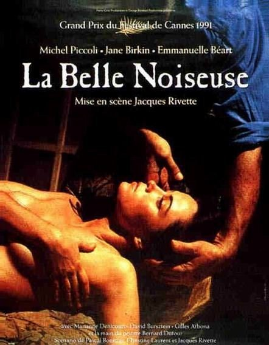

<!-- # 心理分析——人格分裂与赛博空间里的“生死爱欲” -->

**“今天，电脑空间的社会功能的问题在于，它潜在地填补了沟壑，即主体的公共符号身份和它的幻影背景之间的距离：幻念被越来越多地外在化于公共符号空间；隐秘的领域被越来越多地直接社会化。网络性交的固有暴力并不存在于显示屏上直播的、性幻想中潜在的暴力内容，而在于看到‘我的隐秘幻想被直接从外部施加给我’这个非常具有形式感的事实。”**

# 心理分析

# ——人格分裂与赛博空间里的“生死爱欲”

## 文/巴赫金

### 分裂的爱

对动物来说，性的最基本形式，或者说性的“零形式”就是交媾，可对人类而言，性的“零形式”是在性遐想中手淫。同“真实的”，有血有肉的他者接触，从另一个人身上获取性快感并不是什么明摆的事，创伤内在于那其中，只是那个他者进入主体的幻想框架之中，性快感才能维持。在18世纪，作为现代转变的一个显著表现，手淫第一次成为了道德问题，可根本困扰性伦理学家的并不是没有任何结果的精子丧失，而是在手淫过程中唤起欲望的“非自然”方式——欲望的对象并不是真实的客体，而是主体的幻想创造出来的客体。比如说，康德就谴责这种罪恶行为，认为它如此非自然，他说“哪怕是叫这种行为的名字也有损于尊严”。康德的理由是：“如果唤起人的情欲的不是真实的客体，而是他对客体的想象，从而违背了欲望的原来目的，情欲就有违自然，因为是他自己创造出了那个客体。”然而，问题是，如果性要发挥正常功能，至少也需要一点“想象的综合“（康德语），从而再创造出客体。想想看我们大家都清楚的一幕不愉快情景，“想象的作用”就清晰显现出来：即使在最激烈的性爱过程中，也有可能我们突然间“断线了”，突然之间，一个问题跳了出来：“我干吗要在这大汗淋漓，一下又一下重复那个愚蠢的动作？”突然之间，快感变成恶心，或者一种远离的奇怪感觉。关键点是，就在你内心里发生翻天覆地的变化之时，现实中什么也没有变，引起你内心巨大变化的是他者在你的幻想框架中的位置变化。

在基希洛夫斯基的电影《关于爱的短片》中（那是部表现温文尔雅的爱情在今天已经不可能的经典作品），出了错的正在于此。影片的主人公，年轻的托麦克是个偷窥手淫者，他总是在透过“后窗”观看自己所爱的女人的时候手淫。终于，他跨过幻想的门槛——窗户，被那个女人诱到镜子另一边的世界中（那个女人主动献身于他），那一刻，他彻底崩溃了——得到了女人的男孩选择了自尽，世故的女人却重新被温情打动。获救的男孩拉上了窗帘放弃了偷窥，焦灼的女人却拿起了望远镜。当最后我们没有抱任何希望的时候在女人偷窥凝眸的主观镜头中他们却走在了一起。如基希洛夫斯基所言：“我们每个人都变的太自私，由于太爱自己和自己的要求，其他人便在背景中消失了。我们无暇谈论感情，或是我们没有时间感受与感情密切相关的激情。于是我们的生命就从我们的指间流逝了。”

即便在所谓温文尔雅的爱情传统中，我们也早已从弗劳斯威尔特这个形象（代表着世界和世俗生活）中见过去美化的例子：在远处，她看上去美艳不可方物，可一旦诗人或侍奉于左右的骑士走得太近（或者她点头召唤他过来，要酬劳他的忠心侍奉），她就把她的另一面暴露了出来，原来魅力无限的她突然显露出恶臭的肉体，上面爬满了蛇虫，这就是生活令人恶心的本质。在大卫·林奇的电影中，当镜头紧贴一件物品的时候，那件物品就显露出生活令人恶心的本质。因此，美和丑的区分也正是现实和实在的区分，要构建起现实，主体至少也需要一点理想化，从而忍受恐怖的实在。

当幻想框架崩溃时，主体感受到“现实感的丧失”，开始视现实为“不真实”，噩梦般，是缺乏坚实本体基础的世界。那个噩梦般的世界并不是“纯粹的幻想世界”，恰恰相反，是现实被剥离了幻想支撑后剩下的残余。舒曼为霍夫曼配上音乐，成就了《狂欢节》这部音乐剧。在这部剧中，现实退回到梦幻般的世界中，那里，人与人之间的交往被化妆舞会替代，舞会上的人谁也不知道面具后的脸究竟是谁的，只有面具张着大嘴狂笑。我们看到的并不是“纯粹幻想世界”，而是艺术对幻想框架崩溃的独特表现。音乐剧中的人物就如同蒙克画笔下的人物——闲荡在奥斯陆大街上的幽灵，面色苍白，可他们的眼中却闪耀着微弱，却又强烈的光芒。那是一群主体崩溃的活死人，是被剥夺了物质本质的脆弱灵魂。

如此一来，舒曼在对待自己的爱人克拉拉的态度上是个实实在在的“分裂主体”也就不足为奇了，他渴望接近她，可同时，又对她心存畏惧。同样不足为奇，贝多芬的《致远方的爱人》对他有着巨大的影响。舒曼的问题是，他悄悄希望自己所爱的克拉拉伫立在远处，从而维持她在自己心中崇高无上的位置，避免变成一个令人反感的同居者，强闯入自己的生活……在1838年5月10（经过多年艰辛，舒曼和自己的爱人越过了重要障碍，终于开始讨论即将举行的婚礼），舒曼在写给未来新娘的信中道出了藏在心中的秘密。他说：“你的在场，我相信，会使我所有的计划和工作陷于瘫痪，我将为此深深不快。”更为神秘的是舒曼在1838年4月14日的信中提到的梦：

_我应该告诉你昨天夜里我做的梦，我半夜醒了过来，很快又睡着了。然后，我感觉我同你，你的梦想，你的灵魂越来越深地连结为一体，突然我用上全部的力量，从心灵最深处大声叫出来：“克拉拉，我在呼唤你。”可就在这时，我又听到一个粗暴、残忍的声音从我身边对我说：“罗伯特，你身边有我！”我陷入恐惧之中，仿佛在空旷的原野上遇到鬼魂。那以后，我再也没有像那样呼唤过你了，那个梦对我的影响实在太深。_

埋伏在那粗暴、残忍声音中的不正是我们共处一室的真实存在吗？当我们彼此走得太近时，那一存在就向对方暴露出自己令人恐惧的重量。舒曼既感到吸引，又感到排斥;他对远方的爱人既有渴望，可当她走近时又感到间离和反感，他在两个极端间摇摆不定。舒曼的分裂绝不是暴露出他心理上的“病态”失衡，这样的摇摆不定存在于人类的欲望的构造中。真正的难解之谜：一个“正常的”主体怎样才能把自己的分裂掩盖起来，从而在爱人的崇高形象和她的真实存在之间获得脆弱的平衡，从而使那个有血有肉的人继续留存在崇高之中，避开彼此变成令人作呕的大便的可悲命运……

雅克·里维特在他的电影《不羁的美女》中，把焦点放到一位男画（MichelPiccoli）和他的女模特（EmmanuelleBéart）间的紧张关系上，那位模特抵抗画家，她主动激怒他，挑战他的接近，又鼓励他上前，因为全身心投入到艺术作品的创作中。简而言之，那个模特简直就是个不折不扣的“TheBeautifulTroublemaker”，是个创伤性客体，她惹恼、激怒艺术家，拒绝陈列于普通物品之列。而艺术不也是把艺术品“定格”下来，描绘出它的创伤，并把它凝固在艺术品的外在表征中吗？除此以外，艺术还能是什么？然而在电影中，艺术家同艺术品的内在创伤间的和解却失败了，在电影的结局中，画家把自己完成的作品藏在了两堵墙之间的夹缝里，它将呆在那里，直到永远。为什么他要这样做？答案是：他这样做并不是因为他未能看透模特的秘密，而恰恰相反，他看得太透彻了。也就是说，最后完成的作品泄露了模特太多的秘密，它揭下模特的美丽面纱，把她的真实存在展现了出来。她原来是个令人厌恶的、冷冰冰的吻。这样一来，当模特看到最后完成的作品时，她在震惊和厌恶中逃开也就不难想象了。她看到的就是她存在的内核，变成令人作呕的大便的存在内核。因此，真正的受害者不是画家，而是模特，她主动诱导画家把自己的存在内核压榨了出来，平铺到画布上。她得到了她所要的，可这又远超出了她想要的，她得到的不仅是她自己，更加上了构成她存在内核的极度肮脏。正因为这个原因，那幅画要永远藏在墙里，而不是被简单摧毁。物理摧毁画作没有任何作用，你没办法把它埋起来然后就假装什么都没发生过，那“凝结”在画中的东西在严格意义上是无法摧毁的，它具备了拉康在他的文章“四个基本概念”中所提到的薄片的地位，它是主体出现前就已存在的神秘、“不可磨灭”的生存本质，是物化为器官的情欲。

奥尔森·维勒斯（《公民凯恩》的编剧）对这种“秘密宝藏”，亦即隐藏在主体中的存在内核的奇怪逻辑非常敏感。主体一旦显露出来，它就变成了浸毒的礼物。他引用阿尔达丁爵士的墓志铭：“一位伟大的国王有一次问一个诗人，‘在我拥有的一切中，我能给你什么？’诗人巧妙地回答，‘什么都行，只要那不是您的秘密。’”为什么？正如拉康所说：“我把我自己给了你，可这件礼物——哦，真难以理解——竟不知为什么变成了大便。”如果一个人向另一个人过度敞开自己的心扉，这种心灵开放很容易变成令人厌恶的侵犯。在《公民凯恩》的开头和结尾，那句著名的标识语“别越界!”，其意义就在于此。进入他人最隐秘角落是高度危险的行为，如果你的所得超出了你的要求，突然之间，你就发现你已经身陷泥潭，这时你再想回头已经太晚了。我们从自己的个人经历中知道下面所说的情况多么令人难受：你深深景仰某一权威，甚至想更多了解关于他（她）的事。可当这个权威允许了你的请求，给予你信任，同你分享他内心最深处的创伤时，权威的光环瞬间消失得无影无踪，你唯一想做的就是躲开他（她）。或许，标志着真正爱情的特征正是知道何时该打住，别越过某个门槛。我们向心理医生“倾倒一切”，可也正因为这样，心理医生永远也成不了我们的朋友……在这里，即使处于如胶似漆般爱情关系中的人们，有些秘密也是不能说的。

在希区柯克的电影《眩晕》（又名：迷魂记）中，主角Det.John'Scottie'Ferguson有位相貌平平，脸上还有斑的女性好友Midge，她清楚男主角长期以来一直迷恋着那位早已谢世的美女Carlotta的肖像，于是就仿照那幅肖像画了另一幅几乎一摸一样的画，两幅画的唯一区别是Midge在自己画的肖像中用自己那相貌平平，还有斑点的脸替换了原画中美女的脸。当电影主角一看到这副赝品时，当然，他的感觉极度沮丧。为什么会这样？因为崇高的外表被错误的主体占有，实际上，那外表已从内部被破坏。《眩晕》中的那一幕浓缩，宣告了对主人公的欺骗：在电影结尾，他发现他一直在努力把那个姑娘塑造成Madeleine的完美复制，可那个姑娘其实就是Madeleine本人，Madeleine本来就是赝品。仅仅说他受骗了还不够，因为复制品无法再模仿理想原作。实际上，是理想本身从里面崩溃了。

与上面讲的例子严格类似的还有婚姻的崇高面具之下的可怖内涵（出轨、甚至“换妻”、群P）和提倡性自由的废婚主义者、同性恋者、同性恋婚姻在道德主流眼中的伤害性。为什么废婚主义者、同性恋婚姻被道德主流视为如此深刻的伤害？因为这一现象搅乱了一项假设：所有的提倡性自由的废婚主义者、同性恋者所要的都是短暂的混交快感，他们彼此根本无法维持长久的个人间关系。因此，当人们发现同性婚姻、废婚主义者的“自然结合”同“正常婚姻”竟如此接近时，后者的独特性就从内部被破坏了。由此而来的矛盾是道德主流宁愿这些提倡性自由的废婚主义者、同性恋者等等都是喜欢滥交的短暂快感追寻者，当这些人“要求更多”，要求以社会契约（如婚姻制度一样的契约形式）为象征仪式，确定下彼此之间深刻的承诺时，道德主流肯定会把这看成对真正婚姻纽带的亵渎。这就如同对康德来说：审判和判决一名教士是对正义的肮脏违越，是不可饶恕的罪行，其恶劣程度远甚于直接煽动起血腥暴动……

### 赛博空间里的“生死爱欲”

在性领域，对真实界的排斥导致了对计算机化的性的一种新时代观点，它认为身体混同进空虚的虚拟空间，摆脱了其物质重量：一个在准确意义上时意识形态幻念的观点，因为它将不可能的——性（与身体的真实界相关）和与身体分离的“思想”相联合，仿佛——在今天的世界中，我们的身体存在（被认为）越来越多地受到环境危险、艾滋病等等的威胁，直至自恋主体在与另一个人的精神接触中的极端易受伤害性——我们可以重新创造出一个我们在其中可以通过摆脱我们的实际身体，充分沉浸入身体欢娱的空间。简言之，这种视域是一个没有缺乏和阻碍的情景，一个在虚拟空间中自由漂浮的状态，在这个空间中，欲望孳生了下来……

消费社会中的欲望客体无穷多样，社会幻象层出不穷，虽然我们可以容易地指认出每一种社会幻象构造背后特定的政经结构或利益集团，但是这些对于幻象的解释并不具有消除幻象的力量。幻象基本上是一个用来填补不可能性空间的脚本，是掩饰空隙的一道屏障。幻象恰恰是掩饰对抗性裂缝的方式。消费社会为人们提供了太多的剩余快感，剩余快感是维系资本主义社会正常运转的必要条件。资本主义社会从一开始就充满了各种各样无法调和的社会矛盾，生产关系的框架开始限制生产力的进一步发展，而正是这一限制是资本主义社会不停发展的原因。齐泽克说，资本主义消费社会如果不对其物质条件进行不断革命，那么它必死无疑。消费社会的意识形态幻象对每个人的影响都是巨大的，它一定要通过对每个人的召唤来发挥它的作用。消费社会中的许多文化现象都是剩余快感起作用的好例子。网络社区里的男男女女，从其各种聊天记录、文本对话里挑逗性、淫秽语汇的过度使用量看，他们一方面追逐一夜情、性游戏、出轨，另一方面对此类行为结果的真诚性并不相信。网上聊天很好地体现了剩余快感运作的征兆。

身份的含糊性决定了我们如何认识我们的屏幕角色：

一方面，我们维持着保持外部距离，是在与虚假形象游戏的态度：“我知道我不像那样（勇敢、有诱惑力……），不过时不时忘掉自己的真实自我，戴上一个自己更满意的面具，倒挺不错的——这样，你可以放松，你摆脱了做真实的自己、以自己的方式生活，并为此负责的负担……（人格分裂）

在另一个方面，就其揭示了我在现实生活中从来不敢承认的方面而言，我为自己创造的屏幕形象可以比我的“真实——生命”形象（我的“官方”自我——形象）“更像自我”。比如说：我在网络交友社区（或网络游戏）中以虚假的身份资料参与它时，我可以将自己表现为一个乱交的女性，参与那些我假如在真实生活中进行，将使我的个人身份感到解体的活动……

在这两个方面当然不可避免地彼此交缠：我认为我的虚拟自我——形象仅仅是游戏这一事实，使我可以悬置通常会阻止我在真实生活中实现我的“阴暗面”的障碍，自由地发挥一切我的力比多潜力。当一个在真实生活得社会关系中是安静、害羞的人，在虚拟游戏（交友社区）中采纳了一种愤怒、侵犯性的形象时，我可以说他因此表达了他自己被压抑的一面，他的“真实性格”中未得到公开承认的方面——他的“电子身份这里得以发挥”；不过，我们还可以认为，他是一个软弱的主体，幻想着更加富有侵略性的行为，以便避免面对他在真实生活中的软弱和胆怯。在虚拟现实中上演一场虚幻场景允许我们跨越欲望及其固有障碍的辩证僵局：当一个人用他将施与的性快感来对女人大加挑逗性允诺时，她最高明的回答应当是“傻逼，有种你就来操我！”在虚拟现实中我则可以充分发挥，而不用真正操作它，这样也就避免了与真实生活行动相关联的焦虑——我可以做它，因此阻碍或者羞耻得到悬置。

这里有一种解读拉康的格言“真相有着虚构的结构”的方式：只要我知道自己无非是在屏幕上玩一个游戏，我就可以说出关于我的驱动力的隐藏的真相。电脑空间中的性，不存在“面对面的”，只是外部的非个人的空间，在这其中所有东西，包括最隐秘的内部幻想，都可以毫无禁忌地宣讲……

让我们来想想虚拟性爱吧：我和一个女人在屏幕上玩性爱游戏，交换“单纯的”书面信息时，不仅仅是游戏可以真正挑逗起我或者我的伙伴，给我们带来“真正的”情欲感受（这一方面进一步的矛盾是当以及假如——我后来在真实生活中遇到这个女人，我可能会深深失望、厌烦：我在屏幕上的经历在某种意义上比现实中的相逢“更加真实”）；也并不仅仅是在单纯的性挑逗之外，这个性友和我能够不在真实生活中见面而“真正地”陷入爱情。假如在网上我“强暴”了这个女人会怎样？一方面，存在着一条将它与真实生活区分开的沟壑——在某种意义上我的所为更接近于不礼貌，或者粗鲁、伤害性的谈话。在另一方面，它也能够造成深深的侮辱，甚至情感上的灾难，它不能够被剥削为“单纯的言语”……并且——回到拉康——它是什么呢？这种中介的层面，这个插入“真实的生活”和“单纯的想象”之间的第三个领域，这个在其中我们并不直接插手现实，却也不直接插手“单纯的言语”的领域（既然我们的言语的确造成真正的后果），除了符号秩序本身，它还能是什么呢？ web2.0与3G时代的来临，或者在未来更高阶信息技术革命中，距离将被更高的悬置（我可以通过视频电话，在地球上任何一点与我的爱人即时交流）；所有信息，从文本到音乐到视频录像，都将在我的界面上随手可得。不过，使我与一个遥远的陌生人彼此分离的距离的悬置的反换命题是这样的：由于与“真实”的他人的身体接触逐渐消失，我的爱人将不再是一个爱人，因为她正在被一个屏幕形象所代替；大量的可获得性将引发一种难以忍受的幽闭恐惧症：大量的选择被感受为选择的不可能性；普遍的直接参与的社团更加强大地排斥那些被阻止参加它们的人。赛博空间开放了一个无尽的无限选择的未来、新的综合性器官等等的表象，掩盖了它正好相反的一面：一种闻所未闻的极端囚禁。这也就是等待着我们的真实界，一切试图将这个真实界符号化的努力，从乌托邦（新时代或者对于被解放的赛博空间权力的“解构主义”狂欢）到最阴暗的反乌托邦（电脑化网络进行着上帝般统治的前景，如电影《鹰眼》、《夺命手机》等）都仅仅是大量试图避免真正的“历史的终结”，也就是比任何实际囚禁都更令人窒息的无限的矛盾手段。

或者，换一种说话……虚拟化取笑了我的“爱人”和一个遥远的外国人之间的距离，只要它悬置着他者在真实界的巨大分量中的存在：爱人和外国人在他们的屏幕形象上是平等的。在“性爱电话”中，联系领域的狭窄性（我们的谈话对象只能是以一种无实体的、并且因此也是各种可能均有的伪装声音形式出现）将他者，也就是我们的对象，抬升到一种神秘的实体地位，其声音直透我们的胸臆。当（假如）我们终于在现实生活中遇到我们的电话对象时，效果经常是MichalChion所谓的反熟悉化：他者失去了他的虚幻特征，他转变为一个普通的世俗存在，我可以与她保持一个普通的距离。简言之，我们从神秘的真实界进展到了现实，从他者猥亵的虚幻存在进展到仅仅是一个写实客体的他者。

对赛博空间加以理论化的倾向之一，是将数字化性行为理解为克尔凯郭尔及他与雷吉娜的关系为基本环节的链条中的最高表现：正如克尔凯郭尔弃绝了与他者（心爱的女人）的实际亲密接触，认为孤独为与心爱客体保持关系的惟一真诚模式一样，网络性行为也涉及对“真实——生命”客体的虚无化，从这个虚无化中获取性欲动力——我在现实生活中遇到我的网络性伴侣的时刻，也就是去崇高化得时刻，回归粗鄙“现实”的时刻。这个比较听起来可能很有说服力，但是其实它非常具有误导性：我的赛博空间性伴侣的地位不是克尔凯郭尔的雷吉娜。雷吉娜是一个克尔凯郭尔为之献上语言的“空洞”，是一种由他的言论文本所编织的“空心泡沫”，而我的赛博空间性伴侣则是正好相反，她是过度——呈现的，以大量的形象和对她（或者他）的最隐秘幻象的直率言说轰炸我。或者，换种说法：克尔凯郭尔的雷吉娜是对真实界，即不断搅动我的自我满足的性欲想象的流畅滑动的创伤性阻碍的切割，而赛博空间则表现为它的反面，是一个想象和信息的流畅滑动——实际上，当我沉浸在其中时，我回到了一个与他者的共生关系中，在其中，表象的洪水似乎冲垮了真实界的维度。

今天，电脑空间的社会功能的问题在于，它潜在地填补了沟壑，即主体的公共符号身份和它的幻影背景之间的距离：幻念被越来越多地外在化于公共符号空间；隐秘的领域越来越多地直接社会化。网络性交的固有暴力并不存在于显示屏上直播的性幻想中潜在的暴力内容，而在于看到“我的隐秘幻想被直接从外部施加给我”这个非常具有形式感的事实。大卫·林奇的《我心狂野》中一个痛苦、令人不安的场景：

_在一个孤寂的汽车旅馆房间里，威廉·达福粗鲁地压迫着劳拉·迪恩：他摸她、拧她，侵犯她的隐私空间，威胁地重复：“说！来操我吧！”——从她那里压迫出一句表示同意性交的信号。这个丑陋、令人不快的场景不断持续，直到劳拉·迪恩最后筋疲力尽，微弱地说：“来操我吧！”，达福立即撤出身，换上一副友好温和的笑容，愉快地回答，“不，谢谢，我今天没空，不过下一次我会非常乐意从命……”_

完美地证明了网络性交的猥亵暴力，尽管（或者应当说正因为）在其中“没有任何事情真正发生在我们的身上”，我们的存在的幻影隐秘内核以一种更加直接的方式被赤裸裸陈列出来，使我们感到彻底无助和受伤。

所有信息（所有书、文章、电影、隐私照片、录音文件、办公数据……都被计算机化，即时可用）都被数码化的前景保证了一个对大他者的几乎完美的物质化：在机器里，“所有事情都将被写下”，一个对现实的彻底的符号再现将发生。这个完美的符号描述的前景也预示了一种新的灾难形式，这就是对数字网络的一个突然干扰（比如一种强大的木马病毒、网监审查制度、黑客攻击、切断太平洋光缆等）抹去了计算机化的大他者，却没有伤害到外部的“真实现实”。这样，我们就遇到了一个纯粹虚拟灾难的概念：尽管在“真实生活”中，没有发生任何变化，一切照常进展，但是灾难却是彻底的，因为“现实”被突然剥夺了它的符号支撑……
