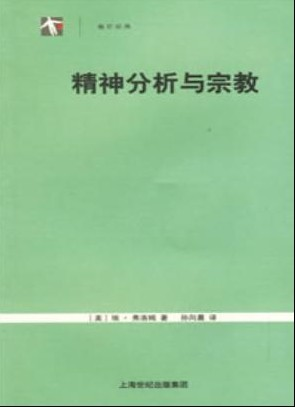

<!-- # 北斗电子书推荐 -->

<!-- # 北斗电子书推荐 -->

## 本期主题：心理世界的探秘

人在生活实践中与周围事物相互作用，必然有这样或那样的主观活动和行为表现。这就是人的心理活动,或简称之为心理。具体地说，外界事物或体内的变化作用于人的机体或感官,经过神经系统和大脑的信息加工,就产生了对事物的感觉和知觉、记忆和表象，进而进行分析和思考。人在实践中同客观事物打交道时，总会对它们产生某种态度，形成各种情绪。但因为我们的种种未知，所以对这个神秘的世界充满好奇。现在，让这些书籍来陪伴我们一步步窥探心理的世界。

推荐书目： 1、《中国的人心与文化》 2、《图腾与禁忌》 3、《精神分析与宗教》

撰稿人推荐书目《性心理学》

推荐书籍 1、《中国的人心与文化》 

《中国的人心与文化》是朱建军教授以心理学的眼光来解读传统文化、以人心利弊来检阅传统文化的收获之作，中国传统文化被以一种别开生面的方式解剖开来，“心理学家看文化，首先看的是人心”。书中提出了很多新颖乃至颠覆性的发现，作者从诸如孟姜女哭长城、牛魔王和铁扇公主这样的神话传说入手，从诸如柳下惠坐怀不乱、六月飞雪窦娥冤这样的经典故事入手，从电影《天下无贼》《太极张三丰》《墨攻》等入手，对塑造中国人性格、影响中国社会人心的传统文化，深入地作了清理与甄别，分出来哪些是毒、哪些是药。

朱建军，教授，在心理咨询与治疗领域享有盛誉，擅长使用多种心理咨询与治疗技术，并创立了影响最大的中国心理咨询与冶疗方法——意象对话心理疗法。

 2、《图腾与禁忌》 

本书由弗洛伊德的四篇论述图腾与禁忌的论文组成，其特色在于将精神分析学的观点和发现用来解决社会心理学中一些悬而未决的问题。在讨论图腾与禁忌问题时，弗洛伊德将之与儿童和神经患者相比较，因而能如弗洛伊德所说，在研究此问题的社会人类学及民俗学与精神分析学之间架起一座沟通的桥梁。

本书试图通过一些保留在儿童时期的图腾崇拜的遗迹，亦即通过我们的孩子在其成长过程中呈现出来的哪些细微迹象。来推导图腾崇拜的原始意义。图腾与禁忌之间的紧密关联又使得我们向着本书提出的假设向前迈进了一步；如果最终的论述使得这一假设看起来很难令人信服，那也没有必要指责它在多大程度上有可能近似于现实，毕竟重建这种现实是如此的艰难。 3、《精神分析与宗教》

埃•弗洛姆(Erich Fromm，1900～1980)是美籍德国犹太人，著名心理学家、社会学家和哲学家，人本主义精神分析学说的创始人，著有《逃自由》、《爱的艺术》、《自我的追寻》、《西格蒙德•弗洛伊德的使命》、《马克思关于人的概念》、《对人的破坏性之研究》等。 

本书集中讨论宗教与精神分析的关系问题，洋溢着强烈的人本主义精神。弗洛姆认为，精神分析既不是宗教的敌人，也不是它的盟友；而是与隐匿在宗教观念背后的人类真实经验及宗教理想中内含的人类价值的实现密切相关。问题不在于人是否要重新皈依宗教、信仰上帝，而是他是否热爱生活、追求真理。

北斗撰稿人推荐

本期为大家推荐图书的是撰稿人唯苦近佛。

**关于霭理士《性心理学》这本书的类似于读后感的一篇文章，我迟迟找不到动笔的机缘。一半是因为书的深刻实在教我难以以读后感的形式和高度去重新把握，一半则是因为你我共知的原因。

**

# 人之性

## 文/唯苦近佛

尽管如今的社会日渐开放，但关于“性”的题目，多数人还是狃于成见，囿于道学家的教条，以为是可耻的东西，以为是不可言说的秘密。我当然不指望在这里扭转或改善这些顽固的态度，我若试图扭转或改善，必要戳了某些人的心，动了文化的根。因此我在阅读的时候，每每便只有拍案叫绝的份，我看着生命中那些被我忽略的细节一一被解释、被赋予重要意义，我看见我以前被雾铺盖的日子恍然清晰，即便浑身充满了记录与抒发的欲望，也立马被想象中读者愤怒的目光浇个透心凉。我深知做这一番研究，作者霭理士和译者潘光旦先生，及各个时代各个研究门派和各个领域的人士，在社会和宗教文化的阻力下，在学术起步的困难中，都为之付出艰辛的努力，我也因此对那些有名无名的英雄们和开拓者们致以尊敬和感激。然而我今天，却尽我最大的努力回避或隐晦那些会使你神经敏感的话题或方面，也因此请求你在阅读下面的文字之前将一切成见暂且放下。

“凡是上帝自己创造而不引以为耻的东西，我们不应当引以为耻而不说。”

“性是一个通体的现象，我们说一个人浑身是性，也不为过；一个人的性的气质是融贯他全部体气的一部分，分不开的。”

——摘自绪论

全书用了整整一章的篇幅来介绍性的生物学，将性联合解剖学、组织学、病理学和生理学等进行阐述。这一章的精彩演绎让我第一次认识到，这本书虽名为《性心理学》，却没有狭隘到放下心理学之外的一切学术不谈。此后，霭理士在谈到性的张与驰、收与放时，也没有袭用一般精神分析者和精神病理学家的观点，认为性的抑制会伤害身体和精神，引发神经和精神上的病态，而是强调抑制现象在一切生物界里的合理存在，以及对人类社会稳定、民族发展的重大意义。

对于女性的性特点，本书提出了更为科学的真知灼见，因此给了女性更大的理解、关怀和宽容。在“婚姻”一章里，关于“冰一般女子”是否存在的讨论，最终以为最极端的例子——卢梭《忏悔录》中华伦夫人——的正名而收尾。（卢梭因此再一次受到攻击，关于卢梭在本书中的命运，见后文）

本书中提到了大量的名字，除了大部分的性学研究者，还有一个名字引起我注意，就是卢梭。是时，关于卢梭，我的全部认识仅仅是《忏悔录》（Les Confessions）一书，当然后来又知道了《一个孤独的散步者的遐思》和《论科学与艺术是否有助于敦风化俗》，从其著作方面来看，这样一个博学而有见地的天才，在本书中的形象，并不如他在其它领域中所领受的那般光彩，甚至可以说是变态的。我当然不会因为这样的侧面而对卢梭本人产生任何的偏见，相反，我一直认为一切天才和伟人在神经和精神上总有一点异于常人或甚于常人的神经上的或精神上的或两者兼有的不健全甚至病态。至于卢梭，被性心理学家逮住不放，放在案板上来解剖并很有发现①—⑤，完全得益于他那本自传《忏悔录》，而卢梭，早在创作这部深刻影响后世的伟大的作品的时候，就已做了这样的打算：“这是世界上绝无仅有、也许永远不会再有的一幅完全依照本来面目和全部事实描绘出来的人像。不管你是谁，只要我的命运或我的信任使你成为这本书的裁判人，那么我将为了我的苦难，仗着你的恻隐之心，并以全人类的名义恳求你，不要抹煞这部有用的独特的著作，它可以作为关于人的研究——这门学问无疑尚有待于创建——的第一份参考材料；也不要为了照顾我身后的名声，埋没这部关于我的未被敌人歪曲的性格的唯一可靠记载。”

我想，那些手持剖刀的心理学家们，在感谢卢梭为他们提供的这份宝贵材料的同时，更会为他这种坦荡荡的心怀和魄力心怀尊重和敬意；同时，这些从事于人的研究的科学家们，更是以一种特殊的形式达成了卢梭书中的心愿。

恋爱与婚姻的核心元素就是爱情，而爱情这个题目拿到这里来说实在是显得略大了一些。不仅我说不清楚，怕是从来没有人能够说清楚。书中引用了莎士比亚的一句话：恋爱说起话来，自有它的善知识，而善知识说起话来，总充满着更亲密的爱。这句话不仅说明恋爱中爱情的核心地位，也指出了恋爱需要艺术，而这种艺术，揉进了并能够表达爱情双方对彼此的感情。霭理士如此定义：所谓恋爱的艺术，就是“用双手来和性的事物接触的艺术，而这双手同时并不忘记它们对于生命的一切细腻的目的也一样有追求与范制的工巧能力”。在探索并运用恋爱的艺术的同时，我们就不能不考虑爱情之所以成为一种感情的综合，其包含有什么样的内容。Herbert Spencer在《心理学原理》（Principles of Psychology）一书中将爱情中九大因素总结如是：1.生理冲动2.美的感觉3.亲爱4.钦佩与尊敬5.喜爱受人称许6.自尊7.所有权8.人我间隔阂消除取得扩大的行动的自由9.各种情绪作用的高涨与兴奋。在这个已经高度简化、概括化的论述中，我们也不难以想象恋爱的艺术的丰满和进步，是一项大的课题，需要许多不同方面的综合努力，而爱情，也不仅仅是一个“肉体与精神”所能含糊过去的。我们现在所能看到的是，面对爱情，许多人采取的是比较片面的态度：要么看得太重，以为爱情就是一切，过分仰仗之；要么看得太轻，所以轻浮敷衍之；要么因种种见识与经历或恶之、或惧之、或讥讽咒骂之⑥。也就是这些态度的存在，使人和人之间的交往越来越缺乏从容和信任，这种混乱，不仅体现在恋爱与婚姻当中，也体现在一切人际活动中，更体现在人的内心冲突之中，有时同一个人在不同时会生成不同的态度，甚至在同一时刻内心也在不同态度的激烈冲突中挣扎。这些现象的出现，有很大一部分要归咎于人性本身的特质，但我们同时不能忽略，还有一部分要归咎到社会的日趋复杂、信息的爆炸、时代变化的迅速这三者与人的心理能力的储备的发展缓慢之间的冲突，而这又回到了我们对儿童以及青少年的性教育的问题上。

我很喜欢霭理士在书中关于恋爱意义的扩大化、深化的那一部分论述，忍不住要原封不动地摆在这里：恋爱原是一可以提高生命价值的很华贵的东西，但若恋爱的授受只限于两人之间，那范围就不免过于狭小，在有志的人，在想提高生活水准的人，就觉得它不配做生活中的中心理想了，这话罗素也曾说过，我以为是很对的。于两人之外，恋爱一定要有更远大的目的，要照顾到两人以外的世界，要想象到数十年生命以后的未来，要超脱到现实以外的理想的境界，也许这理想永无完全实现的一日，但我们笃信，爱的力量加一分这理想的现实化也就近一分。一定要把恋爱和这一类无穷极的远大的目的联系起来，它才可以充分表现它最可能的最大的庄严与最深的意义。

最后，以前人对爱的概括来结束这篇文章： Boyce Gibson：生命中无所不包与无往而不能改造的一股味大的力量，也是一切生命的最终极的德操。 Anonymous：恋爱是最峻极的德操，德操就是爱。

基督教徒：爱是生命的最高准则。
