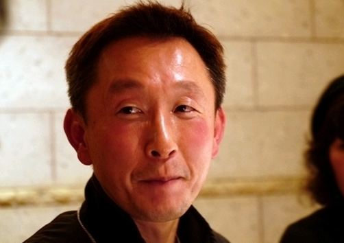

<!-- # 《蜡笔小新》：“黑色幽默”与“皇帝的新装” -->

**“小恶魔”的这种“揭露”与“控制”所能给大人们心理所带来的杀伤力是强大的。如果将孩子们的这种无赖行为进行放纵的话，大人们就很有可能将破坏庞大的社会秩序的能力，拱手相让给早育的儿童，而自己，却掌握不了局面。这也是大人们试图和谐《蜡笔小新》的潜在动机。这是作者给成人社会开的一个“荒谬的玩笑”：倘若——一个小孩能够看懂周围的一切，并能主动掌控所有的变化，那么，他会去怎么做呢？这种假设往往挑战了“傲慢的大人们极强的控制欲”，让这些孤傲的统治者们感到发自内心的不适。这也是黑色幽默的魅力之一：往往它会将整个世界本来得以运转的权利秩序弄得颠倒过来。小新让大人们害怕，他们害怕被“自己”所伤害。他们害怕被自己统治多年的儿童用“类似的手法”所控制。**

# 《蜡笔小新》：“黑色幽默”与“皇帝的新装”

## 文/城似琴

蜡笔小新的作者，臼井義人先生的尸体昨日在荒船山被警方发现，此新闻一出即震了了众人。从11日“留下遗书”失踪的信息被公开后，到“真相大白”从时间上来算，还不到10日。但是对于全世界“小新迷”来说，它仿佛有整个人生那么长。“小新的世界”永远也不会再前进，永久性地停留在了作者构思结束的那一刻——小新再也长不大了。在”漫画中的世界”和小新一起成长的人，从这一刻起，也在另一个世界中必须面临成长的终点。

失踪的消息传开后，仿佛每个人心里都回荡着某种“不祥的预感”。似乎此次的失踪的经过已经暗示着此人有去无回”但对于小新世界这一精神花园的长期暗恋，又导致这群人各自无法去理智地相信所谓的预感。黯淡的希望，依旧被真诚地祈祷所衬托着，成为了他们最后的心理防线。直到昨日，这道防线被最让人心酸的“预感”准确无误地击中，彻底的崩溃。

留下遗书后，失踪于荒山中，在悬崖下被发现——这本不属于任何带给孩子们希望的“漫画家”所应该享有的人生结局。带给世界无数童话以及希望之后，这些人应该安眠于世界上某个更宁静安详的某个角落，而不是“留下遗书”后“在山中遇难”在这种纯然绝望而孤独的境地中死去。常识地看，也许这是此次事件带给很多人的感受。然而，回想他的作品，就像那里所体现的“黑色幽默”无时无刻地在挑战所有即“常识”又“荒谬”的人类世界一样，他给自己安排的永眠方式上，似乎也给人们的常识进行了最后的挑战。仔细想想看，这又何曾不是被命运安排好的奇遇巧合…

话说《蜡笔小新》，可能很多国内朋友不知道，在日本实际上它是一本边缘性的“禁书”。此动画也多次荣冠“最不想让孩子看的动画排行榜”之首。《蜡笔小新》的世界，其实是众多依附于“社会常识”生存的“日本家长”们，从自己孩子的认知系统中试图努力“和谐”的对象。在正直的家长嘴里它是“肮脏的”“低陋地”“无聊地”漫画所在。故事中大量被引。的黄色笑话，性描绘，用词错误等，从正直的教育者的角度来看，都不利于孩子们的健康成长。（其实小新本来也不是针对少儿的读物，一开始是载于青年杂志的。）

造成成年人们这么敏感的一方面，存在着《蜡笔小新》的栩栩如生的人物性格塑造，和故事发展的黑色幽默性，它们准确无误在地揭发着一个荒谬世界对于一个孩子精神生活的影响。所反映出来的其实是真实的世界——“我不是在毒害你们孩子，我只是在说你们以为自己孩子听不懂的那些实话”

《蜡笔小新》给人的印象，便是：“会学习的纯洁灵魂”对于荒谬世界的羞辱与嘲讽。小新自己就并没有生活在一个完全值得学习和借鉴的世界中。例如，小新拥有一位外表正直勤恳的白领，但喜欢在夜里偷看“泳衣大会”的老爸；对此敏感而弱势，却又喜欢用暴力解决问题的老妈；她周围围绕着一群喜欢攀比而虚荣的“富婆”；幼稚园内生息着一群表面上热爱“儿童”但又喜欢相互勾心斗角的老师；她们带着一群外表可爱却思想过于早熟的幼儿园生徒们；有些儿童自幼便携带者浓厚的“恋爱意识”和“阶级意识”等。对于这一切过于现实的“现实”，拥有“纯洁心灵”小新回敬的便是一次又一次的藐视于羞辱，将故事带到意想不到的境地。往往，结局会把小新周围这些“自相矛盾的人们”弄得哭笑不得。

相比很多少年读物，往往人物黑白分明，最终以善胜恶而告终。然而在小新的故事中，根本看不到最终谁是胜者。因为在那个世界，“恶与善”就是非常难分的，每个个体仿佛都在依靠着自己的欲望试图展开最合理的行为，从而处处被小新骚扰而最后以失败告终。往往大人们的“心计”，在小新这种“荒谬的存在”之影响下，处处不可得逞。而小新自己也不是一位“正义的使者”相反，倒像是个喜欢骚扰凡人俗人的“小恶魔”。以一位旁观者的角色充当了一位“中立的骚扰者”。其中必定暗示着一个儿童，实际上拥有的超越很多大人们的想象的对于世间百态变换的敏锐观察力以及临机应变能力。在很多事情上，孩子看懂了大人，但是大人们却对此全然不知。这一事实本身，就能带给大人们足够的“恐惧感”了。对于自己孩子内心世界的一种迷失感，将会刺激到孩子世界里居高威权位置的大人们的自尊心和不安。

试图去禁书的大人们害怕的还有这样一种景象——看到自己的孩子，学蜡笔小新故意说错用典来干扰大人，或者在自己的X巴上画上大象的头影跳舞，抑或向20出头的MM主动问三围的时候，总会捏一把冷汗。小孩子可能只是在“模仿小新”也有可能是在模仿“我们”。大人们害怕的，不是孩子们看到漫画世界里的故事。而是自己孩子通过这些

仿，他们可能会察觉到“大人世界”中的现实故事——即，那些不愿意让子孙看到的一切值得可耻的人性反照。

小新是一个性欲旺盛且心计多端的孩子。他的对于“性”的向往意识以及各种歪门邪道的智慧，相比现实中的同年人来说登峰造极。然而，这样的意识与智慧，也绝非是一位五岁儿童先天性地所能拥有，它必定在是周围的影响中形成的。那么，蜡笔小新的各种行为的荒谬性，其实就可以看作在反照整个世界的荒谬。他身上，充满了整个荒谬人性世界的“影子集合”。这些荒谬的“人性影子”通过一位不懂得社会性地控制与压制的儿童作为光源，将其原本的状态折射出来，不断在揭露着曾经影响过他的整个世界之虚伪无力。

故事里有一幕让人记忆犹新：

小新他想在周末和爸爸一起玩，但是日本的爸爸往往平时辛苦，周末都喜欢懒洋洋地睡觉。于是小新乘自己老爸喝醉的时候，在画板纸上和他签下协约。

“爸爸你答应过我周末和我玩得”

“谁答应过了，我怎么不记得？”

“昨天，喏”（纸上写着：这个周末我和小新玩）

“下次好吧，这周又没说哪个周末”

“那好吧”

——小新面不改色，把画板纸翻了过来，上面写着：“我若违约给小新一百万，野原ひろし”

故事的杯具就如此诞生了…

其实，孩子知道大人总是说话不算化；孩子知道大人总是轻视与他们的约定；孩子知道大人周末不想陪他们玩；孩子知道大人会抵赖；孩子知道大人们一看到和“钱”有关的协约和签字就害怕；孩子知道大人会为自己写下金钱的事感到惭愧；并且知道要让大人做事，有时必须要用上“下贱”一点的手法——因为，他们一直都在看着你们，学习你们，一直都在受你们的影响。

这一幕不到1分种的剧情暗示的便是这些道理。小新其实有着纯洁的欲望，他只是想让自己的爸爸在周末陪他玩儿。但是在现实的世界中，让大人们满足这点微不足道的要求却显得如此困难，因此小新作案手法也就必须成熟毒辣起来，要试图拿金钱势力控制大人们。这次小新所用的作案手法和相关的要挟金额，简直就是黑社会等级的…然而，目的却仅仅是孩子与父母相互在玩耍中寻求沟通欲望，想到这里不禁让人心酸。难道大人们真的连和自己孩子玩儿的时间，都要用金钱与权势去拼凑才能挤得出来吗？

如此，“小恶魔”充当了皇帝的新装中揭露世间虚伪的“天真孩子”角色，其剧情安排，也使整部漫画变成了一部非常巨大的黑色幽默喜剧。

“小恶魔”的这种“揭露”与“控制”所能给大人们心理所带来的杀伤力是强大的。如果将孩子们的这种无赖行为进行放纵的话，大人们就很有可能将破坏庞大的社会秩序的能力，拱手相让给早育的儿童，而自己，却掌握不了局面。这也是大人们试图和谐《蜡笔小新》的潜在动机。这是作者给成人社会开的一个“荒谬的玩笑”：倘若——一个小孩能够看懂周围的一切，并能主动掌控所有的变化，那么，他会去怎么做呢？这种假设往往挑战了“傲慢的大人们极强的控制欲”，让这些孤傲的统治者们感到发自内心的不适。这也是黑色幽默的魅力之一：往往它会将整个世界本来得以运转的权利秩序弄得颠倒过来。小新让大人们害怕，他们害怕被“自己”所伤害。他们害怕被自己统治多年的儿童用“类似的手法”所控制。

然而让人哭笑不得的是，有些“不幸的事物”越让人害怕，它就越可能成为一种“现实”。对于小新的言行，日本国民儿童阶级所做出的反应却是：“那是我们的心声”。小新这种“言人之所不能言”的性格特征也是此人为动漫界中的“国民性英雄”之魅力所在。不同于机器猫里的“大熊”这种只会哭着喊着求机器猫的窝囊废，小新敢于用自己言行举动来为自己所看到的“不公”和“不道德”申诉。不难发现，有时候大人们的尴尬是孩子们“叛逆”的成功标志。《皇帝的新装》中让皇帝面红的最后一幕，直接反照了真理以及纯洁心灵的最终胜利。即使庞大的权利系统和社会机制能够掩饰荒谬的事实，在真理和诚实面前它依旧是可耻而无助的。也许小新的这些言行，是一种“无意识的反抗”。称它为“无意识”，是因为小孩有时根本不知道自己在反抗什么。自己也不了解什么是权威，什么是面子。可惜，纯洁的无知与无畏，给虚伪人世所投掷的最单纯疑问，其杀伤力往往是最大的。整个漫画故事的存在，其本身也就让那些“虚伪”的大人们哭笑不得了。

如今，让所有人害怕的事情又终于发生，这次也同样在现实世界中，它是如此的现实，又如此锐利地挑战了人们的“常识”。《蜡笔小新》的作者，生命竟然终结在悬崖边上。似乎告示着人们，漫画家也是人，也会烦恼，也会做傻事，其肉躯也会在物理摧残中失去生息。生前，臼井先生从不让我们看到他的真实身影，而他却一直在观察着我们周围的形声百态，力图用小新的眼睛和嘴巴诉说出我们这些“现实中的纯洁孩子”所不敢揭露的东西。

然而，我相信，臼井先生依然在观察着我们…透过小新的眼睛。当我们翻开漫画书的时候，先生依旧还在那里，躲在一个幼童轮圆漆黑而纯洁的瞳孔后面，向我们诉说着孩子们所看到的一切，所被压抑的一切。“现实世界”即使能够夺取漫画家的肉体生息，也绝对无法将其灵魂与智慧从他们的作品中带走。也许，这就是漫画家的“伟大”之所在。先生已离去，于此同时，《蜡笔小新》也成为了永恒，“纯真的小恶魔”也将会永远被遗留漫画的世界里，嘲弄并揭露着这个现实的世界。

