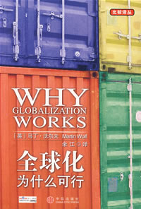

<!-- # 北斗电子书推荐——本期主题：全球化浪潮下的生存方式 -->

<!-- # 北斗电子书推荐 -->

## 本期主题：全球化浪潮下的生存方式

**推荐书籍：**

### 《绑在一起——商人、传教士、冒险家、武夫是如何促成全球化的》

### 《全球化为什么可行》

### 《下一轮伟大的全球化》

**撰稿人推荐：**

### 《失控的世界》

### 1、《绑在一起——商人、传教士、冒险家、武夫是如何促成全球的》

自走出非洲并散布到世界各地以来，人类从未停止重新建立联系的努力。商人送来远方的物产，传教士带来异样的理念，冒险家们给我们揭示地球的神奇，武夫不断拓展疆域边界……几千年以来，形形色色的人们一遍又一遍地重新塑造着我们的社会和星球。

作者将全球化这个千万年来塑造人类面貌的现象，置于完整、丰富而复杂的背景中加以阐释，不仅揭示了互联网、跨国公司、非政府组织等新角色在当今世界舞台上日益凸显的作用，更指明了跨越海洋和大洲，跨越千年的岁月，全世界的人们从来都是绑在一起的同胞。本书定会为你带来全新的阅读享受。

作者纳扬•昌达，现就职于耶鲁大学全球化研究中心，《耶鲁全球在线》（耶鲁大学为探讨全球化而出版的网路刊物）主编。曾任《远东经济评论》与《亚洲华尔街日报》周刊的编辑。

### 2、《全球化为什么可行》

目前正值全球出现通货膨胀、经济放缓，反全球化的声浪空前高涨，国际势力阴谋论滥觞，民主主义者大肆鼓吹关起门来搞发展。但是，假如让美国分裂为50个州，各自设立阻碍商品、服务、资本和人员进出的关卡，你认为人民的福利会得到增进吗？假如每个州都有自己的资本市场，让GE、微软、IBM这样的企业只能在其中一个州里开展业务，你认为消费者会从中得利吗？在那样一个美利坚不合众国里，投资、市场和贸易将大大萎缩，人民的生活水准会迅速下降。有的地方恐怕会成为监狱，把绝望而沮丧的人民封锁在其中……

因此，人为地割裂世界是没有意义的，我们需要关心如何让世界经济有效运转。我们面临的问题并不是全球化太多，而是太少。经济一体化的潜力才刚刚释放，假如我们想提高各国穷人的生活水平，那就需要更多而非更少的全球市场。社会民主主义者、古典自由主义者和保守派民主主义者应该团结起来，保卫和促进全球经济的自由化，反对从各地纠集起来的对手。

作者丁•沃尔夫，英国《金融时报》首席经济评论员，并担任瑞士达沃斯世界经济论坛的讲师，20世纪70年代曾是世界银行国际贸易部门的高级经济学家。他对全球经济有着鞭辟入里的分析，获得了各界的赞赏。2003年，他获得了该年度“最佳商务记者奖”中的“十年杰出成就奖”。

### 3、《下一轮伟大的全球化》

世界经济正在急速一体化，金融体系更是频繁掀起波澜。有的国家因为资本市场的繁荣而财富涌流，一夜造出无数百万富翁，有的国家却遭遇国际炒家的阻击，本币大幅贬值，银行破产倒闭，金融危机爆发，似乎陷入万劫不复的境地……那么，金融全球化的浪潮究竟是千载良机还是致命诱惑，是否真有神秘势力在策划未来的“货币战争”？

作为世界顶尖的经济学家和美联储的资深理事，米什金将正面迎击这些疑问。他令人信服地指出，全球化并非贫困国家经济问题的原因，相反，它是解决这些问题的开始，下一浪潮将是金融全球化，而且需要尽快发生。本书回顾了数十年以来金融体系全球化的进程，深入剖析了墨西哥、韩国、阿根廷等国遭遇金融危机的真实原因，帮助读者认识金融全球化的发轫条件、发展环境和深远影响。作者告诉我们，制造敌人和对立其实于事无补，国际之间的合作与共同繁荣才是真正的趋势。

弗雷德里克•米什金，美联储理事，美国哥伦比亚大学商学院研究生院银行和金融研究所阿尔弗雷德&#8226;勒纳（Alfred Lerner）讲座教授，美国国民经济研究局（NBER）研究员，著有经典教材《货币金融学》。

**本期为大家推荐图书的是撰稿人——西北偏北**

### 一根绳上的蚂蚱——《失控的世界》

1918年，威尔逊总统把美国大兵送上了运兵船，不少年轻的士兵在船上因为流感而亡，而其他的患者把流感带到欧洲，造成至少两千万人的死亡，比一战的死亡人数还多。近日甲型H1N1流感肆虐，人心惶惶，从墨西哥窜出来的病毒，随着发达的交通工具快速的全球传播，虽然在今天的医疗条件下不可能引起很大的破坏，但传播速度和范围可要大多了。

轻点鼠标，金融和资本就在全球间流动；咨询在流动（第一时间能看到美日欧的影片、游戏、应用程序），人也在流动。这就是全球化时代。全球化给我们带来了好处，但也有些蕴藏的危机：因为美国房地产政策失败，大洋彼岸的中国工人失业了：因为中国是主要的制造业国家，金融危机导致外国人没钱消费，中国的工厂也只好关门大吉了，这就是全球化的风险。与此相反，1929年的大萧条，资本主义世界哀鸿遍野，苏联却在完成第一个五年计划显得欣欣向荣，苏联驻美国大使馆门口排满了要求移民的美国工人的长队，似乎印证了那句话“敌人一天天的烂下去，我们一天天地好起来”。只可惜当时苏联只是个要求赶超的封闭经济体系，通过暴力手段维持的工农业剪刀差达到了其重工的繁盛，如果当时苏联也参加了全球化的分工，恐怕也难以独善其身吧。

吉登斯把全球化风险分为两种：外部风险（external risk)和被制造的风险(manufactured risk），外部风险是老式的，来自自然的、外部的，比如瘟疫、洪水和地震等等。被制造的风险，指的是有我们不断发展的知识引发的风险，大部分环境风险，如气候变暖。落后国家在这个过程中可能同时承受着两种风险，因此可以说，在全球化的今天，无论是甲型H1N1流感还是金融危机，各个国家都成了一条绳上的蚂蚱，需要更多的是合作，而不是对抗。

对抗风险的个人方式之一是保险，买份人生、财产保险，保险精算师已经算好了一个人上车遇到车祸的几率；在社会范围而言，预防的理论是很重要的，比如对新型基因玉米进行严格的测试，以防止生物污染。

更多的时候，面临全球性的风险，还需要各个国家之间的协作，比如中国医院滥用抗生素造成了抗药性很强的超级病菌，如果传播的其他国家，会造成严重的问题。G20峰会，各国首脑对解决目前的经济危机问题提出用国际金融机构注资解决问题的方法。这是人类共同拥有的海洋和天空，更多的协作才能解决问题。

反全球化的力量一直是不容忽视的，比如在国际分工当中，制造业被转移到了第三世界国家，那些原来发达国家的工人可能失业，也可能改行去做些不如原来收入和地位的工作，他们可以愤怒的认为这是新自由主义的阴谋，资本和第三世界国家的威权政体狼狈为奸。第三世界国家的工人也会怨声载道，因为他们微薄的收入可能买不起他们自己亲手制造的产品。全世界的无产者没有联合起来，却有可能彼此憎恨。国际间的经济不平等还一如既往的持续着，全球化更像一场掠夺。于是，每次全球化高峰会议，如WTO和G20峰会上，都有不少抗议者。

但毕竟全球化是个不可逆转的过程，民族国家在国际贸易中的权力被削弱了，很难闭关锁国的不去接受。诚如吉登斯所言：“这是我们现在的生活方式”。
