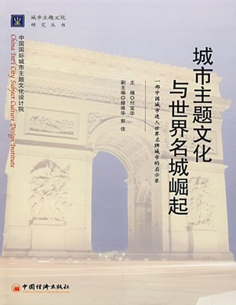
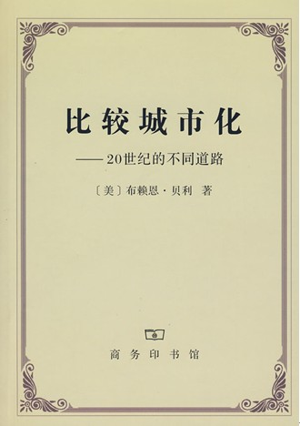
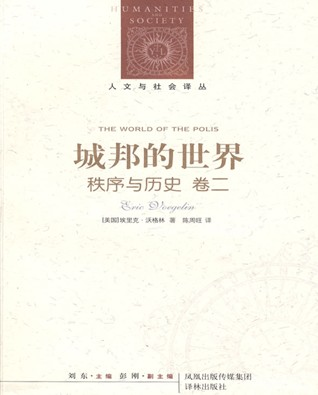
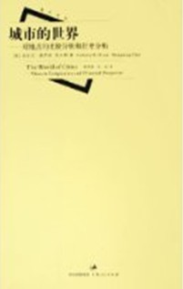

<!-- # 北斗电子书推荐——本期主题：城市的世界 -->

<!-- # 北斗电子书推荐 -->

## 本期主题：城市的世界

**推荐书籍： 1、《城市主题文化与世界名城崛起》 2、《比较城市化：20世纪的不同道路》 3、《城邦的世界》**

**撰稿人推荐——《城市的世界》**

1、《城市主题文化与世界名城崛起》

一个城市没有城市主题文化，就会千城一面；一个城市没有城市主题文化，就会遭到批判：一个城市没有城市主题文化，就会产生特色危机；一个城市没有主题文化，就无法把世界名牌城市的目标实现。

一个政府书记不懂城市主题文化，城市发展就会没有理念：一个城市市长不懂城市主题文化。城市建设就会散乱；一个规划专家不懂城市主题文化，城市规划就没有章法；一个设计专家不懂城市主题文化，城市设计的灵魂就无法体现；一个市民不懂城市主题文化，就不能用思想捍卫自己的精神家园。

作者付宝华——城市主题文化创始人。

付宝华院长历经十年时间系统研究，终于把数十门不同学科整合在一起。构建出了系统的城市主题文化理论体系和城市主题文化发展战略规划设计模式，被国际、国内多家权威机构的专家和学者誉为城市主题文化学科的创始人。 2003年，针对中国城市特色危机问题，付宝华院长率先和中国房地产报联合发起了城市主题文化大讨论。付宝华院长发表的《主题文化：城市的“灵魂”》、《主题文化——经营城市的金钥匙》、《如何构建城市主题文化》、《用城市主题破解“千城一面”》等文章发表后，在全国引起强烈反响，并迅速引发一场城市文化大讨论。为此，付宝华院长成为播种中国城市文化大讨论薪火的第一人。 2、《比较城市化：20世纪的不同道路》 

《比较城市化:20世纪的不同道路》通过世界不同国家和地区城市化过程的比较研究，认识到在20世纪快速城市化过程中，尽管城市化存在很多共性，但是城市化的道路却各不相同，差异化主要源于文化背景及发展阶段的不同，并产生了多样化的人类后果。 3、《城邦的世界》 

沃格林在《城邦的世界》(秩序与历史卷2)中进行了一种“治疗性分析”。“秩序的历史产生于历史的秩序”，一切有价值的思想，都产生于思想家对其所处时代社会问题的忧患意识。思想最初的冲动，源于要去探析社会问题的来源，寻求秩序之道，城邦的世界之兴衰成败对于存在真理的探究，是一个千载难逢的契机。在沃格林看来，古希腊的悲剧、哲学和历史作品，无一不是这样的忧愤之作。而当城邦的世界最终走向崩溃的时候，给城邦看病听诊的内科医生是修昔底德，而负责治疗的、动手术的外科医生，则非柏拉图莫属。用沃格林在本卷最后一句话来说，这样才构成了一种完整的“政治科学”。

作者埃里克•沃格林（Eric Voegelin），1901年生于德国科隆，但他“完全是在维也纳熏陶成长起来的”，而沃格林的学术生命，严格说来，却是在美国度过和完成的。沃格林大学期间主修的是法律，他的导师是名噪一时的法律实证主义大师凯尔森，但他似乎更关心“法国、德国哲学家以及天主教神学家的著作”，而在公众眼中，沃格林是一位不折不扣的政治哲学家。一切地域文化的界限，学科专业的藩篱，在沃格林身上都土崩瓦解。

本期为大家推荐图书的是撰稿人——西北偏北 

# 城市之间

能在几个不同的城市生活是件有趣的事情。大城市，特别是中国的大城市，集中了社会上绝大多数的技术、资源和人才，这里每天发生的大事情，远多于轻罗棋布在大地上的村镇。也都是我们每天在报纸上、电视上和网络上关注的新闻。可以说，城市就构成了我们现代化生活的大部分，现代化的过程也就是城市化发展史，也是现代人的世界，难怪英国人说过：“如果你厌倦了伦敦，那么你也就厌倦了世界。”

过去的时代，封建时代的欧洲的权贵，封建领主和教士们，住在自己的领地和教区里，这些地方大多是乡间，权贵们主要靠这里的农民供养，而作为商业中心的城市，有些时候为了城市的自身利益如税金、自治权和权贵们扯扯皮。帝制时代的中国，皇帝及其下属的官僚虽然生活在城市里，但是绝大多数官僚卸任之后都得告老还乡，在自己的家乡农村做个乡绅、员外，不问朝政。

现代的城市，则是商界、政界、艺术和文化界的精英聚集在一起，交通、规划和设计都得符合工商业的需求，按照高中地理课本的说法，城市化的标志是：1、城市规模扩大2、城市化人口增多3、城市人口占总人口的比重上升：“西欧自18世纪60年代进入工业革命时期，随着生产活动由手工作坊被大机器所替代，人口的快速聚集成为工业化重要的副产品。这不仅为工业化提供了源源不断的劳动力资源，同时也不断扩大工业化的外延，以城市为中心的第三产业也随之逐步兴起。最早实现人口结构城市化的西欧国家为英国，从1760年到1851年的90年间，英国城市人口超过了总人口的50％。作为西欧的衍生国，美国人口结构城市化的步伐更快，在1860年至1920年的60年间，美国城市人口超过了总人口的５０％。到目前为止，发达国家城市人口占总人口的比例平均超过85％，许多已完成工业化进程的次发达国家的同一比例甚至超过这一水平。”

自然，城市化程度不同，也就是发展水平不同，我有幸在三个不同的城市生活过，也就粗略的体会了“初期、中期、到后期”的城市发展阶段。

**城市化的初期阶段**

我的故乡是边境线上的小城市，塔城，这座城市历史不算很悠久，清朝时候才划了一个行政区（但老城已被沙俄吞并），到1984年才撤县划市。全市辖区居民人口十五万左右，城镇人口八万。市区面积很小，过去常被我称为3×3的格子，骑车20分钟不到就可以从南至北走一圈。而中小学生参加的5km左右的冬季长跑比赛就被冠名以“环城赛”。街道上的行人也只会在节日时候显得比较多。在街上逛一圈总会发现熟人，认识的或者常见但我叫不出名字的人，可以说，这是一座放大了的村社，一个传统的熟人社会。

街道规划并没有特别设计，只是沿袭历史传统，做了些拓宽修缮的工作，全市的各个企事业单位也属自然分布，绿地和小溪在市区西北角构成和谐的一片。公用交通不过两路公共汽车，从不拥挤。通往其它城市的选择有公路和飞机（飞机只通往乌鲁木齐）其他公用设施也并不发达，我记得自来水系统是在上世纪八十年代末才普及的，而现在一些老旧的民房依然没有下水道系统。

自给自足的经济方式并没有被打破，农牧业依然是这里的主要支柱，工业也仅限于粮食加工、水泥建筑材料等比较基础的行业。与1978年之前不同，现在对外依赖程度更高了。1978年之前，中国的城市以地区级为行政单位实现了自给自足。我依稀记得过去也有毛纺厂、服装厂、糖厂，周边的县城也能生产电线杆、啤酒等产品。只是在上世纪九十年代公有经济不善的情况下，集体企业关的关、倒的倒，而这种计划经济解体引发的“脱嵌”现象，造成原来企业员工今日生活的困境。“单位”仍是在职人员的主要工作环境，虽然1991年苏联解体给这里带来了边贸行业，但对经济总量影响并不大。商场里没有都市里的名牌服饰，种类也不是很多，如果想买点高档产品，恐怕都得去首府乌鲁木齐了。

**城市发展的中期阶段**

中学的时光是在乌鲁木齐度过的，这在西部是当之无愧的大城市，高楼大厦，街道车水马龙，街道上满是行色匆匆的陌生人。长条形的城市，从南端到北端坐公交要一个多小时。北边的水磨沟区还是那些半死不活的大型国企的聚集地，天山区的中部是政府、党委所在地，商业广场多聚集于此。各区分布，功能各不相同。200多万人口，也就是说这不再是个熟人社会了，各地、各国的各地的人来往于此，我们主要面对的就是陌生人。

“城市化会引起重大的环境和社会问题。从空旷的乡村空间转变成建筑林立的城市空间，意味着自然环境的丧失和活动场地的减少；为了供养城市人口，对剩余农产品的需求也将增加。人口的高度集聚大量需求基础设施：转乘便捷的交通系统、清洁的水源、供电系统、公共卫生和废物管理体系以及公共健康设施等。”这也是大城市的现代病，拥挤、污染，以至于冬天下的雪没多久就被烟囱给熏黑了（虽然对东北诸多工业城市的居民来说见怪不怪），冬季灰蒙蒙的天，夏夜是红色的天（光污染），看不到绝大多数星星。治安也不能说的上好。

大城市自然经济更发达，乌市拥有更大的“单位”企业，估计几个大企业员工加上家属就比塔城市区的人多，商业和其他服务业种类也比新疆各地州繁荣的多。市政府也和其他许多城市一样，用优惠条件招商引资，并兴建大型边贸市场，和中亚商人交易。外国商人虽然很多，但还说不上是做商业国际化的城市。它拥有更多的私营企业，在传统的单位体制下，无疑有更多的选择。

**城市发展的后期阶段**

在上海也有五年了，直观的感触倒不是很多，更多是作为一个读者从书本上去观察这座城市。许多年前有位陌生的女生给我发短信说“这是一座声色犬马、纸醉金迷的城市”，如果按她所说这是被消费主义奴役的城市、没有人情味的城市，我认为只对了一个方面。这是一座千面城市，有很多的功利主义者，也会有很多理想主义者。

国际贸易和外国投资，兴建了以知识为基础的行业技术动力，生产要素在全球范围流动性日益增强。全球化渐渐另大城市失去了民族国家的一些特征，使用通用的英语、行政建制也随之国际化。虽然在上海依旧有遍及全国的党政系统和国企的单位系统，但外企及其带来的制度也是影响巨大的，比如再就业态度上，很多人更希望有个高薪的工作，而不是“单位”里面的稳定工作；在职业化的训练过程中，学生们也主要接受的是国际化公司的训练。

城市化后期的城市另一个特征是外来人口众多，比如当代芝加哥，44%的人口是非本地出生的。上海也同样，新行业需要新人才，在本地供给不足的情况下，也需要其他地区的支援，虽然也造成了一些族群分裂的次要矛盾。

我在一文中曾说过，今日上海是从传统的工业城市转型为服务业城市，这些服务特质金融业、电子等高科技行业，这些服务行业大约在全部生产总值同时，工业在上海仍占有很大一部分：“上海市三大产业占GDP的比例：2006年第一产业0.90％，第二产业48.51％，第三产业50.59％”。第一产业即农业占有量很小，本地产品是极端依赖型，如：南汇和松江的农场，只是锦上添花而已，更多的商品需要从江浙等周边省份运输；至于供电、石油也是如此。

**总结**

三座不同的城市，从小到大，他们不同的根源在哪儿呢？按照《城市的世界》一书的说法：外资直接投入造就了东西部发展阶段的不同当然我想，我的故乡即使有很多外资投入，它也不会变成东洋魔都……
