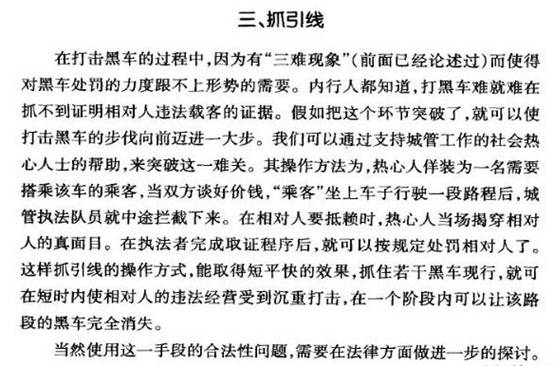
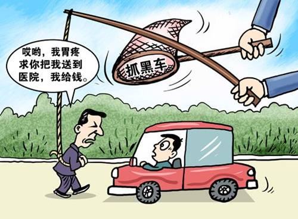
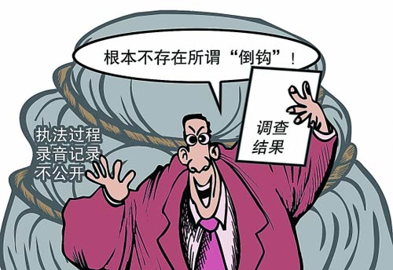
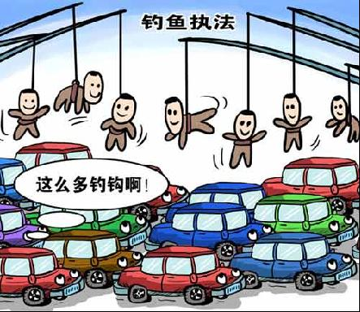
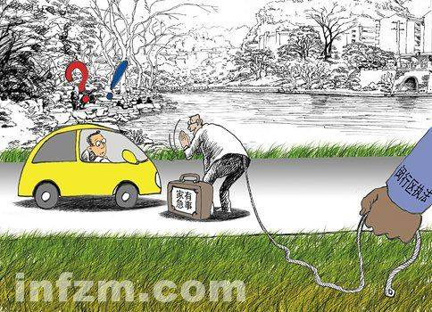

<!-- # 钓鱼之局与黑车之困 -->

<!-- # 钓鱼之局与黑车之困 -->

## 文/安西

前段时间，网上流传过一本《城管执法操作实务》，内容林林总总，其中有一段专门提到了“抓引线”的黑车处罚方法。不成想，没过多久，上海的交通执法部门，就用实际行动，给我们这些围观群众好好上了一课。

（原文见《城管执法操作实务》第四章

城管执法过程中的分寸把握

第三节） 9月10号，一个名为《无辜私家车被以黑车罪名扣押，扣押过程野蛮暴力》发表在爱卡上海论坛，网友“善良的被骗”，也就是白领张军在帖子里描述了事件经过：自己出于好心搭载了一位自称胃疼又打不到车的路人，没想到那是一个俗称“钩子”的交通行政执法队协查人，他的私家车当场作为“黑车”被查扣。

一天之后，这篇帖子被流量巨大的韩寒博客转载，并迅速传遍整个网络。

尽管后来张军自己选择了“放弃陈述、申辩”，妥协交钱领车。但这起“钓鱼执法”事件引发的网络议论狂潮却仍在持续，舆论与民意都出现了一边倒的批判态度，纷纷有车主表示自己也曾在上海有过类似遭遇。最终，在“90后小伙自砍小指‘示清白’”事件后，舆论的关注被引爆到一个最高峰。一个车帖：“本车拒绝一切搭载求助，临盆产妇、车祸、中风、触电、溺水，都不关我事，尤其是胃疼的”被纷纷转载。网民们或激愤、或戏谑，表达着对“执法部门钓鱼”的不满与愤怒。

面对社会舆论的质疑。先是南汇城交执法大队表示“是否收钱不是认定非法营运的唯一标准”。10月20日上午，上海市浦东新区城市管理行政执法局向外界公布，执法大队查获的孙中界涉嫌非法营运行为，“事实清楚，证据确凿，适用法律正确，取证手段并不无不当，不存在所谓的‘倒钩执法’的问题”。该调查遭到了媒体和民众的普遍质疑。在上海一项网络调查中，51%的网友认为“自己人查自己人，难以信服”，41%的网友认为“应彻底重新调查”，只有2%的网友选择相信浦东新区政府。随着舆论的升温，媒体的报导也开始渐渐深入，一条忽明忽暗的“钓鱼产业链”渐渐浮现出来。

据《东方早报》报道，在上海的浦东新区、南汇区（现并入浦东新区）、闵行区、宝山区、奉贤区等郊区，“钓鱼式执法”现象非常严重。当地交管部门有罚款的指标，并招募一批社会人员作为“钓钩”，抓到一辆黑车，可以从罚款一万元中提成。他们会扮成各种身份，如冒充夫妻吵架、去医院看病的病人，乃至去殡仪馆看死人等，只要把司机骗入执法者设立的包围圈，马上踩刹车、拔车钥匙。一位黑车司机告诉记者，整个上海市至少有上千个“钓钩”，而每次执法活动开始前，执法大队都会先确定抓黑车的“地带”，然后带着“钓钩”

前去踩点，一般一个区至少设置五六个点，一个点要抓至少5辆车。知情人士透露，在上海闵行区，至少有3个“钓头”，手下有100多个“钓钩”。

“钓钩”每“钓”到一位私家车司机，便可从执法人员获人民币300元到600元，“钓头”则提取200元。钓钩”月收入两三千元到五六千元，“钓头”月净赚1万至2万元。而闵行执法队2年里罚没款达到 5000多万元，“超额完成任务”。

面对如此情形，如果以诛心的态度来思考，我们很容易怀疑：为打击“非法营运”而设下的“钓钩”行为，不仅仅是一种为了遏制部分违法行为的泛滥趋势而采取的过激方式，也是在某种利益引诱下的必然选择。执法部门“在打击黑车的名义下将数以万计罚款装进私人腰包”，执法在利益驱动下执法已扭曲变异为“敲诈勒索”式的执法经济。

然而，由背后的利益驱动，假公谋私的“执法经济”让人深恶痛绝，不过要是退一步，执法部门的“钓鱼”行为确实只是打击黑车运营，又该怎样看待？

在我国，尤其是一些人口密集大中城市，由于城市交通设施建设的滞后和公共交通系统的不健全，以及正规出租车行业较高的入行门槛和运营成本，“黑车”非法营运屡禁不止，查不胜查。一方面，这些“黑车”价格便宜可面议，运营时段、范围广，方便了市民的出行；但“黑车”的存在，客观上侵犯了合法营运车主的利益，也破坏了正常的城市交通秩序。城市交通行政执法部门在其职权范围内查禁黑车本无可厚非。对黑车，管还是不管，也已成为一个执法困局。面对“黑车之困”，执法部门用“钓鱼执法”来解决黑车查处过程中的“盯点难、取证难、处罚难”的“三难”问题，可以接受吗？

从结果上来说，“钓鱼执法”确实很好的打击了“非法营运”，很多黑车司机这段时间都“电话联系”、“只拉熟客”，以防失足被“钓”。然而，目的的正当性，却无法掩盖有预谋的执法程序上的违法。行政执法中的“钓鱼执法”，与刑事侦查中的“诱惑侦查”，或者叫“诱惑取证”类似。世界各国执法机关也都使用类似手段，比如警察扮演瘾君子向毒贩购买毒品等等。但“诱捕”有着严格的控制要求，第一，诱捕对象是犯罪嫌疑人；第二，已经掌握其部分证据；第三，诱捕时的事实不作为犯罪证据。也就是说，所设之套本身，不能成为违法犯罪的证据。对比发现，上海交管部门对黑车采取的诱捕行为：1.诱捕对象不仅是黑车，还有私家车主；2.诱捕对象随机选择，无先期调查；3.以“钓鱼”行为本身作为判断是否“非法运营”的依据。

由此看来，上海交管部门的这种“钓鱼执法”与“诱惑取证”有着法理上的本质区别，有失于执法的公正、公开，是不合法且不合理的。引诱守法公民违法，并把所设之套作为定性的证据，伤害的不仅仅是被“钓钩”所伤的私家车主们，更是在伤害整个社会的道德与法治秩序。在“钓鱼”事件中的当事人张先生和孙先生可以说都是道德的实际践行者，在他人求助时毫不犹豫的提供了帮助。可谁成想好心变成驴肝肺，他们走入了执法部门精心布下的大网，成了任人宰割的“大鱼”，不仅被“钓走”了金钱和时间，也被钓走了乐于助人的道德之心。“钓鱼执法”仅仅只是道德损害的一个缩影，如果继续下去，民众的道德成本不断增加，道德底线被公权力随意破坏，冷漠必然会入侵，公众也将会陷入一种非道德的思想误区。同时，执法违法也已成为建设法治社会的毒瘤。当一个执法部门不断地违法执法，甚至是引诱守法者“违法”时，公众对行政机关的信任危机也就随之而生了。“钓鱼执法”给公众和行政机关带来的，只会是“双输”。

也许是因为舆论的压力，也许是上级的施压。22日晚，央视《新闻1+1》节目报道，浦东新区已成立了一个新的联合调查组，对“孙中界事件”进行复查。目前，调查组的工作仍在进行中，不知道最后，又会得出一个什么结论。然而，作为整件事的一名彻头彻尾的看客，我心中依然感到不安。公权力超越行政边界的情况，在我国其实远不止“钓鱼执法”这一遭，可作为一名看客，我们充其量发发牢骚，对舆论来一点点微不足道的推波助澜，一个有责任感的公民应有行动，又在哪里？或许，我们缺的不是意愿，而是行动的途径与空间。我们可以大胆的猜测，上海很快会遭遇像重庆“打黑风暴”一般的“反执法违法风暴”，只是，这种自上而下的“运动式”行为，真的能够釜底抽薪吗？

公权力需要来自政府体系之外的社会方面面面的有效监督。我期待着自己不再只能当看客那一天。

相关：

百度百科——钓鱼执法： [http://www.baidu.com/s?cl=3&wd=%B5%F6%D3%E3%D6%B4%B7%A8](http://www.baidu.com/s?cl=3&wd=%B5%F6%D3%E3%D6%B4%B7%A8)

特别策划：上海一白领告交通队“钓鱼执法”引热议 [http://unn.people.com.cn/GB/14748/10206316.html](http://unn.people.com.cn/GB/14748/10206316.html)
