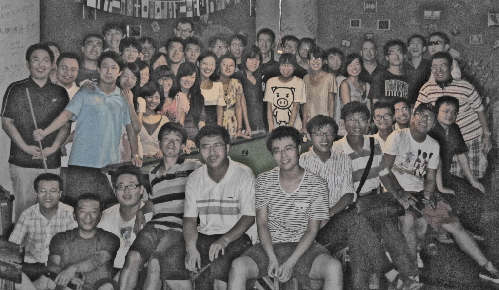
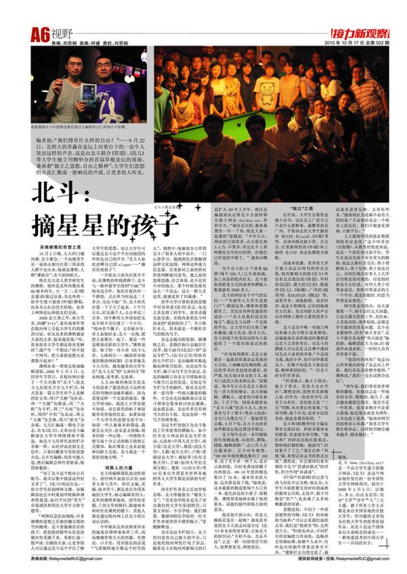

<!-- # 北斗：摘星星的孩子 -->

> 链接：北斗（[ibeidou.org](http://ibeidou.org)）是一个由大学生建立的独立网站，《北斗》是这个网站制作发行的一份全国性大学生网络周刊，创刊于2008年5月5日，以独立、多元、自由为宗旨，突出“大学”“青年”“人”三大主题，旗下所有工作人员都是来自全国各地的在校大学生，所刊载的文章均为在校大学生的优秀原创作品。而北斗是这个团体来自天南海北的成员——一群热爱思考的中国大学生——共同的名字。

“我们得有什么样的自由？”——9月22日，《北斗》编辑之一、来自北师大的乔淼在论坛上对着台下的一众牛人发出这样的声音。这是由《北斗》、《常道》、《范儿》等大学生独立刊物联合举办的首届草根论坛的现场。秉承着“独立之思想，自由之精神”，大学生们思想的火花汇聚成一股响亮的声流，让更多的人得以听见。

### 采摘璀璨的思想之星

10月2日晚，人大西门避风塘，北斗聚会。一个高瘦男生从一桌热火朝天打着三国杀的人群中走出来，他就是薄然，人称“薄始皇”，北斗的创始人。

现在北大读人类学研究生的薄然，彼时是北外西葡语系06级本科生。大一大二，在《校友通讯》做过访谈，为北外的一份学生独立报纸《外域》撰稿，向来关心社会民生的他，也常上网络论坛和朋友们交流。

2008是大事之年，南方雪灾、西藏“3·14”、家乐福事件等在校内网上引起大学生们的激烈讨论。好友众多的薄然遍读大家的文章，惊喜地发现：“哇，原来很多大学生都是很有见解的”，遂产生一个想法：“何不创一个网刊，把大家的思想火花都集中起来？”

薄然拉来一帮朋友组成了最初的编辑团队。2008年5月5日，五四青年节翌日，他们在校内网注册了一个公共账号“北斗”，按北斗七星的名字分七个栏目，每天发表一篇大学生有个人见解的好文章：周日“天枢”为社论，周一“天璇”为图说，周二“天机”为专栏，周三“天权”为语丝，周四“开阳”为高论，周五“玉衡”为艺林，周六“摇光”为杂谈，七天汇编成一期电子杂志，名为《北斗》。文章由北斗编辑部在大学生网络博客中筛选，如北斗七星所代表的栏目名称一样，从时评高论到文艺佳作，只要闪耀着可贵的思想火花，且不失偏颇，均有可能入选，然后编辑会和作者联系，取得转载权。

“加了北斗这个校内公共账号，就可以集中阅读这些好文章了”。《北斗》的定位是：一份大学生原创网络文摘。而编辑部也会不时策划些特稿和调查性报道，如昌平区的“黑车”市场调查和国庆大学生方阵专题等。

“网络信息浩如烟海，许多璀璨的思想之星被浩瀚无垠的空间掩埋。北斗要做摘星星的孩子，把思想的精华从信息的银河里采摘下来，重新汇成一股声流，呈献给大家，让更多的人可以通过北斗这个平台了解大学生的思想，也让大学生可以通过北斗这个平台向校园内外传达自己的声音。”北斗人如此诠释自己的slogan——“摘星星的孩子”。

一开始北斗的关注度并不高，在薄然的牵线搭桥下，北斗与一海外留学生组织“FSMC”开始双边合作，他们在校内有一个群组，点击率当时高达二十多万，为北斗做广告，北斗的关注量一下子大了起来，十个月左右，好友满千人，点击率达三万多，因不断有人申请加好友还不得不另注册了一个小号。

“校内有个圈子，文章被分享，有人加他好友。北斗一出现，就把大家聚在一起了，都是一些思维很活跃的大学生。”薄然说道。海子的一首小诗《北斗七星，七座村庄——献给萍水相逢的额济纳姑娘》后来常被北斗人引用，越来越多的大学生在“北斗七星”的“七座村庄”萍水相逢，思考着，交流着。

人大08级的林语尘是北斗的读者：“我觉的北斗这样形式的刊物应该越多越好，因为需要这样一个交流的渠道。像大学的BBS，我没上大学前就不知道，而且那里的帖子难保能有有价值的信息，如果知道一个大学生的思想交流平台，知道一些人做基本的筛选，我就会去关注。也乐意去投稿，很多时候一些心情，一些感悟不想写成十分正式的稿子投到正式媒体，贴在博客上也未必能和同龄人交流，北斗就是一个很好的地方啊。”

### 网聚人的力量

北斗的编辑团队流动性很大，创刊两年前前后后有200多人参与其中，担任文编、美编、技术骨干，都是来自全国各地的大学生。核心编辑主要有四人：北外的薄然和迦南、清华的姜戬、兰州大学的陈轩。除迦南本科时住在薄然的楼下，其他人都是通过校内网上在北斗的互动认识的。

今年刚从北外法律系毕业的迦南在律师事务所工作，高高瘦瘦穿着大大的西服，有想法，口才佳，用其朋友的话说“气质独特的不像这个时代的人”。偶然的机会，他被朋友引荐到北斗：“很多人初中高中，一门心思学习，我刚到北京接触到这种文化氛围，网络这种庞大信息量，会重新对之前的固有价值判断做出思考，我之前的思维思路，语言体系，是不是有不对的地方，那个时候发现有这么一个杂志，这么一群人在这里，就感觉有了归属感。”

清华大学计算机系的姜戬平时喜欢看《读书》杂志，身边大多是理工科学生，很多话题无处交谈，在校内看到北斗时也觉的“找到组织了”。至于陈轩本人就是一个颇有名气的校内写手。

杂志总编为轮值制。继薄然之后，姜戬接任执行总编。他厉行改革，创立副刊《北辰》（即“北辰专栏”）。《北斗》正刊（即原有的七个栏目）是由编辑审稿选稿而择优刊发的，而北辰作为专栏，稿子由写手完全决定，北辰的编辑只负责文字排版和北斗账号日志的发送，无权定夺专栏写手的稿件，除非北辰作者一意刊登一些观点激进的稿件，才会由北辰编辑部以及北斗理事会集体商讨决定撤换。这也就是说，北辰作者具有相当大的自主权。北辰也即一些写手的博客集。

北辰专栏的创立为北斗集结了许多优秀的撰稿人，如今打开北斗网站的北辰专栏名录：元淦恭（中国人民大学）、孙宇晨（北京大学）、榕晨（武汉大学）、大猫（复旦大学）、卢然（香港浸会大学）、城似琴（庆应义塾大学）、宁湖（加州大学伯克利分校）、楚陌（山西大学）等44位来自全国甚至世界各地的华人大学生都是活跃的专栏作者。

因专栏作者名之后加学校名称，北斗曾被指为“精英主义”。“其实加学校名是为了突出我们的大学生原创特色，只要文章好，不分学校，我们都要，像湖州师范学院的一位专栏作者就常供不错的稿子。”姜戬解释道。

直至北辰专栏创立，北斗仍旧没有自己独立的平台，只是依托校内网发行电子杂志。“原先在校内，半年的点击量能有三四万，不算多，肯定比不上那种漂亮女生的自拍照，但我们已经觉得不错了。”迦南自嘲道。09年上半年，影响力日益扩大的北斗因故在校内网遭到封禁。新任总编迦南决定将北斗全面转移至独立网站ibeidou.org，坚持至今。“域名是买的，服务器费用一年一千块，钱是大家一起募的”姜戬说。

至今北斗的12个读者QQ群（每个200人）已全部加满，加上从前的校内好友，北斗能取得联系方式的读者和撰稿人数量就有5000多人。

北斗的网站有个牛气的定位——“全球华人大学生思想门户”，聊到这里，薄然和姜戬都笑了，其实还有种更通俗的说法——“北斗是我们说话的地方”。通过北斗这样一个交流的平台，让大学生们互相了解和激励，建立友谊，找寻方向。北斗的线下沙龙活动则为大家提供了一个面对面说话的机会。

“沙龙每周都有，北京大家聚在一起就喜欢谈杂志发展的大方向，上海方面以吃喝唱歌为主。武汉的学术沙龙延续的最好，很严肃，比方说讨论女权主义，会专门请武大的老师过来，”姜戬说。每半年左右在北京或上海还会有一次大型的聚会，北斗的编辑、撰稿人、读者均可报名参加。7月下旬，因故未能参加“北斗六聚”的北斗友人、校内著名写手元淦恭还专门为聚会写了一篇缺席发言稿。9月下旬，北斗参与主办的首届草根论坛，他总算没有错过。

北斗每年会出一本印刷版的年度精选集，从组织、撰稿、排版、编辑到推广，由工作人员自愿承担，目前仅在内部销售。“08-09年度的精选集印了100本，花了差不多一两千元，是自己凑的钱，印好免费送给圈子内的朋友。09-10年度的精选集印了70本，成本价卖给大家，算是收了一次钱。”迦南说。这本最新的精选集每个人只有一本，蓝色封皮的小册子，很精致，薄然郑重地捧出属于他的那本，请我们提些排版方面的意见。

孤星找不到方向，但是七颗孤星连在一起呢？迦南甚至觉得北斗人的志同道合比《北斗》本身来得更重要。正如北斗的创刊词，“天柱不高，北辰不远”，正是一群一同仰望星空的人，使梦想更美，理想更近。

### “独立”之惑

近年来，大学生自筹资金独立办刊，这在北上广武早已不是什么新鲜事，最繁荣的是广州，平面杂志有大学生操持的《RICE》、《Clooz》、《印象》等等，总体风格比较小资。北京的《外·域》和上海的《LIVE》杂志等也都有一定的知名度。

因成本低廉，更多的大学生独立杂志以网刊的形式出现，较有影响力的除《北斗》外还有中国政法的《常道》、华科的《沉淀》、厦大的《言炎》《南墙》、北师大的《范儿》、广州的《磊周刊》、《COLDTEA》、《物志》等。这些网刊或重学术，或做新闻，或喜时评，或走小资路线，它们因脱离官方色彩、发出同龄人的声音而在网络上拥有大量的读者订阅。

在各路网刊中，《北斗》拥有独立网站，还有规模最大的可统计读者群的。总编迦南在求职面试时遇到读过北斗文章的考官，北斗撰稿人亦曾在征文比赛中遇到过同为北斗读者的评委。“不是因为我，我的小学、初中同学都看北斗，好像不知道北斗就没法混，精神家园似的。”一位北斗的专栏作者说。

“所谓独立，独立于政治，独立于资本，有很大自由空间”，薄然觉的，固然有其骄傲之处，但作为一份没有刊号、没有主办单位、没有批文的“三无”刊物，风光背后有艰难，“实体刊物、线下沙龙，没有合法的身份，做起来都有阻碍。”

网刊资金用的少，向大家募集一下，倒不是什么大问题，只是自愿无偿的工作，无约束，人员流动快，效率较低，这都是学生媒体的常见问题，北斗也未能例外。因为“独立非法”，北斗不能在各高校“明火执仗”地招新，编辑团队主力06、07级或毕业或求职，一时间人员有些青黄不接。

“前段时间风传广电总局让所有境内的电子杂志向上申报，我们其实是很想申报的，”薄然说，“我们一直在试图合法化”。

北斗和《纵横周刊》主编安替有交流活动，和很多媒体也有联系，有意做实体刊物。“我们和广西师范出版社联系过，想给他们做特稿，做副刊”，但结果不了了之，“现在在和“凤凰”谈，希望以杂志书的形式出现”，薄然说。社会媒体们基本都给予北斗“甚感欣慰式”的评价，但合作得“再谈谈”。

对此，《中国产经新闻》的记者马鸿飞感到不以为然，他认为，大学生不妨抓紧宝贵时间到成熟的媒体去历练，去发声；独立刊物作为“黑户”，充满了太多幼稚激进的因素。

人大新闻学院的张征教授对网刊则持肯定态度：“这不叫非法（出版物），从教育的角度来说，这是一个很好的交流平台。学生在说话交流中有非常大的锻炼。他怎么跟社会交往，善于理解别人，善于包容，善于表达自己。而咱们现在好多人上大学后仍然是很闭塞的，讨论的时候也不太好说。有些人善于用笔来说话，你给用笔说话的人一个平台，我觉的挺好。但适当管理是必要的。”

在姜戬看来，不同于其他一些大学生刊物，《北斗》的风格相当温和：“你可以去看我们选的文章，我们是‘批愤青’的，在这个问题上不分左右。”但他也承认，不同栏目的责编能力有高低，选稿亦无明确标准，依赖个人水平，有时选出的稿件质量也参差不齐。“像陈轩去台湾交流了，最近就有读者反映，文章有些水。”迦南则认为不必给杂志一个形而上的定位，“我们不做意见领袖，只做平台。”

“两年前，我们带有很多理想和激情，但做杂志是一件现实的东西，慢慢的，做久了，就会越来越接近现实。现实不是一件坏事，很多事物并不是那么极端，贴近现实就更为理性，文风也趋于温和。”迦南对网刊的趋势表示乐观：“很多大学生都在做杂志，这样的刊物会越来越多，越来越好。”

> 原文刊载于中国人民大学新闻学院《新闻周报》第2期（2010年10月17日）。
