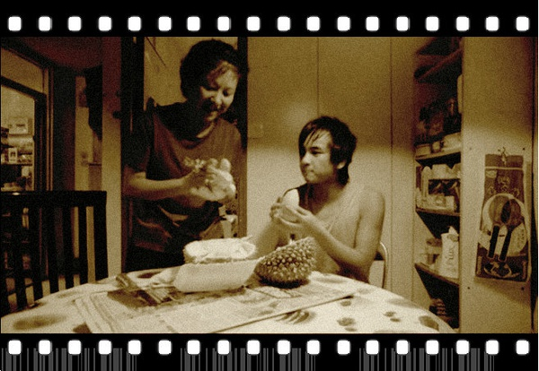
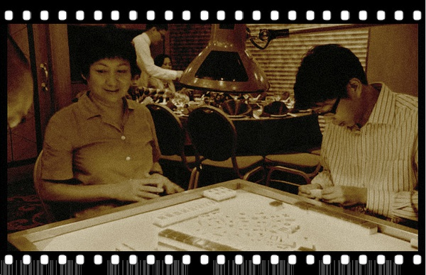

<!-- # 那些母亲教我的事——《天水围的日与夜》 -->

**这是一个歌颂平凡的沉闷故事吧？我想也不是。这世界呢，有人活得潦草，有人活得马虎，有人活得火烧火燎，有人活得落落寡欢。唯独这位母亲，在天水围的四方拥堵中，活得从容、柔和、不疾不徐、富有尊严。**

# 那些母亲教我的事——《天水围的日与夜》

## 文 / 范承刚（暨南大学）

一. 你也有这样一个母亲吧：那时你还小，在某个暑假慵懒的阳光中醒来，母亲已上班去了，你无所事事，等她提着菜篮子回家，做一顿寻常晚饭。饭菜做好，总少不了鸡蛋、番茄、青菜。你和她说几句家常话，或者自然沉默着。那时你记不住太多东西，但多年后每到傍晚，你还是会想起那些落地的阳光、潮湿慵懒的空气、菜倒入油锅时的哗啦声响、还有被钨丝灯点亮的屋子。屋子里浮着沉沉黄光，你无聊看着电视，母亲在一旁忙着家务。你总以为这样的日子会年复一年，不免有些不耐烦，也总以为身旁这个人不会变老，会一直这样唠叨忙碌着。

电影里，贵姐是这样普通，普通到你一下就想起自己的母亲。她在超市场工作，带着围裙，套上手套，每日搬运、包装、售卖着一堆榴莲、西瓜、苹果。下了班，提着卷纸、冻肉、打折鸡蛋回家，放好钥匙，为在家呆了一整天的儿子家安做饭。蒸鸡蛋、炒青菜，两碗白饭，简单得如同母子之间的寥寥对话。

你或许能够想见吧，那种最熟悉的亲人间，才会存在的安静和空白。

也就是这样一个母亲，自己的几个弟弟住在高档社区。一家人为家安的外婆做寿，来到酒楼聚会，弟弟弟媳围坐着打麻将，贵姐一个人坐在旁边。弟媳肚子疼，她帮替着打，赢了放进弟媳的抽屉，输了用自己的钱赔上。弟弟们熟悉自家姐姐，所以并不见怪。儿子也正坐在角落里，几个表弟表妹们正讨论什么时候回纽约。

母子碰在一起，相互看一眼，有些无聊，有些局促。他们住的地方，叫天水围。那里离市区几十公里，数千间公屋，住数十万人，不少家庭靠着失业综援过活。聚会完了，两人步行，住着大巴返家，灯影静静。

这是一个城市角落的卑微母子吗？我想不是，他们只是平凡。母亲买报纸会在意有没有送纸巾，儿子拿起报纸会先找娱乐版，两人在周日早晨闲散地吃着早餐。倘若你也生长在寻常街巷，你会闻到那熟悉的气息：豆浆、面包、拖鞋嗒嗒敲着地板、周末没什么好看的电视节目。

这是一个歌颂平凡的沉闷故事吧？我想也不是。这世界呢，有人活得潦草，有人活得马虎，有人活得火烧火燎，有人活得落落寡欢。唯独这位母亲，在天水围的四方拥堵中，活得从容、柔和、不疾不徐、富有尊严。

二. 同一栋楼里，新搬来了一个老婆婆，姓梁。梁阿婆用发黑的硬币买牛肉，在坏了灯的厨房里炒菜，一个人寂寂寥寥地吃饭。墙上贴满了照片，自己的，和亲人的，却只能一个人撑着木桌发呆。天黑了，手提灯下，继续炒牛肉青菜，再一个人寂寂寥寥地吃掉。

梁阿婆在超市找工作，认识了贵姐。一开始阿婆胆怯、生疏且沉默，贵姐也不以为意，买东西时随手就替她付了账，在楼下的便利店遇见，也会打电话叫儿子帮着搬电视机上楼。回到家，又让家安帮着调试电视机、换掉坏的电灯泡。厨房的灯修好，阿婆抬头，一脸金色微笑，夜里从柜中翻出一包冬菇，细心把价格的标签撕掉，想要送给母子。一个老人晚年想要什么，无非是有人说说话，帮着做些事，知道被人关心着。

可这个简单的愿望，对梁阿婆也是遥远的。阿婆原有个女儿，去世了，女婿带着外孙又再结了婚，却不愿抚养自己。后来，梁老太鼓足勇气约见了女婿，一生节俭还买了贵重首饰，想要送给女婿一家。她的意思，是想为外孙尽责，也想有人为自己送终，走完生命最后一程。女婿拒绝了她，说现任老婆比较小气，只能养她现在的妈妈。彼此客气地喝完茶，女婿匆匆走了。

赴宴之前，阿婆一夜未眠，看着太阳升起，满心希望余生有靠。最终，她还是坐上公交，回到了远离尘嚣的天水围。无论是餐桌上还是归程中，贵姐一直在她身旁陪着。公车上，灰心的阿婆沉默许久，拿出所有首饰交给了贵姐。贵姐也不推辞，将东西塞进包里，说我先帮你收着，以后要用钱，我帮你搞定。

不说安慰的话，只是安静坐在阿婆身边，挽着她的手臂，自己却先红了眼眶。

我想，所谓好心肠，就是如此了。无关怜悯，也无涉崇高，只是如此自然地伸出了手，携人走一段，共一时风雨，赠人以最为朴质的尊重、理解、关怀。

再到后来，贵姐、家安与阿婆一起过中秋，吃完冬菇、鸡蛋、菱角、扁豆，铺一张报纸，剥一个排球般大的柚子，三个人围坐在天蓝色挂灯下，阿婆笑说柚子很甜，窗外万家灯火。

是的，你还记得那样的日子吗，哪怕原本陌生不识，哪怕相距繁华很远，我们都能和煦地将邻居视为亲人，将世界看作眼前的一方小桌，相互牵扶，相待坦诚，在桌子上堆满水果，用温柔将屋子点亮。

三. 家安眼中的母亲，或许是这个样子：独立、和善、偶尔固执得有点可笑，却在琐碎中怡然自得，学着把鸡蛋做出各种花样：蒸、煎、煮、和虾仁炒、和豆角炒。她这一生，就像往返于天水围与市区的双层巴士，宽敞，齐整，奔波的路程漫长，却不忧风雨不忧晴，在城郊的青翠里行得温和。

活得平淡？也不尽然。贵姐是家中长女，十多岁就到纱厂做工，姐弟们住在木板房里，老鼠常在脚旁穿行环绕。她供养大弟读书，再继续供二弟，一直到结了婚，也不时拿钱回来帮扶家人。丈夫同是老实人，从不出声，还加上自己的一份钱。

后来，弟弟们都事业有成，搬进了高档社区，儿女也到了国外读书。后来，她的丈夫去世了，留下她独自一人，抚养年幼的家安。

将亲人送入富足生活，煎熬过了生离死别，贵姐带着儿子，退回到了寂寂小小的天水围。每日坐车到很远的城市中心上班，把狭窄局促的屋子收拾得整洁，对购物抽奖之类的事置之一笑淡然忘之，宁愿在家与阿婆过中秋也不去匡湖居凑那喧哗热闹，还能不用任何配菜，做一道让儿子连声称赞好味的香菇。

你知道的，碗筷声、拖地声、脚步声、笑声、回家丢下钥匙的叮当声、报纸翻开时的哗啦声、衣服晾晒时的滴答声……倘若我们低身聆听，那些凡世尘音，总能将生活的缝隙填满，将长街的寂静敲响，一如中秋月圆时人们在广场上亮起的灯笼，星星点点光，就暖了夜的的阴凉。

后来，家安的外婆生病了，医院里撒着娇要吃燕窝粥。贵姐知道，悄悄煮了过去，嘱咐儿子说是弟妹做的。外婆喝着粥，无意就想起了自己的女儿，对家安讲起了一家人过去的故事。外婆说：“她这个人呀，天天都是傻乎乎的，只懂得个做字。”

这时候，琴声响起，画面切入一幅幅黑白老照片，都是年轻的纺织女工。女儿仿佛就在其中，往昔岁月一下子浮现眼前。外婆喝着粥，低着头，舒口气，勺子在空中停留良久，那一声感谢，始终还是没说出口。

贵姐脸上总是挂微笑，那笑就像个竹筛子，滤掉了生活中卑微的、狭小的、歪斜的，留下了人心里饱满的、圆润的、齐整的。她把菜煮得漂亮，日子也一样不卑不亢、铿然有声。

唯独有一天，儿子从衣柜翻出丈夫生前的牛仔裤，太窄，只能仍掉。她走到垃圾桶旁，把裤子和其他垃圾一起丢下。她刚要转身，想到有人会捡，忽又停下，将桶盖翻开，把裤子捡出，小心地叠好，放在垃圾桶盖上，又再拿起，翻了一翻，恍惚看着。

那一瞬间，过往的记忆被打捞起来：那是她带着白花，穿着白衣，在丈夫送殡的途中，躲在卫生间里哭得痛心。也只有在那一瞬间，对亲人的思念，才像锥子一样刺开了生活的厚壳，透出缕缕悲伤的底色。

贵姐看着牛仔裤，在两盏楼灯的暗光里，站了一会，重又转身回家。正如我们曾穿越过的那些长夜，幽暗不是消失，而是沉淀在心里，然而天总会亮，我们所迎来的阳光，和往昔与来日并没有不同。

正如电影的最后，贵姐和家安去看外婆。外婆聊起姨婆前阵子找回大女儿，找了几十年，找回了有什么用呢，都不见这么久，连妈妈叫什么名字都差点不记得了。

外婆感慨：做人真是很难的。

贵姐床边削着苹果，笑一笑，回答道：有多难呢？

有人说得透彻：我喜欢贵姐，不是因为她是个好人，做了这些善良的事，而是因为，她只是顺应了自己的本性而已。

四. 天水围的故事，原不是这样开始说起的。很久以来，天水围在香港人眼中，是偏远拥挤的悲情市镇，是林夕歌中所唱“围住了的血汗，围住了的跌宕”的繁华角落。这里的自杀率曾是全港最高。2004年天恒邨失业的李柏森，用刀杀死妻女继而自杀，震惊全港。

一开始，导演许鞍华想拍这个事件，却找不到投资。后来，她决定更换题材，一个搁下了许多年的故事，一下子出现在她脑海。

那是2000年，许鞍华收到一个剧本，是香港中文大学一个叫吕筱华的学生写的，讲述一个单身妈妈与孩子在荃湾屋邨生活的故事。

许鞍华说，一直被这个剧本惊讶着：“以为两母子的关系是不好的，结果他们关系不错；以为妈妈的弟弟是看不起他们，原来不是；以为男孩子是单恋女教师，也不是；以为祖母死了，结果死的是另外一个老人……它的情节全部都是在反高潮，但很让人有追看性。”

重拾这个故事，不仅因为需要的钱少些，更是因为在天水围的采访中，许鞍华发现，“那里的居民们并非过着大众所想象的悲惨畸形生活；他们的确贫困，生活繁琐，面临着无穷无尽的烦恼，但也同时享受着点滴的生活乐趣，保持着邻里间的温情，维护着家庭间的亲情。”

拿着120万港币——够拍一部电视电影的钱，花了14个工作日，许鞍华完成了这部电影。电影后来获了很多奖，当地居民也很喜欢，她也由此获得投资，把最初计划的“黑暗的天水围”——《天水围的夜与雾》拍了出来。

如今看来，无心插柳，一部《日与夜》、一部《夜与雾》，反倒呈现了一个完整的天水围。如同一枚硬币的两面、一条河流的两岸，我们轻蔑不了那沉静的、温和的，也躲避不了那阴霾的、痛楚的。

自己却深爱这一部《日与夜》。初看真不像一部电影，影像朴拙，节奏轻缓，做饭、吃饭、买报、聊天、上班下班、出行回家，一些生活的边角余料就拼起了整个故事。但倘若我们静心驻足，你会知晓那其中的静水流深。香港的电影学者舒琪说：“我不以为《天水围的日与夜》是一部简单的电影。它展现的不独是一份气度与情怀，还有无比的信念与勇气。”

电影里的贵姐，总是让我想起自己的母亲。她是家里的二姐，初中没读完就进了童装厂，帮扶五个弟弟弟妹妹的生活，一辈子不轻怨、不动怒，从不丢失笑容。我常想，有一天当我离开母亲，她在那几十年的生活里，教会了我什么？

电影里，家安在母亲的陪伴下，沉缓坚实地成长了：他学会每次都买有赠品的报纸，去团契时不轻易拿桌上的食物，安静地折衣服、拖地板，把榴莲和柚子剥得熟练又漂亮。当舅舅说会考如果考不好，就供他出国留学时，他回答：“读书是应该有得读的，有学费减免的么。”家安的意思，是要靠自己。

然而，母亲会老去，家安也总会走出天水围。就像这城市里的许多年轻人，终将告别故土，常以异乡为家，那母亲所馈赠我们的，会深烙在我们身上吗？

有一天，你面对生活满面愁容，是否会记起那一份母亲的勤勉、豁达、顺应本心、只求活得让自己尊重？

有一天，你离家远行，一头扎进繁华，是否会忘掉母亲这一生的荣耀：像她一样，在这个繁琐、庞大的世界里，始终怀揣一份对世界最基本的善意，是多么璀璨的一件事。

