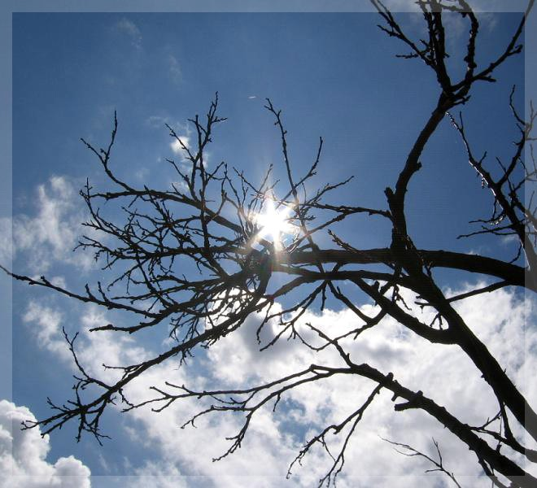
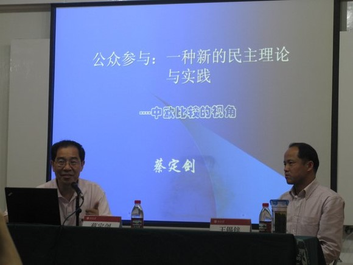
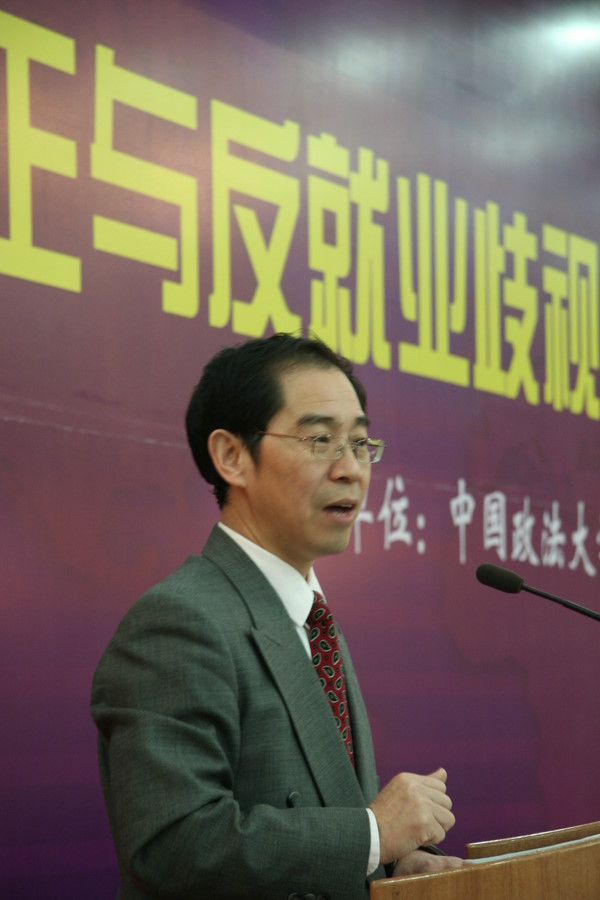

<!-- # 悲莫悲兮生别离 民主宪政是我们这代人的使命——悼蔡定剑老师 -->

**时至今日，大师一个个远去，我相信他们相继化作了夜空中的恒星，在某个不起眼的角落，注视着人间的悲欢离合和幸福周遭。我们在他们远去的背影里艰难跋涉，徐葆耕、吴冠中、钱伟长、范敬宜们身后留下的这个世界，可曾因为他们的努力而在一天一天好起来？抑或是一天一天烂下去？**

# 悲莫悲兮生别离 民主宪政是我们这代人的使命

# ——悼蔡定剑老师

##  文/Tony（清华大学）

去美国之前，对方机构曾以人大制度改革为题命我作文一篇，当时我查找了一些资料，偶得些许想法，遂草草写就短文一篇。午夜12点，我打电话与孙哲老师交流此事，询问他的意见。他当时正忙于手头工作，未听清我写作目的和缘由，以为我要以此作为论文题目，然后说了一句让我至今想起来仍能为之一震的话：“这个话题其实研究到最后没什么意思，你如果真的要研究人大，那么我劝你你现在就跑去图书馆把蔡定剑研究人大的书先全部看一遍。”午夜，一个人，在伍舜德楼的办公室里，这是我第一次听到这个名字——蔡定剑。

到美国后，那里的某位先生曾与我谈起蔡老师的事功。他曾在全国人大担任重要职务，而后因研究受到这样那样的限制，遂辞去官职回到政法，在象牙塔内潜心专研学问。后来我阅读他的相关著作，始能窥见其治学气象。他在中国人大问题的研究领域绝对是首屈一指的专家。就如同你想研究美国国会，你不能不读孙哲老师的著作，你如果想研究全国人大，则蔡定剑的著作是你永远无法回避的。而让我印象更进一步的则是蔡老师今年出版的《民主是一种现代生活》，该书系统对民主理论作了正本清源的分析，有力批判了当代中国某些人士的反民主观点，我将其视为批判王绍光之流《民主四讲》的有力武器。

去年6月2日，得知蔡老师将在北大法学院王锡锌老师主持的法律与公共政策论坛上作报告，我欣然前往，如愿以偿地第一次见到了蔡老师。当时他作了《公众参与：一种新的民主理论与实践》的报告，结合他自身多次前往欧洲城市社区考察的经验与大家分享了这一方面的思考，当时他娓娓道来，颇具学者涵养。在我校内相册里找到了下面这张照片，然而我无论如何也无法想象，这也将是我唯一一次见到蔡老师。

前两天在微博上流传出蔡老师病危的消息，并在相关人士前往医院看望时，他留下最后的话：“民主宪政是我们这一代人的使命！”那么年富力强的一位中青年学者，就人文社会科学来说，正是焕发学术生命的旺盛期，居然罹患绝症，蔡老师在弥留之际仍不忘中国宪政建设，其情怀和气魄又岂是我们这些凡夫俗子可以望其项背的……当我在微博上看到这句话的时候都有点条件反射地把顾准在弥留之际对吴敬琏说的“中国的神武景气一定会到来，你要守机待时”联系起来。

公元二零一零年，但问天上宫阙，今夕是何年？自今年春天开始，一位位大师先后以各种各样的方式告别了我们这个世界：3月15日在那个飘雪的日子里，Pargsos第一个告诉我徐葆耕老师去世的消息；接下来，在画坛被誉为“当代鲁迅”的吴冠中先生辞世；与清华爱恨交织50年的老学长钱伟长先生仙逝；然后，是何美欢老师，范敬宜院长。前两天我还在祈祷蔡老师不要成为下一个。可惜彼苍者天，歼我良人。朋友和我开玩笑说，好像我一年到头只做了一件事，那就是写悼词。一个人的生不会对世事产生什么影响，而一个人的死却可能影响历史的走向并影响波及你我他。

在灯下写徐葆耕老师悼念文章的时候，在中国美术馆参观吴冠中“我负丹青”纪念画展的时候，在上大宝山校区进灵堂吊唁这位崇敬已久却无缘得见、毕生奉行“自强不息、厚德载物”校训的清华老学长的时候，在北医三院ICU病房眼见何老师被抬上担架的时候，以及今晨打开电脑第一眼看到的蔡定剑教授不幸辞世的消息时，我的内心都充满了遗憾和彷徨。痛定思痛后，好像每次都能从中汲取奋斗的力量，重燃对生活的希望。然而时至今日，大师一个个远去，我相信他们相继化作了夜空中的恒星，在某个不起眼的角落，注视着人间的悲欢离合和幸福周遭。我们在他们远去的背影里艰难跋涉，徐葆耕、吴冠中、钱伟长、范敬宜们身后留下的这个世界，可曾因为他们的努力而在一天一天好起来？抑或是一天一天烂下去？往上追溯若干年，几十年，甚至上百年，五四时代梁济先生的诘问“这个世界会好吗？”至今仍是一个未解之谜。

面对各地风起云涌的强拆、自焚、流血、矿难、上访，我们无言以对，欧美银行有所谓too big to fall,而我们则有中国特色的too big to change——撼山易，要变中国难。有时我会突然产生某种无助感，就现在的工作做下去也许也会有所成绩会当官、会赚钱，但真的很难想象在我能力范围内能对改造中国社会能有什么实质性的作用和影响。前段时间参加江平先生八十华诞回忆录发布会，有位记者突然跑到前面提问：江老师，您说我们中国社会什么时候能够实现民主宪政？我们还看得到吗？江老师笑着说，我估计不太看得到了吧……是的，蔡老师看不到了，江老师也看不到了，我们还能否看到？崔卫平说，我们及我们的子女都有享受不受支配的、富有尊严的生活。果真如此么? 在华盛顿某天晚上我独自走到美国最高法院的台阶前，当时已是夜幕降临，四周空无一人，我甚至还没有意识到脚下就是何帆老师笔下那著名的台阶，而面前这座宏大的建筑就是最高法院。我拾级而上走到最高处，突然出来了一个警卫，夜幕中我看不清楚建筑上方刻的字，我就问警卫上面写着什么，他答：It says "Equal Justice Under Law"，我第一次没听清楚，于是他又说了一遍，It says "Equal Justice Under Law".那一刻，一种神圣而庄严的感觉在心中油然而生，在那个宽敞的平台上，夜幕中，我驻足良久。两年后我偶然一次路过了东交民巷的最高法院，我不知道这是为什么一点也无法找回当初那种庄严神圣的感觉，匆匆迈步离开。

以前我会因诸如“我们这个国家一定要我们这代人手中有所改变”这样的话热血沸腾，现在的我趋于保守，像刘瑜那样对未来取谨慎的乐观态度。大约只能从现在开始，一点一点，慢慢的，等，等，等，期待一点一点的变化，一点一点的进步，如王振民老师在何老师故去时邮件里所说的“等到中国实现法治的那一天”，也许到那个时候，你我早已不在人世，而这又有什么大不了的，如蔡老师那样，如果我们切实地参与了这场巨大的变革中去并为之付出了自我的努力，那么消失在夜空中有何不可？与诸君共勉！ Tony 于二零一零年十一月二十二日
