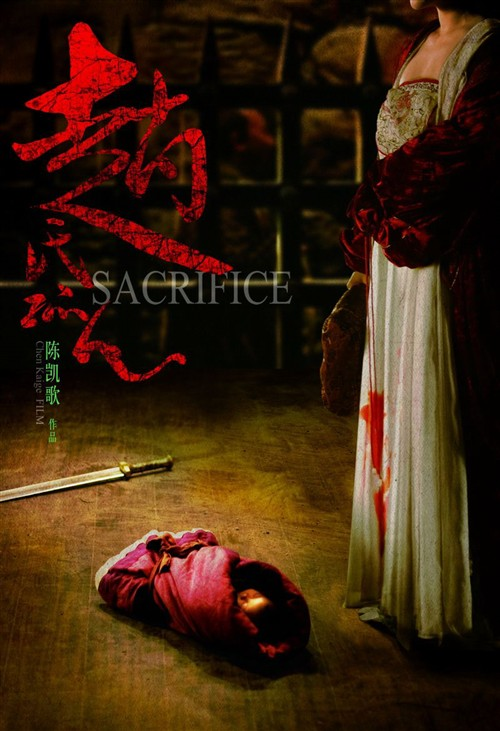
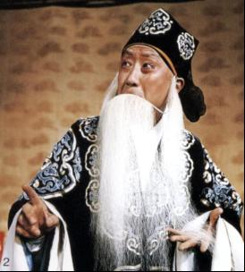
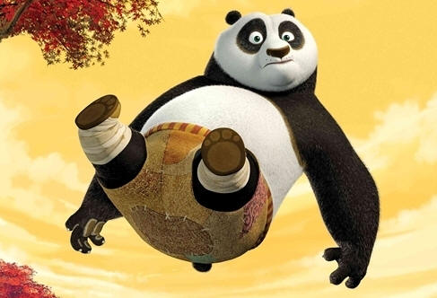

<!-- # 《赵氏孤儿》：热精灌耳，情何以堪 -->

**“写意处酣畅淋漓，承转处不知所谓。如此悱恻之宿命感在曾经的电影诗人镜头中彷徨不知所终，程婴内心悲苦凄切的忧思抑郁，煽情到了极致，骤然改行搞笑，这让憋着泪的观众情何以堪？”**

****

# 《赵氏孤儿》：热精灌耳，情何以堪

## 文 / 苏乏

就人性纠结，命运交错而言，《赵氏孤儿》倒是十分适合陈凯歌一贯拧巴的偏好。区别于三流文人蹩脚叙事，陈导对影像的雕琢令人肃然起敬，但也仅限于此。故事不再多提。

仰仗情绪饱满，导演对悲情主义的雕琢如火纯青，前半段捕风捉影亦可领略恢弘气势及精到之处，尤以赵盾一行逃跑途中惨遭屠戮那一段有板有眼，一气呵成，蔚为大观；又如故作沸反盈天，引密室中婴儿啼哭那一刹，程婴眉间闪烁的汗水细致入微。但影片同样耽于自恋，陈凯歌打哪儿指哪儿的陋习只放不收，写意处酣畅淋漓，承转处不知所谓。如此悱恻之宿命感在曾经的电影诗人镜头中彷徨不知所终，程婴内心悲苦凄切的忧思抑郁，煽情到了极致，骤然改行搞笑，这让憋着泪的观众情何以堪？在憋屈中变态么？

罗衫尽退时，谁料热精灌耳。

即便前半段每一秒都精彩纷呈扣人心弦，甚至令人误以为陈凯歌终归是陈凯歌，却无奈悲情渐入佳境时，反倒为亲子成长的暧昧写真取而代之，搅局之余令整部影片的思辨沦为强弩之末，本是卧薪尝胆的凄苦在欢声笑语中如同闹剧，不禁令人心生疑虑：这仇还报得了么？养父子二人此刻表现得越得劲儿，越为有朝一日手刃仇人添堵，以至于赵孤的选择其实无端端惺惺作态，毫无动人之处。

从角色来看，全知者的无为消解了苦心经营的悲剧，坚定信念之能事令复仇沦为理所应当的暴力，那不如换甄子丹吧，李连杰也行，一双拳脚舞起来虎虎生威咧！让葛大爷和黄大爷这般戏耍，杂搭，卖弄？这阵红薯醋心的破坏力可真够致命。

影片声音处理细腻，如若影院音响设备过硬，屠岸贾闯入公孙杵臼家中搜寻赵孤那场戏，声响与器乐分毫毕现，葛优饰演的程婴埋头等待命运降临，那一声终于响起的啼哭堪称揪心。影片结尾处有如回魂之梦幻，故地重游那份哀婉凄楚惹人喟叹，“你要等多久？”“多久都行。”程婴驻足巷尾，看着靥如夏花的亡妻消失在人群中，那份春光烂漫的幻觉转身告罄。此处弥留之际推门的意象，阶前大风，都很有力量，落幕前程婴对赵孤视若不见，掠过他望向虚空，终而仰面倒下的意味也颇为传神。

总的来说，本片没那么经典，但是不乏动人之处。窃以为应该是陈凯歌回光返照之作。《赵氏孤儿》所呈现的偏执远大过其意义，若非后天失调，完全可以走的更远。有人说陈凯歌可以拍得更好，我并不认同，窃以为这已是陈凯歌的极限了，因为刚出生的孩子是藏不住的，大发了的缺心眼也是藏不住的。这人一旦傻逼起来就再也无法回头了，尤其是发迹过的，曾经的天才，死扛也没用。永不会再有在一个《霸王别姬》，也似乎不会再有《无极》。就算陈凯歌控制得了画面，能够捕捉演员最动人的一瞬，但他已无法驾驭自己的能力，企图与表达的问题便接踵而至。

浑欲不胜簪，说的不是程婴，而是陈凯歌本人。

又及：

对《大笑江湖》《赵氏孤儿》《让子弹飞》《非诚勿扰2》这几部影片，最感兴趣的还是《让子弹飞》，但如果可以选择的话，其实我宁愿再花钱看一遍《功夫熊猫》。如果非要对比一下这四部影片的话，只能是最好看的最自我，最使劲的最没底，最常规的最消费，最随和的最鸡贼，该没营养没营养，该惹埋怨惹埋怨，该被忽悠被忽悠。如上便是我的总结，希望大家各取所需。

2010.12.6

苏乏，北京
