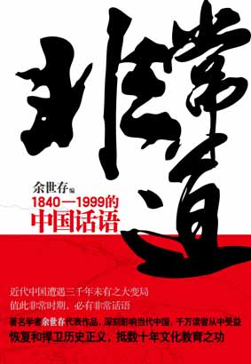
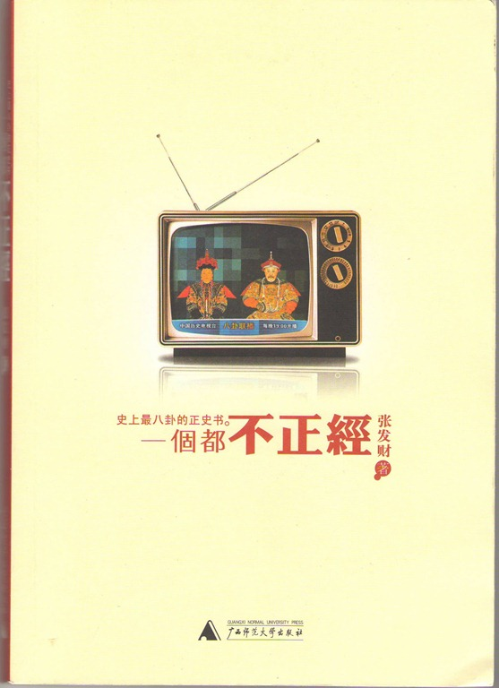
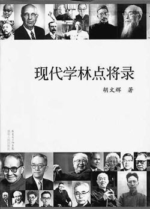
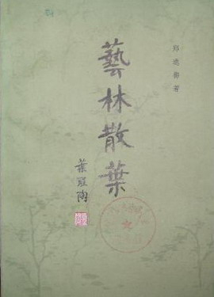
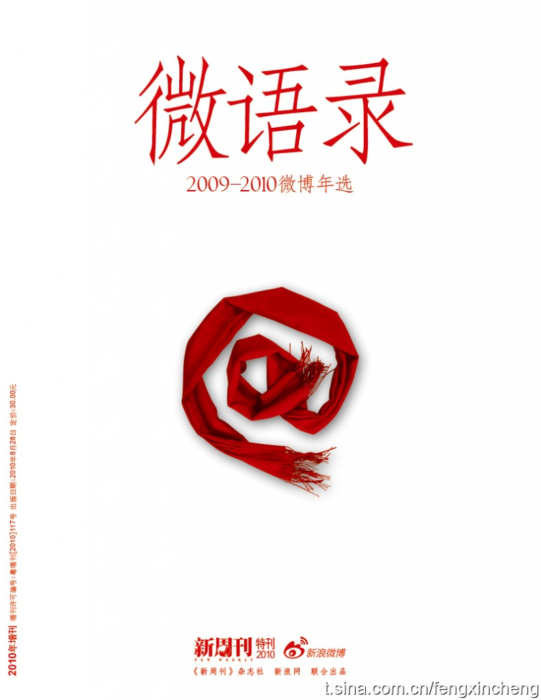

<!-- # 本期主题：微博时代•微阅读 -->

<!-- # <北斗荐书栏目> -->

## 本期主题：微博时代•微阅读

Web3.0新兴以来，由微博这一新兴媒介引领的“小时代”已经不容分说地向我们扑面而来了。这个小时代其实是个大时代，它将话语权的平民化直接推向了全民化，只要你愿意记录、愿意批评、愿意讨论、愿意表达，你就是这个微博时代的主人。微博的即时性、互动性与内容简明化是它区别于博客的最大特点，它以这种特点规定了微博网络世界的价值多元、交流平等、信息迅捷，也呼唤着现实生活中公民意识的普遍觉醒、社会真相的努力找寻、自我价值的不断认同。2010年12月10日的《人民日报（海外版）》在头版头条刊发了题为《微博给力社会治理》的文章，表明官方也越来越看出微博这一小小媒介的巨大社会功用。

在中国，微博的勃兴还与信息时代资源密集同时呈现出碎片化的趋势有关，更在渊源上继承了中国传统的批评鉴赏判断论赞的语言形式，我们习惯用三言两语甚至只言片语来表达自己的看法与观点，甚至对某人某事的评价也是如此，于是我们的文学史与文化史上就留下了很多类似今天微博般的笔记。到了今天这样一个微博时代，也出现了很多将旧事新闻裁切成微语言的作品集，或是将本来就是历史的边角料的事件原貌记下，这种轻松的体制内容却不单薄，有的信息是完全可以颠覆我们的成见的，而我们有理由相信，类似形式的读物的前景应是十分广阔的。

今天，你“围脖”了吗？

**本期荐书人**：谷卿，天蝎男，现在广州暨南大学中文系读研，平生最大爱好是读书、淘书、评书、写书。大学期间出版有《失语着行吟》、《赵朴初书法精神探论》等著。专业以外，主要关注全球化与大众文化、大众传媒与社会文化心理以及近现代学术思想史。

### 推荐书籍（点击书目可下载）：

**1、 [《非常道》](http://ishare.iask.sina.com.cn/f/12455233.html)**

**2、 [《红朝士林见闻录》](http://ishare.iask.sina.com.cn/f/6139824.html)**

**3、 [《一个都不正经》](http://ishare.iask.sina.com.cn/f/10869726.html)**

**4、 [《现代学林点将录》](http://ishare.iask.sina.com.cn/f/12455234.html)**

**5、 [《艺林散叶》](http://ishare.iask.sina.com.cn/f/12455235.html)**

**6、

《微语录》**

[**《非常道》**](http://ishare.iask.sina.com.cn/f/12455233.html)

余世存的《非常道》一出，仿作迭起，连书封装帧都十分近似。不过也不能苛责他们，若从《世说新语》的角度来看，《非常道》未必能洗清模仿的嫌疑，但此书在当代出版史与阅读史上的意义是值得肯定的，一是将世说体装入了新酒，成为此后一大批“新世说”的滥觞之作，二是在新世纪之初就预兆了后来的民国阅读热，并提供了诸多资料与资料索引。《非常道》是成功的，它看似平铺直叙，没有观点，却暗含着感情与价值取向，其间记录的人物有大清逊帝、民国总统、尚书中堂、著名作家、大师学者、梨园名伶、书画名流甚至妓女贩夫等等，时人习气与时代精神，皆可遍览无遗。

[**《红朝士林见闻录》**](http://ishare.iask.sina.com.cn/f/6139824.html)

徐晋如本科在清华和北大两所高校度过，与文坛学林耆旧十分熟稔，偶听学界老人和友朋谈论掌故趣事，便一一记录，又增读书所见、交游所见、访学所见异闻奇趣，遂成此书，在网上流传甚广。我曾问他何时将此书付梓，答曰“写着玩的，不为出版。”我以为晋如其人是促狭中见狷介、冷苛不掩激情，对敌与友，矜倨谦蔼，冷暖分明，在这部见闻录中表现得十分鲜明。

[**《一个都不正经》**](http://ishare.iask.sina.com.cn/f/10869726.html)

张发财是个插科打诨的好手，他以一种“粗俗”、“不正经”地方式透露了许多历史的真实与隐秘，虽然可能读这本书有太多太大的跳跃感，但有个好处就是可以随时拿起随时放下，枕上、车上、厕上皆可阅读。《一个都不正经》是真正的微博体，至今我还每天浏览张发财的微博看看新段子——不能叫段子，该叫读史新发现。看张发财的微博，俗话俚语粗口不断，成书后却“正经”多了，这也是面对所谓“正式出版”的无奈吧。

[**《现代学林点将录》**](http://ishare.iask.sina.com.cn/f/12455234.html)

《现代学林点将录》可不是微博体，这是一本现代学术史研究的大部头。我之所以将胡文辉先生的这部巨著放在这，是觉得这本书对于它里面提到的每个学者而言，分量还是太轻太轻了——这只是《点将录》呈现出的一种状态，并不是说胡先生研究的功力不深，恰恰相反，我们完全不能想象，要写成这样一本“浅出”的书，该需要多少“深入”的功夫。我曾听藏书家何家干先生说，胡先生家里没有卧室和厨房，整个屋子都是放满各类书籍的书橱，吃、睡都在书中。起初颇为怀疑，看过《点将录》后我相信了。感谢胡先生的努力，让我们有机会对现代学术史做一次并不轻松的扫描式微阅读。

[**《艺林散叶》**](http://ishare.iask.sina.com.cn/f/12455235.html)

郑逸梅先生在报界大大有名，人称“补白大王”，既健康长寿，又记得全、写得多，一生留下千余万字的文学作品和回忆录。这本《艺林散叶》以极细碎琐屑的方式记叙、回忆艺坛往事、艺坛故人，堪称微博中的微博，但就是这种微言往往透出大义，很多面目模糊的历史人物，经郑先生的点睛一笔，马上就鲜活起来，特别是这些文坛艺苑中人，最有性格，也最有风骨。读郑先生的书，你会知道民国为什么那么招人喜欢。

**《微语录》**

这是《新周刊》杂志社和新浪网联合编选的微博年度选集，对于正在经历着这个时代的微博客来说，你要么觉得它稀松平常，没有什么阅读价值，要么觉得这本书记录的是我们当下的生活实际，具有特别的意义。确实，经典的魅力在于它的生成过程，这一过程中，一直认为它就是经典的人一定不会是大多数，历史则是最终的判断者。微博的意义也是如此，既在当下，也在将来。

### 【附录】

既然本期的主题是微博时代，自然不能离开主题微博了。在此公布本期撰稿人的新浪微博[http://t.sina.com.cn/babyguqing](http://t.sina.com.cn/babyguqing)，欢迎大家互粉之
