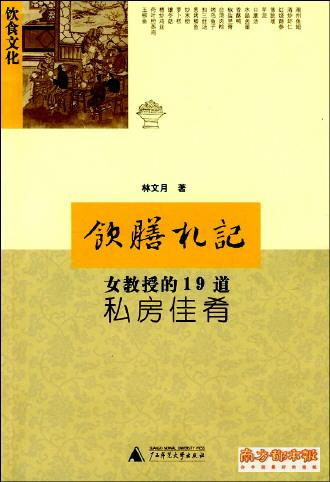
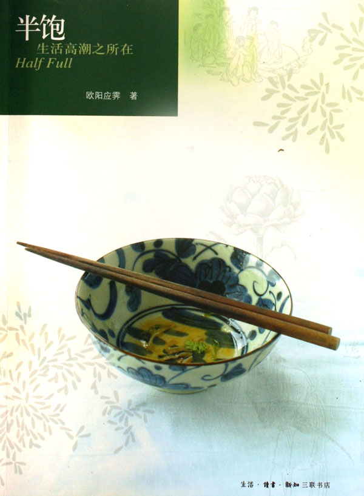
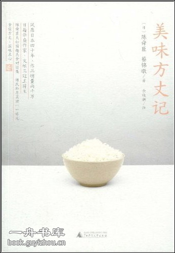

<!-- # 本期主题：珍馐佳馔慰平生——纸上谈饮食 -->

<!-- # 本期主题： -->

## 珍馐佳馔慰平生——纸上谈饮食

《礼记•礼运》言：“夫礼之初，始诸饮食。”在我的生活记忆里，似乎关于吃饭的讲究最多，小时候父母总是在吃饭的时候教训：“两只手都要放到桌上！”“爷爷奶奶先夹菜你才能动筷子！”至于餐桌礼仪，更是在长辈无数次的纠正后才逐渐熟稔：尊者坐首席，普通的居室以东向为尊，堂上则以南向为尊；吃饭时不要把饭捏成团；吃了一半的饭不能放回去；喝汤时不要大口灌；吃东西时不能嚼出声；不要毫无顾忌地大啃骨头；不要一边吃饭一边剔牙，等等。那时对于所谓食文化，也总很不能认同，后来年岁渐长，才渐渐理悟得一些饮食与人生的关系。对待饮食的态度，大抵与生活旨尚并无二致，而若想了解一个人，借助饮食作为媒介，一定会大有所得。

沈宏非说：“美食作家其实接近于美女作家，当然这两‘美’之间也不尽相同，虽然同为身体写作，但依然存在着上半截和下半截的原则性差别。”文人的世界往往构筑于精神中，构筑于纸上；也幸好如此，我们能够透过文字来感知许多不能亲口尝试的美味。从张季鹰到苏东坡，从袁枚到周作人，从梁实秋到汪曾祺，从周瘦鹃到陆文夫，文人与美食也有着前世今生解不开的情缘，不仅要吃得饱、吃得开心，还要吃得精致、吃得有说法，炫技也好、自得也好，总算给我们留存下了属于每个时代、每个个人的饮食记忆。

本期荐书人：谷卿，天蝎男，现在广州暨南大学中文系读研，平生最大爱好是读书、淘书、评书、写书。大学期间出版有《失语着行吟》、《赵朴初书法精神探论》等著。专业以外，主要关注全球化与大众文化、大众传媒与社会文化心理以及近现代学术思想史。

### 推荐书籍（点击书目可下载）：

**1、 [《饮膳札记》](http://ishare.iask.sina.com.cn/f/12882201.html)**

**2、

《饮馔丛谈》**

**3、 [《蔡澜常去食肆160间》](http://ishare.iask.sina.com.cn/f/12882202.html)**

**4、

《半饱》**

**5、 [《美味方丈记》](http://ishare.iask.sina.com.cn/f/12882217.html)**

[**《饮膳札记》**](http://ishare.iask.sina.com.cn/f/12882201.html\)

知道林文月是中学时读《万象》，有篇写台静农先生的文章，很长，很传台先生的神，后来知道这篇文章的作者是台大的女教授，再后来知道她是连战的表姐。林文月是才女、美女，更是好厨娘，台静农、董桥、林海音、三毛等都是她的座上宾，亲尝过她的手艺。据林文月回忆，她当时是为了避免重复以同样的菜式款待同样的客人，于是用卡片记录每回宴请的日期、菜单，以及客人的名字，“后来再度翻起，许多师长已经故去，许多朋友已经离散，更是唏嘘，才会把这些笔记上的饮膳往事记录下来。”可见，这本有关饮食烹饪的札记还有怀人之用，同时也为我们保留了一份当代台湾名流交游的资料。

**《饮馔丛谈》**

龚鹏程先生是我最为佩服的当代学者之一，我佩服他有深厚的学力、奇诡的妙思，还佩服他的实业也办得那么好、那么成功，更佩服他是一个特别会玩的人。读他的《书到玩时方恨少》，知道他是个通人；读他的《饮馔丛谈》，惊叹于他对饮食也有极深的研究。龚先生谈论一事，文字往往看似拉杂，其实最见博识，《饮馔丛谈》谈天说地，凡与饮食有关的，地域、宗教、性别、禁忌、政治、医药，无所不包。值得一提的是，此书的自序堪称凤头，虽短小，但已显出全书内容的广博了。与这本《饮馔丛谈》构成一套丛书的还有《武艺丛谈》和《书艺丛谈》，均由山东画报出版社出版。

[**《蔡澜常去食肆160间》**](http://ishare.iask.sina.com.cn/f/12882202.html\)

谈饮食不可不提蔡澜，在很多老饕眼中，香港就是蔡澜笔下的美食天堂，甚至有人就捧着一本蔡澜的书去游香港——其实是吃香港。这本《蔡澜常去食肆160间》确实像一本黄页，他将自己去过并觉得不错的每间美食店的地址和联系电话都记录在后，以至于我们弄不清是买了本读物还是买了本资料或菜谱。关于这本书的名字，蔡澜说本想用“最佳食肆”、“美食指南”之类，但往往自认为最好，读者不一定承认，于是更名“蔡澜常去食肆”，而读者买这本书就是信任他。——他好狡猾！

**《半饱》**

前年中秋时，我自撰一副对联作为祝福信息发给亲友师长：美酒微醺书半掩，好花欲绽月将圆。后来江苏的一位书法家朋友还将之写成作品，收入了他的书法集中。在中国传统文化的语境中，人们似乎并不一心一意地追求绝对圆满，而是希望让自己处在近于完善的境地，至于饮食，七分饱则足矣。而欧阳应霁的“半饱”在这里则另有深意：因为半饱，当你在下一个街口发现了新的美食的时候，你才不至于胃口没有了容量！他还说：“半饱是一种新时代的良好品德，半饱是一种自我完成，半饱是生活高潮之所在，半饱是一种感觉。”说得真好，我想，要读出这本书的滋味来，最后也要先吃个半饱吧。

[**《美味方丈记》**](http://ishare.iask.sina.com.cn/f/12882217.html\)

孟子有“食前方丈”一语，说得是摆放饭菜茶酒的桌子。天地虽大，与我无关，一年四季不变的是面前这张美食桌子。就在这张桌子上，作者不但对各种食材、食料、风俗如数家珍，更将自家的私房烹饪“秘法”合盘托出，授知大家。有意思的是，这本书的作者是一对日籍华裔夫妻，这本书既有向中日两国介绍饮食风尚的功用，更有夫妻拉杂闲谈的趣话，他们对那种大肆铺排、挥霍浪费的饮宴毫无兴趣，他们关注的只是厨房餐桌和面前这张小小的“方丈”。越小越见生活味，陈舜臣、蔡锦墩夫妇是懂得生活的。

### 【附】

与饮食有关的书还有《欧洲宴会史》、《考吃》、《快煮慢食》、《极致之味》、《吃、吃的笑》、《元气糖》，限于篇幅，就不予赘述了。
