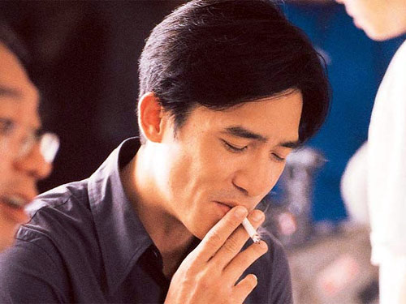
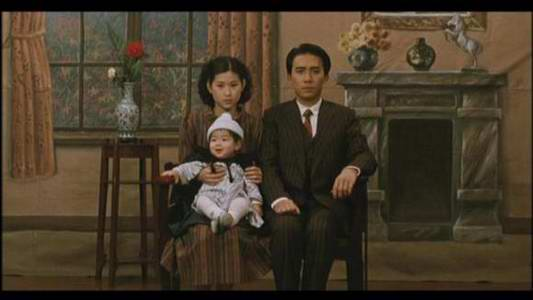
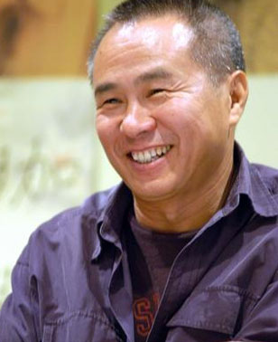

<!-- # 世间多少事——《悲情城市》 -->

**对祖国的追寻，对历史的陈述，对家族的追忆，对人性的审思，电影的语言始终是白描的，不动声色的，却是淡然苍茫的烟云，凝结的是没有遗忘久久不散的永伤。**

# 世间多少事——《悲情城市》

## 文 / 范承刚（暨南大学）

### 一.

夜风吹过黑幕下的基隆，岁月翻起的浪敲打月下的城。一个女人在生产，一盏灯在小屋中挂起，点亮一家人昏黄的焦灼。

这是1945年的台湾，吱吱呀呀的收音机播放着日本全面投降的消息，女人的呻吟不时从屋中传出。而灯光幽明的小屋如海中的一叶舟，漂泊着一家人几十年动荡的岁月。

不多久，一声啼哭豁然划破黑暗，一个婴孩诞生了。孩子是个男孩，父亲林文雄为之取名光明。

夜色还凉着，天或许快亮了。孩子仍不时啼哭，窗外的墨色淡了一些，又很快归于沉寂。

这一刻，是一个家族悲剧的开始。伴随着婴孩初生的，还有我们将要讲述的一段故事。讲故事的人，叫做侯孝贤。

中学时候第一次看这部电影，一直不敢提笔说它，也不能说就真的看懂了它。常常会在脑子里想起一些情节和对白，体悟的是一份诗意的抒情和浮沉的怅然。年岁渐长，才评出其中不绝如缕的悲怆来，以及娓娓道来的对于时事的叙述和人生的解读。这部电影台词不多，想说的话却都在画面之外。

浩海中浮沉的是漂泊不定的台湾，孤岛上动荡的是乡愁不断的基隆，悲城里生活的是平凡普通的林姓一家。电影便是以林氏一家，串联起了一九四五年台湾光复至四九年国民政府迁台之间的一段历史。 1945年，日本投降，台湾光复，国民政府于10月25日派行政长官陈仪接管台湾，宣布台湾重入中国版图。然而台湾本岛人民的生活，并不曾因政权的更替而一日转变。

太阳旗落下，青天白日旗升起；知识分子慷慨高歌《流亡三部曲》，孩子耳边仍悠扬响起日本的旧时民谣；收音机里播放着台湾光复的捷讯，宽美却温暖地流着眼泪相送日本女子静子；当政者换了国民政府，腐败混乱却比过去更甚，就像片中林文雄呐喊的不平：“我们本岛人最可怜，一下日本人，一下中国人，众人吃，众人骑，没人疼。”到了二二八事件，这样的矛盾终致爆发。 1947年2月27日，国民政府台湾专卖局工作人员，在一次缉私活动中打伤女烟贩林江迈，后又误杀路人陈文溪。28日，台湾市民举行示威，要求严惩凶手，却遭开枪扫射。民众愈愤，冲突在数日内蔓延全台湾，国民党调动大批军队镇压，伤亡者有近千到数万人的估计。史称“二二八”事件。

国仇与家恨，乡愁与愤世，温情与冷视，就这样复杂地交织，人们也说着台语日语上海话，憎恨杀戮或相识相爱。这便是电影的时代背景。

正如电影开始婴孩的诞生，生于黑暗，取名光明，为其接生的却是一位日本妇人，孩子一生的命运亦难如其名。导演侯孝贤讲述的是宏观视野之外的民间史诗，历史年轮下，是一代人逝去的诗意青春，硝烟吹乱的平凡人生，胡琴拉不断的秋意凉凉。

### 二.

林氏一家四子。长子林文雄，主持家中事务，经营一家酒楼。有一女唤作阿雪，后有一儿，取名光明。文雄后被卷入三弟与黑帮的争斗，并最终死于赌馆之中。

次子文森，原本打理一家小诊所，战时被日本人征调去了南样当了军医。留着家中妻子苦等多年，从此了无音讯，终无所归。

三子文良，战时被征去上海，为日军作了翻译，等逃了回来精神却已失常。好歹痊愈，又与黑帮争斗，被人陷害，抓进了监狱。在狱中饱受折磨，救出之后疯病复发，成为废人一个。

四子文清，自幼聋哑，在镇上经营一家照相馆。文清与小学教师宽荣为友，后结识其妹宽美，两人在静默中相知相爱，成为夫妻。文清、宽荣等皆为进步人士，二二八事件后共同从事革命活动。后宽荣被杀，文清随后亦被捕，死于狱中。独留宽美一人，抚养尚在襁褓中的婴孩阿谦……

编剧朱天文曾谈起文清这个角色产生的始末，一开始他们设想他是会说话的，但如此反不知如何着手，梁朝伟的国语又不甚好。一日谈话中，侯孝贤忽说，不如让文清哑巴算了! 于是林文清就成了如今这样一个无言的角色。

如今想起来，当初这样设计虽有些无可奈何，反倒成为一处妙笔，生出无心插柳的好处来。

当太多话语藏于心，最华丽的倾述便是沉默。世事无法言说，亦言说了一切。三个小时的电影泼墨出数十年无法风干的记忆，写不尽的家仇国恨，描不尽的乱世浮沉，文清则是这幅水墨上的一处留白。沉默的文清，是自身及他人命运的观察者；文清的沉默，则是生命的一份苍凉与沉静。

文清与人交流，常用纸笔书写。文清与宽美相识时，便是如此。对白化作纸笺上朴素清秀的笔迹，又化为了屏幕上黑白默片般的字幕，这使得电影有了一种文字的诗意，两人的交谈亦如涓涓流水，淡了愁，化了恨，留下的是内心的善意坦露，与人性的深处共通。

比如谈到文清童年失聪往事，谈到莱茵河上美丽女妖传说，比如看到逝去故友留下的诗句，一笔一划讲述的故事：明治时期，一个日本少女在樱花盛开时，自飞瀑下一跃而下。她不是厌世，亦不是失志，是面对这么灿烂的青春，怕它一旦消失不知道如何是好，不如就跟樱花一般，在生命最美的时候，随风离枝。她的遗书，给当时的年轻人整个都振奋起来，当时正是明治维新，充满了热情与气概的年代……

此时，文清与宽美两人相视，静美无言，字幕再次映出了同样的诗句：“同运的/樱花/尽管飞扬去吧/我随后就来/大家都一样。”

一如最初，两人相遇在九份山间的葱秀里，如黛远山，流年似水，虽不知以后将会经历怎样的悲苦岁月，但此刻吹拂过脸庞的，是一生微笑相忆的青春韶华。

### 三.

文清也不是一句台词也没有的。火车上人有要抓他，问他是干什么的，他眼里惶恐，竭力嘶哑地挣扎出三个字：台——湾——人！

人没听清，举起棍子要打他，幸而宽荣赶到，对着打手大喊，他是哑巴你不知道？

打手悻悻而去。

乱世如此，连哑巴都要逼着说话的。以至后来文清被捕被杀，其中的荒诞悲怆，愈发弥漫，方让人评出其中的无言来。

然而文清由于聋哑，始终站在混乱时事的边缘。对于台湾混乱时局表现最为直接的，则是身处其中的长子文雄、三子文良。两人的悲剧，是官僚黑帮争斗的牺牲品，亦是社会动荡的陪葬品。

文良是被乱世吞没的一叶舟。为求心中一己私欲，卷入黑道，盗印日钞、私贩毒品；却因时局的混乱至极，遭人诬告，被打致残。

而为阻止兄弟贩运毒品，大哥文雄卷入了黑帮的争斗。先是没收了文良偷运的毒品，又与黑帮请茶言和求一家平安，终因挡了黑帮财路，兄弟两人被以汉奸罪诬陷通缉。一番辛苦，虽救出其弟，但已成废人，文雄自己也终在赌场中与人夜搏，死于黑帮之手。肩负着家庭重担的大哥，就这样轰然倒塌，血泊之中，倒映着一个民族的伤痛。

一家四子，文雄文良这一脉，针砭世事，激浪翻涌；文森文清这一脉，则是天高云淡，静水流深。然而文雄被杀，文良疯癫，文森失踪，文清被捕。一家四子，终难逃家破人亡。

若在历史中寻一份答案，可看到那一个时代里，台湾本岛人与外来人之间的血痕依旧。孤岛台湾，飘零数十载，到了光复之后，日子却愈加水深火热。外来的投机者入岛寻一份利，拉帮结派胡作非为；外来的国民党入岛求一份权，腐败专政血腥镇压。

外来的国民党要说他们是汉奸，外来的上海帮认为他们挡了财路。本省外省，同宗相残。

他们苦苦寻求着对身份的一份认同，彷徨于命运的几经更迭，喑哑于语言的几度变化。是日本人，是中国人，还是台湾人？祖国是什么，哪里又是祖国？世事几度变迁，却仍在血雨腥风中挣扎求活；故土飘渺难寻，这一方土地上的人们，又将去向何方？

对祖国的追寻，对历史的陈述，对家族的追忆，对人性的审思，电影的语言始终是白描的，不动声色的，却是淡然苍茫的烟云，凝结的是没有遗忘久久不散的永伤。

电影中，宽荣、文清等人久别重逢，在一处酒家聚谈畅饮。聊到惘然处，一人开口低唱：“我的家在东北松花江上，那里有森林煤矿，还有那满山遍野的大豆高粱……”众人相和，歌声渐起，慷慨一时，萦绕在小城上空。

然而家在何方，何处为家？

只有漫天细雨迷蒙，久久不散。

### 四.

侯孝贤谈起这部电影，曾说他希望拍出的，是自然法则下人们的活动。于是在他的一个个长镜头下，出生、死亡、相聚别离，都若隔岸观花。每每到了情节冲突之处，有人争斗或哭泣，镜头便会转向九份云海苍茫的远山。山路间弥漫着不散的轻烟，平和的叙述掩盖了潜流的暗涌。侯孝贤的长镜头便是这般，沉静淡然，缓慢不动，任你自由想象，作一个时间的旅行者，自生命之河一路回溯，寻一份对内心的自省。

这份镜头的不动声色，不免让人觉得冷淡疏离，而给予这份苍凉一份暖意与希望的，则是宽美贯穿始终的安静旁白。

“昭和二十年十一月初八，好天，有云，带着父亲写的介绍信，上山来金瓜石的矿工医院做事。哥哥教书没空，叫他的好朋友文清来接我。山上已经有秋天的凉意，沿路风景很好，想到日后能够每天看到这么美的景色，心里有一种幸福的感觉。”

日记式的旁白响起于九份的云淡暖日间，冷漠剖析一个时代脉络的同时，也温暖走入一个女子善良无争的内心。自那时起，一个家族的兴衰便在这低声述说中徐徐展开。而此刻，是温泉水一般的人生初见。

然而当樱花在雨后随风离枝，这一段邂逅相遇也在栉风沐雨中幻化为相濡以沫。穿越过幽暗的牢室，目睹了难友的鲜血，沉默的文清自觉走向了抗争之路；而在哭泣过了生离，煎熬过了死别，昔日澹然如水的宽美，也成为了贤淑坚忍的女子。

老大文雄已惨死，老三文良已疯癫，一个家已然分崩离析，落在记忆的却是一份最痛的平静。医院里，宽美产下一子，镜头再次转向九份的苍秀山海，镜头外是宽美静静的独白：“今天下午，听到新年第一次春雷，声势很大，一阵又一阵，像要把山跟海都叫醒一般。”

生即使痛苦，命不知何往，雨后的生命也还是有意义的。

故事的最后，这一家三口站在火车站旁，小儿抱在怀中，望着栅栏外灰雨里的海岸线，不知道他们能逃去哪里。这一份生命的尊严、隐忍与宽容，也还是让他们回到了家中，来到画着窗帘壁炉花瓶的布景前，调好相机，为盛装的三人拍下了最后的一张全家福。

再到后来，文清已被抓走，留下的人仍在平静地生活。宽美提起笔，开始给阿雪写信。

“阿谦已经长牙了，笑的神情很好，眼睛很像四叔。有空来家里走走，九份开始转冷了，芒花开了。满山白蒙蒙，像雪。”

浅浅低语间，让人唏嘘。

侯孝贤曾说：“我觉得总有一天电影应该拍成这个样子：平易，非常简单，所有的人都能看。但是看得深的人可以看得很深，非常深邃。”

