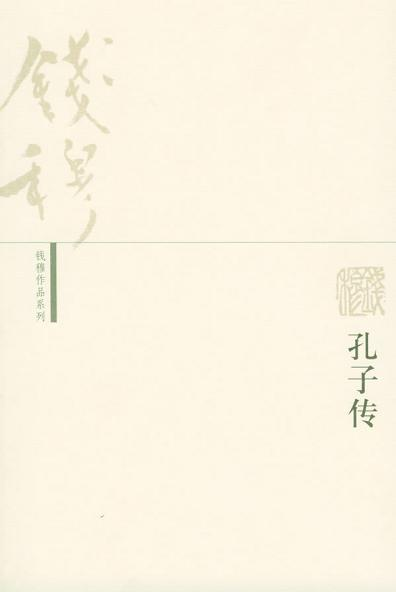
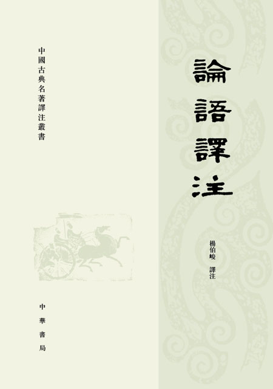
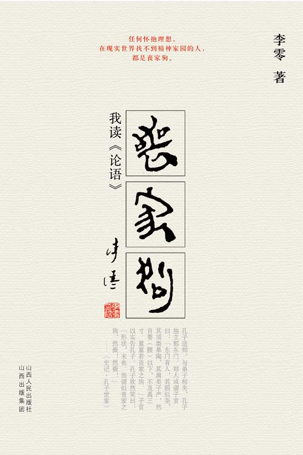
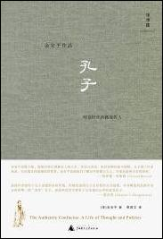

<!-- # 本期主题：俯仰之间看孔子 -->

<!-- #  本期主题： -->

## 俯仰之间看孔子

2011年1月11日，一幅国人再熟悉不过的巨大面孔惊现天安门广场——总高9.5米的青铜孔子立像在国家博物馆的北广场落成。一时间，这座铜像吸引住了国内几乎所有媒体的眼球，网友通过博客、空间、微博纷纷发图发帖议论，也再度掀起一场解读孔子与儒家文化的小高潮。

诚然，孔子是不世出的伟大人物，值得我们认真了解和研究。可是一直以来，我们从没有以正确的眼光和角度去看待他，从当年的无情打倒到现今的立像膜拜，其间的思维方式似乎并未有所改变：要么是卑微地仰视，诵读儒家经典而不敢置一辞；要么是仇恨地蔑视，誓将孔子的著述言论批倒批臭。很多专家学者认为，孔子像在天安门广场落成有着重大的意义，将预示着儒家文化的全面复兴。我倒是觉得，我们离孔子还有很远，我们甚至还没有找到一种恰当的方式去接近孔子，这种通过造像来造圣、确立权威的事情以往不是没有，可是真的能对我们理解孔子与儒家、理解传统文化起到推动作用吗？文化的延续和继承从来都不是依靠轰轰烈烈的运动来完成的，中华民族选择圣人、学术的弘扬与复兴也不是以铜像大不大、多不多为基础的，

其实说到底，孔子就是一个可爱的长者、优秀的老师。当我们走过长安街，看到这位老先生微笑的面庞时，也对他报以微笑就好。面对孔子，我们应当拾起自尊、放下高傲、摒弃蔑视、剔除仇恨，平心静气地面对面，才有交流与碰撞的可能；否则，我们依然是思想上永远也无法成熟的奴隶与暴徒。

本期荐书人：谷卿，天蝎男，现在广州暨南大学中文系读研，平生最大爱好是读书、淘书、评书、写书。大学期间出版有《失语着行吟》、《赵朴初书法精神探论》等著。专业以外，主要关注全球化与大众文化、大众传媒与社会文化心理以及近现代学术思想史。

### 推荐书籍（点击书目可下载）：

**1、 [《孔子传》](http://ishare.iask.sina.com.cn/f/13062390.html)**

**2、 [《传统的误读》](http://ishare.iask.sina.com.cn/f/13062389.html)**

**3、 [《论语译注》](http://ishare.iask.sina.com.cn/f/13062391.html)**

**4、 [《丧家狗》](http://ishare.iask.sina.com.cn/f/13062392.html)**

**5、

《孔子》**

[**《孔子传》**](http://ishare.iask.sina.com.cn/f/13062390.html\)

《孔子传》是钱穆先生一本比较特别的著作，文辞较为浅易，但学术性依然很强。钱先生作为历史学家，有几分材料就说几分话，在史料的搜集取舍上自有其特别的考虑，此书综合司马迁以下各家考订所得，最大的宗旨即在于认为孔子之为人乃其自述所谓学不厌、诲不倦者，更认为孔子的第一身份本非政治家或思想家。钱先生亦如此，他固然是当代的学术大师，但其更令人赞誉者还在于他也是一位优秀的老师——能培养出余英时、严耕望这样的好学生、大学者，怎不让我们更敬佩老先生几分？

[**《传统的误读》**](http://ishare.iask.sina.com.cn/f/13062389.html)

此书是刘梦溪先生重新审视儒家思想与各个历史时期文化主流倾向之间关系的著作，他不认同传统文化主要表现为儒家文化的陈旧观念，认为“儒家即传统是对传统的误读”。确然，汉代以后，儒家作为一具尸壳，不断地被塞进各种魂灵，代无断绝，虽然纯粹的儒学不再，但这也显现了传统文化必将发展为多元复合的趋势。兰巨生先生说：“读《传统的误读》除了看到各种理论和学术的思辨外，会感到有一种感情在撞击你，它无法从文字中摘出放在眼前，这种感情大概就是文化承担力。”我们应当为这份文化承担力鼓鼓掌。

[**《论语译注》**](http://ishare.iask.sina.com.cn/f/13062391.html\)

读《论语》，如何能不读杨伯峻的译注本？！杨先生的译注是理解《论语》最易入门之书，他注解一句话时，但遇疑问，能将截然不同的两种或多种说法并列，让读者自断，就像裴松之注《三国志》，是很明智的做法，是大学者的襟度。杨伯峻是著名语言文字学家杨树达的侄子，曾从章太炎门人黄侃求学，小学功夫极为深厚，故而《论语译注》对于字词音义、语法句式、修辞藻饰特多关注，而又能做到通俗晓畅，实为不易。以此书入门，如想继续研究《论语》，还可读杨树达《论语疏证》、程树德《论语集释》、刘宝楠《论语正义》以及朱熹《四书章句集注》等。

[**《丧家狗》**](http://ishare.iask.sina.com.cn/f/13062392.html\)

夸夸其谈讲《论语》的人很多没有读过《论语》，很多读过《论语》的人谈《论语》往往又言不及义，孔子到底是什么个形象，李零先生拈出“丧家狗”三个字来描述，这惹恼了很多读者和孔粉——殊不知“丧家狗”这个名号是孔子乐滋滋地自愿接受和肯定的。《史记•孔子世家》载，“孔子适郑，与弟子相失，孔子独立郭东门。郑人或谓子贡曰：‘东门有人，其颡似尧，其项类皋陶，其肩类子产，然自要以下不及禹三寸。累累若丧家之狗。’”子贡到东门，真的找到了孔子，并以实相告，我们这位可爱的老先生此时“欣然笑曰：‘形状，末也。而谓似丧家之狗，然哉！然哉！’”可见孔子自以为“丧家狗”的形容是很传自己的神的。李零先生尚有《去圣乃得真孔子》一书，可与《丧家狗》对读，让我们看看这位先师是为何被称为最识时务的圣人的。

**《孔子》**

****

与钱穆先生不同，耶鲁大学教授金安平女士这本书对孔子所持的态度更公正平实，它“不讳言孔子个人好恶及其在鲁国内乱中的角色，何以步下政治舞台不情愿地成为职业教师，甚而浪迹天涯。”此书主体部分共有八章，以去鲁、返鲁为两大叙述板块，将孔子的政治、教学生涯一一展现，每段详实的描写的背后都哟大量的史料支撑。芝加哥大学教授夏含夷（Edward L.Shaughnessy）评价此书时说：“虽然作者惊叹于孔子思想的永恒价值，但她仍试图以人生历程的方式展现。本书阐述的虽然不是永恒而唯一的‘真实’孔子，却是特定时空背景下以及我们心中的真实孔子。”我以为这种解读方式是十分可取的，也是我们最为缺乏的。
