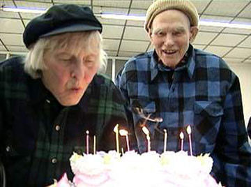

<!-- # 那年夏天的小王庄——纪念一位可爱的老人 -->

**“对于现在的年轻人来说，老寒这样的人物在世时几乎等于是活化石，而大多数人恐怕根本不知道她的存在。她为自己的信仰活了一辈子，她是纯粹的理想主义者。纯粹的理想主义者不会把空泛的口号挂在嘴边，而是把它细化到平淡的劳动当中去，她这一辈子，是过得幸福的。”

**

****

# 那年夏天的小王庄——纪念一位可爱的老人

## 文/蔡残音（华东师范大学）

老寒去世4个月后的今天，我才得知噩耗，尽管我知道总会有那么一天，但是内心还是很伤感，感慨万千。 05年我还在太原念大一。从高中时开始和网上的一些老左派网友接触，对马列和毛的理论很着迷；还有那时张广天的《切·格瓦拉》话剧的热演，让我对左的东西十分热衷，那个时候经常去一些网站浏览，比如“乌有之乡”，——如你们所知，它现在还在。 05年暑假前夕，南开的朋友友告诉我，他们在做关于建国后土改的研究，准备写一些关于阳早和寒春的文章，这是我第一次听到他们的名字，包括韩丁（寒春的哥哥），便很好奇的去网上查了一下，才知道除了斯诺、白求恩之外还有那么有传奇色彩的外国人在国内，而巧合的时，没过多久寒春竟然来了我所在的学校演讲。记得我听完演讲给寒春送了鲜花，第二天寒春的儿子就给我打了电话表示感谢；我也表示有机会要去拜访他们。这些南开的朋友，由于写作需要，要去寒春所在的地方住一阵子，我知道后便表示也想去，于是便有了这次难忘的经历。 05年7月，我去了北京，同行的还有我同学老根。目的地是北京昌平的小王庄，那里是中国农机院北京农机试验站。这地方挺远。我记得来接我们的朋友带着我们换公交、换轻轨，好一阵子才到那，毕竟是北京的郊区。

其实那里通俗的说就是一个奶牛农场，地方很大，里面有招待所和饭店，应该是国营性质的。

第二天我们就在朋友带领下去拜访寒春。她住在一个砖结构的平房里面，没什么装修，很简朴，水泥地白墙，但是从进门的院子绿化什么很好，很有生活的气息。那时候寒春已经是80多岁的老人了，之前有过中风，而03年丈夫阳早的去世对她打击甚大。她的中文不是特别的好，而且好像听力也有困难，加上我对谈话内容的记忆已经有点模糊了，所以基本上我只能回忆起一些内容，我记得她愿意我们叫她老寒，如果要加称谓就是加同志，她还说30年代她跟家人在德国，听过希特勒的演讲，说希特勒是一个富有鼓动力的人。我们谈话的客厅里面挂着毛和陈永贵的照片，这两个人是老寒最尊敬的人。她的那张工作台特别吸引人注意力，工作台是由砖头堆起来的，上面放了块木板就是工作台了，那工作台还符合人体功能学，有一定的倾斜角度，老寒对这个工作台很满意，也很骄傲，觉得实用又便宜，我记得当时上面还放着图纸和卡尺，据说是老寒她自己在设计房子，因为住的房子实在潮湿，她身体吃不消，放在原来，她是坚决不会考虑换房子的，太奢侈。其实老寒享受的是副部级的待遇，但是她十分节约，阳早去世时候她为了节省40元的骨灰寄存费，把阳早的骨灰葬在了农场的树下面，她说那里能看得到奶牛，很好。

之后的几天我们就开始在农场劳动，其实就是很简单的劳动，除草、喂牛之类的。我是城里面长大的，所以是第一次近距离接触奶牛，那里的奶牛很大，超出我的想象，简直跟小象一样。而农场的挤奶已经高度自动化，奶牛排队进挤奶房，一头挤完就自己出来，下一头跟上，据说奶牛也希望快点把奶挤完，因为它会涨得慌。而那套挤奶设备，是老寒夫妇以前设计的，设计出来的时候在国内算是最先进的了。

每天早上在农场劳动的时候，都会在固定的时间看到老寒的。那是她早上对奶牛的例行检查，每天如此，风雨无阻的。当时虽然是7月份，天气很热，但是老寒确实穿着格子衬衣，因为她毕竟年纪大了。她弓着个背，脚上还穿着一双黑色的长筒胶鞋，慢慢的朝挤奶房走去，这幅景象，至今还深深的刻在我的记忆力。当时给我的感觉是，她不是去看奶牛的，是去看她的孩子们的。

老寒是第一个拿到中国永久居住权也就是所谓绿卡的外国人，有人问她为什么不干脆加入中国籍，她的回答是：“我热爱的不是中国，是中国革命。”多么坦率的回答！她始终捍卫毛泽东和他的思想，并对改革开放后的中国现状不满，她认为那是走资派和买办的政策，她说现在的人只知道赚钱。这样的思想，对于现在来说，确实是不合时宜了，但是她的执着和坚持，让我不得不肃然起敬。我有点理解为什么当年阳早的去世对她打击很大，因为她失去的不仅是爱人，还是有着共同信念的革命同志，在现在的社会，她这样的老左派，真是一个一个少下去了。

这五年以来我自己的思想有了很大的变化，和以前的那些网络上的朋友也渐进不联系了。但是我心里确实还挂念这位老人。至今我的手机里还存有老寒住所的电话。对于现在的年轻人来说，老寒这样的人物在世时几乎等于是活化石，而大多数人恐怕根本不知道她的存在。她为自己的信仰活了一辈子，她是纯粹的理想主义者。纯粹的理想主义者不会把空泛的口号挂在嘴边，而是把它细化到平淡的劳动当中去，她这一辈子，是过得幸福的。我们虽然获得了各种各样的自由，但是到头来，却不时的为信仰的缺失而唏嘘，卡尔·波普尔已经把柏拉图开始的历史决定论和乌托邦批了一通，大部分人也接受了，但是万一这些终极理想真的是对的呢？不要紧。对不对，真的不要紧，只要我们愿意相信他们是错的就好。

做理想主义者并不是坏事，只是太难罢了。谨以这篇模糊的回忆，来纪念这位可爱的老人，我也得试着抓住理想主义的猫尾巴，把它留在我这里。

再见了，老寒！

简介：寒春，原名Joan Hinton，1921年4月20日出生于美国芝加哥，是小说《牛虻》作者伏尼契的孙女，曾是一名核物理学家，是美国陆军部研究核武器的“曼哈顿计划”中少数的女科学家之一，在洛斯阿拉莫斯(Los Alamos)武器试验室做费米的助手，原子弹爆炸使其放弃了作为科学家的愿望，她1948年来到中国，49年与丈夫阳早（Sid Engst）在延安结婚。 2010年6月8日凌晨，寒春因病在北京协和医院逝世，享年89岁。7年前的圣诞节，她的丈夫阳早在北京去世。阳早、寒春将毕生精力都献给了中国，献给了中国的奶牛事业。有人曾称赞阳早、寒春是白求恩式的国际主义战士和具有牛的精神——吃的是草，挤出的是奶。夫妻俩生前说过：“我们吃了中国人2万斤粮食，做了一点有益于人民的解放事业，应该的。”
