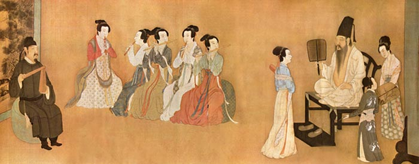
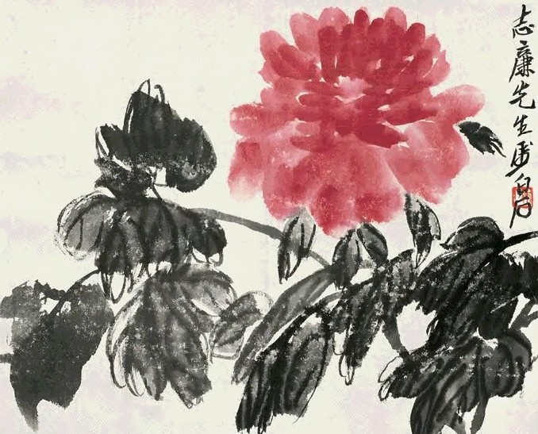
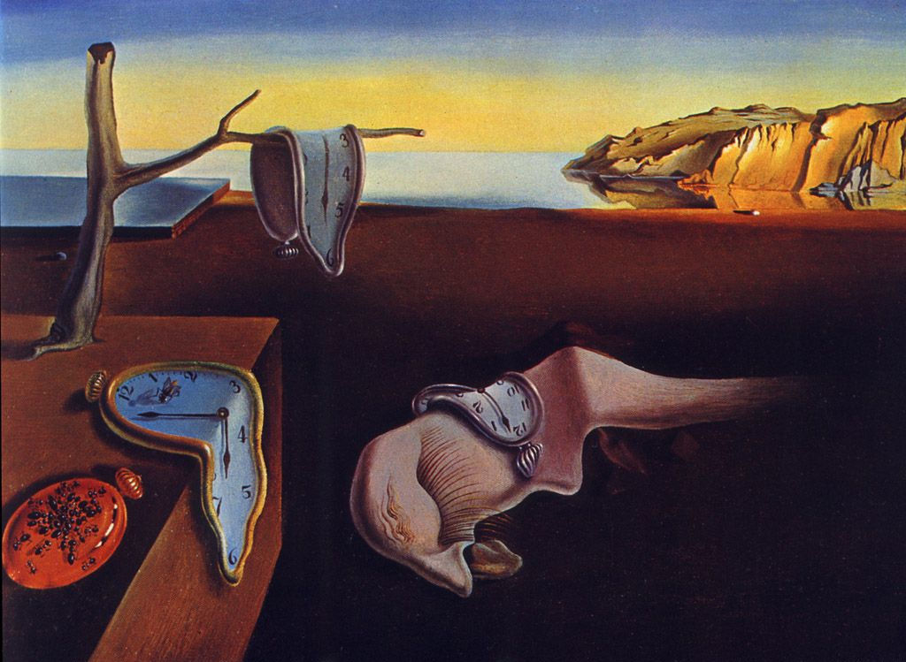

<!-- # 年轻人为什么嫌中国画“土” -->

**中国古代任何王朝的画作都不乏带有类似这种隐喻者，甚至隐喻的无所不在就是中国绘画思想史的主流，对于这些内涵的解读必须熟知文学史和艺术史，时代的隔离与知识的疏失让很多中国画变得难以理解，这种丰富的画外内涵让今天的年轻人在面对它们的时候感到无比沉重和压抑，或者觉得莫名其妙，在无法解读的情况下，当然会认为它们是一种与当今社会生活脱离的毫无意义的“土”画。**

# 年轻人为什么嫌中国画“土”

## 文 / 谷卿（暨南大学）

不久前，我在为学校理工科大一的学生以“乐舞书画”为题讲授文化史的时候，曾用PPT展示了一组中国名画图片，但却发现在座的“90后”们对之兴趣淡然，似乎颇感无味；甚至只有很少几位同学能够认出像《韩熙载夜宴图》这样知名度很高的传世佳作，对于画史的了解也仅限于听说过很少的几位如吴道子这样的画家。与之形成鲜明对比的是，学生们对西方美术史的熟稔程度令我惊讶，他们中能够随便举出五十幅以上的欧洲名画者大有人在。其实这个现象不是单独和偶然的，根据我在其他场合的了解可以很明显地看出，年轻人对于美术的爱好，绝大多数表现为对西洋画的欣赏；而他们对中国画的看法，一个最为普遍的评价就是“土”。

我们为什么嫌中国画“土”？在这里，我并不想为中西美术的艺术价值做无谓的评判、严格地分出一个你高我低的等级，只是希望通过我的观察与思考对上面说到的这种现象找寻一个可以解释的原因。

中国画的审美与批评标准是极具特色的，自南朝谢赫提出“六法”尤其是其中的“气韵生动”以来，希图“传神”和追求“神”、“韵”成为了中国历代画家的一贯践行目标。在这种审美旨尚的影响下，中国画脱离了机械摹写与被动仿照的程序，较早地完成了其艺术性的自觉与意识上的形而上化，所以，中国画史从来不和技术发展史同轨，与之关联更为密切的是思想史和观念史，甚至政治史，它突出地反映了时尚与趣味的变化，这种带有极强人文性质的嬗变与更迭是科学技术发展史的眼光所根本无法理解的。在两宋写实之风盛极之后，明清的“文人画运动”又为中国画的审美找回了“最初的梦想”，晚近以来愈加昌炽的写意画风似乎不断在向我们昭示“不求形似”才是中国画的金科玉律。可见，对于中国画的理解与欣赏并不是一种能够以实物作为参考的关于“像不像”的考量，而是一种超越于兹、必须进行于中国传统艺术语境的深度解读。我前些日子读到美国学者姜斐德女士的《宋代诗画中的政治隐情》，在此书中，她以大量的材料来证明宋画中存在着巨大的隐喻，在寄托对个人命运变迁悲叹的同时，更有着丰富的政治含义。其实不仅宋画如此，中国古代任何王朝的画作都不乏带有类似这种隐喻者，甚至隐喻的无所不在就是中国绘画思想史的主流，对于这些内涵的解读必须熟知文学史和艺术史，时代的隔离与知识的疏失让很多中国画变得难以理解，这种丰富的画外内涵让今天的年轻人在面对它们的时候感到无比沉重和压抑，或者觉得莫名其妙，在无法解读的情况下，当然会认为它们是一种与当今社会生活脱离的毫无意义的“土”画。从构图与画面光感而言，中国画强调营造出那种简淡平实之风，同时力求在这种简淡平实的背后，形成一种有余意的“韵”，这与西画中多见强烈的光影感完全不同，西画的写实风尚使得画面能够在第一时间就可以抓住观者的眼球；而20世纪以来兴起的现代主义绘画虽与其传统的写实之尚背道而驰，但在画面的冲击力上却有着更强的程度，狂野、激荡、迅猛、夸张的风调就是现代社会生活在艺术层面的体现。与西画相比，中国画所表现出的静穆和雅很自然地会被年轻人感知为一种不合时宜的“土”。

我曾思考过一个被我们经常用来品评中国画所用的词语“高古”的含义，什么是高古的呢？与之对立的应该是什么风格呢？我觉得，高古就是努力地创造出一种“隔”的情态，就是画中表现的人、事、物与我们现实生活要隔开一层，而不是常见的熟人、旧事、俗物；就人物而言，其造型、开脸、衣饰的笔画都要避免流于俗笔，夸张、变型更是十分常见的，这是“高古”的重要表现。与之相对的应是“圆熟”，题材、笔画、造型不能生新，自然没有境界。中国画是极其尊尚高古的，同时也是避忌圆熟的，作品“圆熟”的画家往往被讥为“匠人”，是不被认作为艺术家的。可惜这种传统的绘画精神与审美追求在艺术发展的过程中遭到中断，在上个世纪中后期大陆那场“厚今薄古”的浪潮中，高贵的艺术传统被打倒在地，这也造成了出生在那个时代以后的年轻人们对传统精神缺乏心理的认同。对艺术的审美也是一个传承的过程，由积淀而养成，一旦中断，整个社会的风尚势必会极大地转变。在文化传统断裂后亟待重续之时，中国的经济社会开始向现代化转型，于是也带来了文化的转型，西方的生活方式与文化价值再一次深刻地影响了我们，甚至比上个世纪初持续数十年的影响还要完全和彻底。在这个不断掀起大众化浪潮的时期，随着媒介的迅猛发展，动态视觉已经超越单一的文字、图像、声音而成为我们主要的消费对象，在讲求效率的当代社会，视觉的消费已经完全融入到日常生活场所中，“当下”的意义被不断放大，艺术的作品创造和意义生成也变成为一种快速的工业化过程和商业化行为，我们似乎再也不需要那种必须重设语境进行多维解读的艺术了，那些远离“当下”意义的画无疑是“土”的。“80后”、“90后”在这样的环境下成长，对现代生活有着心理上的归属感，对于作为这种生活与风尚的一种体现的西方文明也有一种亲切的认同；而回视我们本来就追求“隔”境的中国传统绘画，很难不让我们的年轻人真的产生一种“隔”的感觉，更由此生成“中国画‘土’”的印象。

传统美术教育的缺失和错位也让年轻人对中国画缺乏了解或好感。记得我在中小学课时极少的美术课上所学的大多是素描、水彩或剪纸、泥塑，完全没有美术史的概念和对中国画的初步认识。同时，当年蔡元培提出以美育代替宗教的理念深入人心，我们近一个世纪以来的美术教育由此发生了巨大的错位，这种对美的功利认知导致了艺术教育的政治化，课本与教师对中国画的解读疏离了真正的美，这是以学术研究的方式替代艺术本位教育，单纯强调载体而忽视本体，终致在这种教育方式下成长起来的年轻人与中国画产生了巨大的隔膜。

我们并不认同“文化侵略”的说法，而宁愿相信对艺术风尚的欣赏和选择是由主体的自主性所决定的，但影响这种自主性的因素却十分复杂。我想，年轻人之所以嫌中国画“土”，正是因为中国画与中国艺术批评自身的特点没有在新的社会文化语境中得到他们的认同，在后新时期的全球化语境中，年轻人的生活环境、知识背景与支撑中国画的传统文化内涵构成了悖离与冲突，这一时期新的艺术界定、认知、批评方式通过新兴媒介对我们生活的深刻影响不断改变着我们对艺术的理解，我们被不断地告知什么才是“潮”、什么才是“土”。当然，当代艺术教育如何脱去沉重的政治道德理念，如何在教学中与学生一起重新认识中国画的美学价值，更是值得我们深思的课题。

### 【注】

本文原载于2011年1月26日《中国书画报》。

（编辑：黄理罡）
