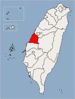
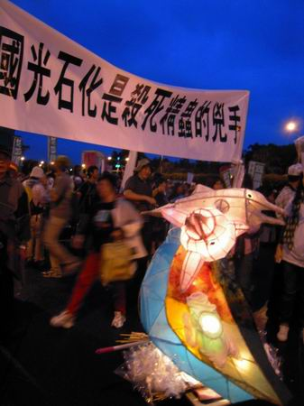
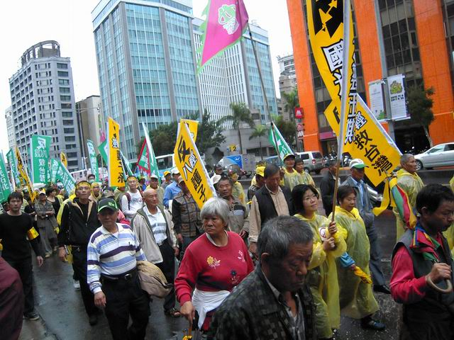

<!-- # ＜对岸观察＞国光石化与公共讨论 -->

**【主编寄语】今天开始《北斗》杂志开辟新栏目“对岸观察”，主要刊登台湾和大陆的大学生以台湾或两岸青年人生活为话题的文章。这一系列的文章聚焦点在台湾，但话题多元，体现在栏目名称的多元解读上：对岸（对对岸本身的）观察、（大陆对）对岸（的）观察、对岸（对大陆的）观察等等。在隔绝的政治、社会和文化体制下，二十一世纪的两岸青年一代需要加强对对方的全方位、深层次的体悟，这对整个中华民族的团结和繁荣具有深远的意义。而这一切，请让我们从阅读对岸、观察对岸开始。如今我们身边的媒体对台湾的报道着眼点往往在政治、经济等宏大层面，不够具体和细致。也许我们知道台湾地区领导人是谁，台湾党派政治的概况，两岸经贸成果喜人，但要问起台湾年轻人上什么网站、关注什么社会议题，他们也有他们的天涯、猫扑吗？他们也有他们的“草泥马”“非主流”吗？这些并非不重要的内容往往却得不到我们主流媒体的关注。北斗希望提供一个平台，为两岸年轻人相互了解架起一座桥梁。

第一期的话题是国光石化、环境问题和公共参与——笔者在台湾交流时台湾大学生中最火爆的一个公共议题。原载于国立清华大学学生刊物《基进笔记》**

**其实这些环境争议和我们学生是息息相关的，和台湾未来产业发展方向与国家竞争力是紧密结合的，由前中油董事（为目前经济部长施颜祥）不断推动的石化产业扩张的政策，有前瞻性可言吗？错误的政策将把国家发展停留在落后的高污染思维，局限、排挤台湾前瞻产业的发展。不断盲目扩增高污染炼油厂，台湾绿色产业发展还有未来吗？**

# 国光石化与公共讨论

## 文 / 黄裕颖（国立清华大学）

### 一、 国光石化是什么？

国光石化是个民间集股公司，将于彰化潮间带填海造陆4000公顷兴建轻油裂解的上中下游整合的离岛工业区。大肆填海将造成潮间带的生态灭绝（那里是台湾最大潮间带）与当地蚵业经济链破坏。

同时，彰化是台湾的鱼米大县，八成鸡蛋、三成的稻米蔬果产自彰化，在台湾粮仓兴建一个高耗水、高耗能、高污染产业，台湾未来的粮食安全令人担忧。石化产业排放的细悬浮粒子PM2.5、挥发性有机物、硫氧化物、戴奥辛等等，简单来说，就是你我以后吃的白米蔬菜水果，未来可能都会遭受污染。

经济学者陈吉仲教授计算（科学资料[http://ppt.cc/bXvp](http://ppt.cc/bXvp)），国光石化预计每年净效益529忆远低超于，从健康风险、农渔业、水资源利用、生态等等，台湾每年将为其付出540亿到1482亿元的外部成本。不值得的交易为什么还要盖？其实，不只是开发案、更是场巧取豪夺的零和游戏。大股东将赚走多数的收益，而污染将成本外部化由地方渔民承受，未来再用微薄的补偿金塞住愤怒居民的嘴；空气污染、环境破坏由全民买单，再以未纳入外部成本的无意义GDP来蒙蔽民众的眼。

其实这些环境争议和我们学生是息息相关的，和台湾未来产业发展方向与国家竞争力是紧密结合的，由前中油董事（为目前经济部长施颜祥）不断推动的石化产业扩张的政策，有前瞻性可言吗？错误的政策将把国家发展停留在落后的高污染思维，局限、排挤台湾前瞻产业的发展。不断盲目扩增高污染炼油厂，台湾绿色产业发展还有未来吗？

### 二、 环境争议与人民参与

谈到环保，环境保护、节能减碳每个人都可琅琅上口，说出点道理来，显然环保思维广为流传，但为什么还会有环境争议与冲突？跟人民参与程度又有什么关系呢？

为了反抗党国政治的高压钳制，80年代台湾社会运动风起云涌，也冲出了台湾自由化的发展，自由化后的下一个阶段就是民主化，后来台湾民主化的进展如何了呢？以下三点就可以由国光石化议题来检视：

#### 1. 资讯不对等、不透明公开：

大城乡的民调显示多数民众赞成国光石化设厂，但国光石化的地方说明会上只有宣扬经济发展、对于健康影响完全不提，问卷内容提到：

「国光石化兴建将带动当地经济发展与繁荣，您同意吗？」

#### 2. 漠视当地人的生活方式：

政府认为养蚵就是落后、不赚钱的行业，唯有开发才是经济发展的唯一选项。殊不知芳苑当地以养蚵著称，访调过程中，许多蚵农表示他们由于当地潮间带营养丰富，常常年收入达上百万，政府以粗暴方式高举经济发展旗帜，完全漠视当地人生活方式的选择权利。

#### 3. 环评审查缺乏独立机制：

目前环评（环境影响评估）都由环保署长选出的环评委员来审查，而环保署长沈世宏是化工博士、更是化工协会（与国光石化关系友好）的下届理事推荐人选，在不避嫌的情况下选出的环评委员，不乏有许多开发至上的开发派委员。再者，环保署直接隶属于行政院，政治施压导致环评粗糙过关案例屡见不鲜。令人无法相信这样的环评能真正为环境把关。

更多荒谬的环评程序、政令宣导等等碍于篇幅、不多著墨。目前能否开发的最终决策权落于环评，而环保署上级机关行政院又同时是政策推手，如此裁判兼球员、便宜行事的官僚作为，人民罔谈决策参与了，连得到第一手的资讯都有困难！

政府未提供管道让人民参与讨论，所以人民不知道重大建设对于自身未来有深远的影响（上述的健康与产业方向），但更重要的是人民对于参与公共议题的想法，常常是漠视与忽略，也代表着放弃自身的权利。从选举期间等待强人统治来领导、拯救台湾的大众想法，可以知道台湾人民心态上从来不觉得自己是国家的主人（同样的，清华学生也很少觉得自己是学校主体），由人民来带领国家政策的真正「民主」实践，显然只是口号。

缺少人民参与讨论、决策的国家，谈不上是民主国家，只能说是个自由的国家罢了。简单来说，当个人行为与财团没有利益冲突都是你的自由，但当有冲突时，倒大楣的就是人民了，如国光石化、相思寮、大埔征收事件等等。

因此，环境议题小组在清大校园推动一系列的活动：国光石化总经理与学生的对谈、环保团体的讲座、印制国光石化议题衣服，希望国光石化能成为一个清大被讨论的议题，借此促发更多对话、讨论的可能。

环境运动作为一种社会运动，最终期许的不外乎是公民社会的早日崛起，在充分、透明公开的资讯下，进行讨论与意见交流的过程，渐渐形成的公民讨论氛围，各方想法都衡量所进行的建设与开发，也将不会有像国光石化如此多的争议。

透过白海豚认股、潮间带体验、白海豚路跑、公听会辩论、清大校内对谈等等活动，社会关注的气氛渐渐成形，公民社会的能量也正在累积着，并在11月13日的环保救国大游行释放，发起更多效应。但社会运动的进行不能只停留在单一案件如国光石化就结束，更重要的是充分讨论、对话的公共氛围，公民社会何时才会到来，我们正期待着。

同时，你，准备好要成为参与公共讨论的公民了吗？

（编辑：陈轩）
