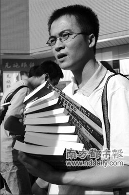

<!-- # 台湾人文社会学科硕士生的一些情况(之一) -->

**“这是很多人心中对于台湾社科界「硕三硕四」满街跑的情况，所会有的想法，包含我一开始进大学的时候也是。然而，当自己逐渐走到这一步，又看到前面很多学长姐的例子之后，才发现到，其实硕三硕四的现象，并不罕见，甚至已经逐渐变成台湾人文社会相关学科领域的情况。”**

# 台湾人文社会学科硕士生的一些情况

## 文/杜宗熹(国立台湾大学)

前言: 2010年8月20日，台湾的立法院通过了所谓的「陆生三法」（大学法、专科学校法、两岸人民关系条例）的修正案。于是，从2011年起，大陆学生除了赴台湾交流和交换之外，终于可以正式的招收陆生，台湾各个大学也摩拳擦掌，准备迎来第一波的陆生。

于是，我想继续写一点文章谈一点台湾高等教育的情况。以前我写过「大学生活在台湾」等系列的文章，不过因为某些因素（主要是因为太忙

+ 懒惰），并没有达成我想要的预定进度，只写了其中的几篇，还有很多东西可以谈。等到「陆生三法」终于通过时，我已经变成一个要准备升上二年级的硕士班研究生。于是，这篇文章我想谈一些以前没有讲过的，除了本科生和学校情况以外的情况。因为我对理工科和博士班的理解有限，我这篇文章的重点，主要在讲台湾人文社会学科相关领域硕士研究生的状况。如果有对岸的同学，将来想要来台湾念广义的人文社会科学领域时，可以先思考一下。

-----------------------------------------------------------------------

「什么，你硕四？」

「怎么你硕士都读这么久？」

「没办法，毕不了业，我目前还在赶我的论文。」

当年我在（新竹）清华念本科的时候，我们人文社会学院（以下简称人文社会学院）有很多的研究所，包含了社会所、历史所、语言所、人类所、哲学所和中文外文等等，于是有很多的研究生。在某些场合，例如研讨会和演讲，甚至是修课的时候，会碰到一些我们学院的硕士研究生。但我在清华的时候，无论从正面或者侧面了解，都会发现一个很可怕的情况，就是硕士班三年级以上的学生很多。

奇怪了，硕士班不是应该要两年毕业吗？怎么现在读这么久？

这是很多人心中对于台湾社科界「硕三硕四」满街跑的情况，所会有的想法，包含我一开始进大学的时候也是。然而，当自己逐渐走到这一步，又看到前面很多学长姐的例子之后，才发现到，其实硕三硕四的现象，并不罕见，甚至已经逐渐变成台湾人文社会相关学科领域的情况。

台湾目前的人文社会类科相关研究生，在硕士班的部分，主要的毕业要求分为修习学分和论文发表两类，每个学校每个研究所会各自有所不同。大致上来说，一般会要求学生要修24-30个左右的学分，然后另外有硕士论文的要求。通常硕士论文也会给学分，但不会算在要修的毕业学分里面。下面简单讲一下学分跟论文的情况，其实每个学校算是大同小异。

不过，很多人会念硕三硕四一个很重要的原因，就是因为硕士班必修这24或者30个学分，其实并不好修。正常来讲，如果以24个学分计算，那就是要修八门3学分的课。然而，在硕士论文撰写的过程当中，不太可能找到这么多跟自己论文有相关的课程，于是这就是困扰的开始。

台湾的人文社会科学研究生教育，跟理工科有很大的不同。理工科学生硕一入学，甚至一考上，在入学之前，大部分的人就已经找好指导教授，进入实验室做实验或工作，有很多人是从升硕士班的暑假就开始做实验。而理工科学生的硕士伦文，多半是实验室或指导教授研究的一部分，也会以团队的形式来运作。我想，这在中国大陆或者美国也是类似的，这个部分比较相同。

台湾的话，一般来说，理工科的老师手上都会有一些国科会计划要做。所以理工科的学生，多半是要帮老师做国科会计划。这有可能会跟自己的研究有关，很多人的硕士论文，就是帮老师做国科会计划的一部分成果，当然，也会有些人的论文跟这个无关。但基本上，受限于器材、经费和老师的专长考虑，台湾的理工科学生硕士论文，多半都是跟老师的计划或多或少有些关系。

不过，人文社会领域就不是如此。台湾的人文社会科学研究生，通常一入学，并不会先找指导教授，系上也不会强迫要求。而且，大部分的人文社会领域的老师，也会希望学生多听、多看、多搜集资料之后，再来决定自己的研究题目和研究方向，建议货比三家，才不会吃亏。因此，在台湾的话，人文社科领域到硕士班二年级以后，才找好指导教授，确立完整的研究题目，是多数的情况。

至于硕士班的一年级学生，主要的工作，多半就是修课，通常也会有一些必修课，必须要先修完。然而，这些课程的要求很繁杂而且困扰。在本科生的阶段，台湾的人文社会领域学生，多半是老师授课，学生听课、学习、抄笔记、考试。虽然台湾的老师会尽可能设计一些活动，包含分组讨论，成果发表，甚至是一些活动如辩论、课外参访等等。但大体上，还是老师高高在上，学生在底下听课，老师授课这件事，在大部分的时候，仍然相当重要。

而到了硕士的阶段，虽然理工科大半还是如此，除了实验以外，上课的部分仍由老师来授课，但人文社会科学的课程，基本上所有的课程都是专题讨论（seminar）的形式，而且都是小班制，很多课不到二十个、甚至不到十个学生。因此，这24个学分的课程，并不是轻松的事情。

最重要的是说，当你在本科生的阶段，包含人文社会学科也是，基本上，读书是读「熟书」。也就是说，老师教过的，才回去读。上课虽然老师会鼓励同学发言，但基本上是基于自己的意见，而不是基于文献或资料。在台湾，除了少数特别用功的人之外，大部分的学生多半只有复习（有的人搞不好连复习都没复习），不太会去预习，每周都会课前预习的人，更是少之又少。

不过，到了硕士班的阶段，因为是seminar又是小班教学，老师多半讲话的时间会不到一半，甚至都不讲话，就放任学生自己讨论。因此，同学之间彼此互相讨论、经营、每周的主持人带读，就成为很重要的功课。基本上，每个人都逃不过发言的机会，而且每个礼拜都要有人（有时是一次两个人）负责带领整个三小时的课程讨论。老师只有在必要时，才会加入，或者说明一些大家搞错的部分。

(编辑：陈轩)
