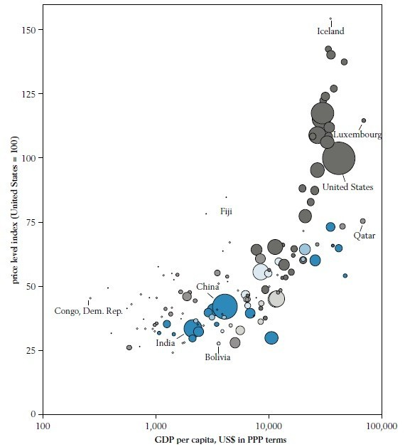

<!-- # 靠点儿谱（一）——中国物价真的超过美国了吗？ -->

**那么，用什么来比较中美物价呢？我很纳闷，在众多讨论中，没有看到一个人提到“购买力平价”

(Purchasing power parity，简称PPP)，即在不同国家购买同样一篮子商品所需要的当地货币的比例。用PPP除以货币汇率，就可以得到不同国家的相对物价。当然，考虑到各国生活水平、消费习惯和商品质量的不同，这里的“同样一篮子”只能是理论上的，但研究机构计算的PPP，毕竟要比个人凭印象的价格比较要严谨。”**

# 中国物价真的超过美国了吗？

## 文/西洪柿（The Pennsylvania State University)

中美物价对比一直是网络上的热门话题。随着近来的通货膨胀，这一话题有愈演愈烈之趋势。除了网上留学生常有的议论，新闻媒体（如凤凰周刊《[美国物价为什么比中国便宜》）](http://www.ohmymedia.info/%e5%87%a4%e5%87%b0%e5%91%a8%e5%88%8a%ef%bc%9a%e7%be%8e%e5%9b%bd%e7%89%a9%e4%bb%b7%e4%b8%ba%e4%bb%80%e4%b9%88%e6%af%94%e4%b8%ad%e5%9b%bd%e4%be%bf%e5%ae%9c.html)和经济学家（如[郎咸平](http://my.icxo.com/244207/viewspace-1278276.html)、[聂辉华](http://www.china-week.com/html/5766.htm)等）也纷纷加入进来。将这一话题推向高潮的，是博客“白板报”作者王佩的[调查](http://www.baibanbao.net/wp/3758)。他在博客中写道，“最近一段时期以来，一直有一种说法：中国物价比美国都贵。为了验证这种说法，我与在美国的好朋友[纳纳](http://nana.blog.paowang.net/)一起，决定联手做一次实地调查。”他的最初成果是这里的[表格](http://www.flickr.com/photos/lookoo/5267711210/)和这样的结论：从这张中美物价比较图中可以看出，波士顿和杭州的物价各有高低，杭州蔬菜较为便宜，但在肉蛋奶的价格杭州已全面领先。

这一草根调查结果，先是登上了[华尔街时报](http://blogs.wsj.com/chinarealtime/2010/12/21/china-more-expensive-than-the-us/)，而后惊动了[政府](http://news.66wz.com/system/2010/12/23/102298365.shtml)：

“杭州市物价局价格监测中心副主任周一东表示，网友“王佩”的调查结果仅仅是其个人消费过程中的数据采集，也是一种个人行为，其参考价值有限。”

“周一东认为，调查结果缺乏科学性、全面性。‘首先表现在采集品种不多，文中的品种并非是老百姓消费最多的，且表中杭州粮食等价格明显较高，比如表中杭州大米是4.33元，但这应该是比较高档的大米了，平时百姓消费最多的还是2块多点的。’周一东说。”

不得不说，这位物价局副主任的表态挺正确，想得出美国生活成本比中国低的结论，不是简单列举几个商品价格就够的。上面提到的几篇文章，都有多多少少的问题。

首先，不能任意选择商品来进行比较。看到凤凰周刊文章中赫然写道“猪肝、猪心、猪脚、骨头之类，每磅价格都在0.50－0.99美元之间”，我就笑了。故意选这些美国人不吃的东西，能说明什么问题呢？美国比中国贵，甚至贵得离谱的东西不是没有，比如AT&T简简单单的手机充电器卖30美元，我的伊朗同学Farid在State College理发店花18美元理的发，不如花5块钱寻任何一个北京小理发店师傅的手艺，甚至比不上小熊给我理的水平。

其次，经常被拿来证明美国物价低于中国的LV包包、品牌冲锋衣、阿玛尼西服、宝马Z4在中国都属于奢侈品，定价高属于一种营销策略。且这些奢侈品在中国普通居民的消费中权重极小，对生活成本影响不大。

第三，就像物价局副主任所说的，王佩的调查没有考虑质量因素。同样是大米，质量不同，价格差异会很大。

这些问题都可以归结到一点：生活成本的比较，重要的是选定合适的“商品篮子”。我相信王佩的调查比凤凰周刊的记者和郎咸平认真得多（郎竟然信口开河说中国麦当劳和美国价格差不多，让我怀疑他是否大驾光临过美国的麦当劳），但他依靠个人能力的调查注定不够全面和准确。

那么，用什么来比较中美物价呢？我很纳闷，在众多讨论中，没有看到一个人提到“购买力平价”

([Purchasing power parity，简称PPP](http://en.wikipedia.org/wiki/Purchasing_power_parity))，即在不同国家购买同样一篮子商品所需要的当地货币的比例。用PPP除以货币汇率，就可以得到不同国家的相对物价。当然，考虑到各国生活水平、消费习惯和商品质量的不同，这里的“同样一篮子”只能是理论上的，但研究机构计算的PPP，毕竟要比个人凭印象的价格比较要严谨。下面是世界银行2005年国际比较项目（International Comparison Program，简称ICP）调查得到的全球相对物价图。图中横轴是以PPP衡量的人均实际GDP，纵轴是相对美国的物价（美国为100），圆圈的相对大小表示该国GDP的大小。可以看到，相对物价和人均GDP成正比。这是所谓巴拉萨效应的缘故：发达国家的人均生产率高，故劳力成本高，不可贸易品和服务业价格高，使整体物价高于发展中国家。从途中也可以看到，中国2005年的相对物价只是美国的40%，考虑到2005年至今人民币升值了约20%，物价上涨15%，中国目前的相对物价大概还只是美国的一半多一点。如果单列出消费品物价，可能中国相对美国的物价还要更低一点（因为构成消费品的有更多不可贸易品）。

如果信不过需要繁琐计算的PPP，我们有另外一个相对物价指标：《经济学人》主持的[麦当劳巨无霸汉堡指数](http://www.economist.com/markets/bigmac/about.cfm)。数据显示，2010年7月22日中国Big Mac的价格折合1.95美元，在有统计的120个国家中是第四便宜的，相对美国的3.54美元是一半多一点。考虑到中国还有很多居民去不起麦记，也就是说麦当劳汉堡还具有一定奢侈品性质，它在中国的价格可能偏高，这个麦当劳指数只会高估而不是低估中国的物价。

最后想说的是，旁观中美物价讨论，不得不同意[@guodaxia](http://twitter.com/guodaxia)在Twitter上所说的，

“@wangpei的调查一出来，跟上一个郎咸平式的解读是多么顺理成章。公众多么愿意接受。而要给出一个更严肃的解释是多么难。”

也许根本的原因在于，在政府公信力下降的情况下，相对于统计局发布的物价指数，大众更愿意相信自己对生活品质下降的体验，以及对“美国天堂”的想象。面对这样的局面，政府更应该负起解释统计数据的责任。我很高兴看到这篇统计局于11月30日发表的[《我国居民消费价格指数（CPI）是如何调查和生成的》](http://www.stats.gov.cn/tjzs/t20101130_402686954.htm)，还在统计局网站上看到了这个介绍中国CPI统计的[视频](http://www.stats.gov.cn/was40/gjtjj_detail.jsp?searchword=CPI&channelid=6697&record=15)，但这些努力，相对于美国劳动统计局（美国统计CPI的政府机构）来说还不够。关于两国对CPI统计过程的公开和普及说明方面的比较，我会在[《美国如何公布消费物价指数》](http://kaoputive.org/?p=12749)中进一步说明。

作者简介：本期<天玑·连载>一共有三位作者，但都来自同一个博客

“[靠点儿谱](http://kaoputive.org/?p=12733)”。

（编辑：刘一舟）
