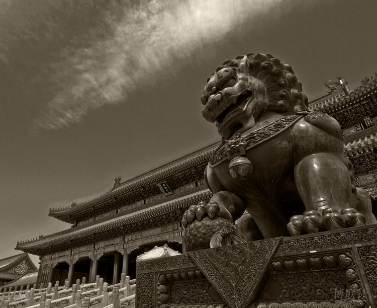

<!-- # 自《宫》处谈起 ——警惕买椟还珠，提防还珠卖毒 -->

**“在各种古装剧的轮番轰炸之下，我们的青年渐渐形成了自己的历史观。他们当然知道历史上大明湖畔没有夏雨荷，纪晓岚未必那么聪明，康熙的八阿哥也不会那么弱智，但他们一定会觉得，康熙乾隆是和蔼可亲的好皇帝，就算没有电视里描述的那么好，也差不到哪里去吧？”**

# 自《宫》处谈起 ——警惕买椟还珠，提防还珠卖毒

## 沐风（山东大学）

打算写这篇文章很久了，要说还得感谢芒果台对《还珠格格》的执著，让我对这类瞎编帝王戏有了越来越深入的关注。今年寒假芒果台没有延续传奇，倒是又推出一部清宫戏，干脆直接叫《宫》，还结合了最时髦的穿越元素。不管你鄙夷也好讽刺也罢，这部戏又一次在大家“天雷滚滚”的嘲笑声中收视率节节攀升，赚取了足够的眼球。

其实，我对做娱乐敢为天下先的芒果台不乏好感，但对这些辫子戏已经越来越不能忍了。不因为那些肉麻到恶心的对白，不因为那些俗套到弱智的情节，更不因为本故事纯属扯淡若有史实纯属巧合，这些都是编导们的创作自由以及市场需要。我无法忍受的是，在这些清宫戏里潜在的封建专制思想如此浓郁，对皇权的膜拜、对“明君”的妄想主导着编剧的思维，也在潜移默化地影响着收看电视的小孩子。

清宫戏在荧屏上实在风光，有句话说，1644年清军入关，从此对中国的电视剧事业做出了卓越贡献。鄙人如今大四老男人一枚，也年轻过，也喜欢过那些火爆一时的电视剧。央视热播的《雍正王朝》、《康熙王朝》，俺作为小屁孩，曾经热血沸腾地守望过；红遍大江南北的《还珠格格》，俺一开始是跟着家里人不得不看，后来自己也津津有味地看了起来；风靡一时的《铁齿铜牙纪晓岚》等等，俺也跟着一家人看得其乐融融，捧腹不止。

在这些古装剧里，那些打着“正说”旗号公然为帝王唱赞歌的王朝戏，已经为许多人所诟病。在下却觉得，那些戏说剧同样不能掉以轻心。封建思想遗毒最烈的，当属绵里藏针的《还珠格格》！

不管你是否曾经喜欢过，可能都免不了轻蔑一笑，觉得我小题大作了，且容在下慢慢分析。伟大的琼瑶阿姨，在《还》剧里建构起一种剧情模式，我称之为“还珠”模式：故事的背景是锦衣玉食的显赫之家，有一位保守、严厉、易信谗言而又慈祥体贴的一家之长——皇上，在他身边潜伏着正反侍臣，主人公们则是家族里一群敢爱敢恨、叛逆不羁的好青年，在反派的挑拨离间下，他们常常被误解，屡屡遭磨难，为了爱情折腾得死去活来。这种情节的主题本是追求自由，当然没什么问题，问题出在矛盾的解决上。不管那位一家之长曾经如何严厉，最后必然露出了慈祥的笑脸，查明了真相惩罚了奸佞理解了好青年成全了好姻缘，皆大欢喜。而这位内柔外刚的好君主、好爸爸，恰恰符合了中国人对于当权者最美好的憧憬，通过结局的大团圆，一位深明大义的慈祥领袖深深镌刻在观众的心里，大家热泪盈眶地表示吾皇万岁万万岁。

你会说，电视剧仅仅是娱乐而已，不值得口诛笔伐。令人忧心的是，跳出荧屏，我们的教育实在是烂得可以。拿历史来说，由于中学一切为高考服务，大部分学生选择理科，造就了可观的一批历史白痴；这还未必是坏事，因为学历史的，也未必能——准确说是肯定不能——树立起正确的历史观，为高考服务的历史课也远不能具体阐释那些数不尽的历史人物。这就让中国青年的大脑中出现了一片广阔的“历史真空”，即便是理科高考状元，也说不定对历史所知甚少。那由什么来填补这一空白呢？古装剧粉墨登场，向广大青年投来了含情脉脉的目光。

当然，任何一个有智商的好青年都清楚，电视里说的不是真的。但真正的历史是什么？他们又不知道。在各种古装剧的轮番轰炸之下，我们的青年渐渐形成了自己的历史观。他们当然知道历史上大明湖畔没有夏雨荷，纪晓岚未必那么聪明，康熙的八阿哥也不会那么弱智，但他们一定会觉得，康熙乾隆是和蔼可亲的好皇帝，就算没有电视里描述的那么好，也差不到哪里去吧？

他们不会知道，荧屏里温情无限的康雍乾三帝，残暴起来岂是容嬷嬷比得了的？仅文字狱一项就足以把这些帝王钉在历史的耻辱柱上。尤其是最为观众津津乐道的乾隆，已经到了丧心病狂的地步，“胡中藻案”、“《字贯》案”、“尹嘉铨案”、“沈德潜案”等等，因言获罪的缘由都十分荒唐，活着的满门抄斩，死了的开棺戮尸，令人发指。

在下仇恨满清吗？非也非也。我是对所有的皇帝都没有好感。真正理性的历史观，会让你对极权体制下的任何最高统治者都保持距离，审慎地看待他们头上的一切光环。不论他是不是“明君”甚至“千古一帝”，不论他有着怎样的历史贡献，你要清楚的是，他们所做的一切都不过是为了一姓之朝的长治久安，不值得现代社会的公民们去热情洋溢地歌颂。现实恰恰相反，二十一世纪的中国人，却仍然津津乐道于各种“帝王戏”，不能不令人悲哀。

鲁迅先生把中国历史分成做稳了奴隶和欲做奴隶而不得的时代，鞭辟入里。至今我们老百姓依然是明君治下死，做鬼也幸福。不是么？当下，古代帝王就是任人打扮的小姑娘，编导们无不将其打扮得魅力无限，而且还大受欢迎，分明可以看出大家对明君的喜爱和期盼。其实，人没有那么贱，我们并非向往被权力奴役，而是向往权力本身，只是得不到而求其次，才向往仁爱的掌权者罢了。对权力的顶礼膜拜，使当权者在群众心里有了一种天然的好感，而一旦把当权者披上善良仁义、爱民如子的面纱，人们就再也不会去追究体制的弊端，只剩下对贤君慈父的歌颂了。

跳出古装剧，你会发现这种“还珠”模式岂止存在清宫戏，差不多这是所有青春偶像剧的套路！不论时间是古代还是现代，不论发生在皇宫还是都市、校园，不管男主角是五阿哥尔康还是道明寺慕容云海，必然出身高贵、家世煊赫，女主角天真烂漫、讨人欢喜，而在他们之上总有家族的权威，直接决定这些青年的命运，最后也成全了大团圆。且不说剧中的奢华渗透出对富贵与权力的向往，这种“人治”思想本就是几千年来中国人的顽疾，如今被编导们不经意间或不怀好意地带进电视剧里，也灌输给了茁壮成长的祖国花朵们，终有一天，他们也会发现身边的“皇阿玛”，那时，他们也会习惯于苦苦哀求摇尾乞怜么？这种看似生生不息的剧本创作，只会令真正艺术表达从自由到自宫，沦为《宫》一般的儿戏。但愿不会。

相较之下，民主观念的传播，举步维艰。转瞬间，辛亥革命已经过去一百年了。有人说，辛亥革命的意义不大，只不过革去了一条小辫子；也有人说，辛亥革命推翻了帝制，之后的两次复辟成了两次闹剧，和法国这类反复折腾的国家相比，已经功莫大焉。后者评论确实中肯，但革去现实的皇帝尚且不易，革去心中的皇帝，更是难上加难。中国经历了两千年帝制，现实环境又不言而喻，如此情况要把某些传统观念在百姓中纠正过来，绝不是一朝一夕之功，而需要一点一滴的积累。比如面对荧屏里那些风光无限的皇帝们，我们是不是也要来一次“辛亥革命”？

电视剧，当然不过是百姓生活闲暇之娱乐品，但嬉笑怒骂中也是渗透着不同的观念。皇帝戏少一些，“人治”的戏少一些，封建思想的遗毒就少一些。对于选择娱乐，我们不但要警惕买椟还珠般的没有眼光，还应提防“还珠”模式的“卖毒”，此时此刻的每一小步，都可能在不经意间，造就历史的一大步。

### 【附】

题目为编者所拟，原题目为“荧屏里也需要‘辛亥革命’”。

推荐阅读：<玉衡•艺林>留将功罪后人论[（上）、（中）、（完结篇）。](/?p=2328)

(编辑：黄理罡）
