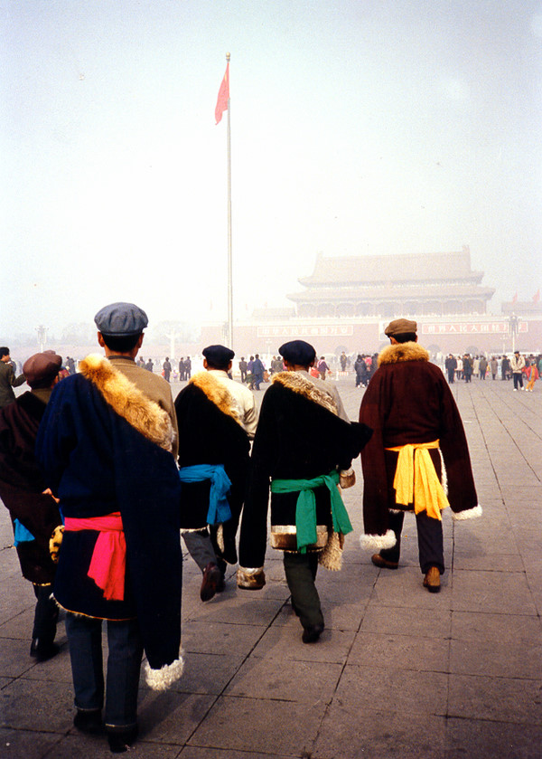

<!-- # ＜开阳＞中国“稳定”的根源——皇权社会、官僚专制与小农意识的三位一体 -->

**其中比较突出的就是我国浏览量最大的思想类网站“乌有之乡”。这个网站基本的想法就是指望领导层有一天突然觉醒，全面恢复改革开放前的政治经济体制，所以他们被称为“左转派”。他们中既有高调维稳，甚至已经被他们抛弃的司马南之流，也有主张大民主的张宏良。而就是这位张宏良，仍然坚称：“皇权成为民众抗衡官权的天然依靠力量”，说什么“失去皇权中心的民众比任何时期都更加悲惨”。**

# 中国“稳定”的根源

# ——皇权社会、官僚专制与小农意识的三位一体

## 文/陆遥遥 ( 北斗撰稿人\)

序

再过几天，又要开始跑“两会”了。这是笔者第三次参加相关活动的报道。回想起2008年的“两会”，那时候当局第一次向少数央媒之外的广大媒体开放分组讨论会，并在分组讨论后由媒体比较自由地采访地方首长或人大代表。事实上，大部分人大代表本身就是各级地方首长，或官方背景的知识分子、演艺人士等。

当时，刚入行的我，尚由衷期待“新政”，以为漫长的等待终于迎来东天曙光。现在想来，I was too simple sometimes naive。

2010年，也就是去年的“两会”，亲睹封疆大吏怒夺女记者录音笔的壮举，加之仔细阅读内阁及各部的各项政策宣示，结合自己的生活经验并工作心得，终于明白，大戏演不下去了。于是转战文场，想要“启蒙”。迩来一年了。

期间，余人的想法也在不断改变。有时候影响别人，有时候又被人影响。但基本的两点——一是想要移风易俗，改造国家；二是坚信民主不仅是进步的手段，且是进步的目的之一，实现民主正是进步本身，始终也没有改变。

期间，和友人交谈，与很多论敌舌战，到很多地方考察，基本形成了一套自己对当代中国的认识和理解。诚如笔者反复说的，既要看问题，也要学主义。最后在友人的鼓励下，决定系统地倾吐出自己的看法，为抛引玉之砖。

一、认识中国

甲、农民性革命的历史遗产

今天的中国，除台湾等少数地方外，都不同程度地继承着上世纪初至50年代，国民党、共产党先后领导的暴风骤雨式革命的遗产。其表现为；革命时期的意识形态，现在仍在一部分人群中发挥巨大影响；革命后形成的权力格局，至今没有重大变更——具体体现为，至今仍有很多（甚至可以说大部分）干部就是当年革命者的后代，或者他们指定的接班人。所以解释当代中国，就必须从理解那次大革命说起。

很多反体制人士也非常清楚这点，所以他们往往以否定革命开始构建自己的反体制合法性。而具体否定多少什么程度，是连辛亥革命都要抹杀，只允许改良不允许革命呢？还是只反对中共，而承认国民党领导的革命——包括历次起义、北伐、抗日、甚至“戡乱”的正义性呢？这些因人而异。但最大的公约数，无疑是对中共领导的两次国内革命战争的否定。

在否定者口中，以毛泽东为代表的一代中共领袖，都是狡黠、刻薄、贪婪的农民，他们的历史作用也丝毫不比千数百年前的赤眉、黄巾先进。

对此，笔者深切不能认同。一代优秀的青年知识分子包括毛泽东、周恩来，在举国沉睡之时，他们率先觉醒，组建社团，致力启蒙。他们中的很多人，留日、留数、留法、留英、留美，很难相信他们就是些“长毛发匪”。读他们的著作则可以感受他们的见识、胸襟、抱负远远超过了那时以及现在的农民阶层。通过一些民国人士的回忆，我们可以感受非常鲜明的早期共产党人形象，如李宗仁回忆，“他们都勤劳刻苦，热情洋溢……我对他们的任事作风是很佩服的。”李宗仁回忆毛泽东道：“毛氏那时任国民党中央党部所办的农民讲习所所长，并曾担任短时期的国民党中央宣传部代理部长。长得身材高大，肥头大耳。在议会席上发言不多，但每逢发言，总是斩钉截铁，有条不紊，给我印象很深，觉得这位共产党很不平凡。”

反观近年来，很多人不要说对连毛泽东人格、品格加以否认，就连其的身高也要质疑，说什么“毛泽东的身高应在1.72米左右，最高不会超过1.73米。”其历史视野及其方法论，未免太下作了。

五四时候，爱国学生们提出“外争国权，内惩国贼”的口号。而经过包括国民党、共产党在内的很多中国先辈前贤的奋斗，民族自立已经完全实现。这不能不说是那个伟大革命的成就。

近年来又有人大谈什么五四时火烧赵家楼乃侵犯物权的行为，真是腐儒蠢见，你们该醒醒了。

在认同伟大革命的同时，不能不指出，其所具有的巨大农民性，这也是今天很多问题的远因。邓晓芒教授说：“中国是一个农业国，这不仅是指农民人口众多而言，而且是指农民意识渗透于整个社会各阶层、包括知识分子的头脑中而言。”所以中国的社会变动，往往根源于农民“盼望一个‘真龙天子’和‘明君’来统治他们的普遍心理定式。”在这种心理定式之下，只反贪官不反皇帝，成了民族永恒的伤痛。人们习惯奉旨造反，习惯跟随官府抑制好抢。除非出现新的救星式人物，人民难免永久匍匐在旧王朝的脚下。这种救星式的人物，一要确实给人民带来实惠，二则往往要比皇帝更皇帝，更具有专制的手腕和魄力。

邓晓芒接着说：“四十年代开始、五十年代全面铺开的对知识分子的‘思想改造’，从本质上说就是使知识分子接受农民意识的改造；而绝大部分知识分子心悦诚服地接受这种改造，也正说明他们骨子里本来就流淌着农民的血脉。”

这种意识形态领域的农民思想时至今日仍然强烈地影响甚至控制着中国知识分子的灵魂。民族主义知识分子自不待言，新儒家、新左派仍有很多人引颈期盼明君出而海内清。虽然他们期望的明君未必是同一个脸谱。但拥有强权，自上而下地行政，确是其被期待共同点。

其中比较突出的就是我国浏览量最大的思想类网站“乌有之乡”。这个网站基本的想法就是指望领导层有一天突然觉醒，全面恢复改革开放前的政治经济体制，所以他们被称为“左转派”。他们中既有高调维稳，甚至已经被他们抛弃的司马南之流，也有主张大民主的张宏良。而就是这位张宏良，仍然坚称：“皇权成为民众抗衡官权的天然依靠力量”，说什么“失去皇权中心的民众比任何时期都更加悲惨”。因而要求中国老百姓“能够把国家利益放在第一位，甚至在杀自己的问题上同样（能够）把国家利益放在第一位。”要求人民对那些虽然镇压和屠杀人民的侩子手，但却也维护了国家的统一和安定的，“真诚地歌颂他们纪念他们”。张宏良称之为“中国老百姓的民族大义”。他们的农民本质，难道还不鲜明？所以“乌有之乡”现象并不偶然，它反映了当代意识形态格局的一角，它就是由一些马列毛主义的知识分子参与的，主要体现了中国传统农民思想（特别是政治层面）的网络论坛。

大规模革命的农民性更集中体现为其所建立的权力的封建性。我们可以惊人地发现，毛泽东、蒋中正，莫不是生杀予夺、大权独揽，莫不是党、政、军、财、法一把抓的人物。不同之处仅在于，毛泽东搞政敌主要通过挑动群众奉旨造反斗杀，蒋中正则通过情报机关暗杀；毛泽东枉法通过砸烂公检法，蒋中正枉法通过干涉一些他认为需要干涉的司法个案。当然毛泽东的专断程度，远较蒋中正为高。

到今天，台湾的进步不能以道里计。大陆也确实进步了。独裁已经终止，民权也到的一定程度的张扬。但是核心的部分，即最高权力对国家的全面垄断，凌驾在社会上，不受限制方面，仍然和传统皇权无二。虽然最高权力的构成和运作存在协商和一定的限制。

学界称我国为官本位国家。这种官本位六十多年来一直没有大的改变。虽然其推行的经济路线多经波折，但社会运行的骨架，如政治决定经济，中央集权，上级决定下级，官员决定一切，一言以蔽之权力尤其是最高权力决定一切则基本没变。笔者以为，这就是中国问题的根源所在了。

毛泽东并不是没有意识到这个问题。他在去世那年发布的非常重要的中共中央1976年4号文件中说：“老同志思想还停止在资产阶级民主革命阶段”。“一部分党员却不想前进了，有些人后退了，反对革命了。为什么呢?作了大官了，要保护大官们的利益。他们有了好房子，有汽车，薪水高，还有服务员，比资本家还厉害。社会主义革命革到自己头上了，合作化时党内就有人反对，批资产阶级法权他们有反感。搞社会主义革命，不知道资产阶级在哪里，就在共产党内，党内走资本主义道路的当权派。走资派还在走。

”

这些提法就使得毛泽东的想法大大超越了钦定的“毛泽东思想”的范畴。于是人们称之为“毛主义”。毛主义到底意味着什么，这个问题笔者长期思考，迄今没有得出答案。

对上引文件中的那段话，首先我们可以发现其否定打天下者及其子弟坐江山封建思想的进步一面。虽然这种思想至今仍然流行于上流社会。毛泽东的确反对它，他谈汉献帝，谈“触龙说赵太后”、谈“君子之泽五世而斩”的很多谈话可以为证。但所谓已经过去的资产阶级民主革命，笔者以为毛泽东始终没弄明白。因为按照常理，资产阶级民主革命，必然要产生资本主义民主的上层建筑，人民也能够享受资本主义的人权。而现实是，中国人从来没有享受过。于是由此推导出下一步社会主义革命的必要性，不能不令人怀疑。

对于毛主义横扫一切的“文革”，以知青的身份参与“文革”的邓晓芒教授说： 1966年，“文革”之风也吹到了我们下放的边远山区。现在想来，当时所提出的那些口号也的确迎合了我们这些在底层受压抑的知识青年的逆反心理。“造反有理”似乎真的是横扫一切社会不平等的战无不胜的“金箍棒”，几千个知青把个小小的江永县城闹了个底朝天。我们似乎体会到，毛主席和中央文革的确是站在我们一边与那些平时不可一世作威作福的官僚资产阶级在作斗争，一个普遍民主和平等的社会即将到来。可以想见，我们当时的个人崇拜已经达到了近乎疯狂的程度。然而，与小知识分子对“文革”的“巴黎公社”式的理解不同，广大农民则勾起了27年大革命、农民运动的回忆，“一切权力归贫下中农协会！”他们也自认为有毛主席给他们撑腰，有“阶级路线”和“无产阶级专政”给他们指方向。于是1949年以来为了设置对立面而保留下来的地、富、反、坏和他们的子女，在道县和江永一带的大屠杀中被“贫下中农革命法庭”彻底斩草除根，潇江河水为之堵塞。1967年夏天，几乎全体江永知青都亡命回城，直到1968年，在“最新最高指示”的软硬兼施下，我们才“返回原地抓革命促生产”。但很快，我们这一小撮知青就成为了运动整肃的对象，整肃的现成的理由就是出身不好，妄想变天。我逐渐悟到，本来就是“奉旨造反”的这种虚假的“民主”，也只可能成为被当权者所临时利用的工具，一旦利用价值消失，不可避免的就是被牺牲和被抛弃的命运。

对邓教授的话语，我们至少有两点可以思考。第一，地富反坏右的子女被留下来，被解释为“为了设置对立面”是否太过有罪推定？第二，“文革”早期造反者被赶下历史舞台，毛泽东强调老干部、三结合，究竟是一整套以卸磨杀驴为最终目的的精密计划，还是最终害怕革命革到自己头上，还是害怕真的天下大乱？

在此笔者以为应该听听毛泽东自己的说法，他在1967年对阿尔巴尼亚的一个访华团说：“本来想在知识分子中培养一些接班人，现在看来很不理想。在我看来，知识分子包括仍在学校接受教育的青年知识分子，从党内到党外，世界观基本上还是资产阶级的。因为解放十七年来，文化教育是修正主义把持了，所谓资产阶级思想溶化在他们的血液中。所以要革命的知识分子，必须在两个阶级、两条道路、两条路线斗争的关键阶段，很好地改造世界观，否则就走向革命的反面。”究竟毛泽东是真有一条他认为的革命路线，凡是符合这条路线的人，就对他们公而忘私，不计个人地提拔、支持？还是毛只是用人打击政敌，巩固自己的权势？还是两者兼而有之，互相混杂？这个问题还需思考。

但不管怎样，那种恩格斯论及的“锡利亚式的狂想”——即在一个“圣人”治下的平均主义。这种平均不仅指财产平均，而且是思想平均、知识平均，甚至取消一切社会分工——既不可能实现，又在其过程中必然出现暴政和杀戮，应该到了全面否定的时候了。也就是说“乌有之乡”所代表的一群至今仍在寄希望于党内某些人物，想要“一声令下，我们就杀汉奸，杀精英，保国家”的人们及其意识形态，可以说完全背离了中国的需要，对民族有百害而无一利。

结论就是：中国社会问题的根源，在于皇权式的，官本位的社会骨架至今存在，在于包括笔者在内的知识分子尚没有洗干净身上的农民（甚至是农奴）意识。而只要皇权社会持续，农民意识就会存在；农民意识长期存在，皇权社会就会持续。这又是鸡生蛋蛋生鸡的问题。所以说：一个像中国这样的大国的进步，需要一个相当长的过程。既要有社会规模的，疾风骤雨式的市民运动，又要有水滴石穿似的个人的人格完善。这都是不可偏废的。

(责编：陈轩）
