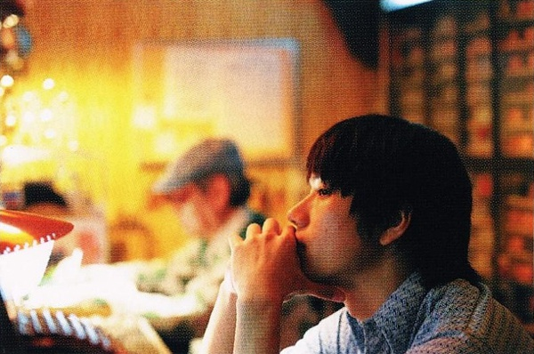

<!-- # ＜摇光＞继韩寒的话谈小三问题 -->

**如果你再不知道你能在一个女人身上找到什么，那么你只能在一个一个异性中间流连，不知道自己到底要什么，被贴上滥情或者不定性的标签，实际上就是不善于和异性交际沟通，没有在一段感情里审视自我，在感情里一次一次的自我的迷失。这种情况下，就算有小三，小四，也不会有人分得清他爱的是谁，看上去他谎言连篇，但是实际上他把自己都骗的团团转。**

# 继韩寒的话谈小三问题

## 文/朝夕（北斗资深撰稿人）

小三问题本质上不是个道德问题，这一点我基本同意，而很多三角关系中，男性的渣并非渣在道德上，而是一种对感情的懵懂。每个二十岁左右的年轻人都应该有一段始乱终弃或被始乱终弃的历史，否则他不会知道自己在感情里想要什么，这段历史来的越晚，他就成熟的越晚。第一个遇到自己真正合适的人的概率非常低，更不用提什么初恋即真爱，都是屁话。

很多男人难以启齿的是，我和你在一起想要的是性，其他的不很重要，你不会打球，不会打游戏，不懂学术经典，我完全可以找一个同性朋友做其他任何事，年轻的时候性和爱一样神圣和神秘，但是很快他们就能分清楚了，在第一次从一个女人的床上爬起来以后。但是并不代表这个女孩不好，因为男孩儿在性上面花费的精力太多了，我们看《朱诺》里的两个小孩，是从女生怀孕之后两个人才审视他们的关系并且认真谈感情的。

可是在同一段关系中，这种机会少之甚少，那怎么办？收拾收拾行装，找下一个人去，如果你再不知道你能在一个女人身上找到什么，那么你只能在一个一个异性中间流连，不知道自己到底要什么，被贴上滥情或者不定性的标签，实际上就是不善于和异性交际沟通，没有在一段感情里审视自我，在感情里一次一次的自我的迷失。这种情况下，就算有小三，小四，也不会有人分得清他爱的是谁，看上去他谎言连篇，但是实际上他把自己都骗的团团转。

那么没有迷失自我就不会出现第三者了吗？当然不是，每个男人都想有一个后宫，一

个超完美无差错全能女人根本无法抵挡一个后宫的诱惑，对女人来说也一样，你是愿意要几个性格魅力各有特色的男人，还是要一个完人英雄？但是，我深信一个人的自我越明确，后宫深度就越差，像《悲观主义的花朵》里描述的那样，男主角陈飞喜欢的女人大抵是一个类型，只不过在文艺圈混，同类型的女性也容易聚集。

有的时候第三人是比较善意的存在，我喜欢《纵横四海》的结局，红姑没办法和热爱自由的发哥在一起，但是哥哥是温暖的好男人，折中一下三人行，是真正的齐人之福，也有必须做出选择的，《老友记》看到最后其实很伤感的，美国人或许没有你想象的那么开放，因为十年的感情和对孩子的责任，Rachel和Joey没有在一起我其实很难过，但是Chandler 夫妇说要给Joey一间房间，大家永远住在一起，不啻为一种小小的安慰。

这种情形你在中国是没办法想象的，你想，两个斗鸡一样的男人或女人在不计代价的争夺一个游移不定的人的注意力，有的是为了维护在家庭中的地位，有的是为了金钱，有的是为了性，这一点我觉得中国人比外国人开放的多。大多数的小三问题只是一个经济问题，是一个财产分配问题，哪怕不涉及钱，同样是一个男权社会中女人想得到地位的认同的问题，而最怕的是男性是那种自我没有开化的人，看似谎言连篇，实为自我割裂，甚至处于绝对混沌的状态，更不存在为爱走天涯，爱美人不爱江山这种神话，如果第三者的问题首先定位于爱情和自由的话，中国大多数第三者问题就都是伪问题了。

（采编：乔淼；责编：陈轩）
