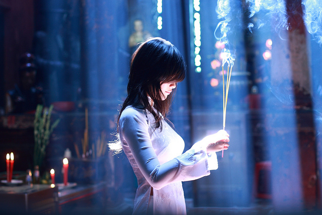

<!-- # 为嘛要宽容日本？ -->

`**“时间一长，什么仇恨、正义都自然而然的化解了，如果某种仇恨能持续一百年以上，那一定是靠着某种神话和幻想维持的。历史上再坏的人最终留在史册中的形象也就是一个负面的教育角色而已，千年以后，当后人们在读史书的时候看到那些罪大恶极的名字不会再产生一种仇恨的情绪。”**`

# 为嘛要宽容日本？

## 文/宋京逵(中国人民大学)

在那些对日本地震幸灾乐祸的国人眼里，历史必需自身展现为有意义和道义的。因果循环、善恶到头终有报，都应内在于历史的发展之中。结合当年战后的结果，有太多的侵华日军没有得到他们应得的业果，有太多的中国人的冤死没有得到正义的伸张，日本人必需为此付出代价。但麻烦的是，战争已经结束了，侵华的日本老兵也都快死光了。为了延续历史的道义，不让抗战中的国人白死，那些抗日青年们就必须坚信这样一种信条，即父债子偿，也就是把全部日本人、几代的日本人拟制为一个整体，即历史性的日本民族，日本民族为日本民族负责、还债，这样一来就解决了复仇对象的模糊性的问题了。

抗日青年们的这种对历史的理解是完全没有问题的，甚至对历史的这种理解对人类文明来说是有益的。而且也没有什么力量能阻止他们这样去理解历史，阻止他们去建立这样的“意义-世界”。

想要反驳抗日青年们的观念，跟他们讲逻辑、摆事实是没有用处的。因为这涉及到对整个历史和世界的理解问题。这压根儿就不是父债子偿有多么荒谬的问题、也不是对人类的灾难幸灾乐祸有多不人性的问题。因此，反驳抗日青年的观念最好的方法就是，建立另外一种“意义-世界”去取代抗日青年们的“意义-世界”。这是亲日青年们的急迫任务。

这一新的“意义-世界”就是现代性的、启蒙主义的、人道主义的“意义-世界”。具体来说也就是靠博爱来化解仇恨，用爱无疆界代替狭隘的民族国家什么的云云。总而言之，就是用历史的终结来结束历史的循环相报。

这两种“意义-世界”，都是人们对历史进行赋义的产物，他们都根植于人类精神上的自由。他们都是自我确证的，也都依附着各自的一套对历史、世界认识的神话体系上。因而，二者中任意一方的水平也不比另一方高到哪里去。关键只是看你接受哪个。而最终，二者之间的矛盾，很有可能演变成政治斗争。

除了上述两种态度外，还有一种似乎可以称之为跳出五行外，不在轮回中的解释。在这种解释中，我们尽量不要再对历史抱有太多的希望，我们不建立一种“意义-世界”，而就是活在历史、世界的本身之中、自然之中。我们要清醒的认识到，好人不长命，坏人活千年，这一现象实在是太普遍、太正常不过了。你想人为的扭转这一现象才是疯了呢。因此，我们就必须大度的接受，当年的侵华日本老兵们大都安享天年，谁也无法改变这个事实。正义永远也无法得到伸张。那当年被这帮老兵杀死的中国人也白死了吗？没错，就是白死了。在这里，我们不是靠爱来化解仇恨，而是靠着历史本身的无意义使得坚持仇恨看起来非常荒谬。只有这么做，我们才能最终的、彻底的宽容日本民族。

其实，人类历史大部分也就是这么荒唐的过来的，谁还想着对当年大秦军团、蒙古铁骑复仇去啊？楚虽三户，亡秦必楚。但你亡的也是当年建立大秦帝国的那批人的后人的秦，原来对秦始皇的仇你敢说报了吗？秦始皇早就拍拍屁股死了什么也不知道了。

时间一长，什么仇恨、正义都自然而然的化解了，如果某种仇恨能持续一百年以上，那一定是靠着某种神话和幻想维持的。历史上再坏的人最终留在史册中的形象也就是一个负面的教育角色而已，千年以后，当后人们在读史书的时候看到那些罪大恶极的名字不会再产生一种仇恨的情绪。所以说，抗日青年和亲日青年的人性没什么不同，如果是70年前日本发生地震海啸，两拨人肯定都会高兴地手舞足蹈。他们的区别只不过是前者的记性更好，而后者忘事儿更快。

当中国古人说冤冤相报何时了的时候，并不是说仇不应该报而，是在感叹报仇的不可能性。他们总是心怀无奈与不甘。

（编辑：陈轩）
