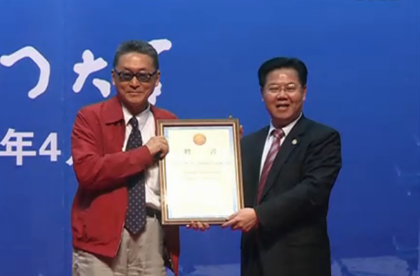
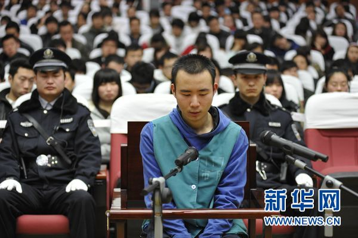
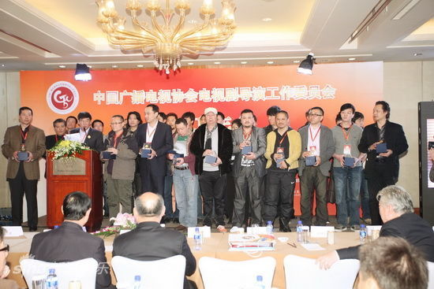

<!-- # 老纸幽一默，儿纸“被戡乱” -->

<!-- # 七星视点 -->

## 第十二期：老纸幽一默，儿纸“被戡乱”

#### 1.老纸幽一默，儿纸“被戡乱”

继[于建嵘](http://t.sina.com.cn/yujianrong)、[李承鹏](http://page.renren.com/600009823/fdoing/1853552589)、[闾丘露薇](http://blog.sina.com.cn/s/blog_46e9d5da01017f52.html)等公共知识分子和媒体人参与到沸沸扬扬的“[北大会商门](/?p=7384)”网络大讨论中之后，李敖、李戡父子也与这起事件戏剧性地扯上了关系。4月2日，《广州日报》上登出一则消息，4月1日，李敖在暨南大学讲演，提到自己“弃暗投明”的宝贝儿子[李戡上了北大的“会商”名单](http://china.rednet.cn/c/2011/04/02/2223302.htm)，原因据说是他“上网成性”。[李戡](http://baike.baidu.com/view/3214079.htm)，去年夏天以一部《李戡戡乱记》批评台湾教育而一举成名，同一时间考入大陆的北京大学，于经济学院就读，一时风光无限；难道不到一年，就已经沦落到了要“被戡乱”的境地？李敖此言一出，[大陆的媒体炸了锅](http://news.sina.com.cn/s/2011-04-03/015122230898.shtml)，纷纷向北大方面和李戡本人求证，当晚，[李戡在微博上否认了此事](http://t.sina.com.cn/1781789543)——原来所谓“上了会商名单”只是李敖开的一个愚人节玩笑。

**【七星视点】**

此事闹得沸沸扬扬，李戡似乎并不开心。在辟谣的微博中，他讲，“演讲中的玩笑话，竟被没幽默感的记者当成头条新闻”。然而，幽默感，对于李戡所说的“记者”——大陆的记者而言，或许已经是一个过为遥远的字眼。

早在1993年的4月1日，[中青报就曾经刊出一整版的愚人节假新闻](http://blog.sina.com.cn/s/blog_4c5b28970100qj56.html)，意在改革报风，并与读者为乐，所谓“幽默”。结果如何呢？[有报人这样记载当时的“盛况”](http://blog.sina.com.cn/s/blog_491e384e01000bpa.html)：“报纸如期在愚人节当天出版。一大早，我们部门的人按计划去慕田峪爬长城。车走到半道上，报社办公室就电话追来，我们的愚人节假新闻报纸出事了，全国人大、国务院、北京市政府、共青团中央都打电话到报社质问为什么会出那么一个整版的假新闻，而且还涉及计划生育那么敏感的话题！质问我们到底想干什么！！！接下来的时间，我们的境遇可想而知。”无独有偶，2009年的愚人节，[一位重庆网友也曾类似地“幽默”了一把](http://news.sina.com.cn/s/2009-04-05/061217550642.shtml)，结果遭到警方“警告教育”。

“幽默”在大陆遭遇的这般窘境，或许是生长于解严后台湾的李戡所不了解、也不能理解的吧。台湾的水土养育的作家，敢于在愚人节的公众演讲中耍一把“幽默”，而且“幽默”的对象直指当下最热门、最敏感的公共事件，而被这位作家盛赞的大陆体制下的媒体们，你们敢吗？

究竟是什么，让我们生于斯长于斯的这片大陆，如此惧怕面向公众的幽默感？推荐大家在这样的一个时间上，重读北斗网去年曾经刊登的一篇文章，[《以有趣对抗极权——如何成为一个有趣的人》](/?p=4560)。

**By 白泽**

#### 2.大师的演讲：30年与一两千万

李敖在4月3日上午应邀参加厦门大学九十周年校庆活动“走进大师”系列讲座，对厦大师生发表《从鲁迅先生来到厦大讲起》的演讲。演讲中途，李敖还专门点名从北京赶来厦门和父亲会合的李戡就北大被会商的谣言上台发言。

虽然演讲题目是“鲁迅先生走进厦大”，李敖依然秉持其演讲天马行空的特点。而且演讲中李敖大师语出惊人：“中共将中国人的平均寿命提高了30年，杀个一两千万人又算什么。”

此言一出，骂声一片。但小编不禁在想，是如此智慧的李大师甘被当作跳梁小丑，还是另有深意呢？

**【七星视点】**

敖叔演说已经够大胆了，敏感问题不回避，敏感人物不闪躲，点名直说，不掐头去尾，不藏头露尾，该批的批评，该赞的赞美。对执政党高官也嬉笑怒骂，铸币税之类的说的也差不多到位。后面对执政党呛声也有理有力，总体来讲发挥好于05年在北大清华和复旦的三场。就算是引起争议的“杀一两千万”也有前后语境，不断章取义的话不至于对敖叔有如此指谪

**By 周远游**

#### 3.药家鑫该不该杀

3月23日，[药家鑫故意杀人案](http://news.qq.com/a/20110323/000919.htm)在西安开庭审理，法庭没有当庭判决，而是择日宣判，给药家鑫的命运走向留很大的想象空间。而在网上，对药家鑫则几乎是一边倒的诛杀之声，可谓群情汹汹，不杀不足以平民愤。而《中国青年报》则说：别因“万人皆曰可杀”而[坐实药家鑫死刑](http://zqb.cyol.com/html/2011-03/25/nw.D110000zgqnb_20110325_2-02.htm)。

对舆论与司法的讨论，不是一个可以随便说说的话题。小编特别请了北斗三位重量级撰稿人就此话题展开讨论。

**【七星视点】**

（如何定罪）

其实药家鑫案就案情及定性而言，并不存在争议。药在将受害人撞倒之后，因担心受害人记下其车牌号，并基于“农村人难缠”的顾虑，用刀将被害人刺死。这属于典型的另起犯意的情况，此时药主观上具备了杀人的故意，客观上实施了杀害行为，并造成了被害人死亡的最终结果，应该说，完全符合刑法对故意杀人罪的认定。然而争议的焦点在于药的律师提出的“激情杀人”一说，在我国法律及司法解释中，并没有对“激情杀人”的相关规定与解释。但在法律实践中，如果由于被害人严重过错而引起行为人的情绪强烈波动，导致行为人在激情之下，一时失去理智，实施了杀人行为，法官在量刑时可能从宽。因为“激情杀人”的主观恶性显然不及“预谋杀人”。但本案中，“激情杀人”一说显然过于牵强，因为被害人并不存在过错，而鉴于药本人确不存在“预谋杀人”的情节，如将其行为解释为“临时起意”或许更符合案情。当然“临时起意”与“激情杀人”一样，我国法律均无明文规定，也并非量刑上的从宽情形，只是在法官对行为人的主观恶性进行衡量时的一个参考。作为药家鑫的律师，在案情已经十分清晰的情况下，提出在我国刑法领域并未普遍接受的“激情杀人说”，本无可厚非，因为除此之外，并无其他更好的辩护立足点。但最终是否能左右药家鑫的生死，可能在一定程度上海要取决于法官的自由裁量。

**By 迦南**

（舆论、权力与司法之关系）

司法独立不仅仅是机构设置的独立，审判与定罪过程不被政治和社会舆论所左右也是重要的一个方面。热点案件受到社会舆论的广泛关注很自然，而如何区分舆论中“要求公正裁决”的言论和“干涉司法独立”的言论，是一个值得关注的问题。对于个案的审判，我倾向于把所有认为必需采纳某种刑罚——如死刑——才算体现公正的法庭外舆论，都看做对法官的独立裁量权的一种干扰。当然公众的广泛讨论与司法公正之间并不矛盾，不过我们需要警惕的是，在一个司法并没有完全摆脱行政干预的国家，鼓励法官独立判案，才是每一个期待公平正义的人最应该坚持的。如果连国民都不尊重司法的独立地位，权力对司法的干涉必然会更有恃无恐，完善法制，又从何谈起呢？

**By图三**

我现在怀疑，“民众干涉司法”就是个伪概念，民众根本不存在有效干涉的途径。舆论就是民众集合起来的意见而已，一定有干涉作用吗？但是新闻不一样，本来有的新闻就是为了迎合民众的趣味，民众是新闻的衣食父母。可是给法官出薪水，影响他们升迁的归根到底还是权力部门。现在貌似舆论的热情已经被点燃，如果法院的判决不能使他们满意的话，估计又是一片讨伐之声。但这些讨伐之声具体分散到整个体制里，对于体制内的每个人来说，甚至对于做出判决的法官来说影响就是微乎其微。然而权力的干涉是直接而粗暴的，两者不能同日而语。打喊杀是个人修养问题，民众在外围讨论总是可以的。所谓舆论的力量是个意见的集合，即使它有力量也是一种合力而非各自发挥影响。我觉得最有可能的是以这样的方式来发挥影响：民众舆论热烈——权力关注舆论——权力干涉司法，因为民众义愤难平会导致社会不和谐和政局不稳定，所以当局会比司法者更关注舆论。这么说来，舆论会有影响的根本症结在于司法部门本身就不能独立于行政部门，而非民众自身有任何力量干涉司法。在这个问题上，改革司法制度才是首要。

在一个不民主的社会，其实很难谈得上培养广泛的公民意识的，像这种类型的权力干涉司法和权钱操作的事频繁出现，而民众又缺乏制约的机制，民众就不可能把自己视为社会的主人，而只会以对抗的心态与权力斗争。所以我才说，政治制度的改革才是关键。在改革之前，这种“民众干涉司法”的假象不会消除的。

**By 陈纯**

#### 4.名著禁翻拍，穿越需冷静

在愚人节举行的2011电视导演委员会年会上，广电总局电视剧管理司司长李京盛，对近期影视创作的乱象[提出反思](http://www.chinadaily.com.cn/hqyl/yyneidigangtai/2011-04-02/content_2194098.html)。他表示，近期内不会再批准四大名著的翻拍题材立项，而时下泛滥的穿越题材电视剧则需要“冷静反思和讨论”。

**【七星视点】**

国内的话剧如果是提到《哈姆雷特》的话，两个人的名字是逃不开的，一个是林兆华，一个是濮存昕，后者是前者的御用男主角。犹记得中学的时候话剧老师给我们看林兆华1990年版本的《哈姆雷特》，当时感触最深的是第三幕第一场“生存还是毁灭”的独白。莎士比亚原作之中这段独白是哈姆雷特一个人完成的，到了林兆华手中却变成了哈姆雷特、国王和波罗涅斯共同的声音。这段英文语言中最有名的“独”白都让林兆华改了，这是否影响了作品成为经典？恰恰相反，1990年的这版《哈姆雷特》是成功的，其话剧表现、演员素质和林兆华掺杂在其中的实验话剧成分都获得了无数正面的评价，以至于2008年林兆华和濮存昕再次演绎《哈姆雷特1990》的时候，哈姆雷特王子是穿着一件T恤上台的。

这正是我们常说的“一千个人的眼中有一千个哈姆雷特”。林兆华绝不是唯一一个凭着自己的理解演绎《哈姆雷特》的导演，古今中外的话剧导演，多多少少有自己对于《哈姆雷特》的不同诠释。比起中国的四大名著来讲要短小的莎翁话剧尚且有如此多不同的呈现版本，四大名著的翻拍反倒必须要由广电总局来说了算？且不论广电总局是否真的有文学和艺术上的权威来断定名著的翻拍是否正统，直接一刀切就真的能保证经典？

岂不知虽然手握审查大棒和意识形态大棒确实可以暂时扭曲大众的审美观，但是太阳的光芒不是闭上眼睛就会消失的，《蜗居》的叫停并没有影响它成为街头巷尾热议的话题，四大名著之一的《西游记》在嘉靖年间也曾因为影射世宗朱厚熜而被禁。

**By谢熊猫**

#### 5.谁是Y男星？或者谁制造了Y男星？

据香港某媒体报道，香港娱乐圈传出，一名[Y男星](http://bagua.ifensi.com/article-386654.html)患上绝症艾滋病。与他有过“亲密”关系的男／女星，都静悄悄去做艾滋病测试，希望不要惨被感染。

据悉，这名Y男星，因爱泡夜店，更喜欢猎艳，短短几年便与超过100名女子发生关系。

小编想，知道你们香港娱乐媒体竞争激烈，但你们不要想搞一个大新闻！香港哪个明星的绯闻我没有听过啊？

**【七星视点】**

是余文乐，郭富城，林保怡还是罗永浩呢……

公众人物的八卦是人民群众喜闻乐见的娱乐形式，而群众们对艾滋病却是谈而变色，所以这也就成了一件悲喜交加的事件。众所周知，我国的艾滋病泛滥不是由于经济上的短视继而引起血制品无序泛滥所造成，也不是政府刻意隐瞒不报（恰恰相反，我们从小就从学校接受了大量教育：艾滋病好可怕的，没结婚千万不能做爱啊！）贻误时机的缘故。艾滋病在我国的泛滥完全是因为美利坚的价值观输出，导致同性恋行为的增多，长久以来同性恋就成为了我国艾滋病滋长的温床。回到新闻，关键的关键，报道中的这位先生男女通吃，且交友广泛，由此形成了感染网络也可想而知。可通过性行为传播的疾病，如果作为身处节点、达成百人斩（甚至数倍）的个人，能够做好必要措施，那百人斩的朋友们和朋友的朋友们也就不必太担心了吧。

当然，最好还要希望你们的省长不叫长春……

**By 石三**

#### 【小编日志】

因为篇幅关系，本期的七星是七位评论者，而非七条新闻。这七星都是斗内名人，甚至还有世界名人。他们的评论，各位读者中意不中意呢？新闻的选择您中意不中意呢？如果不中意，可以直接告诉我们您的口味，不论多重口，我们都会想办法去满足。七星视点，是你的喉舌。

（出手评论，参与七星视点。投稿邮箱： [ibeidouview@gmail.com](mailto:ibeidouview@gmail.com)）

（采编：钱思韵、杨再爽、陈造极、金吉男、刘一舟；责编：刘一舟）
