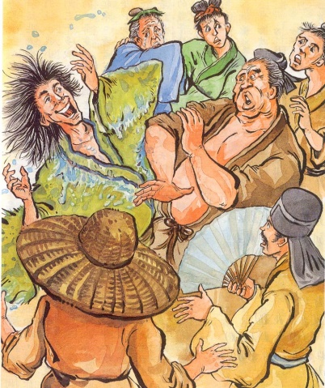
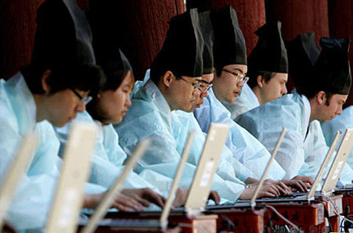

<!-- # ＜天玑＞托物言志（三）我们不如范进 -->

**当权力的大门向我们关闭的时候，我们却在欢呼终于告别了一个落后的时代。当选举成为一种表面的形式，甚至连形式也没有的时候，科举也没有了，我们是否想过知识分子的政治出路在哪里？而排斥了知识分子的政治只能由两种人掌权，贵族和暴民。而在一个贵族没有知识的时代，贵族就是暴民。**

# 我们不如范进

## 文/明夷（中国人民大学）

时间回溯到中学的某一节语文课上，老师在热情洋溢地嘲笑着范进的痴迷和愚蠢，随后又自以为是地将这一切归咎于吃人的封建制度。随后的历史课上，1905年废除科举制被视为万恶的清政府为数不多的进步举动。这一切，赋予我们一种思维，在这种思维看来，今天的一切都那么顺理成章，而所谓的反对者，亦不过是在这种思维之下，咒骂不已，而找不到出路。

当知识成为一种特权阶级所能享受的资源时，贵族政治显然成为了全民最无奈的最优选择。贵族和知识的结合使得这种政治有了历史的合理性，然而一旦知识成为全民共有的资源，出身抑或知识，哪个才是政治合法的基础，便开始引起争论。而关于这一话题，任何的理论论证的作用都微乎其微，因为在历史面前，真理是不言而喻的。

自五代之后，贵族政治的合法性在中国历史上便彻底宣告破产。恩荫制度在科举制的洪流面前简直不值得一提，仅仅成为扩大政治基础的辅助性渠道。而比实际政治运作中时有世袭贵族当权的现状更重要的是，在中国人的观念中，知识阶层入仕当权天经地义，仿佛自古已有。状元郎，远比获得重大军功的将军更加受到上下的尊重与敬仰。人们对于知识的崇拜仿佛日益热烈，因为知识与权力牢牢地绑在了一起。

于是，在经过五代的斯文扫地与僭主政治之后，除了亡国于蒙古人的近一个世纪，大一统王朝的寿命似乎越来越长，对内的驾驭能力也越来越强，那种走马灯式的权力更迭越来越少。李自成和洪秀全的失败从其对固有的知识阶层的态度中，仿佛便有了某种必然性。拒绝知识阶层，就是拒绝权力与成功。

科举制绑架了人才的多样性，这不是现代人才发现的不传之秘。大一统专制主义国家的长寿，系于知识分子在各个阶层之间流动的畅通无阻。朝为田舍郎，暮登天子堂。给了这个国家的无数正在寒窗苦读的知识分子以无限的希望。他们在无数个朔风飞雪的黎明爬起床来，趁着微弱的晨曦，研墨书写，吟诵着古圣先贤的著作。无数贫困的年轻人希冀着扬名天下的未来，无数年迈的学者还在渴望实现儿时的梦想。所以，当饿殍遍地的时代，气势汹汹、一路烧杀抢掠的农民军经过他们的家园时，他们选择的是闭门谢客，甚至引颈就戮。因为这个国家没有对不起他们，因为国家给了他们实现梦想的道路，权力的大门向天下的学子们洞开大敞，无论贫富。

当我们在嘲笑范进或者孔乙己的愚蠢时，当我们批判那个时代的黑暗时，我们忽然发现，其实我们比他们更可怜。当权力的大门向我们关闭的时候，我们却在欢呼终于告别了一个落后的时代。当选举成为一种表面的形式，甚至连形式也没有的时候，科举也没有了，我们是否想过知识分子的政治出路在哪里？而排斥了知识分子的政治只能由两种人掌权，贵族和暴民。而在一个贵族没有知识的时代，贵族就是暴民。

而加强执政者的修养仿佛是我们这个时代的政治核心，这个国家把一切寄希望于对执政者的知识化和道德化，从而为封闭权力大门提供可能性和合法性，然而这一切仅仅是一个梦而已。因为从印刷术不再仅仅印刷佛经和黄历开始，知识便不再是贵族的专有品，权力与知识的结合更加具有说服力，贵族政治早已排除在世界潮流之外。即使贵族本身就是知识阶层，也仍然没有理由拒绝现有贵族之外的知识分子走入上层。

一个社会不怕产生阶层差别，反而怕没有真正贵族的存在（贵族与民主的关系本文不予以论述），就怕这种差别是由先天因素决定的，并且不可改变。贵族的标准不能仅仅是出身和家庭。而且阶层之间的流动渠道必须是畅通的，这个社会才是健康的。民主体制天生如此，权威体制则理应如此。

由此看来，高考实在是我们体制下最为合理的制度，它在遭到无数人唾骂之时，也给了无数勤奋的学子以希望。然而这希望仅仅到大学便截止，因为不存在继续向上流通的考试系统。而所谓的国考，不过是取吏之试而已，官吏之防的严密，古今一也，其开放权力门径的功效未必就能和科举制同日而语。钱穆先生一直强调中国社会阶层的流动性，否认中国有固定僵死的阶级，我想，在选举制移入中国之前，或者恢复科举制之前，这句话只能当历史来看了。

今天，范进能够期待中举而成为世人眼中的文曲星，我们能期待什么？

(采编: 黄理罡

责编:黄理罡)
