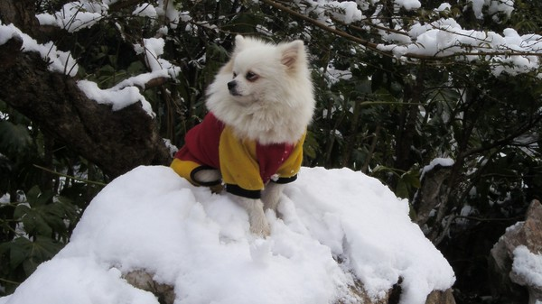

<!-- # ＜狗与人特稿＞道德底线与狗的生命 -->

****打个比方来说，高速劫狗的行为相当于足球比赛中的犯规战术，通过一个不合法的行为，为之后合法行为（收购）取得时间。犯规战术确实是犯规，但这犯规并不代表对规则本身的否定，而是愿意接受惩罚的意味。**劫狗者侵犯他人权利的行为，并不代表他们不尊重权利，或是没有权利意识。**他们是选择了****与这个制度做一个****“****交换****”****，付出一定的代价，换取对制度一定程度的破坏，以达成自己的目标。**如果这个规则是健全的，这有什么不可以呢？喋喋不休于“权利”之争的人，在我看来，无异于对一个因犯规战术被裁判惩罚的球员叫喊：“你太过分了，你居然认为自己有拌别人腿、拉别人衣服的权利！”** ibeidou.org  ibeidou.org

# 道德底线与狗的生命

ibeidou.org

## 文 / 陈锴(清华大学)

ibeidou.org 翻翻校内好友的日志和状态，我猛然发现自己处在一个尴尬的境地。可以说自有斗以来，我还是第一次处在和几乎所有斗人对立的位置。但我确实不喜欢用斗内用自由和权利的框架去解释一切的风气，所以斗胆也发出自己的声音。没错，我是反对吃狗的，而且是极其反对，但本文却试图跳出权利主义的框架论证这个问题。为了避免再次遭到误解，我在此强调一下，我想说的在有两点：一，劫车者们并非缺乏公民意识；二，认可吃狗是有害的。任何关于人权与狗权的论证，都不属于本文的主旨。 ibeidou.org 反对高速救狗的人，基本持这样一种观点：这是侵犯权利，他人有吃狗肉的自由，你无权侵犯他人吃狗肉的权利。你可以呼吁，可以宣传，可以推动国家立法保护动物。但在这之前，你上高速劫车，就是对他人合法权利的侵犯，就是不对。

每当我看到这样的论调，我头脑中就浮现出这样的场景。如果这辆卡车上载的不是520条狗，而是你的孩子，你的亲人、朋友，或者甚至是与你素未蒙面的普通人，他们经过合法的程序被交易，即将被屠宰。那么你还会在乎法律吗？你还会轻而易举地说出：“我尊重你们现有的权利，但我会努力阻止它以后发生”么？我想你早就管他妈的什么法律，直接抄上家伙先救人再说。

好吧，看到这儿我想诸位一定要拍我了，这是使用不恰当的类比来过分煽情以逃避理性上的思辨。那么请先别急，待我慢慢来理性。我举上面的这个类比绝不只是为了煽情，对于保护动物人来说，他们可能真的就是这么想的。试想一下？我们为什么要保护狗？因为从原始时代以来，狗就一直是人类的伙伴，帮手。我们认为狗通人性，我们给狗赋予了各种各样的品质。更重要的是，现代社会中越来越多的宠物狗，担当了“伪幼儿”的作用，作为人类幼崽的替代，满足人类抒发母性的需求。（网上有一篇文章说，狗不是人类的朋友，因为人绝不会把自己的朋友当玩物。这种说法是不确切的，实际上人类常常吧自己的幼崽当玩物。）**可以说，狗是被人类****“****移情****”****最多的一种动物。**（需要说明，这是对现实中狗的移情，老鼠作为卡通形象也承载了人们大量的移情，但现实中的老鼠仍然不被人喜欢）**而这种****“****移情****”****，使得狗在人心目中****“****人性化****”****了。**这也是狗相比其他动物显得特别的地方。

刚看到的一句很经典的话：**动物保护，是为了保护同情动物的人的感受，而不是为了保护动物，保护动物，是一般的说法，但绝不是事实上的本质。**反救狗者们用它来揭示动物保护的虚伪，而我认为，它反映了我们完全应该从另一个角度认识动物保护。为什么“保护同情动物的人的感受”就不对呢？我们既然认可为口腹需要利用某些动物，为什么不能接受因为精神需要利用某些动物呢？**我认为，根本不存在所谓的****“****狗道****”****，所有救狗的行为，其核心都是****“****人道****”****。我们对狗的同情，其实是对投射到狗身上的那个虚拟人格的同情，是被转移了的****“****同胞之爱****”****。**我想这时会有人愤起抗议了，把人和狗比作同胞岂不荒谬？我想说，既然你们认为“狗是人的朋友”是一种主观偏见，那“人和狗不能相提并论”为什么就不是偏见了呢？

我是很反对抽象地去探讨权利、等级、价值这样的话题。从理性层面上来说，我不认为狗就比鸡鸭牛羊猪高贵，他们是平等的。但要知道，从理性层面上，要论证人比一个细菌高贵都困难重重。如果这样的话，我们所谓的道德，所谓的价值观，所谓的权利，还有讨论的可能吗？我们通常认为的道德底线——人的生命——有理论依据吗？所以我认为，道德本身是不能从理性层面无限推演下去的。一旦推演下去，只会陷入逻辑的虚无。它有一个基础的公理，那么它的基础是什么？没错，是情感。**对同胞本能的同情，构成了我们的道德底线，不需要思辨，不需要问为什么，我们理所当然地接受了它，作为不可改变的公理。**

所谓动物保护者是怎样一群人呢？他们就是将我上述所说的“移情化”发挥到极致的人。在他们眼中，狗已经“人性化”到与人无异的程度，狗所遭遇的生命威胁激起了他们对同胞本能的同情。也许在很多人看来这很可笑，但这种情感确实与同胞之爱非常相似，而且和同胞之爱中最强烈的对幼体的爱非常相似，其本身可以作为构成道德底线的基础了。狗在他们眼中与人无异，保护狗的生命是一个天经地义无需解释的行为。 ibeidou.org

ibeidou.org 当然你会说，这只是他自己的“移情”，他没有权利强迫他人也必须要“移情”。我同意，可是别忘了本文的目的本来就不是论证权利问题。我想说的是，正是这种真实的情感，赋予了他们行为一定的内在合理性（注意是合理性，不是合法性，不合法但合理）。那些认为他们应该去呼吁、推动，而不该去劫车的自由主义者似乎忘记了，车上还有520条活生生的狗。他们是注定死翘翘了吗？它们就一定要被这场“人权与狗权”的博弈排除在外吗？所以我要问，如果不是狗，而是人呢？我们在制度未改变之前是不是就听凭其牺牲呢？

所以，我真正想反驳的，是认为动物保护者缺乏公民意识的说法。因为这520条不行动就将被屠宰的生命，对于这些人来说，已经构成法律意义上的“紧急状态”。我们知道，当人的生命遭受威胁的时候，就构成紧急状态，这时侵犯他人的权利有时候是合理的。我问过一个学法律的同学，她说当你维护的权益大于你侵犯的权益时，你就可以不负责任。高速劫车固然不对，但对于动物保护者来说，狗的生命就像人的生命一样，其重要性远远超过一次自由交易的权利、一次开车不被堵的权利。**我把这个****“****紧急状态****”****看成是法律为人性空出的一块自留地，法律认可有一种情感可以超越公民权利而存在，这就是对于同胞生命威胁的急切关怀。**动物保护者们并不是缺乏公民意识，而是他们身上这种急切关怀已经被唤起，使他们强烈的觉得应该超越公民权利去行使这种关怀。也就是说，他们是听凭自己公民意识的驱使去做这件事的，虽然那个公民意识仅存在于他们自己价值观的世界中。**他们是做了件错事，但并不是因为他们缺乏你说的那种素质所以才犯错。**

当然，他们价值观的世界与真实的世界有一条鸿沟，致使对于他们自己合理的行为，在现实中却不合法。对于其他不具有这种“移情”的人而言，这种对公民权利的“超越”是毫无合理性可言的。但我们应该看到，这些动物保护者们并没有忽略这条鸿沟的存在，他们并没有试图占据道德制高点去压迫别人，也没有把自己的情感强加于人。他们认识到了自己与他人的不同，并仍然从现存的制度框架下寻求解决的途径，用收购的方式，达成理想和现实的妥协。他们无权干涉他人交易的自由，可他们不是也有自己加入市场参与交易的自由吗？实际上他们就是那么干的。

换一个角度说，他们也许确实侵犯他人的权利。但我想请大家别忘了，他们不是政府，他们的这种侵犯是有代价的，是会受惩罚的，而这点他们自己也心知肚明。如果你做一件事会受到惩罚的，那你算是有做这件事的权利吗？也就是说，劫狗者明白自己做的并不是一件合法的事情。**打个比方来说，高速劫狗的行为相当于足球比赛中的犯规战术，通过一个不合法的行为，为之后合法行为（收购）取得时间。犯规战术确实是犯规，但这犯规并不代表对规则本身的否定，而是愿意接受惩罚的意味。**劫狗者侵犯他人权利的行为，并不代表他们不尊重权利，或是没有权利意识。**他们是选择了****与这个制度做一个****“****交换****”****，付出一定的代价，换取对制度一定程度的破坏，以达成自己的目标。**如果这个规则是健全的，这有什么不可以呢？喋喋不休于“权利”之争的人，在我看来，无异于对一个因犯规战术被裁判惩罚的球员叫喊：“你太过分了，你居然认为自己有拌别人腿、拉别人衣服的权利！” ibeidou.org 其实看到这次的高速救狗事件，我心里是很高兴的。过去听到激进的环保主义者云云，感觉那都是洋人的玩意儿。现在自己的同胞也能赶此时髦，不禁感到我们国家确实发展了。他们是真正的理想主义者。对于自由民主控们而言，政治改革后的社会变化毕竟能给自己带来些许利益；而这些人，他们的付出却毫无任何利益上回报的可能。我很高兴这样的理想主义者能诞生在我自己的同胞之中。 ibeidou.org 莫利斯在《裸猿》中很好地总结了各个年龄段保护动物的动机：“第一阶段是婴儿阶段，此时我们完全依赖双亲，非常喜欢大动物，把它们视作父母的象征。第二阶段是幼儿-父母阶段，此时我们开始与父母竞争，喜欢小动物并把它们作为孩子的替代物。第三个阶段是前成年阶段，这时科学和审美的兴趣开始支配象征的兴趣，是捕捉昆虫、使用显微镜、收集蝴蝶，喂养水生动物的时期。……第六阶段是后父母阶段，这时如果我们失去了自己的孩子，就会再一次把动物当作孩子的替代物。第七个阶段是老年阶段……作为个体的人，老年人行将就木，因而他们就把稀有动物作为自己的象征；老年人要拯救这些动物、使它们不致灭绝的情感反映出延年益寿的愿望。”

可见动物保护本来就不是出于抽象的哲学思辨，而是出于最朴素的情感。说**到底人是一个感性的动物，人对于情感的需求，不也应该像口腹之欲一样，得到足够的重视和尊重吗？**为什么“人类中心主义”、“为人类情感而保护动物”，就一定是虚伪，一定是贬义呢？

如果跳出“你有XX权利，我有XX权利”的单曲循环，先不计较抽象意义上的对与错。从社会影响的层面上来看，我认为认可吃狗肉是有害的，对孩子尤其有害。我说过，对于一般人而言，对狗的同情实际上是被转移了的“同胞之爱”，而后者是构成我们道德底线的基础。**吃狗的行为，虽然理论上没有触及人类的道德底线，但是它暗含了对被转移的“同胞之爱”的否定，而这种否定很可能危及真正的“同胞之爱”。**这是我们无法从理性上加以强制避免的，因为两种情感的发生机制几乎相同。由于爱狗的人很多，如果“同胞之爱”的情感被破坏得足够严重，道德底线还能不能继续稳如泰山，那就很可疑了。 ibeidou.org 写到这儿，我不禁想起了自己家里两条长得几乎一摸一样的小白狗，我不在的日子里，就是它们陪着我父母度过枯燥无味的生活。我这不是在煽情，我只是想说，未来的趋势，很可能是狗作为同伴，作为“伪幼儿”的社会功能会越来越凸显。而这种功能是与食用以及其他很多功能不兼容的。这会引起种种冲突，比如杀死别人一条心爱的狗，是不是只算破坏财产赔点钱就完事了？要不要精神损失费乃至刑事责任？这样的问题，也许是以后经常会碰到的。如何应付好这种变化，这是我们该思考的。 ibeidou.org

（图为作者家中小狗）

ibeidou.org 对于立法问题，本来我是不打算涉及的，但不妨在此说一下。从抽象权利角度考虑，我不认为立法禁止吃狗肉是对的，毕竟这个社会应该容纳不对狗移情的人的存在。但从社会利益或者功利主义角度来看，我认为立法是有好处的。可以取代狗肉食用价值的食品很多，但能取代它“移情”价值的却很少，而且同胞之爱相比口味偏好，在情感上要强烈的多，也固执得多。当两种功能必然发生冲突的时候，牺牲一小部分人可有可无的口腹偏爱，去换取大部分人的一个维持内心平静的迫切情感需求，这似乎是最好的解决方法。我一向认为，并不是所有权利都是平等的，就像本能需求有强弱缓急之分，但经历了千年集权专制和二十多年家长权威的新一代自由主义者们，往往不认同这一点。 ibeidou.org ibeidou.org

（采编：陈轩；责编：陈轩）

ibeidou.org ibeidou.org
