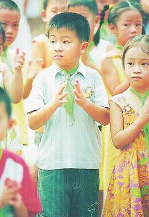
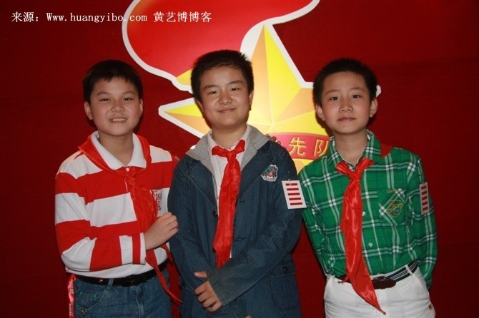

<!-- # 五道杠和学校教育：隐藏的支配工具 -->

 黄大队长五道杠的事昨天曝出，今天就红遍了全网。看到"戴上个眼镜就是我来晚了"和各种Ps的图，想笑死爹啊！但笑的确实不是这孩子，而是这个孩子身上承载的那些符号和文化。孩子是无辜的。

谁小时候都戴过红领巾，如果能有幸带上一两道杠，肯定也得春风得意一阵子。后来也都会成为共青团员。我现在还记得参加初中首届团员代表大会放团歌时候的激动人心的感觉。接下来到了高中大学，有的人觉得自己多少醒悟了，但是大部分人还是向团委、学生会和党靠拢了。当我们在质疑大多数人投靠体制的动机时，会觉得他们是为了自己的利益。但是理性决定论和功利态度在这里的解释力是不足的，显然投靠体制只是一小撮人的话语。在大多数人心中，体制才是唯一合法的。这是因为我们受到的教育就是这样的。学校是养鸡场生产肉鸡的一个环节，或者说是隐藏的支配工具。

首先我们很确知的一点是，学校文化不是中立的。学校文化是一种特殊的文化，即被转化成合法、客观、不容置疑的统治者文化。这个从我们在学什么就可以很明显的看出来。不仅仅是代表性的从小学的思想品德，到中学的思想政治再到大学的政治必修课程可以体现的出，很多常识课程和修养课程比如语文、音乐也都不是根据科学教育的原则而是根据体制意愿设立的。

老师评定学生的优劣，也是根据体制希望的标准。学校有体制授权的强制的权力，而这种权力通过规定学生优劣的评定标准来实现。好学生就是成绩好也就是考试好的学生嘛。如何考试我们都知道的很清楚。而且学生的日常举止也被要求符合规范，比如遵守纪律和热心于学校活动。学校作为社会化的主要场所，提出一些行为规范的要求本来是无可厚非的。但我们都被强迫参加到了某些具有特定象征意义的规训中，比如戴红领巾、义务劳动、鼓号队等等。而且不听话就要受到惩罚哦，打骂罚站抄写叫家长哦。

因为中国的意识形态教育太过于明显，所以我们也就知道教育中一些体制强加的部分是什么。但是一个孩子如果仅仅不上政治课，不入团就想逃离支配也是不可能的。因为在学校实际运作中，"天分意识形态"才是决定性的。"天分意识形态"声称学业成功不成功，是因为天分造成的。学习好的孩子就被认为是聪明的，学习不好的孩子被认为是笨的。随之而来的是"能者居高位的意识形态"。在成绩榜上排名靠前的学生被许诺以美好的未来，排名靠后的被许诺以不好的未来。这个意识形态意味着学校在权利和义务上是平等对待每个人的，而且每个人的机会都是平等的。

但是事实上，成绩的好坏，天分只决定了一部分。或者说一个人学业是否顺利，很大程度上是由不平等的社会条件决定的。地域不平等，阶级不平等，各种社会不平等。但是"天分的意识形态"合法化学校的不平等，也因此合法化了社会的不平等。

所以很多处在社会底层的群体，会将改变社会地位的希望寄于学校教育，但现在看来，大部分以失望告终。

这样就有两个结果。一个是体制将想灌输的东西无阻碍地灌输给学生，而且还将自身合法化。我们首先失去了选择文化教育的机会，比如我们从小就知道知识有课外和课内之分。学习课内知识是本分，学习课外知识就要筛选了。这就是一种合法与非法的划分。而且体制还可以拿教育当挡箭牌呦。个体失去了把自身遭遇归罪于体制的想象力。体制合法性更不会受到质疑啦。我只能在建筑工地打工，唉，谁让我在学校的时候学习不好呢！

学校的限制难破。社会化的场所除了学校还有朋辈和家庭。朋辈都跟自己一样关在学校里呢。而家庭呢？是毫不迟疑支持学校的。开家长会，家访这些事都是在干嘛？学校动员家庭配合自己的支配地位而已。

再回头看黄队长，他也是受害者了。虽然未来还有改过自新的机会，但人生难免是留下污点了。但愿他也是个共产主义接班人界的仲永，小时了了，大未必佳。

（采编：王也；责编：陈轩）
