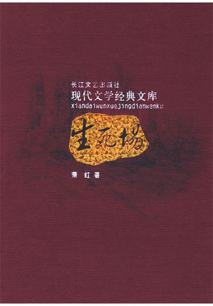
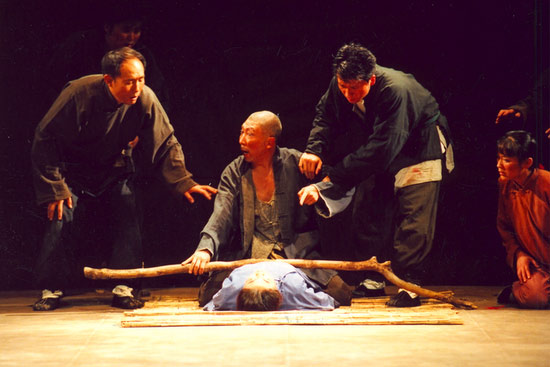
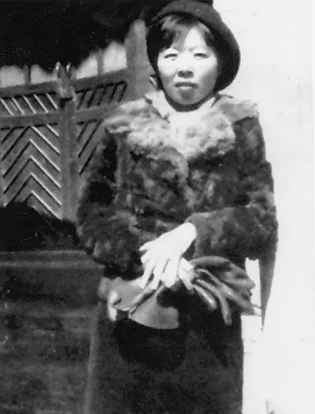

<!-- # ＜天玑＞少女藏刀（二）世间再无生死场 -->

**萧红让我们直面社会最底层的中国农民的生存，饱受苦难却无苦难意识，富有人性却无人性尊严。他们正像我们脚下的土地，无论多少次被鲜血浇灌、被铁骑践踏，只要有阳光，有雨露，自能生出野草，以令人难以想象的顽强自生自灭着。**

# 世间再无生死场

## 文/花爷（复旦大学）

一

生死场是一本生命之书。

在这个仿佛隔绝于我们所熟知的文明世界以外的乡村，生与死犹如一扇旋转门，日夜旋转不休，从这个门进去，从那个门出来。小说中反复出现生死交替的描写，最令我难忘的莫过于接生，五姑姑的姐姐生孩子，“这边孩子落产了，孩子当时就死去，……孩子掉在炕上，像投一块什么东西在炕上响着”，“窗外，阳光洒满窗子……田庄上绿色的世界里，人们洒着汗滴”。二里半的老婆和李二婶子同时生产，麻面婆的孩子刚露出头顶，五姑姑进来说李二婶子小产了，人快死了，王婆赶过去，另一个产婆来时，麻面婆的孩子已在土坑上哭着。“王婆再次回来时，窗外墙根下，不知谁家的小猪也正在生小孩。”一片乱七八糟的景象，生与死你方唱罢我登场，对于生并无过多的欢欣，对于死并无过多的悲戚。正所谓生亦何欢，死亦何苦。

在这里美丽也不能获得更多的垂青，美丽的事物在这里是要被摧残，被毁灭的：像金枝，成业想要娶她的时候，叔叔问他“小姑娘到我们家里会做什么活计”，成业说：“她长得好看，有一双亮油油的黑辫子”。可是柴米油盐鸡鸣狗吠的夫妻生活一旦开始，斥责与殴打取代蜜语甜言，青春的丽颜失去了任何意义。月英原是打渔村最美丽的女人，最后以厉鬼一般的形象凄然死去，埋在荒山下；小金枝的死更不啻是一个人间惨剧。仿佛这里不配拥有美丽的事物，这里的一切，是粗糙的，残酷的，丑陋的……

人与动物之间的关系同样十分微妙，有时候动物被提升至一个极度尊贵的地位：如二里半和他视若命根的老山羊，亡族灭种都不如其来得重要；如王婆牵马入屠宰场，哀恸如犹太人亲手将亲送入煤气房。而有时候人被践踏至一个极度卑贱的地位：在金枝母亲的眼中，女儿的价值竟不如麦苗；王婆说起过去摔死了自己的孩子时，也说道“起先我心也觉得发颤，可是我一看见麦田在我眼前时，我一点都不后悔，我一滴眼泪都没淌下”。

又如之前所提细节，孩子生下来了，不知谁家的小猪也在生小孩，无论人还是猪，在生育这件事情上很自然而然地相提并论了，“人和动物一起忙着生，忙着死……”

在萧红笔下的这样一个时空里，生与死，美与丑，人与兽，它们之间并无界限，不是好与坏的对比，不是高级与低级的差异，而是硬币的两面，是同时存在的，是相生相随的。这是个一片混沌的世界。而生命不正是这样吗？生命赋予一切以平等的意义，如同白天和夜晚，我们称之光明与黑暗，可是对大自然而言，无非是太阳落下去，月亮升起来。

生命无所谓生与死，美与丑，人与兽，它存在了，它拥有一切存在的理由和意义，生命不作任何评判，它只让一切发生。

二 王婆服毒。女人在旁边哭着，却不是哭王婆的死，哭孩子，哭丈夫，哭自己命苦，总而言之，她们的动情并非缘于个体生命的逝去，只相当于一个集体发泄的仪式；男人围在一旁抽烟喝酒，催着抬棺下葬，并为王婆的迟迟不断气而感到不耐烦。王婆复活的迹象一次比一次明显，读这一段令我最惊心动魄，仿佛能感到生命的力量在死尸的躯壳里翻涌奔突，挣扎着要喷薄而出。出于对死尸还魂的恐惧，身为丈夫的赵三用扁担压住她，鲜血喷溅出来，他的反应竟然是“轻一点吧，弄得满身血”。

王婆最终复活了，这一场挣扎的最高潮处，“将棺材送上坟场！要钉棺材盖了！”她坐起来，轻轻说：“我口渴了。”

而一切戛然而止！

没有欢呼，没有惊叹，一场生与死的较量就这样无声无息的结束了，生命的极端的顽强与对生命极端的淡漠奇异地糅合在一起。为什么会这样？我想，除了长期暴露在死亡面前，对死亡的恐怖已然完全麻木以外，会不会是因为他们对人之为人的意义并无概念，牲畜的死亡、麦子的破坏令他们心痛，而人的生死也不过如此。在他们眼中，一条人命并不比一头老山羊更尊贵，但我们不能因此说他们的情感是粗陋的、原始的，尽管那确实是一种未经打磨修饰的、粗生粗长的、带血带毛的东西，但却比我们的文明所喜闻乐见的精致华丽的情感更为真实而有力，同时也是我认为这部小说里最直抵人心之处，那是一种在无意识状态下的生命的蓬勃的力量。

萧红让我们直面社会最底层的中国农民的生存，饱受苦难却无苦难意识，富有人性却无人性尊严。他们正像我们脚下的土地，无论多少次被鲜血浇灌、被铁骑践踏，只要有阳光，有雨露，自能生出野草，以令人难以想象的顽强自生自灭着。只要能够维持生存的最低限度，他们能够忍受一切苦难，他们的苦难有多深沉，他们的性格就有多坚忍。他们之间确乎有人性的温情，尽管表达的方式在我们看来暴力而野蛮，他们的生生死死却如蝇虫般毫无尊严，连尸骨都被乱坟岗的野狗啃食得一干二净。

写出这样一群人的萧红是难得的伟大的作家。这样的一群人，我们如何能够以启蒙者自居，用高高在上的眼神俯视他们？我们需要直视他们空洞的面容，直视他们丑陋的伤疤——用真诚、坦然而充满敬意的目光。

三 小说的后半部分，即“年盘开始了”以后，包括受胡风称赞的村民歃血宣誓一节，予我的震撼却不如前半部分，甚至感觉有些突兀。相比之下，鲁迅先生笔下未庄村民那样的形象似乎更为真实可信。诚如先生所说，不愿作异族的奴隶，难道作本族的奴隶就是好的吗？受压迫受剥削的本质仍在，他们仍然是被侮辱与被损害的人们，与其说是反抗意识的觉醒，不如说是日本人的入侵突破了他们生存的底线，以至于催生了这一个个在沉默中爆发的灵魂。在我看来，这正体现了一种蓬勃的生命的弹性，如同一根弹簧，你愈挤压，它愈低微，但当你将之压至最低，便会产生惊人的反弹力。

同时，日本人铁骑的踏入亦相当于为这一潭死水般的乡村打破了一个缺口，对于如老赵三这样的村民，是人性需要的飞跃，懦弱的、驯服的、麻木的人们，内心深处却未尝没有蛰伏着猛兽，他们被压抑得太久太久，正需一个爆发的契机！“在乡村永久不晓得，永体验不到灵魂，只有物质来充实他们”。如今，以民族意识觉醒之名，以反抗与斗争之名，他们终于得以蜕去在千年如一日的僵死乡村里风化的丑陋的硬壳，从而使灵魂得以阔步，血性得以爆发，生命得以酣畅淋漓地呼喊。

生命，生命，纸页间扑面而来的仍是生命！所谓政治意义、民族认同的标签，在鲜活泼辣的生命面前显得黯然失色。若有人在此层面指摘萧红，认为她思想落后、觉悟不高，我只感到惋惜，他们不能领会这部看似幼稚粗糙的小说超前于时代的伟大之处，又何能理解生命与人性的深刻内涵。

四 萧红终生孤独。这个以笔为戟手斥长空的女人，以整个血肉之躯向文学献祭的作家，经历过几次飞蛾扑火般壮烈而短暂的爱情，创作过几部在当时不被认可的小说，一个人凄清地病死异乡，临时前挣扎写道“不甘！不甘！”

落落寡欢的张爱玲如今声名大噪，萧红仍然孤独。是不是我们的双耳已惯于喧嚣，不能听见沉默。是不是我们的感官已蜕化到只能被轻浮的机巧所取悦，无从领略厚重的诚拙。我们汲汲于生活，忽略了生命的本质。现代文明是一桌五光十色的饕餮盛宴，而天地间再无生死场。

萧红的孤独是我们这个狂欢时代最大的悲哀。

(采编: 黄理罡

责编:黄理罡)
