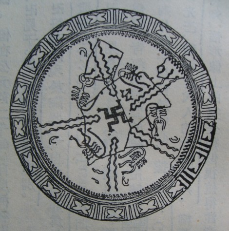
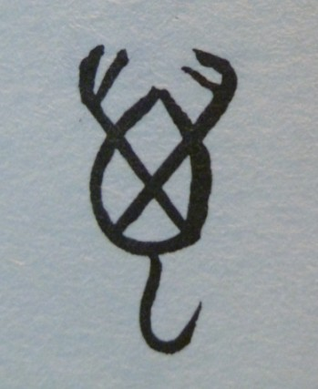
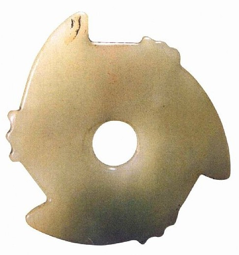
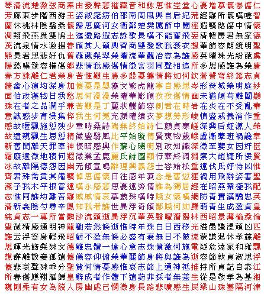
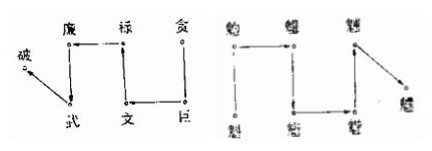
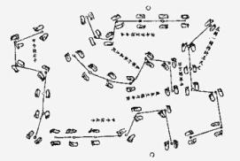
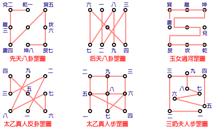
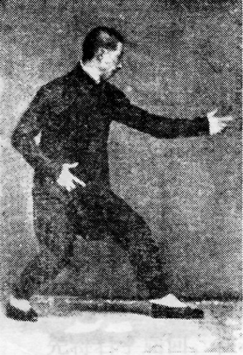

<!-- # ＜开阳＞“卍”与北斗 -->

**在这篇文章里需要着重谈到的是，根据我近期的阅读和思考，我认为卍在中国的形成、发展状况判定，卍不仅只是单纯地与东传的西方宗教有涉，更与中国本土的道教或早期巫教相关，而两者连接的媒介就是北斗。

**

# “卍”与北斗

## 文/谷卿（暨南大学）

我极为清楚地记得，当年我是在父亲办公室里翻看《辞海》时第一次见到“卍”这个符号的。

小学二三年级，每天放学都很早，父亲接到我后，离他下班尚有很长一段时间，于是把我带到他办公室，等到下班后一起回家。他的办公桌上除了堆积如山的文件，另有一部极厚的《辞海》，我虽幼稚，却还知道若要打发时间，选择翻《辞海》会比看文件要舒服。看这么个大部头，完全是一种读图遣兴的行为，好在它里面图画很多，当时给我印象最深的就是“卍”字条，因为我实在想不出编写者是如何把这么个怪符号打上去、印出来的，而且它看上去还十分规整——我自己画的卍和五角星总是因上下左右不对称而显得怪模怪样。

《辞海》对于卍的解释，我记得是从佛教东传这个线索来说的，认为卍与佛经的翻译、佛教的流传有关，因为似乎此前没有看到中土有卍字。《大方广佛华严经》卷六五《入法界品》说释迦牟尼“胸标卍字，七处平满。”确实，我们最常见到卍的地方，正是佛祖的胸口。古印度教、耆那教，均以卍为吉祥的标志。后面又提到武则天，按《翻译名义集》卷六引唐慧苑《新译大方广佛华严经音义》：“案卍字本非是字，大周长寿二年主上权制此文，著于天枢，音之为万，谓吉祥万德之所集也。”鸠摩罗什、玄奘将卍符号译为“德”，菩提流支则译为“万”。武则天长寿二年正式定读音为“万”，意为集天下一切吉祥功德。于是我就知道，这个奇怪的符号大约就该读作“万”字，有着福德吉祥、佛法广大、光明普照的意思。后来陆续看到很多资料、书籍，都延续了这种说法，认为这个读作“万”的符号，确乎传自印度。比较有趣的一种说法是，日本国士馆大学光岛督博士认为，卍本非文字，前八世纪时始见于婆罗门教的记载，乃是主神毗湿卍的胸毛，直到前三世纪才被用于佛典，两百年后，更名为svastiko，本为牛犊头部的毛发螺旋相，演变成主神毗湿卍的胸毛相，后成为十六种大人相之一，又成为三十二种大人相之一。解释得虽然有趣，但仍不脱卍乃古印度宗教神祇身体之属。

从《辞海》上看来的这些解释直到中学时我还自以为正确，每见他人谈及卍字，便把此说抛将出来，并自鸣得意一番。直到后来看到饶宗颐先生《卍（Swastika）考》一文，始知《辞海》之说错陋甚矣。

收录《卍（Swastika）考》一文的《梵学集》为饶公有关中印问题研究文稿的结集，所论者于文化交流史、音韵学、国际关系史、交通史、古印度文献、符号学、诗学、思想史、文字学、比较文学等，皆有涉及，由上海古籍出版社于1993年印行，并不多见。《卍（Swastika）考》为《梵学集》开篇第一文，题下后有副标“青海陶文试释”，是饶公在受邀参观青海省文物考古队发掘出的彩陶后写出的，饶公在文章末尾写道：“中国文化史上卍号的意义非常重要，以前只知由于佛教的传入，今观青海、辽宁陶器已广泛地采用卍号，马厂为半山型之继续，则卍号的出现，远可追溯到彩陶时代。在印度本部，雅利安人以前，印度河谷文化已普遍使用这一符号，西亚史前遗物所见则更在其前了。”可见，卍是各个文明早期都已有的符号，不特印度、中国，亚洲其他地区陆续发现的史前实物均证实了卍的普遍存在。

在饶公此文中，我注意到一幅比较特别的图（图1），这是美索不达米亚史前Hassuna时代的卍号，饶公言其“作手足状而与长发人物俱作几何形图案”，但在我看来，这几个围成一圈的图案，哪里是“长发人物”呢，分明是蝎子呀：细长身体、一双大螯、四对步足，更有一条生着倒刺的长长的毒尾，这不是蝎子又是什么呢？！五只蝎子本不值得我们如此关注，但要知道，“万”字的本意恰恰是蝎子！

图1：美索不达米亚史前Hassuna时代的卍号

由于字形字体的演变简化，我们无法看出“万”的本来字义，即便是许慎，也在《说文解字》中对“万”字语焉不详，只说它是“虫”，却不知道是哪种虫，正是因为身为东汉人的许慎没有机会看到二十世纪才出土的甲骨文字，而当我们看到甲骨文的“万”（萬）字（图2），一定会毫无疑义地确定这就是个蝎子的图形，极其明显。“万”本指蝎子，当千百万的“万”无法表示时，由于音近的缘故，便借“万”来用，而表示蝎子的“万”只好再加上一个“虫”字变为“虿”了——虿也是蝎子，我最早知道此字是读《封神演义》，其中商纣王听取妲己的建议，以蛇蝎填满大坑，号为“虿盆”，专门用来对付宫中的异议分子。这种本字“万”被借，而另造他字“虿”的用字方法，即六书中的“假借”，所谓“本无其字，依声托事”，“万”就是典型的例证。而周代所谓的“万舞”，起先是武舞，由舞者手拿兵器跳舞，可以想象，必是一种模仿毒蝎进攻的昂扬斗志的大舞。而根据美索不达米亚史前Hassuna时代的卍号（图1），我们也可看出，卍、万必有相通接处；不唯中国的读法如此，早期西人对卍规定的发音和对卍所代表的含义的理解与阐释，皆与我们有极大的共通处。此间或许也涉及互相传播、影响的因素，这恐怕需要更细致的跨文化比较研究了。

图2：甲骨文的“万”（萬）字

在这篇文章里需要着重谈到的是，根据我近期的阅读和思考，我认为卍在中国的形成、发展状况判定，卍不仅只是单纯地与东传的西方宗教有涉，更与中国本土的道教或早期巫教相关，而两者连接的媒介就是北斗。

图3：“璇玑”

我们看卍，实是一个四肢的螺旋符，若将之减少一肢，则是中国古代一种礼器“璇玑”（图3）的样式；再减一肢，则为太极图的阴阳分解流线（图4）。

图4：太极图阴阳分解流线

《尚书·舜典》言：“在璇玑玉衡，以齐七政。”孔安国释曰：“在，察也，璇，美玉也；玑衡，王者正天文之器，可运转者。”从孔安国的解释中我们知道，璇玑是古代帝王用以观测天象的器物即所谓“观星仪”，而璇玑的三肢，正是汉代人命名为开阳、左枢、帝星的三星，不管中天北极星随季节如何移动，它处于这三星正中的状态却是永恒不变的。清人吴大澂在其《古玉图考》中，也专门绘制了《璇玑图》，并加释云：“璇，美玉；玑，衡。王者正天文之器，可运转者。是玉外郭有机牙三节，每节有小机括六，若可铃物，使之运转者，疑是浑天仪中所用之机轮，今失其传。不知何所设施。”关于文字之“璇玑”，我曾于清人李汝珍《镜花缘》中得见传自晋女苏蕙的《回文璇玑图》（图5），其于八寸方锦中，以五彩丝织成八百四十字（中间“心”字为后人所加），纵横各二十九字，此图奇巧之处在于纵、横、斜、交互、正、反读或退一字、迭一字读均可成诗，有三、四、五、六、七言不等，观之令人目眩。其实《回文璇玑图》表现得正是璇玑回转不歇的奇妙状态，在不断旋转中形成一轮轮的新生（新解），李公麟曾效苏蕙作回文旋图诗，跋云：“回文诗图，古无悉通者。予因究璇玑之义，如日星之左右行天，故布为经纬，由中旋外，以旁循四旁。”有意思的是，他所谓的“由中旋外，以旁循四旁”，说的似乎已经不是三肢的璇玑了，而恰恰是四肢的卍！而朱淑真题《苏若兰璇玑图诗图记》则表述得更加详细：“璇玑者，天盘也；经纬者，星辰所行之道也；中留一眼者，天心也。极星不动，盖运转不离一度之中，所谓居其所而斡旋之。”他们所叙述的，不正是卍的形态与运动状态吗？

图5：《回文璇玑图》

那么，卍的形态与运动状态又有什么内涵和所指呢？中国古代天文星象历法俱极发达，测绘技术高超。上个世纪，安徽阜阳汝阴侯墓曾出土三件圆盘，其上刻有二十八星宿的距度数据，其中一件圆盘的中心刻有交叉的十字线，只要我们将其上的十字线对准北极，便可极为精准地观测子午线上的天体极度。受此启发，如果说十字是表示东、南、西、北四方的标识的话，那么卍便可视为东、南、西、北和东南、西南、西北、东北八方的象征，它的所指则为时间上的四季更替和空间上的八方旋环；若将卍坐实为一种与天象对应的刻符，与其相对应的则只能是兼具指示方位与时节两种功能的北斗。上文谈到璇玑对应的天象为北极坐中，开阳、左枢、帝星三翼拱之，而卍则不是一时的具体星象状态，却是历时性的具有变换、动感的图符，它表现的是北斗以北极为枢、周天绕行的轨迹（图6）。

图6：北斗以北极为枢、周天绕行的轨迹

实际上甲骨文中已有卍，但其四肢多非方折，而是呈圆弧状，其卜辞有释为“万归”者，浙江大学余健先生援《淮南子·天文训》所述与民间“腊月祀万回哥哥”之说释“万归”为斗柄复归子位，即北斗绕行周天复位，旧年结束、新年开始。我甚为赞同。所谓“斗柄指北，天下皆冬”，熟悉中国传统习俗则必会知道，古以冬至为新旧交替节点，如《清嘉录》所言“冬至大如年”之说至今仍在岭南流传。故北斗回归北方子位，表示的是一个循环的完成，同时也昭示着新一轮循环的开始。

图7：七步步法（阳斗、阴斗）

由是，我们可以确定卍与北斗有着极为密切的联系，甚至它就是北斗运转的轨迹象征。至此我更想到道教斋醮坛仪中有一种特殊的步法，叫做“步罡”或“步天罡”、“步天纲”，也即我们平常在传奇小说中所见的“踏罡步斗”、“步罡踏斗”云云。这是中国传统的“天人合一”理念在宗教科仪上的具体表现，道教有“人法地、地法天、天法道、道法自然”之说，他们认为万物有灵，山岳河渎、日月星辰、草木鸟兽皆在崇拜之列，其中北斗崇拜尤为突出。由于北斗七星对方位、时间都具有重要的指示作用，道教遂将之视为阴阳五行、四时四方的统领者，以北斗为崇拜对象、借北斗神力劾鬼降魔。道教不仅尊北斗为神，更将七星逐一封奉，俱有尊号，天枢宫号为贪狼星君，天璇宫号为巨门星君，天玑宫号为禄存星君，天权宫号为文曲星君，玉衡宫号为廉贞星君，开阳宫号为武曲星君，摇光宫号为破军星君，另有左辅右弼二星号为洞明宫外辅星君和隐光宫内弼星君，北斗则为七元解厄星君。从这些称谓封号可见，道教相信礼拜北斗具有无上神力，而踏罡步斗就是要飞天之精、蹑地之灵、运人之真，使三才合德，九气齐并，一切鬼神，旋转天地。道教认为古之真人修炼阳神，一切奏达上天表章，便可飞神敷奏，而后世法师惟出阴神驰奏，故依凭着方丈之地，拟之为九重之天，于是步蹑星罡，神飞碧落，以可对越于天。所谓“斗”、“罡”、“纲”、“纪”，皆北斗七星之属：斗即七星所聚而成之斗形；罡为斗柄，即北斗第五星至第七星；纲为斗纲，即北斗第一、五、七三星——纲为连星，纪为缀星。晋人葛洪在其《抱朴子内篇·杂应》中言：“思作七星北斗，以魁覆其头，以罡指前，乘魁履罡，攀登云路。”很明显，这种步罡的科仪具有极强的模拟性和仪式性，是为了表现道士阳神奏达上天、踏蹑云斗的状态，这是步罡在道教早期的科仪意义，而到了唐宋以后，随着道教规模的扩大，道教教派的发展，轨范、法术、教仪等均达到了鲁迅先生所言“杂而多端”的地步，步罡的功用也更广泛，按照民国时期道书的总结，步罡对于起死回生、上天入地、收服魔怪、普扫不祥、趋吉避凶、招神降福、强身健魄、消灾治病等，皆无不验。以上所言数语虽仅寥寥，但若从宗教史、仪式演变史等端进行推敲、考察、研究的话，或许能够勾画出一个更清晰明确的发展变化进程。

图8：步迹图

由于罡图只有北斗七星，限制了步迹，故除了最简单的七步步法（图7）外，实际走步时扩充为原先的四倍，以应二十八宿，而二十八宿正是整个周天环宇的代表（图8所示步迹图，四方各有七星，中央又有七星，正是图6的变体），也只有这样四方步踏才能保证步罡的循环不竭。若将北斗七星加上左辅右弼二星则成为北斗九皇（九数即最大的阳数），也即有最常见的九步步罡之法（图9），而九也代表了河图九数、八卦九宫、大地九州，故九步法本身即暗含了踏遍天地宇宙之意。步罡最大的特点即旋回、往复、以轴枢为中心循环步踏，与卍的形态和北斗的行迹是相符的；此外，卍的空间构成也包含了七和九这两个数值：其四肢加上中心表示“上中下”的节点即为七，四肢加上由其平均划割的四个空白区域再包括中心点即为九，所以说，卍实际上蕴含了七和九这两个代表空间极数的数值。

图9：九步步罡之法

说起道教步罡的起源“禹步”，更与卍有着极重要的关联。今人所著道教功法与科仪书文，多认为步罡步的就是“禹步”，我以为两者是不同的，尤其是在道教产生的早期，法术没有后世那样综合杂糅，道教最重要的类书之一《云笈七签》卷六十一“诸家气法”也很明确地说，禹步“其来甚远，而夏禹得之，因而传世，非禹所以统也。”按照《抱朴子内篇·登涉》引《遁甲中经》所言：“往山林中，当以左手取青龙上草，折半置逢星下，历明堂入太阴中，禹步而行”，可辟“百邪虎狼”，又详细描述禹步之法：“正立，右足在前，左足在后，次复前右足，以左足从右足并，是一步也。次复前右足，次前左足，以右足从左足并，是二步也。次复前右足，以左足从右足并，是三步也。如此，禹步之道毕矣。”足可见禹步是一种禁咒法术，用以入山辟邪镇鬼，道教以之为万术之根源；《云笈七签》的描述更有一种规范性：“其法先举左，一跬一步，一前一后，一阴一阳，初与终同步，置脚横直，互相承如丁字所，亦象阴阳之会也。踵小虚相及，勿使步阔狭失规矩。”很明显地看出，这种禹步在步法行迹上，正是“十”或“卍”型，较之后世道教步罡的复杂，禹步显然要简单得多，在时间上也必然早得多。

为什么禹步呈现出“一跬一步，一前一后”、“初与终同步”的步态呢？这应起源于早期的巫舞，这种十字步或旋转着的十字步即卍字步在现代舞蹈中还能够看见。我幼时曾有一段时间跟随家中长辈晨起锻炼，在公园里就看到过很多老人练习跳十字舞，这种步法简单，重复性强，且没有较大的变化，也无须高速移动、跳跃，故适合老人运动。成书于战国的《尸子》中解说禹步时就认为，由于禹的残疾，故而导致禹步的跬半跛行：“禹于是疏河决江，十年不窥其家，足无爪，胫无毛，偏枯之病，步不能过，名曰‘禹步’。”正由于禹的一腿萎缩、步不相过，故其步法看来极为奇特；而这种“步不相过”、行走缓慢、竟致绕行的步态，用符号来表示，正是卍字。

我们虽然不能确定禹步在前还是巫舞在前，但它们的步法有着共同的特点，那就是简单、重复性强、前进速度慢甚至不前进即原地旋回。“巫”其实也有舞的意思，故许慎言“巫”是“女能事無形，以舞降神者也”。从音韵角度而言，巫、舞相近；从字形来看，巫、工、十、卍皆如舞时腿脚划地之步迹。所以说，卍确乎就是上古巫舞的一种符号表现，更与禹步有着某种应合的关系。

饶宗颐先生还在《卍（Swastika）考》一文的“附言”中，提到东汉永建七年洗上“七”写作“卍”，《金文续编》收录其字。从字形来看，卍确实与“七”相近，或就是七的变体书写。按甲骨文“七”即今之“十”，“十”写为“丨”，表示九造数之极后复归为一，金文于其间加点，篆文则改为一横；后世可见的文献中，《黄帝内经太素》“少阴者，肾也，十月万物阳气皆伤”中“十”即写作“七”，为十、七通假之例。从符号形态上来看，十、七、卍皆为一体之变形。

关于卍或卐，世界范围内的很多民族都曾使用过，它们也曾在很多史前文明的实物上出现，其所覆盖的区域之广、被使用的范围之大、被阐释的内涵之丰富，实在难以估测算计。不管它是舶来品，还是最先出现于中国内陆，它对我们民族文化、思维、审美和艺术风尚的形成，都产生了巨大的影响，或其本身即是上述种种的符号化体现。在此，我仅从卍与北斗的对应关系出发，间谈它在中国本土宗教语境中的特殊涵义，只是根据我的阅读、思考、研究经验提供一点个人的看法。而卍究竟是如何产生、在何处最早产生、最初代表什么含义等问题，则注定是难以解开的谜，不过这并不妨碍我们对它的理解和阐释。先民因天地取象成图的直觉与情感，我们早已不备，对于这些神秘的符码，我们再也不能以最为纯粹的自然的方式去认知了——并且，我们还将在这条迷失的道路上越走越远。

图10：卍字手劈拳

图11：中国道教协会会长任法融道长（左）与作者在北京白云观

（采编：黄理罡；责编：黄理罡）
