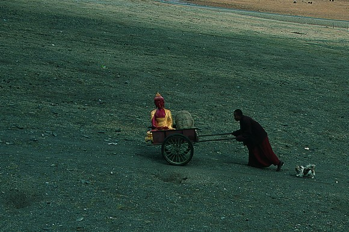

<!-- # ＜天枢＞人心的重建 -->

**我们又何尝不是在种种灾难中习惯了灾难，在种种沉默中默认了沉默？那些在北川老县城祭奠时用手机拍照、吃瓜子、扔一地垃圾的围观者，又何尝不是我们的影子？有多少人会在地震后认为，是举国体制成就了救灾奇迹？在天灾之前，就有多少人祸泛滥，我们是如何用傲慢、贪欲、漫不经心，轻易地剥夺了别人的尊严、身份，乃至生命？**

# 人心的重建

## 文/范承刚（暨南大学）

玉树仁宝寺，僧人在搬运佛像。高屯子摄。

#### 一

去年夏天，我正在玉树。那时地震已过了124天，废墟上空的尘土慢慢静落于地，人们的生活也复归往常。吊车轰鸣着开始清理瓦砾，玛尼石堆旁又环绕起朝圣的老人，孩子们在空地上玩着游戏，理发店、服装店、小餐馆的老板也在帐篷外挂起了招牌。只有深夜到友人家作客时，隔壁毡房里静静点起的一百多盏酥油灯，映照着这家人虔诚而悲伤的身影。

在玉树，时间就像一幅油画，触到的风轻，踏过的草柔，有时我不禁恍然：这里曾经历一场劫难吗？答案又似乎是确然的。所住的帐篷里，床下长着黑色的小草。破败的庙宇里，木棍支撑着残垣，佛像摔断了头颅。人们向你讲述如何死里逃生如何痛失亲友，与你谈论玉树的前世今生。这时候你会发觉，地震所造成的伤口，仍在人们的心里吱呀作响。

藏族音乐人代尕花了42年，走遍三江源头，收集了500多首频临失传的民歌。他一生为玉树文化的凋敝痛心疾首，比如80多种白龙卓舞与老人们一起渐埋荒土，如今只剩下了30多种。地震后他最伤心的一件事，是家乡再也无法回到以往。

玉树大多数的房屋建在首府结古镇，地震前，这里的房子都是藏民自建，各具特色。地震后，按照国家规划，玉树要建成“高原生态型商贸旅游城市”，房子都是统一建造，都是一样的装饰布局，一样的水泥砖头。

代尕说：那我怎么找到自己的家？

地震里有些房子没倒，但按照规划也要被征用拆除，很多老百姓不满上访。玉树县委门前为此增添了警卫，守备森严。

后来我看新闻，在新华社记者的笔下，看着红色屋顶、米黄色墙壁、铝合金窗户、浅红色地砖，牧民扎西索南灯满脸欣喜地说：“这辈子没住过这么漂亮的房子！”

我想，欢呼声里，代尕老人的声音是多么的不合时宜。

同样的困惑，来自于玉树的摄影师冶青林。地震后几分钟，他就拿起了相机，然后找到玉树仅存的网络，把照片发布了出去。震后第二日，国内所有门户网站报道玉树地震的图片，几乎全部来自于他。

后来的十多天，冶青林一直干着这件事。那时的想法，就是第一时间把玉树的灾情传出去。有一天，单位领导领导找来，勒令他停止：“这样做不好，有国际影响。”

冶青林很疑惑：为什么不让大家知道玉树真正的情况？

#### 二

还有一些声音，在轰轰烈烈的重建中更显微弱。这些混杂着担忧、愤怒、疑惑的声音，产生于地震之前，但同样起源于某种坍塌。明嘉是玉树州三江源生态保护办公室主任，他出生的地方叫长江村，村外不远是通天河。在他记忆里，儿时的河岸芳草茂盛，人一钻进草丛，就消失在晨雾一般的翠绿里。

当他31岁时重返通天河，河畔像被山火肆虐而过，只剩半个指甲高的草稀疏覆盖着。河水也由清而浊，裹挟着泥沙而去。而在整个玉树，伴随着财富与人口大量涌入的，是矿山的满目苍夷、牧场的荒芜凋敝，随处可见赶着瘦弱羊群、走牧流浪的疲惫藏民。

明嘉不明白：以前的玉树去哪里了？

作家江阳才让写了一本小说叫《康巴方式》，他想借此清洗外界对康巴人片面又脸谱化的想象，也想借此挽留康巴人的独特生活，“一种自由、率真、缓慢的生活，以及一种非对抗性的坚强”。

一次夜间聚会，我们聊到越来越多的藏族僧侣进入内地，其中有一些招摇撞骗。这原本是不敬的话语，江阳才让却狠狠拍了拍大腿：“我们一直想说，没说出来。你们说得真对。那些僧人，怎么变得像汉人一样！”

怎么会变得像汉人一样？我已不记得当时如何回答。

大胡子文扎是多年前与索南达杰一起保护藏羚羊的同伴，索南达杰被盗猎者枪后，他投入到青藏游牧文化的保护当中。

他说，越是深入了解藏族文化的精髓，就越痛心地感觉到，在外来文化对牧区的任意解释和人类过度开发的贪欲中，支撑藏族文化的土地正在慢慢消逝。

和这些人聊天，你能感觉到他们对故乡或淡或浓的忧愁。无论是地震前后，他们的故乡都在沦陷，甚至，地震加快了这种沦陷。又或者，如果不是地震，沦陷将悄无声息，就像四川亚丁那些为建旅游索道而被砍掉的一颗颗参天大树，生于神山之上，倒下却无人知晓。

而这种沦陷源于人心里的匮乏。我们匮乏谦卑，匮乏耐心，匮乏对生命的重视，也匮乏对惩戒的敬畏，由此人世间傲慢滋长、恶业丛生、颂歌四起、硕鼠猖狂。于是，民间舞者扎西昂江和他的同伴们在瓦砾堆上苦练了几个月，在太阳底下等了两个小时，只为了给前来慰问的中央某领导跳五分钟的欢迎舞蹈。

代尕老人在废墟里挖出整理了几十年的音乐笔记，但悲哀地看到会唱民歌的年轻人越来越少；冶青林还在坚持拍照，但玉树的领导会在背后说

“这个人联系外媒，靠不住”；明嘉继续为三江源而奔走，但被挖空的山和人心里留下的裂痕一样，已无法弥补。

#### 三

当我读到四川地震三周年的一些新闻时，深感世间的苦难和荒谬如此相似。在那样一场地震中，古羌遗址的萝卜寨消逝了，黄泥雕群的布瓦村没了，石砌古雕的阿尔村面目全非，成百上千尚不能统计姓名的孩子失去了生命。时至今日，这些像被狼一样被叼走的孩子究竟为何而死，不得而知。善人在惩戒罪恶之前，却已被罪恶所惩戒。没把建造豆腐渣的人抓进监狱，只把追问豆腐渣的人抓进了监狱。真让人有些以自由为耻。

从“地震摇了2分钟，都江堰前进了20年”到“汶川，三岁了”，再到央视播出的《中国奇迹》，我能看到的是人心的粗鄙。太多人急于把鲜血饮作庆功酒，把遗忘当成乐观，把沉默视为成熟。

而这些人又何尝不是我们？我们又何尝不是在种种灾难中习惯了灾难，在种种沉默中默认了沉默？那些在北川老县城祭奠时用手机拍照、吃瓜子、扔一地垃圾的围观者，又何尝不是我们的影子？有多少人会在地震后认为，是举国体制成就了救灾奇迹？在天灾之前，就有多少人祸泛滥，我们是如何用傲慢、贪欲、漫不经心，轻易地剥夺了别人的尊严、身份，乃至生命？

玉树的秋松卧色活佛，隐居在三面环山的夏日寺，我们去拜访他时，夏日寺在地震中遭到损毁，他们在草地上搭起了十多顶帐篷，秋松卧色活佛住在最小的一顶帐篷里。

我们问他：灾难之后，人们如何生活？

他回答：我此生经历过许多磨难，但从未产生怨恨。我总是将一切与我有关的灾难的原因追寻到自身，追根到无始以来自己所有的罪孽上。所谓的“地狱”，是人的一种心境的再现。是否让自己的心灵堕入地狱，并不取决于外力的作用，而是心灵对于自身品行的评判。

（采编：安镜轩；责编：刘一舟）
