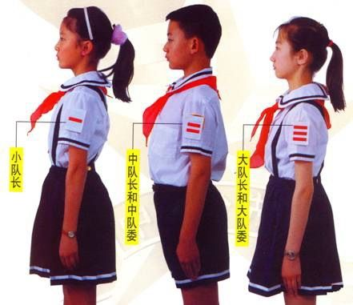
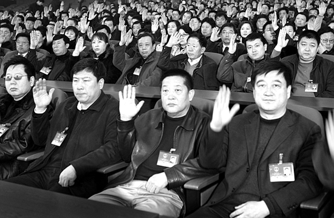

<!-- # ＜摇光＞民众的狂欢 -->

**如果百姓在发表意见前多思考一会，“高级知识分子”在看待民意时少一点浮躁和自负，当局人士能更结合现实客观地对待民意，这个社会不会因为某些民意的“极端”而极端化，反而会更加的成熟和理智。

**

# 民众的狂欢

## 文 / 尹桑（Bentley University）

前言：“民意”这个词在媒体的字里行间、聊天的只言片语里屡见不鲜，那么，到底什么是“民意”？“民意”有对与错么？“民意”又该如何解读？微不足道的“民意”能有什么作用？若想熟悉“民意”，就请在这个多事之春，享受一场民众的狂欢吧。

**一．“五道杠”和民意的解读二．拉登之死三．民意之无作为四．

“极端”民意后记：重棒捶鼓

欲于谁听**

“五道杠黄艺博”“武汉市少先队总队长”“未来领袖黄队长”“林妙可不和黄艺博联姻我就不相信爱情了”——我放下书包刚打开人人，整个首页便充斥着这么一个小家伙。稚气未脱的脸庞被涂抹了“成熟”的胭脂，身着衬衫、大衣和红领巾的他，站在以雪松、书房或者养老院的背景下，抬头挺胸、微笑面对镜头摆出一副安定祥和的模样。具体是啥模样？打开新闻联播便时时可见，“领导架子”是人们对他形象最贴切的描述。

#### “五道杠”和民意的解读

人们到底在讨论什么？“五道杠遇到孩子，就如同硫酸遇到了嫩肉，成为一种奇特的焦土”，五道杠这个标志首先成为了人们关注的焦点。众所周知用人人网的大多是在校大学生高中生，都生在一个要入队宣誓的年代，很多人小时候也带过一道杠二道杠或者三道杠，可是五道杠确实是绝大多数人都没有见过的一朵奇葩。曾经一个“你带过几道杠”的相册都能引起人们对童年的追忆，这个深刻显眼的五道杠在互联网的催化下又一次产生了奇特的效应从而吸引了大众的眼球。在官本位思想早已被入侵的童年里，“几道杠”对大部分学生来说只是意味着：欺压、打小报告和家长嘴里的“别人的孩子”，当大家现在纷纷脱离苦海后看到这个“五道杠”，看到他博客里“活动小能手”“热心公益”“发表过100多篇文章”等诸多溢美之词时，产生的自然是极大的厌恶和不屑。关于五道杠的PS照，恶搞文以及谣言纷纷借势而起，“这些孩子这么小就想做大官并给自己造势炒作，当我们老了的时候中国将会怎样？”“官本位的思想已经荼毒到了孩童了，救救我们的孩子吧！”等声音也不绝于耳，虽然某些有失偏颇，但也往往引人深思。

当人们在网上肆意狂欢分享这个笑点槽点的时候，也传来了一些理智而“刺耳”的声音，“黄艺博不过是个孩子，你们这样肆意的打击他，才是真的毁了他的前途。他这么小能知道什么？你们这样嘲笑他又为了什么？”对于这些评价“民意”的话语，我首先想提出一个问题，民意有对错么？自然是没有的，民意来自人民，人民的意愿何来的是非对错，对于它，古今中外多是解读，而很少评价对错，哪怕是德国人民对于纳粹的疯狂支持亦不会被扣上“人民错了”的帽子。

我认为，以上那种对**民意的解读**是不够客观的，更不能正中要害并看到问题本质核心所在。民意是指人民的意愿，有时候并不是十分客观，甚至做不到是理智的，所以也就更做不到某些知识分子心中的绝对正确；而往往民意做不到理智客观的时候，一些自诩“理智且独醒”的知识分子便会出来批判“愚民”了，这恰恰是我不希望看到的。举个更直接的例子，前一段时间的药家鑫案件，当人民群众纷纷喊杀的时候，有一些他的同学和专家站出来说话了“如果再这时候不给他支持的话，他就真毁了”“死刑不合理应当取消，激情杀人不应该判死刑”“不要让司法成为人民暴政的武器”，激情杀人、人民暴政、道德善恶一系列专业词汇抛在了民众面前，谴责着他们的不理智和愚昧。何为民意？民众的声音而已，民众的声音并不是法庭的判决书，在这件案件中，民意并不是杀药的侩子手，而是监督司法公正的利器，非民意杀药、乃民意监督法律杀他尔。在这件事中，如果对案件本身的解读，可以读出很多专业的知识；但是对**民意的解读**却并不应该在于讨论人民暴政与否，而是应该读出人民对政府司法机构的极度不信任、对特权阶级违法却可利用一切资源为自己辩护的厌恶以及一种对独立公正司法的希冀，我觉得这才算是一个对民意相对客观的理解。

回到这个问题上，网上对“五道杠黄队长”的议论和嘲讽应该被怎样解读呢？其实大家都心知肚明：相对理智的人民都不会对这个乳臭未干的毛小子过多苛责，尚未成年的小学生又能知道什么官本位思想的危害？取得好成绩和老师家长的表扬是他唯一想要的。有些人说他的家长才是罪魁祸首，其实我觉得也不然。在你不知道这件事会在网上轰动的前提下，如果你儿子能遵守学校纪律、取得好成绩、做一些面子工程然后做一个“五道杠市级干部”，你会引导他走上这条“正道”么？我相信目前来看至少大部分家长是不会反对的，因为在他们眼里这样总比不学无术要强吧。所以说他家长其实也并没有大错，要错也只是在这件事的处理上缺少智慧，不小心将他们的儿子推上了网络的风口浪尖，引起了一场轩然大波而已。人们之所与对这件事、这个人投以极大的热情，正是他们对于童年的回忆以及对现今教育系统、体制和主流思想的反思。当他们长大以后回顾这段往事，都深知孩童时期的官僚主义给本不轻松快乐的童年带来了多大的创伤，再结合一系列的社会问题，更深的理解了这种官本位思想根深蒂固的危害，以及这一代人变成家长后造成新的恶性循环。能反思这种现状的人往往都是经历过童年官僚主义以及现在有了一定思考的大学生，所以单纯说他们愚昧肯定是不对的，总体来看他们也只是对事不对人，顶多带了点玩笑的戏谑，当李宇春这个无辜的歌手被诋毁攻击了几年后，黄艺博这点小风波也用不着过多的上纲上线吧。解读民意，更多的应该是结合社会情况和以及去了解人民的本意，前面药家鑫案件反映的是法治政治混乱的中国现状以及人民对司法不独立不公正的强烈不满，后者黄艺博事件反映的则是官僚主义深入中小学的教育现状以及成年的大学生对于过往教育体制的反思。

有趣的是在同一天里，大洋彼岸的民众也开始狂欢了——本拉登死了。

#### 拉登之死

刚关校内就发现这一波“黄总队”在校内刷完屏，Facebook上的美国人也开始刷屏了。内容里的关键词有以下：“美国万岁！”“美国就是牛逼！！”“美利坚合众国威武！！”“兄弟，这就是美国！！”乍一看还以为美国统一了世界，慢慢看完了所有的状态还是一头雾水，打开Google News的主页才知道——奥萨马本拉登在巴基斯坦被美军击毙了。

回忆“911”事件到今年为止已经快10年了，当年9岁的我回到家中吃午饭的时候，看到了“新闻30分”里的这幕，不由的振臂高呼“打倒美帝国主义！”，胸前的红领巾和肩上的三道杠随风飘扬，心里想着这个人一定不能被美国抓到；而奥巴马终于没有让美国人民等到10年，在这个“共产国际劳动节”的夜晚告诉了他的人民，这个和美国人作对数十年，策划袭击纽约双子楼随后东躲西藏还不忘放视频嘲讽美国的头号敌人今天被击毙了。图书馆所有电视都在放奥巴马的演讲和相关的新闻讨论，本来在馆里看书的男男女女也一个个拿了书包疯狂地跑出了门，唱着国歌裸着奔。听起来有点疯狂不是么？全美国的人都陷入了无尽的疯狂当中，网上如春笋般冒出的派对视频，尤其是大学生为首的一群人，在知道消息后的一小时内都纷纷聚集到校园里街道上拿出啤酒和夜光灯去唱歌游行，星期一的凌晨2点却闹的宛如白昼，仿佛忘了几个小时后就开始的期末考试。

有民众的狂欢，自然就产生了理智的苛责。有人问道“美军不经过审判就擅自去外国领土杀了一个外国人，于是所有的美国脑残们就开始狂欢了？狂欢一条生命的逝去就是美国人的姿态？”“反恐和民主都是美帝国主义的遮羞布而已，政府倒是利用这次事件来调动起全民狂热的爱国主义。”我觉得，如果真的是举国欢庆一个人的死亡自然是不对，但是这次美国人欢庆的原因真的是欢庆本拉登死么？我觉得不尽然。看看他们在Facebook上发的状态，基本都是因这事从而抒发一些自豪感，并非是对本拉登本人以及他的死发出的欢呼。这自豪感又从何而来的呢？和国家民族扯上关系的事情总得换位思考，这样试想一下，如果2001年1月10日一群恐怖分子劫持几架飞机在上海撞毁了东方明珠塔和金茂大厦导致了数以万计的人员伤亡，10年后这次袭击的策划者被中国城管在某地击毙，中国人民会怎样想呢？是家家鞭炮还是所谓“冷静下来思考默哀”？这件事其实民众关注的并不是本拉登，而是一种对自己国家面对危机却成功处理而产生的兴奋，对心怀不轨的恐怖分子的回击，和北京申奥成功时的那种自豪感在本质是一样的。只不过美国人民已经等待的太久太久了，阿富汗和伊拉克战争局势的深陷泥潭，美国人期待的正是这一刻的情绪的释放。关于本拉登的死我觉得也用不着太上纲上线，他如果被抓到审判也一定是处于反人类罪的绞刑，何况他提抢反抗被击毙也属情理之中吧，不是么？

#### 民意之无作为

奸臣当政，乱臣篡权，国事于我等小民何干？民意无作为这个理论虽然一直被指责为“甘于屈服的奴才理论”“悲观主义”和“犬儒主义”，但是却有他一直存在的道理和合理性。

先说黄总队吧，我记得从我小的时候就有人开始抱怨“还孩子童年”，虽然近几年声音越来越大，但是少先队、共青团、爱党爱国教育始终还是强制被按进小学六年的时光里。回顾往事，少先队员等一系列的回忆似乎已经遥不可及，可是当你回到现代小学校园的时候还是会发现他们胸前飘扬的依旧是经久不衰的红领巾，肩膀上仍是鲜红霸气的三道杠，这种“红色教育”还存在于这个已经步入21世纪第二个十年的“现代化中国”，经济发展了，科技现代了，军事强大了，为什么基础教育里的那落后腐朽无用、却吞噬童年的“红色教育”还是存在呢？不仅还存在，近期还愈演愈烈，什么某些省市还发展数千人唱响红歌、某领导“唱红是为了教育年轻一代”，大行其道。有些人会说，不喜欢不支持的人估计都是小时候的差学生被班干部批评了留下的心理阴影和抵触情绪吧？这种观点只能说是片面的，我小时候也是所谓的“三道杠”，普通班长见了我要立正敬礼，可算是“队内成功人士”了吧。可是给我的回忆又是什么呢：打小报告可以被老师喜爱、团结大部分人打击小部分人拉拢人心、和上级特别是教导主任搞好关系可以顺利连任，而我长大以后去回忆思考这些事时，存在的多是反思和自责，为当时自己年幼无知犯下的种种错误感到追悔莫及，也是留下了阴影。那为什么这个“上层民众”讨厌而“下层民众”也憎恶的制度，依旧坚挺不倒呢？因为讨厌的人只是“民众”，没有实权就算我们再讨厌也是徒劳无功，无法直接改变体制规则。从这个引申开的各种问题更是数不胜数，李刚敢上CCTV、药家鑫敢下车捅下八刀，都是因为他们深知自己掌握的是“实权”，而不是民众所逞的“口舌之快”。

相比于中国这次消极的民意而言，美国的这次狂欢带有了更多的积极层面：人民夹道欢庆美国反恐的又一次成功，庆祝美国的国际形象和影响力得到了再次肯定——虽然这些狂欢对于美国的反恐大局本身没有任何影响。制服了本拉登，但是美国的反恐道路依然存在重重艰难险阻，杀死本拉登一人并不意味着基地组织的终结，甚至已经很难影响到基地组织。扎瓦赫里长期作为基地组织的二号人物，多年来担当着组织内的重要角色。而且先进基地组织已经有了一个相对松散的内部结构，在各个地区和国家他们皆有自己完备的组织纪律，相互之间并不互相关联或制约，本拉登作为他们心中激励自己的精神领袖虽然已死，但是带来的并不一定是消沉而是更大程度的反击。对于已经开始庆祝的美国人民来说，快乐情绪可以使他们放松一段时间，却不能舒展开政府和军方的眉头，在宣布击毙本拉登后，美国政府随即宣布了一系列的防范措施，迎接接下来即将可能出现的打击报复。

#### “极端”民意

既然消极的批评的民意中国政府听不进去，而积极乐观的民意又无法给美国政府排忧解难，是不是说民意就是无用的呢？不，在我看来有一种民意最为可贵，那就是很多人视为“洪水猛兽”的“极端”民意。

**人民并不愚蠢**。虽然韩寒这样的“新青年”都写过“人民是最愚蠢的”，我却认为人民并不愚蠢。个体的声音可能有失偏颇，但是群体的声音确不能用“愚蠢”二字来形容——哪怕是最极端的声音。从网络上闹的沸沸扬扬的事件来看，网友大骂“春哥”、网友诋毁抵制韩国组合“东方神起”到现在的“严惩李刚李启铭”、“不杀药家鑫不足以平民愤”以及嘲讽辱骂黄艺博这些声音，在我看来都不是愚蠢的，反而是一个个值得去理解、去解读、去反馈的资源。不说春哥和东方神起，李刚事件中的人民是愚蠢的么？虽然时不时总是能看到网上对李刚李启铭咬牙切齿恨不得他们去死的民众，但是在这些声音的下面，更多的是理性的回复“李启铭只是交通肇事而已，如果要判也是界定他是否危害了公共安全，而李刚本人则要另立案调查”，很多门户网站的投票也显示群众更愿意界定这一次为交通肇事，也有一部分人认为他是危害公共安全（多在他所说的那一句我爸是李刚的话上），当他的案件审出来了以后舆论也就渐渐平息，“一命换一命”的说法也渐渐淡出了讨论的视野。这是一次可贵的进步，既然法律说交通肇事得判有期徒刑，受到“以命抵命”思想影响几千年的中国人最终还是愿意按照法律来判罚他，而不是索他性命，这足可以说明人民是愿意相信法律的、是愿意依法行事的，他们不愿意看见的只是某些特权阶级利用权力践踏法律而已。再看药家鑫的事件，人们多是喊“杀，立即杀”，为什么李启铭说出“我爸是李刚”这种极度触痛大众平民百姓的话后都受不到药家鑫这种“特级待遇”？大部分人就算一开始不了解事情，在渐渐地熟悉事情真相以后，都会有自己的判断，知道故意杀人和交通肇事的区别。现代社会的中国人民已经不会盲目的仇富，不会盲目的恨官，人民会思考亦会反思，所以在我看来人民并不愚蠢。

有人要问了，“普通大众在不了解真相的情况下，就一齐要求处死药家鑫，难道不是多数人的暴政么？”不，说这是多数人的暴政既不客观也不结合中国现实，这只是一种多数人**意识的极端**并非暴政，而极端之所以存在正因为“矫枉必须过正”（比如对黄艺博的围观能不能引起广大家长和老师的反思？我看行）。首先，为什么会有极端的民意？极端的社会现象才会催生极端的民意。杭州的胡斌撞飞一人数十米远数米高并致死，而交警做出调查后竟说他的时速仅有七十码、李启铭在肇事杀人后高呼我爸是李刚并且事后李刚能从容走上CCTV道歉以及后续所谓的追杀律师事件、钱村长死在车下却有多处疑点并有目击证明是被人谋杀却不了了之，和现在的药家鑫杀人后多少法律专家为他用站不住脚的理由辩护并且让他可怜的形象又上了中国中央电视台。为什么穷人犯法从严发落、甚至不取证就强行逼供（还有关了杀人犯几十年最后受害者没死的情况），而富人犯法却要唤起大家对生命的同情以及对“激情”的原谅？极端的社会财富不公导致了最应该独立公正的司法也倾斜了它的天平，从而催生了这种“民意极端化”——罪魁祸首是民意么，是人民么，谁更需要负责？答案不言而喻。其次，这种仅仅是“意识极端”的民意真能杀人么？之前有多少人喊杀李启铭，难道法官就会根据问卷调查于是就处死李启铭？自然不是，法官依法判决，有期徒刑附上一定量的赔款已经渐渐缓和了民众。当有些“理智人士”害怕所谓的多数人暴政的时候，我想先问他们现在这些人民到底有没有“当政”？网民也好，生活中街头巷尾的老百姓也罢，都是手无实权的平民，在中国目前的社会现实下，人民还不足以造成“暴政”。看似杞人忧天、防患于未然的专家，在不结合中国社会现实的情况下就抛出这些名词，只是试图吓走民众从让他们**噤声**罢了。还有，人民是真的是想药家鑫死这么简单么？明显不是，如果想要一个人死，这么多“愤怒不理智的”人群早就去啖其肉饮其血了，而人们在网上爆发的热议，只是希望法律给民众一个公平公正公开的答复罢了。面对这个财富、权利和权力极度不平衡的这个社会，在这个法律不能发挥其公平效用的制度里，人们明白，如果他们不吭声、不表现、不去把自己的意见极端化的话，这个天平是扳不回来的，而只有扳回来，法律才不会因凶手的家庭、财产或地位而动摇。其实药家鑫本人死不死早已经不那么重要了，他只是一个“Symbol”而已，人们用自己的标准通过他来看法律是否存在。人民并不愚蠢，**当人民对此事件表达出急切的关注时，法律也休想愚民**。

有人又要问，上面说的都是“意识极端”的民众，那“行为极端”的民众是不是洪水猛兽呢？我之所以这里谈的是“极端民意”而不是“极端民众”，就说明意识和行为时可以分割的：极端的行为虽发自极端的意识，但是**并不是意识的过错**，而是谁利用和如何利用的问题。举两个同是二战时期的例子：一战结束后德国百业待兴，国内经济政治也饱受不平等条约的痛苦，1929年爆发的经济危机导致国内几百万人同时失业，催生了极端的渴求社会进步、人民生活提升的民意。这时候希特勒出现了，他把这种极端的意识转变为了对犹太人的仇恨，最终组成了臭名昭著的纳粹政府（值得注意的是，在民众普选中他从未获得半数以上德国人的支持，足可以证明民众就算再极端也并不愚蠢）。第二个例子，在日军偷袭珍珠港并造成大批伤亡后，美国民众群情激奋从而导致了美国顺利加入二战，但美国政府并没有做反日宣传，而是保护起了在美日侨，更没有把这个问题上升到民族仇恨上。从这两个例子可以看出，极端民意的爆发必然有因，但是民意本身没有危害。如何结合社会现实看待民意、如何正确合理面对利用民意，才是问题的重中之重。

#### 后记：重棒捶鼓 欲于谁听

其实讲了这么多并非皆因为黄总队和本拉登二人，网络议政早已不可避免地成为目前议政的主要形式；而其中民意到底应该怎样分析怎样看待，是老百姓、是知识分子、更是当局人士所面对的重要问题。其实，民意并不简单，却也并不严重：不简单在民意多多少少反应了当今社会现状和人民诉求，不严重在其实民意中所包含的原始信息并一定是他们真正想说的想做的。拿美国做例子，不管是反恐还是反战，堕胎问题还是死刑问题，宗教事宜还是同性恋现状，对于那些最极端的民意、抗议和游行，政府和媒体总能做到客观和温和的引导，营造出一个百家争鸣的民主社会。如果百姓在发表意见前多思考一会，“高级知识分子”在看待民意时少一点浮躁和自负，当局人士能更结合现实客观地对待民意，这个社会不会因为某些民意的“极端”而极端化，反而会更加的成熟和理智。

（采编：陈轩；责编：陈轩）
