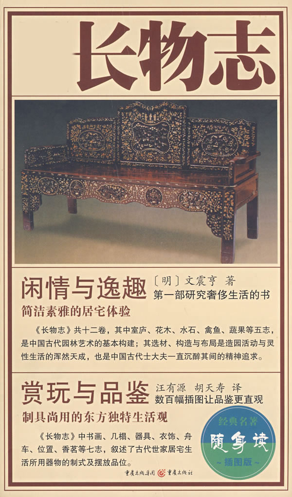
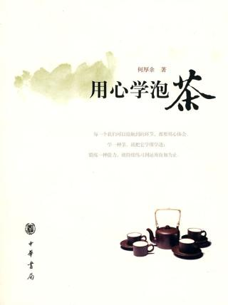
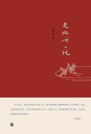
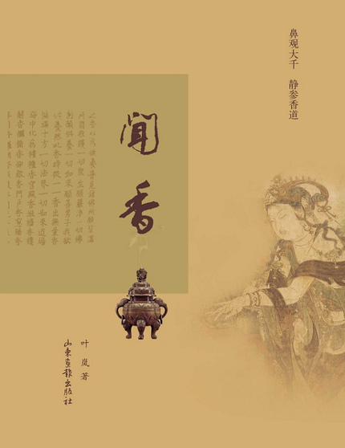
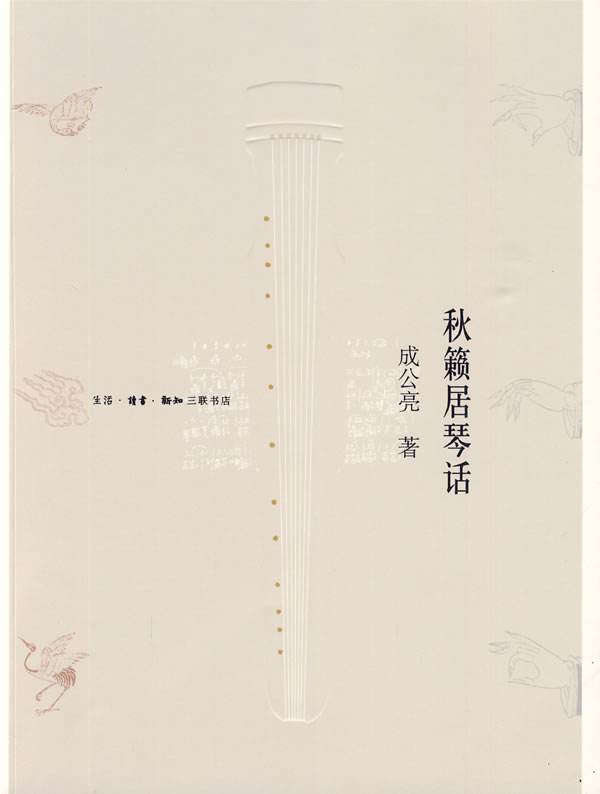
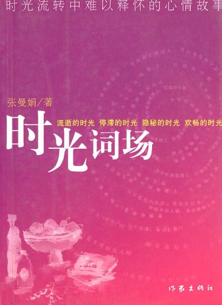

<!-- # ＜北斗荐书＞本期主题：一帘风月一床书 -->

<!-- # 本期主题：一帘风月一床书 -->

## 荐书人 / 谷卿（暨南大学）

一位体制内的朋友新年乔迁，给书房取名“两宜斋”，颇有“学而优则仕，仕而优则学”的涵义，意谓读书行政两不误。他嘱我写一幅对联装点书房，我以“四壁诗书三不朽，一窗风月两宜居”赠他，亦庄亦谐，有高尚理想也有闲情逸致。这位朋友初涉官场，自信颇能两相宜，只不知那些固有的个人小趣味能否真的一直保持。

我们这一代的成长，大致有着相同的经历，接触所谓“文化”也大多是从读背诗词、练习书画开始的。我有很多极具天赋的同学、朋友，却在毕业、工作之后再也对这些“没用”的事儿提不起兴趣，每天努力地工作、拼命的赚钱，从某种意义上来说是非常成功的；但是，每每见面，总觉得他们的精神气里少了点什么，或是失去了点什么，是自得、自适，还是安闲、平静？不同的生活确实能把人变成不同的模样。在这里举出的几本书，可以让我们短时间内亲近亲近这些久未亲近的东西，也许它是小玩意小把戏，也许它是徒费时间毫无意义的，可是不为无益之事，又何以遣有涯之生呢？

明人陈继儒在《太平清话》中有这样一段话：“凡焚香、试茶、洗砚、鼓琴、校书、候月、听雨、浇花、高卧、勘方、经行、负暄、钓鱼、对画、漱泉、支仗、礼佛、尝酒、宴坐、翻经、看山、临帖、刻竹、喂鹤，右皆一人独享之乐。”不得不佩服明清文士的闲雅，这样清明自喜的生活，我们还能有吗？

### 推荐书籍（点击蓝色字体书目可下载）：

[**1、《长物志》**](http://ishare.iask.sina.com.cn/f/9544355.html\)

**2、《用心学泡茶》**

**3、《更与何人说》**

**4、《闻香》**

**5、《秋籁居琴话》**

**6、《中国历代闲章集萃》**

[**7、《时光词场》**](http://ishare.iask.sina.com.cn/f/15514560.html\)

（采稿：徐毅磊；责编：徐毅磊）
