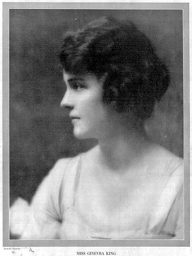
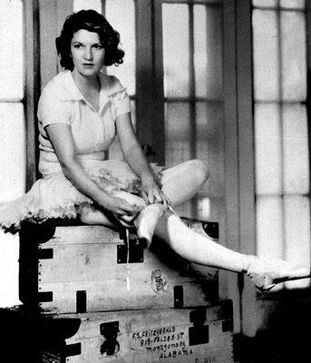

<!-- # ＜玉衡＞毁掉菲兹杰拉德的女人 -->

**他毁了她，她毁了他，可这远远不能说清他和她之间最深沉的理解和冲突。他控制不住把她灵光四溢的日记抄袭进自己的小说，她控制不住在作家的妻子之外为自己寻找其他的身份。他和她都困惑了，哪一部分的生活是自己的，哪一部分的生活是对方的。即使在她最疯狂最虚弱的日子他们还交换着炙热的情书。她对他：“月亮像失落的钱币掉进深山，草地阴沉而刺鼻，我想让你靠近，我触碰你，像秋天的平静，甚至带一点夏天最后的回声。”他对她：“你是我见过的最精致最可爱最温柔最美丽的人，即使这样也言犹不及。你所忍受的我没有其他人能忍受……”**

# 毁掉菲兹杰拉德的女人

## 文/沈诞琦（普林斯顿大学）

海明威在《流动的盛宴》中直言不讳地说，斯科特·菲兹杰拉德（F. Scott Fitzgerald）是被女人毁掉的。这话有失公允，女人成就了他，女人也毁了他。伟大的人总是被成就他的东西毁去，无一例外；而大部分人之所以默默无名，只是因为没有遇到所能成就他们的。

姞内瓦反复恳求他：“请，别把我理想化了……”而他从十八岁的那场新年舞会起唯一能做的事就是把她供奉在最高不可攀的祭台上。十年后他给当年的自己取了个了不起的名字：杰·盖茨比(Jay Gatsby)，而那些他与她相爱时走过的街道搭成了一架梯子，一直通向树顶上空一个秘密的地方——他可以攀登上去，如果他独自攀登的话，一登上去他就可以吮吸生命的浆液。然后，在最高不可攀的祭台上，“她洁白的脸贴近他自己的脸，他的心越跳越快。他知道他一跟这个姑娘亲吻，并把他那些无法形容的憧憬和她短暂的呼吸永远结合在一起，他的心灵就再也不会像上帝的心灵一样自由驰骋了。因此他等着，再倾听一会那已经在一颗星上敲响的音叉。然后他吻了她。经他的嘴唇一碰，她就像一朵鲜花一样为他开放，于是这个理想的化身就完成了。”[1] 盖茨比吻了黛西，菲兹杰拉德却从未吻过姞内瓦，正因为没有，她完美无暇。她不只是黛西，还是伊莎贝拉、罗斯林、吉斯敏、朱迪、米妮、婕瑟芬妮[2]。那些爱情故事里受着无上宠爱的女子，都是他幻想着的姞内瓦，而故事的扉页永远献给另一个女子，他的妻，“给珊尔达”、“再一次给珊尔达”。《了不起的盖茨比》里黛西伤心地对盖茨比说，“单独谈我也不能说我从来没爱过汤姆，那不会是真话。”[3] 同样的，就算菲兹杰拉德单独和姞内瓦谈，他也不能说他从来没爱过珊尔达。恰相反，他爱珊尔达远胜过姞内瓦，因为他娶了她，因为他眼看她变老，因为他恨她，因为他们彼此逼死了对方。

**一、“我只记录闪光的时刻。”**

他和她分手后互相要求对方毁去所有通信，她照做了，他没有。四十四岁时，他死于酗酒过度引发的心脏病，死时濒临破产，妻子关在疯人院。他时年19岁的独生女整理遗物，在一个标记为“绝对私密”的档案夹里找到了227页打印稿，全部是一位名叫姞内瓦·金（Ginevra King）的来信。

他的独生女将信件寄还原主，姞内瓦·金早已为人妻人母，丈夫是芝加哥百货商店大亨。姞内娃将书信放进衣橱的角落，衣橱里挂满了华贵的晚礼服，每天晚上她都在这个衣橱中挑选一件，端庄美丽地出现在晚餐桌前，扮演与生俱来的皇后。在这等级森严的豪富家族，每一代只有最美丽的女子才被命名为姞内瓦，姞内瓦，语出达芬奇的名画《[Ginevra de'Benci](http://www.nga.gov/fcgi-bin/tinfo_f?object=50442.0&detail=none)》，弗洛伦萨的贵族小姐，优美，纯洁，智慧。她的外祖母叫姞内瓦，她的母亲叫姞内瓦，她叫姞内瓦，她的女儿叫姞内瓦，她的外孙女中最美的一个也叫姞内瓦。又过了许多年，姞内瓦会问她同名的外祖母：“外婆，这箱子里锁着什么？”她盛装浓抹的外祖母神秘地摇摇头。直到她死的那一天，人们才发现了箱子里的227页书信，书信上压着一本日记，少女在热恋的晕眩中记的字句，日记的扉页上题着：“我只记录闪光的时刻。”

姞内瓦的右手小指闪着光，是一只玫瑰金的戒指，戒指上刻着“Big Four 1914”。1914年，15岁的姞内瓦是芝加哥“四大金花”之冠，四个最美丽最富有最尚交际的少女。这并非纨绔子弟私下评选的花名，而是姞内瓦和她三个门第相当的好友自封的称号，她们煞有架势地专门定做戒指，又穿戴漂亮裙子合影留念。大概也只有身世最好容貌最美的女子能有这般自知和自信，而姞内瓦两者都有。她的父亲是成功的证券商，她的外祖父是建筑大亨。她通体圆润无骨，小而精致的手，长而瘦弱的腿，头发深而卷，深棕的眼睛永远闪着亮光。她的声音低沉沙哑，高声说话时不断变着调子，像在歌唱，“把每个字都唱出一种以前从未有过、以后也决不会再有的意义。”[4] 1915年1月4日，在明尼苏达州圣保罗市的一场新年聚会上，十八岁的菲兹杰拉德见到了十六岁的姞内瓦。姞内瓦原是造访同学暂留圣保罗，人未到却早就芳名远播。当时就读普林斯顿大二的菲兹杰拉德回家过圣诞节，久闻姞内瓦的美名，别人问他1月4日的聚会去不去，他就在朋友圈子里放出话来，“如果姞内瓦去，我就去。”她去了，他去了，他在一大群少男少女中见到了她，前后说了不足几句话。而这几句匆忙的交谈已经俘获了他，他本该第二天乘火车返校，却决定推迟一天，好在第二天的舞会上和姞内瓦跳舞。1月5日晚上他们跳了一整夜的舞，十一点他要去赶火车，她送他到门口，四周都是熟人，出于害羞他们没有接吻，他们握着手，他说他会写信，她说她会回复。当夜的日记里她匆匆写下：“斯科特完美极了……他11点离开去普林斯顿——噢！”

十八岁的斯科特·菲兹杰拉德完美极了，只要不提他的学业和他的父亲。他高中时就全校倒数第一，颇费了翻人情关系才进了普林斯顿，大一期末全部科目都为中差，他并非资质愚笨，只是懒于受人驱使。他的母亲的娘家本是极有钱的，可惜外祖父死得早，孩子又多，庞大的家产到菲兹杰拉德幼年时就所剩无多。他的父亲生意失败，靠在小舅子的公司做杂货销售商支撑家用。虽是温饱无虞，依照父亲的地位他本无缘进入上流子弟的交际圈，人家不过念在他外祖父的面子上，每每聚会都还叫上他一起玩。而只要不提学业和父亲，菲兹杰拉德完美极了。他长相极度英俊，脸部的轮廓甚至比女人更美，他嘴唇敏感又柔软，淡金色的头发从中间分开又小心地梳到后面。青春期的几年来，他已经自成一番风度，说话时既风趣又不失真诚。十年后他会在《了不起的盖茨比》里这样描述自己：“他心领神会地一笑——还不止心领神会。这极为罕见的笑容，其中含有永久的善意的表情，这你一辈子也不过能遇见二三次。它面对着——或者似乎面对着——整个永恒的世界一刹那，然后就凝注在你身上，对你表现出不可抗拒的偏爱。”[5]这诗意的描述自然是夸张的，却又恰如其分。多年后菲兹杰拉德和整个世界的所有朋友的都闹翻了，包括他的老友海明威、他的编辑麦克斯威尔‧柏金斯（Maxwell Perkins）……可所有这些朋友仍在回忆录里念叨着他浑然天成的风度和英气，而1915年1月5日的晚上姞内瓦也感觉到了那种面对着整个世界又凝注在她身上的偏爱。 1月5日菲兹杰拉德回了普林斯顿，姞内瓦回了康涅狄格州Westover女校。1月7日他的第一封信特快专递送到姞内瓦的手上，落款是“暂时的忠实的你的”（Temporarily Devotedly Yrs.），1月11日她的第一封回信寄到了他手上，落款是“偶尔薄情的但现在忠实的你的”（Yours Fickely sometimes but Devotedly at present…）那天起的两年间，他们交换了几百封书信。她的倾慕者众多，他的身边也不乏女伴，这本是一场你情我愿的游戏，把一叠叠书信炫耀给朋友看，显得自己如何如何受欢迎。可是不知哪天起谁开始动了真心： 1月20日：“斯科特，几年前我因被称为‘快枪手’而高兴。当然这很疯狂可我那时太年轻，我现在也不过十六岁……所有人都说我固有一套，可我没有。我用很多心在讲话，可是没人相信……我们多相像啊，你知道我比其他人所谈论的我要多得多。” 1月25日：“今晚我多愁善感了。我多希望我们现在已经回家了。噢，我多希望，斯科特，我就留在这样的情绪里，想着圣保罗的那天晚上。直到明天早晨。斯科特，别以为你不在我就把你忘了，我一直在想着你。” 2月20日菲兹杰拉德决定去姞内瓦的学校看她。戒律森严的女校只有每周六下午四点到六点接受来客访问。菲兹杰拉德起个大早，由普林斯顿经纽约转火车去康涅狄格州，在临近的小镇下来，他又转了一部电车才到了女校。他被带进了一个四面玻璃的小房间，姞内瓦坐在里面，穿校服，不化妆，身边坐着负责监视的伴护。整个探访一个半小时，他们只是握着手说话，而姞内瓦在日记里满足地写，“噢再次见到他太高兴了。我疯狂地爱着他。”6月8日姞内瓦的母亲来接她回家过暑假，途径纽约时邀请菲兹杰拉德吃晚饭。菲兹杰拉德永远忘不了那顿在丽兹酒店顶楼花园的晚餐，多年后在散文中回忆说“姞内瓦掠过的身影把整个丽兹的屋顶照亮了……”[6] 姞内瓦曾在信里写：“我告诉你，我们总共见面正好十五个小时！”[7] 而她又不停幻想，“如果有完美的一小时，在某天，在某地，只有我们两个，那该多好。”[8]姞内瓦想用完美的一小时听他更甜蜜大胆的情话，菲兹杰拉德想用完美的一小时补上他的吻。可这一小时从未出现，他们不停地期待着，在不同地点匆匆相见，却每次身边都簇拥着过多监视的目光。渐渐地，他明白了完美的一小时只在虚构的世界存在，他开始写短篇故事，第一篇就叫“完美的一小时”，寄给姞内瓦逗她开心。一个月后姞内瓦回复了一个自己的故事，也叫“完美的一小时”，讲嫁入豪门却婚姻不幸的女主角几年后重见旧情人。女主角的名字叫姞内瓦·金，旧情人的名字叫斯科特·菲兹杰拉德。即使在热恋中，她都警醒地知道，他配不上她。他恐怕也知道，于是出于自嘲很爱姞内瓦的故事。他的一生中多次改写过这个故事，最后一次是十年后《了不起的盖茨比》，女主角的名字叫戴西·费伊，旧情人的名字叫杰·盖茨比。 1916年8月他最后一次去姞内瓦的家，她的父亲告诉他：“穷小子休想娶富家千金。（Poor boys shouldn’t think of marrying rich girls）”这句话终结了这段感情，也刻下了难以磨灭的耻辱。

**二、野蛮人的公主**

那年除了姞内瓦，还有更值得菲兹杰拉德担心的事。1915年秋季学期结束他因成绩过差而暂时退学。1915年圣诞节普林斯顿三角剧社（Triangle Club）照例在全美巡演，演出喜剧《邪恶之眼》（Evil Eye），剧本和歌词作者菲兹杰拉德却因成绩原因被禁止随团演出。在芝加哥的两场演出，“三百名年轻的小姐占着剧院的前排。演出结束时，她们站起来，向演员抛着花束。”那晚最该收到花束和赞美的菲兹杰拉德坐在阴冷的家里，失落愤懑之余开始写另一个关于姞内瓦的故事。 1917年春，美国宣布参加一战，千万青年报名参军。菲兹杰拉德已停学一年，注定不能从普林斯顿毕业。他顺着人潮参了军，参军倒给他从普林斯顿正式退学找了个光荣的借口。他曾敏感地幻想自己会死在法国的战场上，而整个1917和1918年他不过是在不同的训练营受训，每晚在军官俱乐部写作第一篇长篇小说《浪漫主义自我主义者》（Romantic Egotist），还没等到被派上战场，一战结束了。对那一代美国青年来说，第一次世界大战从头至尾都是个多愁而无害的梦，鲜活的呐喊厮杀传到他们耳里已成旷远的回声，千万人倒下了——却从不是他们。东北部的上流青年被笔挺的军官制服和修长的佩剑装饰着，现在除了父辈的发迹史他们终于有了新的荣耀。他们被运到“野蛮的南部”受训，一切都那么新鲜：疯长的作物；赤裸的黑人；高耸的干草；无节制的酒烟。这片浑然天成的原始之中，十八岁的珊尔达·莎尔（Zelda Sayre）走进每个村庄每个城镇的舞池，就像野蛮人的公主。

“如果珊尔达来，其他女孩子就直接回家了。”“她在，今晚别指望跳上舞了。”“最挺的鼻子，最坚决的小小的下巴。”“阿拉巴马和乔治亚最美的女孩。”珊尔达·莎尔是一件精雕细琢的艺术品；在她家庭所给予的教育里，女性特质被当作了一件艺术品，又常常被误解为生活的全部意义。她生长在阿拉巴马州最舒适的家庭，是阿拉巴马最高法院法官的小女儿，倍受家人溺爱。荒蛮的外部世界滋养着她不羁的内心，正如舒适的家庭生活滋养着她惊人的美貌。最好的舞蹈老师教她芭蕾，最好的文法老师教她法语，她还被鼓励看书写诗。她在暮年回忆起少女时代，“我从未觉得一丝不如人或者羞涩或者怀疑，我也没有任何道德标准。”十八岁，她刚从高中毕业，是所有南部少年的梦中情人。甚至——不只是梦中情人，她胆大包天，和许多男人有非正式的婚约，虽然所有男人都得不到最终的诺言。她早就学会抽烟喝酒，把头发剪得像男孩一样短，她半开玩笑地说“曾吻过几千人，还准备再吻几千人。” 1918年七月初，一等中尉菲兹杰拉德在阿拉巴马州蒙哥马利市的乡村舞会上邂逅了珊尔达，这几乎是个和姞内瓦一样的开始，公主的身边围绕着过多的爱慕者。在同年写成的《浪漫主义自我主义者》中，他会为假想的自己安排一个更私密的邂逅，在暴风雨的傍晚，在干草垛背后，他的公主在吟诵魏尔伦的《秋歌》，然后公主察觉到了他：“谁在那里！你是谁？曼弗莱德，圣克里斯多夫，还是维多利亚女王？”小说里的他高声地短促地说：“我是唐璜！”

七月中旬他收到姞内瓦的信，她第二天就要和父亲生意伙伴的儿子订婚了，她兴奋地讲，“即使说我是世界上最快乐的女孩都显得太谦虚了！”过些日子他又收到了姞内瓦的婚礼邀请，他没有出席，可婚礼邀请信被他贴在一本永久珍藏的剪贴簿上，剪贴簿的第二页是芝加哥报纸对婚礼的报道，姞内瓦的侧面像占了报纸的一整版。1918年9月4日，姞内瓦·金结婚。1918年9月7日，菲兹杰拉德在笔记本上写，“7日，跌入爱情。”这一次，是和珊尔达。1918年末，一战结束，菲兹杰拉德回到纽约。他请求珊尔达和他订婚，她同意了，当然和她同意的其他许多婚约一样，只是非正式的。

珊尔达反复强调，“物质毫无意义，”可过了不久她又说，“卑琐的单调的生存真可怕啊。”物质毫无意义，因为在她的生活里物质从未匮乏过；她能为浪漫牺牲物质，而她的浪漫就是无数的物质在合适的时机精确地进入她的生活。为了娶珊尔达，菲兹杰拉德还要赚很多很多钱，而成绩不佳的大学肄业生所能找到的唯一工作是在名不见经传的广告公司写谁都不当回事的广告词。 1919年6月，远在阿拉巴马州的珊尔达失去耐心，终止了婚约。几天后，心灰意冷的菲兹杰拉德从公司辞职回到家乡圣保罗市。没有学位、没有工作、没有恋人。

**三、天堂的这一侧** 1919年夏天，在圣保罗市的父母家里，菲兹杰拉德唯一拥有的东西，是已经两次被斯克里布纳出版社（Scribners）退回的长篇自传小说《浪漫主义自我主义者》。出版社的老一辈编辑认为手稿结构混乱

、不知所云，而年轻的编辑麦克斯威尔‧柏金斯从中看到了作者的潜力，鼓励他改写，“现在这个故事没有实质性的结尾”，“主人公的经历和性格都没有把结尾推向高潮。”在家中闷热的阁楼里，菲兹杰拉德照着柏金斯的建议改写了小说，9月4日他把修改稿寄给了柏金斯，改名为《天堂的这一侧》（This Side of Paradise）[10]，情节基于他的普林斯顿生活和两段恋情。这是他最后的赌注，他想要用这篇小说进入文坛、赢得名声、赚够钱、夺回珊尔达……恐怕所有人都会说，他想要的实在太多了。 1919年9月16日他收到柏金斯的回信：“我十分高兴地告诉你，我们准备出版你的书。”1920年3月26日，《天堂的这一侧》出版，这是一本拼写错误百出的青春小说，却因跃动鲜活的时代感感染了读者。3月29日，第一版售罄。3月30日，菲兹杰拉德发电报给珊尔达，“书卖得好，速来纽约。”4月3日，菲兹杰拉德和珊尔达在纽约著名的圣帕特里克大教堂结婚。至1921年，《天堂的这一侧》再版十二次。

一夜间菲兹杰拉德功成名就抱得美人归，一切如梦似幻。他在散文《爵士时代的回声》写到：“这是奇迹的时代，这是艺术的时代，这是富余的时代，这也是讽刺的时代。”[11] 因为这篇散文，美国历史上纸醉金迷的二十年代又被称为“爵士时代”。在接下去的十年里，菲兹杰拉德夫妇是爵士时代的绝对代言人，他的短篇小说卖到四千美元一篇，各类电影版权收益更高。珊尔达的相片和访谈常出现在各类小报上，永远美丽优雅，永远特立独行，更多的人赞美她，“一个女神”、“天生的皇后”。他们是所有派对的座上宾，是所有高级商店和酒吧的常客，是从不关上行李箱的疯狂旅行者。在纽约、巴黎、蔚蓝海岸，他们的别墅就像盖茨比的房子那样夜夜笙歌。

《了不起的盖茨比》里有一段极抒情的情节：多年后，穷小子盖茨比功成名就，在纽约长岛戴西家别墅的对岸买了一栋巨大的豪宅。他不敢贸然拜访戴西，只是每天举办来者不拒的豪华派对，希望有一天能吸引戴西的注意，可是戴西总没有来。临近午夜，盖茨比从热闹的派对里走出来，望着戴西的家，“他朝着幽暗的海水把两只胳膊伸了出去，那样子真古怪，尽管我离他很远，我可以发誓他正在发抖。我也情不自禁地朝海上望去——什么都看不出来，除了一盏绿灯，又小又远，也许是一座码头的尽头。”[12] 不知在菲兹杰拉德奢华的派对上，他是否也这样无数次地幻想根本不存在的又小又远的绿灯，姞内瓦就在灯的后面，也许有一天真的会循着欢笑声出现在这些派对上……他一定经常想念她，因为他继续在所有的创作里怀念着她，用赚到的钱支持他和珊尔达放纵无度的生活。

就让时间停留在这一刻吧，就让黄金时代的光晕永远留在他们年轻骄傲的脸上，因为这一刻梦幻得无以附加，这之后一切将可怕而残酷。这一刻他们多开心啊，他们在蜜月的酒店进口不停地玩旋转门，在酒店大堂里旁若无人地侧身翻，他们坐在出租车顶兜风，他们跳进了广场饭店的喷泉，又湿淋淋地站在桌子上跳舞，他们去剧院看喜剧，约定在最不好笑的地方放声大笑……

然后疯狂的快乐越转越快，把快乐都甩走了，只有疯狂——她对文字有天生的灵感，他欣赏她的才能，鼓励她写作。然后——他说服她用他的名字发表短篇小说，因为这样报酬更高。他开始在小说里大段大段抄袭她的日记和信件，并丝毫不以为然。没几年他的酗酒恶习越陷越深，他常常夙夜不归，即使在家也是酩酊大醉。她的生活空虚无聊，开始重拾芭蕾，她已经二十七岁了，再也不可能成为职业芭蕾舞演员，可正是如此她更疯狂地训练自己，每天练舞八小时。1930年，高强度的芭蕾舞训练诱发精神崩溃，她被诊断为精神分裂症。然后——1932年她完成她唯一一本小说，自传体的《最后的华尔兹》（Save Me the Waltz），菲兹杰拉德强迫她删掉与她精神病史有关的情节，并非因为他想保护隐私，而是他已经在自己将出版的小说《夜色温柔》（Tender Is the Night）里用了同样的情节。他曾当着精神病医生的面对珊尔达说：“省省吧，你这个三流的作家和三流的芭蕾舞演员。”然后——酗酒严重影响了他的创作，杂志和报社陆续中断了与他约稿。直到有一天，菲兹杰拉德在任何的书店都再也找不到自己的书，任何的书店营业员都表示没听说过这样一个作家。因为珊尔达的病，他们的婚姻自1933年起就名存实亡。没人相信珊尔达的病能够痊愈，她从一个精神病院搬到另一个精神病院，设施更差、房间更脏。 1940年12月21日，年仅四十四岁的菲兹杰拉德死于酗酒引起的心脏病突发。他的葬礼和他十五年前小说里描述的盖茨比的葬礼一样寒酸简陋，他死前破产，遗嘱中要求“最便宜的葬礼”。他曾像盖茨比那样夜夜敞开大门办派对，却只有很少的亲友来参加葬礼：他的女儿、他的编辑柏金斯、还有好友女诗人多罗茜·帕克（Dorothy Parker）。珊尔达困在精神病院，无法参加葬礼，报纸介绍珊尔达为“他不合法的妻子”，尽管在死前两天他还写信给珊尔达聊女儿的情况。多罗茜·帕克在葬礼上失声痛哭：“这家伙真他妈的可怜。”(This poor son of a bitch.)

在盖茨比寂寞的葬礼上，一名出席者讲了一模一样的话[13]。 1947年3月11日凌晨，珊尔达所在的精神病院失火，珊尔达困在顶楼，被活活烧死，年仅四十七岁。

当年菲兹杰拉德从如日中天的二十年代每况愈下，文学圈里的朋友众口一词骂珊尔达毁了他。“珊尔达生活太铺张了，他不得不写那些不入流的小说糊口。”“珊尔达太古怪啦，太多变啦，他心肠真软。”六十年代菲兹杰拉德被评论界再发现，各类学术研究风生水起，女权主义者掀起了研究珊尔达热，珊尔达的书信日记一经公开，诸多女权主义者又异口同声：“是傲慢自私的菲兹杰拉德毁了一个天才的作家、画家、芭蕾舞演员。”

他毁了她，她毁了他，可这远远不能说清他和她之间最深沉的理解和冲突。他控制不住把她灵光四溢的日记抄袭进自己的小说，她控制不住在作家的妻子之外为自己寻找其他的身份。他和她都困惑了，哪一部分的生活是自己的，哪一部分的生活是对方的。即使在她最疯狂最虚弱的日子他们还交换着炙热的情书。她对他：“月亮像失落的钱币掉进深山，草地阴沉而刺鼻，我想让你靠近，我触碰你，像秋天的平静，甚至带一点夏天最后的回声。”他对她：“你是我见过的最精致最可爱最温柔最美丽的人，即使这样也言犹不及。你所忍受的我没有其他人能忍受……”

关于死亡，珊尔达在1919年春曾致未婚夫菲兹杰拉德：“今天我去了墓地——你知道的，那不是个公墓——我想去打开山那侧一座生锈的地下室的铁门。它被冲洗白了，覆盖着泪汪汪水汪汪的蓝色小花，小花也许是从死人眼睛里长出来的，碰上去粘乎乎的带着让人作呕的味道……为什么墓地非得让人感到空虚呢？关于这个论调我听得太多了，格雷先生的话也很有说服力，可是我怎么也不觉得任何曾经生长的东西是让人绝望的——所有断裂的石柱和紧握的手掌和鸽子和天使象征着浪漫然后一百年后我想让更年轻的人来猜猜我的眼睛是棕色的还是蓝色的——当然，两种颜色都不是——我希望我的墓看起来像已经有许多许多年头——多奇怪啊，那一排南部邦联士兵的墓，有两三个会让你觉得它们是死去的爱人或死去的爱情——它们看起来一模一样，甚至上面黄乎乎的苔藓也一样。古老的死亡真美——真真正正的美——我们会一起死——我知道——甜心——”

他们没有一起死，不过他们葬在了一起，在他父亲的故乡马里兰州。他的初恋姞内瓦还要多活四十年，亲眼见证菲兹杰拉德的死后哀荣水涨船高，《了不起的盖茨比》一版再版，被奉为美国经典文学，可她毕生都把当年的情书和日记锁在衣橱的角落里，从未想过站出来说：“我就是那个戴西。”高门巨族的操守，如是而已。

----------------------------------------------

**注：** 1. 语出《了不起的盖茨比》第六章。 2. 英文原名为 Daisy Buchanan, Isabelle Borge, Rosalind Connage, Kismine Washington, Judy Jones, Minnie Bibble, Josephine Perry. 3. 语出《了不起的盖茨比》第七章。 4. 语出《了不起的盖茨比》第五章。 5. 语出《了不起的盖茨比》第三章。 6. 语出菲兹杰拉德散文“My Lost City”。 7. 1915年8月25日信。 8. 1915年1月31日信。 9. 语出《天堂的这一侧》第三章。 10. This Side of Paradise中文又译作《人间天堂》。 11. 原文: “It was an age of miracles, it was an age of art, it was an age of excess, and it was an age of satire.”

语出菲兹杰拉德散文“Echoes of the Jazz Age” 12. 语出《了不起的盖茨比》第一章。 13. 《了不起的盖茨比》中此人名叫“戴猫头鹰眼睛的人”（Owl-eyes）.

**参考资料** 1.普林斯顿档案馆菲兹杰拉德档案，含姞内瓦·金的书信 2.菲兹杰拉德小说《天堂的这一侧》、《了不起的盖茨比》、《夜色温柔》 3.Gross John. The New Oxford Book of Literary Anecdotes. New York: Oxford University Press, 2006 4.Hemingway, Ernest. A Moveable Feast. New York: Charles Scribner’s Sons, 1964. 5.Hrtnett, Koula Svokos. Zelda Fitzgerald and the Failure of the American Dream for Women. New York: Peter Lang, 1991. 6.Lanahan, Eleanor. Zelda An Illustrated Life: The Private World of Zelda Fitzgerald. New York: Harry N. Abrams, 1996. 7.Mizener, Arthur. The Far Side of Paradise: A Biography of F. Scott Fitzgerald. Boston: The Riverside Press, 1965. 8.Turnbull, Andrew. The Letters of F. Scott Fitzgerald. New York: Charles Scribner's Sons, 1963. 9.West, James. The Perfect Hour: The Romance of F. Scott Fitzgerald and Ginevra King. New York: Random House, 2005.

原文地址：[http://blog.renren.com/blog/229489235/727009344](http://blog.renren.com/blog/229489235/727009344)

（采编：管思聪；责编：管思聪）

[【七星影像】盖茨比真的“伤不起”？](/?p=41452)--多少人的爱情里夹杂着金钱、权利、身份这些外在的东西？有多少人能拿出勇气执着地追随心灵深处那道绿光？这些问题，总渴望从某个故事中找到答案。

[【风月江山】爵士时代的盖茨比](/?p=41380)--长时间以来，人们心中的泽尔达都是十足的坏女孩形象，她的疯狂与自私毁灭了他的丈夫。可是谁知道呢，如果没有泽尔达，会不会有《了不起的盖茨比》。

[【七星影像】伤不起的盖茨比——那些年，我们没逆袭到的女神](/?p=41553)--为什么Daisy不选择Gatsby？Gatsby是注孤生吗？屌丝逆袭后如何才是推倒白富美的正确攻略？请看本期<七星影像>！
