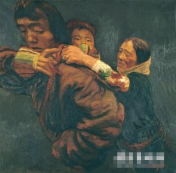

<!-- # ＜摇光＞责任的来源 -->

**现在的我们仍在争取一张选票，仍不能获得有效的参与，很多有选票的国家却投票率比较低，他们只是把参与当成了一种权利，多年的有效参与让社会相对公平，选票后面的利益减少，积极性降低是必然的。缺少广泛而有效的参与会让社会陷入危机，危害每个人的利益，消灭这个潜在的威胁，至少多数人的有效参与是必须的，为了争取社会公平我们宣扬参与是一种权利，而为了预防不公平的参与则是责任。

**

# <摇光>责任的来源

## 文/阿复 （郑州大学）

父母抚养孩子和子女赡养父母、一个人热爱自己的祖国，这些责任被人当作天经地义的事情，而没去思考何以存在这些责任。前者几乎不存在争议；虽然围绕爱国有一些，但也都是在达成爱国的共识下，争论的只是到底做什么是在爱国和有些对国家有利的事情是否不顾道义也要去做。

常有人被斥为不负责任，总有人要我们对这负责，对那也负责。只要活着，我们都无法逃避责任的烦扰，意识强的责任我们很容易就能认识到，也有一些我们从不认为是我们的责任。真可说搞的我们好乱啊！但无论什么责任都存在一个共通点：责任存在之处，必存在某些需求。没有需求，我们为尽责所做的的一切都成了多余，谁会承认你是在尽责。

父母之于子女：人到老年，就会对子女存在很强的依赖性，老人的生活需要子女提供一些辅助；刚坠地的婴儿没有人的哺育无法存活，这种需求决定了父母对孩子责任。每个家庭孝敬老人的方式都不会相同，或偏于物质，或者更在于精神层面。物质匮乏的时代，人们对孝心的理解偏重于物质，物质丰腴则精神层面获得重视。可称之为缺啥给啥，如果不缺的你毫不吝啬，缺的你不给，套用《关云长》中曹操的话：你不是蠢蛋就是坏蛋。

中国文化中很注重孝，这种文化氛围让孝中含的道德色彩过强。道德之下，孝与生俱来，无人能推辞。如果你想自问一下，还没等经过大脑人都已经被骂了。我想剥落其中的道德成分，去探讨一些孝的问题。不妨假定人的死亡总是突如其来，没有一丝征兆，既在年龄上没有规律可循，体力和精力都是恒定不变的。每个人都可能在某一天一命呜呼。这样人出生则能独立生存，不随年龄的增长而出现生理机能的下降，人因机体衰退产生的精神空虚感则无从谈起。父母与子女之间就不再幼年需要抚养、老时需要赡养。他们之间的依赖度急剧下降，关系则类同于朋友。父母不必抚养孩子，孩子也不必像现在这般尽孝了。因情感和物质需求而形成的以现在家庭为单元的社会变成单纯因情感为基础的以夫妻为单元的社会。

一般情况下，做父母的都应该给孩子一个美好的童年，但也有言曰：穷人的孩子早当家，家庭的缘故，他们的父母没有那样的能力去承担普通父母的责任。过于辛苦的父母则需求减轻些负担，面对现实的需求，孩子做更多的事情、比同龄人更体贴父母则成了他们的责任，责任从来没有固定的标准可以遵循，环境不同则会有不一样的需求，责任也会随之变化，有需求就要有人去担负责任。

自然界的生物，都必定会接触责任，虽偶尔承担责任的方式显得很残忍，可这种承担是不可缺少的。比如非洲的红螯蛛是一种自食母的蜘蛛。幼蛛要啮食母体（自想母体应该感觉到痛，但也无法幻想母体当时的心态），如果没有母体的自我牺牲，就不会有红螯蛛种群的延续。种群延续的现实问题需要母体的牺牲，这种牺牲是红螯蛛的种群责任。

制度：历史上好的政体从不是只有一个人或者一群人玩的，而一个人一群人玩的短期可能有些效果，但长期看必是一种失败的政体。现在的我们仍在争取一张选票，仍不能获得有效的参与，很多有选票的国家却投票率比较低，他们只是把参与当成了一种权利，多年的有效参与让社会相对公平，选票后面的利益减少，积极性降低是必然的。缺少广泛而有效的参与会让社会陷入危机，危害每个人的利益，消灭这个潜在的威胁，至少多数人的有效参与是必须的，为了争取社会公平我们宣扬参与是一种权利，而为了预防不公平的参与则是责任。参与从争取公平演化成预防不公平。

慈善：比于美国，中国的慈善事业仍在缓慢成长，公众的慈善意识仍在培育。社会中除了已经占据很多资源的既得利益者，还有一些人也不希望社会公平，他们相信着自己能在不公平的社会攫取更多利益。中层者和弱势者则不同，他们代表着对社会最重要的需求，社会终将向着更公平，更正义，更幸福的方向发展。多数人的期望如同每个人降临时签下一份契约：将来如富有要帮助弱者，假如困顿则会得到帮助，以使社会得到更多的幸福，正是基于社会对更多幸福的追求，弱者获得帮助成了一种需求。

当然参与和慈善这两种社会责任意识需要时间来强化。如果采取强制性措施则可能事与愿违，在澳大利亚则强制选民参加投票，无故不参加投票将被罚款。

内政？

世界真让人惊讶，一不小心咖啡同志都玩了三四十年。到西方对利比亚采取军事行动时，很多人拿‘国家与国家之间只有永恒的利益没有永恒的朋友’来鄙视参战国。本来用动机论来代替效果论就有问题，更别提没弄懂别人的动机。一件无论对利比亚人民，还是对干涉国来说都是有利的好事，却诋毁的如此不堪，被我们上升到道德高度，这和古代鄙视经商一样无知。如果说苏联解体之前，插手别国事务的国家多怀鬼胎，那今天适当的干涉则显得尤其必要。当利比亚人民面对咖啡的强暴需求有人加以制止，一些国际组织恰能满足这种需求，而出于对弱者的同情和对强权者的惩罚，无论是谴责，制裁，还是军事行动，都是被强暴人民的需求，这种需求国际社会来承担责任。国际性的组织也应承担起责任。

一种责任意识的不断增强，最终会上升到道德高度，甚至被提到法律层面，通过它们保证责任得到承担。世界之所以悲剧：是需要去承担的责任你不知道，而你却认同了那些没有需求的道德和罪恶的法律……

（来自投稿邮箱；责编：项栋梁）
