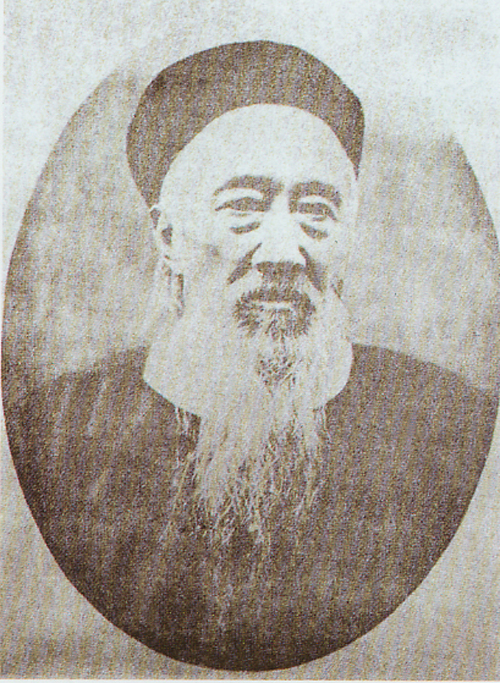
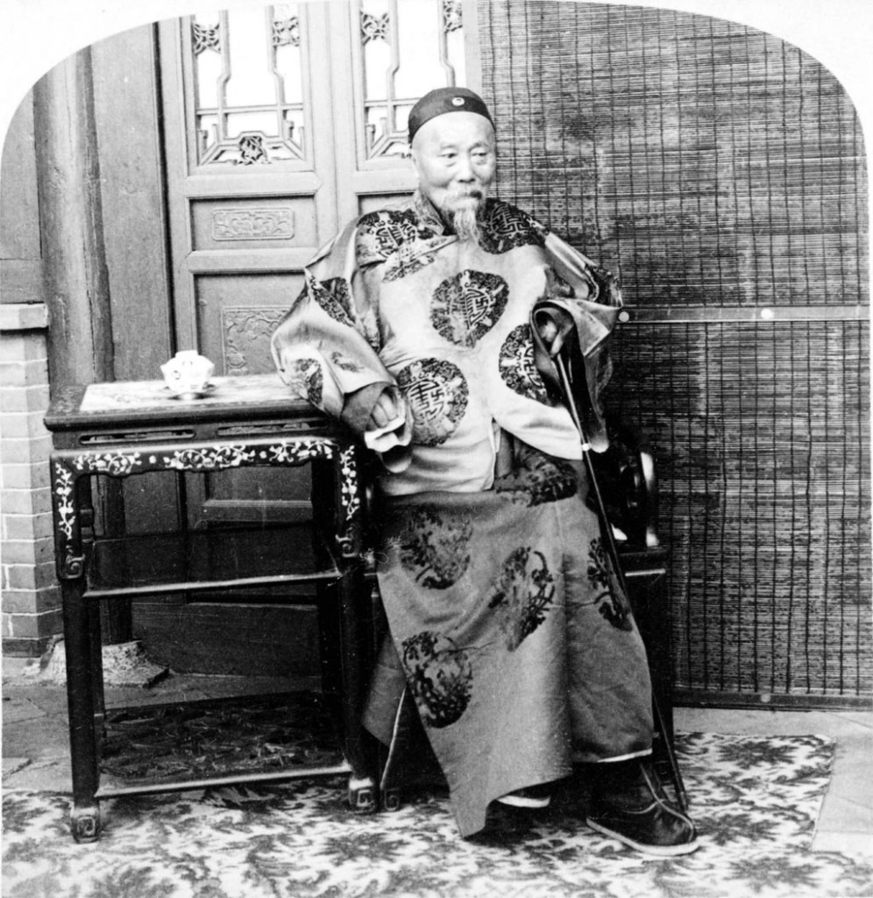

<!-- # ＜天玑＞少女藏刀（三）：岂有豪情似旧时 -->

**今人多誉曾而毁李，将曾国藩与李鸿章分别划作理与势的代表人物，不免失之公允。在那样一个节节蜕变的时代，鲜有人能够保持信念与行为的全然一致，大多徊徨于理与势之轻重权衡间，在我看来，危局乱世复杂多变岂能一以贯之，有所矛盾有所彷徨才是真实而深刻的人格。**

# 岂有豪情似旧时

**

——理势之辨与士人精神**

## 文/花爷（复旦大学）

一 19世纪的中国社会，西方文明冲击所带来的新旧消长翻天覆地于倏起倏落之间，时人呼之为“千古未有之变局”、“智勇俱困之秋”，既有山河破碎之痛心惨目，亦有突临奇变的惊惶无措及大梦乍醒的四顾茫然。

清朝并非养士之朝，百年文祸绵延更使文气一度萎靡消沉，而晚清后期却于内外交困中蓬然勃发一股淋漓士气，西方列强之入侵、太平天国之作乱，实为召唤出儒生中最为刚毅敢行的一群。他们越众而出，心怀匡扶社稷之使命意识自觉肩起时代的重任，挺立于风口浪尖而成为乱世洪流的中流砥柱。以天下为己任的儒家传统赋予士人担当世运的共同的责任意识，同一种品格却在以变制变的历史进程中催生了这一群体自身的分化与背离，以致渐行渐远而嬗蜕为不同派系，实乃殊途同归——同怀满腔救国济民的深挚心血，各趋向理与势的两端而相互抵牾，此类冲突有时表现为个体与灵魂的脱节，是以在历史之拐点，守旧与开新的往往是同一批人。其间卓然者不胜计数，个人而言，当以曾国藩、李鸿章二人为最。

理与势的矛盾在这二人身上同样表现得异常明显。今人多誉曾而毁李，将曾国藩与李鸿章分别划作理与势的代表人物，不免失之公允。在那样一个节节蜕变的时代，鲜有人能够保持信念与行为的全然一致，大多徊徨于理与势之轻重权衡间，在我看来，危局乱世复杂多变岂能一以贯之，有所矛盾有所彷徨才是真实而深刻的人格。正如曾国藩身上留有传统义理为现实事功所倾轧的痛苦的辙痕，李鸿章身上同样具有越出务实功利之外的士人之风，皆有可感可佩处，读史切莫概而论之，应怀抱同情之理解、宽容以及最大的真诚，去辨识故纸堆中那些模糊的面貌，还故人以客观、公正之评价。

二 曾国藩向来被目为士大夫理想人格之化身，他极重修身养性、煅淬人格，“其为日记，力求改过，多痛自刻责之言”，其严苛甚至到了丑诋及于梦寐的地步。然而就是这样一个深浸于理学名教的传统知识分子，却一手创办了湘军，操办团练之初即因酷刑严法、杀人如麻而被称作“曾剃头”，日后横扫太平天国之时，更是处处显出与礼教所倡恻隐之心丝毫无涉的悍酷恣睢。当然，曾国藩以书生而操杀人之业，是与他捍卫名教的人生信念内在一致的，更因其信念坚定而更加不能宽容，是以“世皆称之，至谓汉之诸葛亮、唐之裴度、明之王守仁，殆以无过”，尽管孔孟程朱之教以书生建立武勋的方式表现出来，显得残酷而荒谬。

倘领兵缴匪尚能算作道德取向占据上风，在随之而来的觉醒过程中，曾国藩所面临的抉择便使他深深陷入理与势相互撕扯的境地。他比拘于义理之辩的朝中清议更多地接触现实、更清醒地认识到西方文明之坚不可摧，尤其在第二次鸦片战争后，对自强的强烈渴求使得有识之士不得不向时势作越出常轨的回应。

若说早年开眼看世界的林则徐、魏源尚畏惧清议而不敢放手革新，负中兴重臣之名、掌封疆大吏之权的曾国藩则大可阔步前进。他确实创下不少事功，设机器局，立翻译馆，送幼童出洋学艺，皆为开风气之举，然而他心中固念中国旧文化，因此是怀着对民族劫难的痛愤与守护中华传统的决心，“不得已而为之”地由经世之学延伸至洋务。于是他一方面在“借法自强、以新卫旧”的过程中，因内心道德主义为功利主义所抑而委屈苦闷；一方面又在排斥事功只论是非的朝中清议之下战战兢兢。观其在此期间所写的日记、书信，始终萦绕不去的是一种心力俱困的彷徨。他后半生如行钢索，如履薄冰，苦心维系义理与事功的平衡，而这平衡终难长久，曾国藩晚年抱病处理天津教案时，中国传统义理面对西方蛮霸强势因实力悬殊而溃败，最终使他身败名裂，从他事后所写“内疚神明，外惭清议”八字，足见沉痛苍凉。曾国藩“晚年衰病，犹日从事于经史”，他疲惫的灵魂需要在经学义理所搭建的精神家园中方得喘息，而经由他一手引入的西方文明，却正以摧枯拉朽之势毁灭他毕生舍命相护的传统文化根基。亲眼目睹这一切发生以前，曾国藩在矛盾的痛苦中郁郁而终。

三 相比之下李鸿章似乎潇洒许多。同样在太平天国一役中以淮军建功勋从而崛起于晚清之政坛，李鸿章倾半生之力办洋务，并比他的老师走得更远。李鸿章在学术造诣远不及曾国藩，更缺乏一种自觉砥砺人格的修身意识，因此不似后者对传统文化道德攀附得那样深；他自信“生平不解空言高论，只知以实心办实事”，也正是因为其惯于以事功作衡量标准，从而与传统儒家文化中的义理道德之辨渐成陌路，以至于有“孔子不会打洋枪，今不足贵也”之语。

当时世议多“以骂洋务为清流，以办洋务为浊流”。清流对李鸿章之多加谤毁，首先恶其洋务舍民生而逐富强，以近代工商之强行殖入生生拽裂自然经济与市场之联系，独亢国家权力而淹掉匹夫匹妇与苍民众生，此举自与中国传统政治理想中的王道义理不能兼容；再者，李鸿章用人尚实干才能，“文章道德，尚在其次”，“好以利禄驱众”，是以汇聚在李鸿章身边的人又自成有别于过往理想官吏的一群：他们本受利益感召而来，重实事实功的背后是由德行缺失而漫溢的贪欲私心，由此而造成种种贪污渔利、中饱私囊的污秽行径随洋务掀起的波澜而泥沙俱下。更令重义理者所不能接受的是，伴随着富强之说挟汹汹之势搅动社会人心，其重事轻德的人才取向必然造成传统君子人格的衰颓与式微。

然而，比之曾国藩，李鸿章固然少一分苦心孤诣，却多一分强毅力行。他一心办实事“不避劳苦，不畏谤言”，孤独地直面困窘而为天下作计承难。在惨淡经营二十年的北洋水师全军覆没之后，他默默吞咽巨创深痛的同时更要直接承受国耻骂名；面对战败后不得不委屈求和之局面，无人愿担此难事与污名，又是他在“廷议”的催逼推挽之下白发远行，凄凉东渡，带回一纸屈辱条约与一身染血朝服。以重事功轻人格遭半生非议的李鸿章，临难所表现出的“无论若何大难皆挺然以一身当之”的血性与刚强，却是当世所罕的。庚子事变后李鸿章奉诏“入都议和”，去见僭居西苑的联帅德瓦西时，入苑门即徒步，人劝其乘舆，他含泪答“犹是君门，老臣何忍忘之”。此深植于传统士人心中的君臣之思、家国之哀，更远非日后“卫士持枪似虎熊，恒温入觐气何雄”的袁世凯之辈所能比拟。

四 曾国藩说：“因事端艰巨，畏缩不为，俟诸后人，则后人又将托辞以俟后人，且永无自强一日。”回视那段风云诡谲的岁月，虽隔百年仍能想见其举步维艰境况：前无古人，后无来者，内忧外困，左支右绌，然而即便如此，这批孤独的先知先觉者仍然愿为且敢为天下先，倾毕生之力探索自强之路，其苦心若是，当为之一哭！

从曾国藩到李鸿章，无论其德行修为有何差异、路径手段有何分歧，他们始终共守一种以天下为己任的自觉自愿，以及终身不能去怀的、与世运相连的苦心和忧患，使得他们在探索之路上犹疑、气沮而不折不挠，最终铸就个人之于历史的悲情与荣光。此后是康有为七上皇帝书，谭嗣同以血荐轩辕，严复化天演的肃杀作啼血心声，梁启超以文字作风雷起八方激越，陈独秀慷慨雄辩启民智，孙中山遍求良药疗沉疴……国难时危之际，这个民族不能没有担当，而担当实涵育于中国传统文化浇铸而成的士人精神，正所谓“士不可以不弘毅，任重而道远”，这样的品格也正是整个知识分子群体在百年自强的雄关漫道上分化分裂而又相兼相容后最终殊途同归处。

义利之辨、理势之争至今犹存并愈演愈烈，今人多作褒曾贬李之论，或欲盖而弥彰。清议指摘李鸿章“唯利之视而不顾义之安，唯功是图而不念道之悖”，士大夫的郁愤难平实际上是同远望来日的深重忧患连在一起的，他们真正害怕的是功利主义四处漫溢终将侵蚀二千多年儒学在人心中构筑起来的道德界限。历史的恐惧在百年后的世界得以应验，而心系世运、弘毅笃行者的脚步似乎渐行渐远去了。对实事实功的追逐也便随士风的消泯而沦为麻木不仁的寡廉鲜耻与私欲公行。追古思今，唯余慨叹：

岂有豪情似旧时，鱼与熊掌两由之。

（采编：黄理罡；责编：黄理罡）
