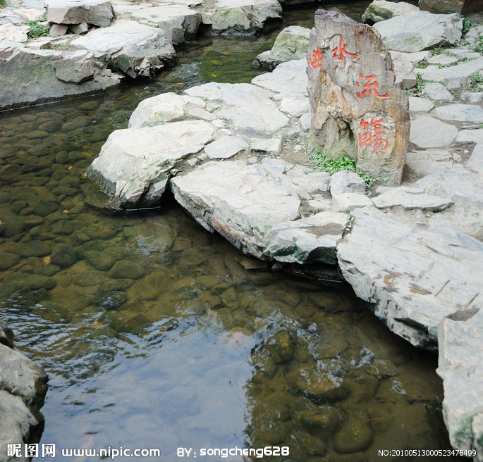
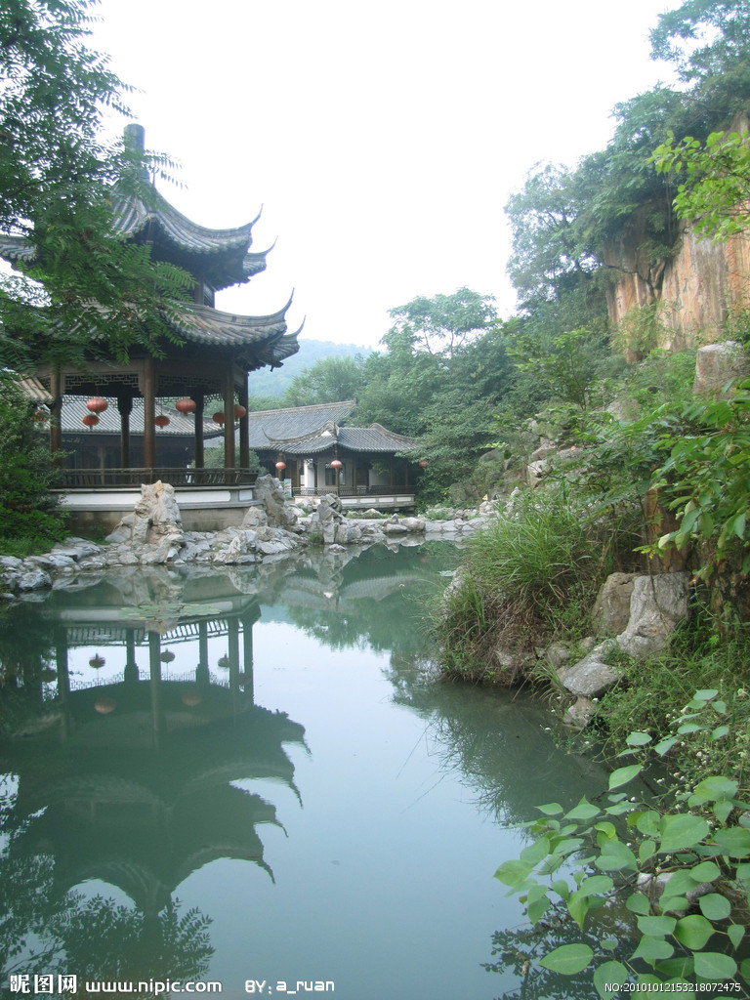

<!-- # ＜天权＞游人不管春将老 -->

**文人在宋朝，是幸福的。虽然，身闲酒美惜光景，唯恐鸟散花飘零。有宋一代的华丽，不免被北狄所趁，再无中国。元朝延续下来的廷杖，更是将文人的地位一次次降低到零落成泥。**

# 游人不管春将老

## 文/张以哲（南京农大）

欧阳修一直是我很喜欢的人物，他近乎于一个在幕后操作和指引一切的角色，提携一切后进，鼓励他们出位，推动青年发展，培养晚辈自立。

他还比较固执，在政治上即可明显看出，范仲淹时提倡改革被贬，青苗法时批评之又被贬。然而他还很新派，作文，袁枚说他学韩愈，而又独树一帜；作诗，流畅自然，平实直白，一反西昆体靡靡之音；作词，又绮丽婉约，如南唐再现。

他教育，或者引荐出了苏洵、苏轼、苏辙、王安石、曾巩这些人。这样推动时代很好。

他在扬州的时候，说：“平山阑槛倚晴空，山色有无中。手种堂前垂柳，别来几度春风？文章太守，挥毫万字，一饮千钟。行乐直须年少，尊前看取衰翁。”对于古代文人来说，最高理想就是“文章太守，挥毫万字，一饮千钟”。孔融说过：坐上客恒满，尊中酒不空，吾无忧矣。

欧阳修还会遣人从十几里外的邵伯湖里摘来荷花，以类似流觞的玩法喝酒。“欧公每暑时，辄凌晨携客往游，遣人去邵伯湖取荷花千朵，以花盆分插百余盆，与客相间。酒行，即遣取一花传客，以次摘其叶，尽处则饮酒。往往漫夜载月而归。”这等浪漫，不必挥金如土，不必钟鸣鼎食，不必山珍海味，只需在平山堂上高卧，深谷下窈窕，高林合扶疏，手把荷花一朵，闭目参禅，努目饮酒。

因而，苏东坡第三次来到平山堂，欧阳修已经故去，离“挥毫万字”之词已经十年，坡仙则不得不留下“三过平山堂下，半生弹指声中。十年不见老仙翁，壁上龙蛇飞动。欲吊文章太守，仍歌杨柳春风。休言万事转头空，未转头时是梦”这样的诗句，真真正正唤醒痴愚不少。非辗转踌躇一生感慨，难以体会此词中所含的“物是人非事事休，却道天凉好个秋”的空虚超然。

欧阳修当年也穷过一阵子，喔不，是两阵子，小时候他家就很穷，穷的跟范仲淹有得一拼。范仲淹是煮一锅粥，等干了切成四块，一天两顿各吃两块，然后把咸菜切成菜泥，洒在上面稍微起点味。欧阳修家也穷，买不起笔，“太夫人以荻画地”，不得不去河边摘去芦苇杆一枝，画地教子。欧阳修因为政见不和被贬到夷陵的时候，他的母亲大人则很看得开，说：“汝家故贫贱也，吾处之有素矣。汝能安之，吾亦安矣。”

所以说，一个人成才与否，和自己的母亲，有很大的关系。

欧阳修对书法、绘画、金石、音乐、历史都有相当造诣，自己也是大儒。他的家诫，可见其尺度之森严：“玉不琢，不成器；人不学，不知道。然玉之为物，有不变之常德，虽不琢以为器，而犹不害为玉也。人之性因物则迁，不学，则舍君子而为小人，可不念哉？”虽然古人拿琢玉比人之成才，欧阳修却又提出了更新的观点，玉不成器，尚且是玉；人一旦不成器，则不成君子而成小人。成人成才，皆在一念，被外物随意变化，就会悲剧。

虽然如此，欧阳修也不免被人攻讦。历来想把一个人搞臭，都只能从男女关系上入手，欧阳修则被诬蔑两次，一次说是乱伦，一个说是扒灰。被政敌构陷，附会诗文——如乌台后事，一时间不得不左右支绌，这等事情，解释又不是，不解释又不是。所幸文坛领袖历来持身甚正，宋神宗亲自出面，将诬陷之人贬官——宋朝所谓“文字狱”，大多是此理，均为党争，最上层领导对此却是不甚认同。后之满清，不可同日而语。

文人在宋朝，是幸福的。虽然，身闲酒美惜光景，唯恐鸟散花飘零。有宋一代的华丽，不免被北狄所趁，再无中国。元朝延续下来的廷杖，更是将文人的地位一次次降低到零落成泥。

在文人气息上，宋是和魏晋最像的。然而文人的理想年代是宋，而不是魏晋。

曹操毕竟容不下孔融，一刀杀了；司马昭毕竟容不下嵇康，一曲终了。而醉翁亭记之后“欧阳公记成，远近争传，疲于摹打。山僧云：寺库有毡，打碑用尽，至取僧室卧毡给用。凡商贾来，亦多求所本，所遇关征，以赠监官，可以免税。”为了摹拓欧阳修的《醉翁亭记》刻石，竟至于把寺庙的毡子都用完了。

这等尊重文化的民间习气，除了向往，只能默然。

对了，附提一句，醉翁亭记刻石，苏轼手书，流传千年，文革时被红卫兵砸了。

（采编：黄理罡；责编：黄理罡）
