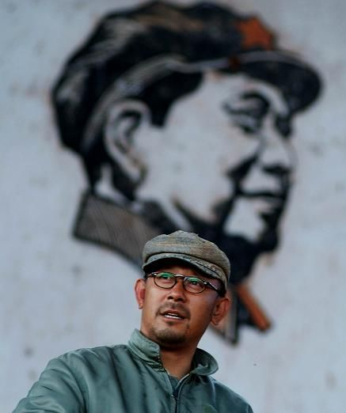
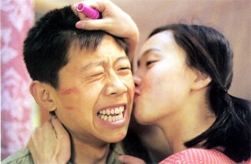

<!-- # ＜玉衡＞《阳光灿烂的日子》：亦真亦幻，梦耶非耶 -->

**人们喜欢把中国社会目前的“礼崩乐坏”归咎于文革，其实这是不负责的说法，所谓的“礼崩乐坏”其实完全是社会转型的必然阶段，人们在重新追求物质和精神生活的过程中必须要经历思想上的激烈震荡。《让阳光灿烂的日子》既是一部色彩浓郁的怀旧相册，也不啻一部现代警示录。**

# 《阳光灿烂的日子》：亦真亦幻，梦耶非耶

## 文/昨夜西风（山西大学）

我出生时，《阳光灿烂的日子》中的故事的发生年代刚刚过去不久，但是那个特殊时代的尾巴时常会在儿时的记忆中不自觉地留下些许痕迹，这些痕迹让我对于那个年代总有一种莫名其妙的亲近感，从理智上我很清楚那个年代的疯狂和罪恶，但从感情上我却极其向往那个年代的热情和诚挚。在我看来那个时代有一种“虚假的真实”，比之于现在这个时代的“真实的虚假”，它与我的精神乌托邦更加契合，片中马小军一句台词“我也可以作证，那时候除了一些政治品质可疑的干部，贪官污吏凤毛麟角”足以为我的这些“一厢情愿”提供最有力的支持，所以我无条件地喜欢《二十四城记》、《山楂树之恋》等等带着深深的过去烙印的电影，而《阳光灿烂的日子》中那些在记忆中越来越珍贵的飘散着青春汗臭的金黄色则时常萦绕在我的心头，挥之不去。

当年初看《阳光灿烂的日子》，我根本没有意识到那个一脸穷酸知识分子模样的人竟然是后来执内地贺岁票房之牛耳的冯小刚，如今一脸白癜风的著名导演冯小刚在那时已经表现出足够吸引人的演技了，别管有人怎么看不起他的作品，但事实就能说明一切，奇丑无比的冯小刚就是个牛逼人物，不服也得服。当然《阳光灿烂的日子》的开篇就给我造成梦幻感觉的并不是冯小刚，而是乱哄哄的课堂和那一堆煤球。我的童年和少年是在和北京纬度差不多的某个盛产煤炭的北方城市中度过的，那里的很多风土人情日常事物和影片都有相似之处，尽管那时文革已经结束好多年了，但是很多事情的改变并没有那么快，特别是片中纪律不整的课堂竟然和我曾经的学校生活出奇地相似，那个穿堂而过的痞子学生在我的那所不入流的学校中真实而频繁地存在过，只是相比于冯小刚扮演的老师的外强中干，我的同样戴眼镜的老师却敢于提着椅子腿和前来学校捣乱的社会流氓在操场进行搏斗，当年的那场“生死大战”野蛮而彪悍，那位老师血染征袍但一战而成名，成为很多学生心目中的偶像，他的勇气为我们的班级甚至学校换来了一段难得的宁静时期。这种乱象其实是跟文革武斗遗风一脉相承的，《阳光灿烂的日子》中后来出现的马小军拍板砖事件以及那场没有发生的械斗，简直是我曾经的学校生活的翻版，当然我没有那样的胆量和气魄亲身参与其中，否则我的人生可能是另外一番景象，这也是我为什么离开家乡的一个重要原因，就像姜文在《让子弹飞》中说得那句台词“我跟他们玩不起”，玩不起的我只好逃离了我的家乡，一别多年，只是影片里发生的所有这些让我有了一种亦真亦幻的感觉，所以影片开场十分钟我便已情不自胜了。

《阳光灿烂的日子》是讲的文革中的故事，但是整部影片除了开场那“祖国山河一片红”的背景和其他地方隐约可见的标语之外，根本感受不到“文革”的任何影子，有的只是在空气中肆意飘荡的青春荷尔蒙和无处不在的性隐喻，时代变了，人们表达感情的方式也变了，可有些东西的本质是不会改变的。马小军对于米兰的爱恋属于标准的姐弟恋，在属于青春的那个时间范围内，几乎每一个男生都有一个相对年长的女性作为暗恋的对象，这种爱恋在一定程度上是包含着寻找母性的端倪，马小军对米兰的痴迷就是如此，这也一定是姜文的个体经历，所以他才能把那种感觉拍得真实而热切。

马小军是一个经典的形象，他几乎可以看成是60年代—80年代这三十年中国所有男性少年的一个缩影。他聪明，但功夫好像总用得不是地方，他人品不坏，但却总是惹是生非，他能力不足，但却时常爱逞能。他的母亲经常骂他并且稍带上他的父亲，要知道，那个时候的大多数中国女性绝对没有现在这样的独立和自我，她们嫁了人往往就意味着为家里的男人操劳一生，自我价值根本谈不上。《阳光灿烂的日子》是一部男性电影，女性在片中其实扮演的是反抗男性的角色，马小军之母对男人的怪怨就是一个生动的例证。而刘北蓓和米兰似乎是被片中的男性围着转的，可是刘始终处于边缘位置，甚至一度都无法确定这个人物的真实性。而米兰虽然是片中几个男性的爱恋对象，可是她看起来只是一个成熟美丽的肉体，话语权根本不在她那里，而她最后也消失得无影无踪。由于米兰而发生在马小军和刘忆苦之间的争执，本来就是雄性世界里的标准样板戏，这本身就是一个关于男孩到男人的故事，与其说是马小军疯狂迷恋米兰，倒不如说是马小军从米兰身上试炼着成为男人的必经阶段。

马小军和米兰其实从来都不是一个世界里的人，马小军还是个单纯得依靠逞能来吸引别人注意的小孩，这从他因一时冲动爬上烟囱就可以看到我们少年时代的影子。而米兰已经变得功利了很多，她对马小军有意思吗？肯定有，但是那可能只是寂寞时的一点精神寄托，她真正想要的是马小军这样的人给予不了的。如果马小军代表的是情和欲，那么米兰则代表的是利和益，如果马小军代表的是纯真，那么米兰则代表的是世俗。一个人的成长经历中必须有米兰这样的女性才完整，而“米兰”则在一定程度上是文革到改革开发这个时代转折中人们需求观念改变的一个缩影。女性的需求实际上能够代表时代的需求，米兰不是一个纯真的女性，但却是一个真实的女性，她的出现是每个青春期男人的需要，她的离去则代表着每个男人的成熟。

《阳光灿烂的日子》虽然是一部“青春性征”极为明显的电影，但是它又是一部单纯的电影，影片中有性的暗示，但却从未有性的描述。从马小军面对刘北蓓的亲吻慌乱逃避，到刘忆苦看到小弟那勃起的阴茎大骂流氓，都表现了在这个特殊时代之下青少年的某种纯真，他们在一定程度上对于性有着强烈的向往，可是又自觉地进行着道德性的克制。从这一点上说，那是最坏的时代，同时又是最好的时代。现在的观念基本上认为过去的意识形态是对人性的扭曲，其实凡事不能矫枉过正，彼时的意识形态在一定程度上让人们自律性极强，即便是像马小军、刘忆苦这样的小混混也保持着最基本的道德底线，在三十年后的今年，你还能找到像马小军这样的小混混吗？人们喜欢把中国社会目前的“礼崩乐坏”归咎于文革，其实这是不负责的说法，所谓的“礼崩乐坏”其实完全是社会转型的必然阶段，人们在重新追求物质和精神生活的过程中必须要经历思想上的激烈震荡。《让阳光灿烂的日子》既是一部色彩浓郁的怀旧相册，也不啻一部现代警示录。影片最后，已经成年的几个混混人五人六地坐在豪华车里重新审视北京这座城市时，当年那个需要他们保护的傻子冲着他们来了一句“傻逼”，而此时贯穿影片的那种诱人的黄色已经不知在何时消失，画面变成黑白，那种在物质上丰盈在精神上却老去的无奈，让《阳光灿烂的日子》在那一刹那带出了阵阵伤感。

顾长卫的摄影为《阳光灿烂的日子》提供绝佳的画面支持，大量长镜头深焦摄影和俯角仰角拍摄的运用除了让画面空间维持完整性之外，更重要的一点是这种拍摄技法常常让影片中的人和物有一种从遥远时空而来的意境，形成一种梦幻般的感觉。有多少人曾经迷失在这金黄色的梦中不得而知，但是可以肯定的是姜文的这个梦也一定是大多数人的梦，在《阳光灿烂的日子》里我经常能找到自己的影子，亦真亦幻，梦耶非耶？

（采编：安镜轩；责编：黄理罡）
