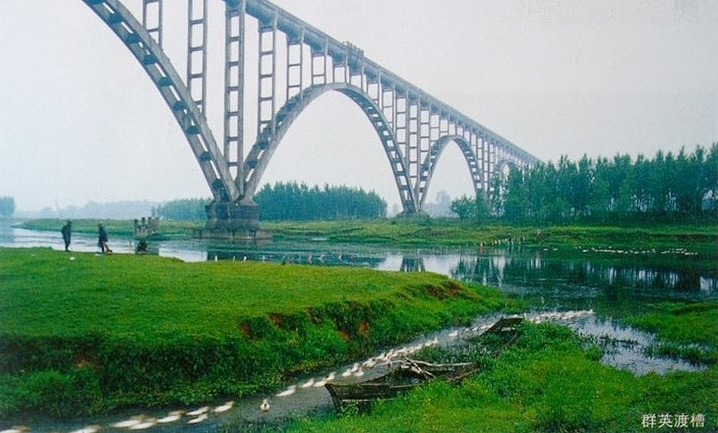
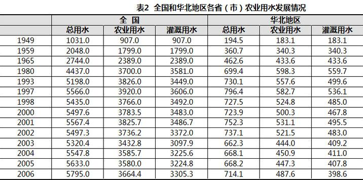
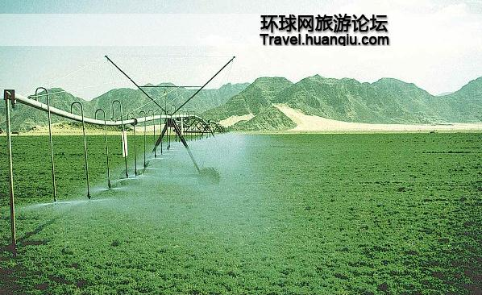

<!-- # ＜天玑＞无根之水（下）：都是灌溉惹的祸？ -->

**小时候爷爷常常会念叨“五龙治水”、“十龙治水”，会不会风调雨顺，而现如今，无论是几龙，恐怕都治不了北方的水危机，在灌溉农业的水资源浪费问题得不到解决，现代化的生产生活方式又在不断增加耗水量的局面下，北方的水危机一个死局，除非地球气候发生极大地变化，或者喜马拉雅山开了口……

**

# 都是灌溉惹的祸？

## 文/alexmaoist (北京航空航天大学)

苏拉密先生的另一长文《制度性干旱——中国北方水资源危机的社会成因》提供了一种颇有说服力的解释：大干旱的背后隐藏着一个重要的“社会制度成因”：“包产到户”终结了中国古典农业“中耕保墒”体制，逆转了毛泽东时代建立的农业“灌溉保水”方向，从而加大了农田蒸发，才是导致“大水荒”最根本的原因。

这个结论初看上去颇为牵强，似乎什么问题都能转移到赞扬毛时代伟大，鞭挞现有社会制度上。但作者的确是经过了大量的调查研究乃至亲自试验得出的这个结论。

记得小时候，每次下完雨，村里人都要去锄地，大人告诉我锄地是为了保墒。我原来很不理解，下过雨了，再锄地，地松了，水岂不是更容易蒸发掉吗？后来知道锄地是为了破坏土地的毛细现象（浅显地说，就是你把毛巾的一头放到水里，看着水沿着毛巾爬上来的现象），松土就是为了破坏土壤表层的毛细管，以减少水分的蒸发。《齐民要术》就特别强调：“锄不厌数，勿以无草而中缀”；就是说，锄地是不论次数的，没有草也要锄。《吕氏春秋·任地》论述到：“人耨必以旱，使地肥而土缓”。意思是：锄地的目的是为了防止土壤干旱，具体做法是把土壤弄细腻、酥松。

关于锄地的农谚更多了：锄头上有三宝：治旱、治涝又治草。瓜锄八遍瓜上走，谷锄七遍饿死狗（糠少）。七遍谷子皮儿薄，三遍麦子吃馍馍。一寸松土一寸墒，棉锄七遍白如霜。浇水不锄地，三天干地皮，花了冤枉钱，费了瞎力气……等等都是对松土保墒功能的生动总结。

苏拉密的文章正是从这点出发，做了大量论证，中国古典农业发端于春秋时期就逐步建立起“深耕——易耨”的耕作体制，形成了“中耕保墒”耕作体制。而在毛泽东时代，中国通过大修水利，实现了灌溉革命。但在这同时，并没有因为随时可以灌溉，放弃“中耕保墒”的老传统。毛泽东主持制定的《全国农业发展纲要》（“农业40条”），“发展灌溉”和“精耕细作”同时被列入条款。不但注意开源，同时注重节流，通过不断地田间管理，不仅能引来水，也能留住水。

苏拉密认为因为改革开放，分田到户，分散的小农不具有灌溉工程能力，但依靠毛时代的遗产，短期内仍然可以随时灌溉，但再也无人愿意顶着烈日去锄地了，但是延续千年的松土保墒却被放弃。苏拉密亲自进行了田间实验。实验结果为：放弃“松土保墒”可加大“1/2的棵间土壤蒸发”，或者“1/4的田间总腾发”。证实了民间“锄三省一”的说法：锄三遍可少浇一水。通过计算黄淮海流域现有耕地面积7.0亿亩（另一资料为5.85亿亩）；年均降水566mm ；灌溉面积3.46亿亩，2005年的灌溉用水为915亿m3；7亿亩农田包括降水和灌溉用水在内的总“受水”为3556亿m3。计算得到因放弃“松土保墒”加大的田间腾发总量每年为：3556亿m3×1/4=890亿m3；接近于1条黄河再加2条海河的天然水量；相当于10条“南水北调”中线一期工程！ 890亿m3的数字，苏拉密认为由此也就揭示了中国北方发生“大水荒”最直接、最根本的原因。

在我的记忆里，八九十年代的农民还是非常勤奋的，我的父母就经常会雨后顶着烈日去锄地，下过雨后的日头是最毒的，“锄禾日当午，汗滴禾下土”确实锄地场景的真实写照。但到了九十年代中后期，随着大量的农民进城打工和老一辈的农民渐渐老去，再没有顶着烈日去锄地了，除了播种和收获季节忙一些，一年有八九个月农民都无所事事的，而九十年代后期刚好又与北方水资源短缺急剧恶化的时间相契合（或许这是巧合吧）。

灌溉虽然还在继续，但是水却悄悄地不断在流失，水自然也就越来越少了，这是苏拉密给出的解释。个人认为除此之外还有一个重要原因，就是水利设施破坏以后，大量采用地下水灌溉的恶果。

有不少朋友都提出因为改革开放了，分田单干了，大家有积极性了，大家忙着干自己的活，挣自己的钱了，党员干部更是带头发家致富，公共建设既无人组织，也无人参加。毛时代的公共建设普遍被废弃，农村水利建设陷入停滞和倒退。

图一：如今遍布全国各地的高架渡槽已成为毛时代的标志性遗迹，随着时光的流逝，渡槽似乎也随之被抛到遗忘的角落，像一位位历史老人诉说着令人感慨的历史。他们当中，有的年久失修，自然坍塌；有的人为破坏，残缺不全；有的妨碍交通和城市建设，被迫拆除。但是他们是老一辈自力更生、艰苦奋斗的象征，也成为共和国大地上一道道靓丽的风景，一座座丰碑。

我们村子附近的的河流几乎每个村子都修有提灌站和引水渠，妈妈说，年轻的时候每到农闲就会去推土建水渠，但打我记事起，这些水利工程也就只剩下给我们这些儿童玩耍的功能了，抽水机和电动机早就被卖掉，水渠的基础被一点点挖掉，渐渐塌掉。

曹锦清先生的《黄河边的中国》一书中就有不少的例子，作者在一条农村看到水渠被破坏挖掉，就问当地人：“水渠怎能分，分了又有甚么用？”当地人答：“分掉了也可以取土填房基（高架的水渠多是用土堆起的基础）。”作者叹道：“统一的水渠也能分，中国农民分的劲头和分的彻底性实令我惊叹！”作者提到的董园村和小靳庄村的故事，两村共有一条数百米长水渠，在董园村那一段连接着常年有水的河道，可以随时抽水灌溉。董园村珍惜这条水渠，以水泥衬砌，而小靳庄村却把自己这段水渠废弃了，地里浇不上水。小靳庄村的小麦平均亩产因此比董园村低二三百斤。由此引发的一些列思考，曹锦清先生得出的结论是：“中国的农民的天然弱点在于不善合。”吴思先生由此也发了一通不同意见，我们暂且不论谁更高明。但毫无疑问改革开放以后农村的水利建设陷入停滞与倒退，这是不争的事实。2010年的西南大旱也正是农村水利建设停滞欠账三十年的恶果。

手头刚好找到一张表似乎颇能说明问题。全国和华北的农业灌溉用水都是在1980年达到高峰，而在1980年之后则成波动下降趋势。随着人民公社的解体，改革开放之后，由于分田单干，无人组织，农村的水利建设陷入停滞甚至倒退，在80年代，中国的灌溉面积不仅没有增加反而因人民公社的解体平均每年减少了736万亩。

图二：全国资料均未包括港澳台数据；原始资料引自“中国水资源利用”、“中国农业需水与节水高效农业建设”、“中国水资源公报”；华北地区1949年、1959年、1965年、1980年、1993年和1998年数据为估算值。

该存的水没有存，可用的地表水没有用，只能大量采用地下水来进行灌溉，每年的水资源利用都是赤字，地下水位越来越低，地表河流逐渐干涸，北方的灌溉农业陷入不断恶化的恶性循环中，井越打越深，水越用越少。如今北方广大的灌溉农业区基本上都是靠机井灌溉。

图三：而我们的灌溉方式又多是最落后的大水漫灌，灌溉效率极低，造成极大地浪费，我国农业灌溉用水有效利用系数为0.4-0.5，发达国家为0.7-0.8。（作者按：灌溉用水有效利用系数为灌溉水利用系数是指实际灌入农田可供作物利用的有效水量与渠首引入水量的比值。）

我国是现代灌溉技术应用程度世界上最低的国家之一。说到这里，还要提一提永贵大叔，1974年5月，墨西哥总统埃切维利亚邀请陈永贵访问墨西哥。永贵大叔不看风景名胜，却蹲在农场的一套滴灌系统面前傻了眼，愣是蹲在那儿不走了，两个小时参观时间结束了，他还不走，直到善解人意的主人答应送他两套，他才高兴地起身。永贵大叔是农民出身的农业主管，当然明白、喷灌、滴灌系统对于中国农田的重要性。在1977年的《大寨》剧组中担任摄影助理的山西电影制片厂的摄影师王安光说：“我跟随剧组到达大寨时，看到的已经是那里改造后的层层梯田和先进的喷灌设备。”

大寨试点成功后，各地纷纷到大寨参观学习。1975年，农田喷灌、滴灌系统在全国农村逐步铺开，鉴于当时我国电力供应不足，很多地方是用柴油机带着抽水机。

图四：巨大的轮式移动喷灌设备

记得第一次去寒春阳早所在的中国农机院北京农机试验站，在农机站的门口有一台巨大的轮式喷灌设备，当时觉得很新奇，从来没有见过如此巨大的机器，刚开始还不知道是干什么的，后来开始工作才知道是用来灌溉的。如此巨大的机器智只能在大规模耕作的农田上使用，估计是为当年的集体化生产准备的，而分田到户之后，土地被划分地支离破碎，这样的机器自然也就用不上了。

再插一句，北航上世纪80年代初研制的“小蜜蜂”系列轻型飞机，本来就是为集体化的农业生产准备的，我们去过的延庆刘斌堡村当年就计划买一架，可惜后来分田到户了，这种飞机也就没有了用武之地，扯远了，不好意思哈。

现代灌溉技术并没有太高的技术含量，但是需要大量的资金和人力投入，远不是单个的小农所能够承受的，个人认为分田单干是节水灌溉技术发展停滞的主要原因，没有之一。

说了这么多，我们来理一理逻辑，灌溉农业本身就是不可持续的，而华北农村在分田单干后，农村水利工程建设停滞，水库和大型水利工程渐渐废弃，本来不多的雨季降水和地表水得不到充分利用，北方农田大量依靠地下水灌溉，每年用水都形成赤字，地下水越用越少，水位越来越低，地表水也渐渐干涸。

而这不多的用于灌溉的水，由于落后的灌溉方式，用水过程极为浪费，效率极低。

在水引入农田之后，由于放弃了“中耕保墒”，放弃了“灌溉保墒”的农耕制度，大量的水又被蒸发掉，又造成了极大地浪费。

总结之，由于分田单干和市场体制，北方地区该存的水没有存住，该节的水没有节约，该用的水没有用好，该保的水没有保住，年年用水赤字，形成恶性循环，直至趋于崩溃，“百年不遇”的旱灾年年遇。

后记

家乡的南水北调工程已经热火朝天的开工了，九十年代的时候，村南的那条沟是规划的备选路线之一，整个小村子都是百米宽的河道里的拆迁区域，那时的村里人还很淳朴，听说要挖河，几年间都没人愿意盖新房——如果是在现在，知道要挖河，栽树挖井盖房的场面肯定热火朝天了。小时候一直都很期待一条波光粼粼的大河出现在村边，沿着河堤还可以一直走到北京，多么美好的事情啊。不过后来终于还是没有选我们这条路线。

曾经喜欢听刘立群的讲座，痴迷于大西线工程朔天运河，痴迷于变塔克拉玛干为粮仓，改天换地，重整山河，再造一个中国的迷梦，今天看来，那也只能是迷梦而已。

北方的水危机似乎是个无解的难题，调水工程耗费巨大，还蕴藏着巨大的生态和地质风险，调来的水也只是杯水车薪而已。在目前我国粮食供应总体偏紧的情况下，目前华北平原显然也不可能放弃灌溉农业。而在目前的市场体制和小农经营下，节水农业也无法大规模发展，有些砖家们为水危机还开出了“私有化”的灵丹妙药，如果用水这项基本人权也要被资本主义的黑手所攫取，那引来的必将更大的不公和灾难。

小时候爷爷常常会念叨“五龙治水”、“十龙治水”，会不会风调雨顺，而现如今，无论是几龙，恐怕都治不了北方的水危机，在灌溉农业的水资源浪费问题得不到解决，现代化的生产生活方式又在不断增加耗水量的局面下，北方的水危机一个死局，除非地球气候发生极大地变化，或者喜马拉雅山开了口……

补充资料： 1、漳河上游自90年代年以来，因抢水多次发生大规模武装冲突，说是战争也未尝不可。1999年春节，竟动用了“重装武器”——抗日时期的火炮！河北省涉县境内的跃峰渠、机井、生产桥、民房等生产、生活设施被击毁，牲畜被炸死。 1992年8月22日，在数十次刨损炸毁支渠之后，涉县白芟村几十位村民趁着夜色，背负着数千斤炸药，炸毁了河南林县人民在太行山腰上的悬崖峭壁上凿成的长达1500公里的伟大工程“人造天河”红旗渠，致使40万人生活断水，震动中央。 2、2006年新浪网新闻报道：

济阳县西李村农民对记者说，村里有近２０００亩地，由于今年天气非常干旱，迫切需要灌溉，而２公里外就是从黄河引水的齐济河干渠，今年黄河不缺水，齐济河

里的水是近几年最大的，但能浇上黄河水的也就是２０％。因为大部分老引水渠都被泥沙淤满遭到毁坏，没有引水渠，只能看着黄河水白白流走。这几年，当地农民不得不从机井里取水浇地。

作者注：

个人认为灌溉农业是北方水危机的主要原因，但是现代工业急剧增加的耗水，现代化的不合理生活方式，以及大规模的水污染，这都是造成北方水危机的原因。

本文有相当部分内容来自苏拉密文章及相关网上资料，不一一列举，原创内容有限，一家之言，水平有限，各位见谅。

（采编：项栋梁；责编：黄理罡）
