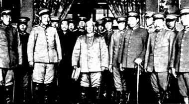

<!-- # ＜天玑＞辛亥革命反思专集（一）：孙中山一生另一面之研究（上） -->

**孙中山早期反清是有进步意义的。但民国建立后，他的不断革命给中国民主带来了极大危害。孙中山的集权专制对中国危害极大，开创了新形式下集权专制、个人崇拜的先河。由于他是国共两党共同推崇的人，国共两党都受其影响。后来的蒋、毛的集权都是学的孙中山。孙中山可以说是中国党国、党军的创始人。总的来说，孙文

有理想有抱负，但是个志大才疏，政治能力偏差的政客而不是圣人。**

# 孙中山一生另一面之研究（上）

## 文/荣欢（安庆师范）

**满清是孙中山推翻的吗？

**

说起孙中山无人不知，有的人说他是“国父”，有的人说他是“先行者”。无论海峡两岸，他总是被捧得很高，似乎是千古第一伟人、释迦牟尼再世。如果只按历史

教科书或者我们头脑想象中固有孙中山形象，他是高不可摧的，我们是渺小的。然而我们多去研究民国初期的历史的话，我们会为我们失去可能走向民主安定的道路

感到惋惜，而使民国建立一直到现在，国家所受的遭殃，老百姓所受的苦难，除了社会经济制度的客观影响外，也有一些始作俑者的破坏。孙中山就这么一位。孙中

山年少时就以少年轻薄闻名，时称四大寇之一，崇拜太平天国领袖洪秀全。孙中山不过读了个卫校，拿个中专文凭出来招摇撞骗。一开口就是：“医学博士孙文”，

好似水浒林冲的台词哦，“在下东京八十万禁军教头”。就这样一个博士被后来国共两党捧为推翻满清的英雄。但事实是什么呢？

清朝的灭亡有其制度的原因，也有其现实的原因。其中满清200多年的奴化统治，外国列强的纷纷入侵，尤其是甲午、庚子两大败仗彻底摧垮了满族中央的权威影

响力。还有军事上，晚清八旗军腐败不堪，战斗力几乎没有，所有清朝后期镇压太平天国等农民起义都是靠汉族官僚自身的武装力量。其中曾国藩首次办团练，这是

一种私人武装，能有效地打压地方叛乱，但也容易产生军事割据。清朝末年各省的督军就有自己的军队保持本省的防务。所以后期清朝看似是统一的，但潜伏着分裂

的危局。1911年，武昌起义后，后来各省纷纷宣布独立，后来袁世凯北洋逼宫，彻底葬送了清王朝。为什么汉族各省的督军宣布独立了？满清多年的统治以及皇

族内阁导致汉族极其不满，包括汉族官员和百姓。所以武昌起义后都响应，武昌起义和四川保路运动有关，偶然暴发。武昌起义跟孙中山也没关系（起义时孙中山在外国还不知道有武昌起义），甚至武昌起义还有张之洞的新军成分，各省独立的督军也有袁世凯的部下。那时候袁世凯的威望很高，当时各省督军和立宪派都商议袁世凯当总统以待他反正。

孙中山的革命党实际是一群搞暗杀爆炸的小组织分子，没什么实力的。但革命党中的某些思想家写的一些书对思想上瓦解满清有进步意义，比如邹容的一些书。而

实际行动中多次“革命”活动事实上并非由孙中山直接领导，而是由黄兴筹划与统帅，当时人们把孙黄两人并列。革命党内，认同黄为实际领导革命的党人也很多。

如1906年，在讨论中华民国国旗时，孙中山主张青天白日旗。黄兴主张用井字旗，认为青天白日旗的形式不美，并认为与日本太阳旗相近，有日本并华之嫌。双

方争执不下，孙中山坚持己见，黄兴力争不得，甚至大怒，誓言要脱离同盟会籍。1907年，光复会的章太炎、陶成章等人以潮州起义失败为由，要求罢免孙中山

的总理职务，另举黄兴担任，黄兴推辞。最终光复会退出中国同盟会。可惜的是1914年孙中山在日本组建中华革命党时候强迫别人按手印效忠服从自己，黄兴不满孙中山集权专断跟他闹翻了。革命党分为东洋系和南洋系。1928年北伐胜利后，孙中山的嫡系蒋介石把黄的人马也都排除在国民党之外。

武昌首义，黄兴倒是参加了武昌战争，而孙中山当时正在美国打工端盘子呢！当孙中山从外国报纸上看到武昌起义的消息，

赶紧从外国跑回来，下山摘桃子，趁袁世凯逼宫前当上了总统。孙中山当上的总统是所谓的17省都督推举，参加选举的有直隶、奉天、山东、山西、河南、陕西、

湖北、湖南、江西、安徽、江苏、浙江、福建、广东、广西、云南、四川等十七省代表四十五人，孙中山获得十七张有效票的十六票，当选为中华民国第一任临时大

总统。当时的被选举人只有三位，孙中山、黎元洪、黄兴。很奇怪的是当时参加的直隶、奉天、山东、山西等省的代表，不知是哪位都督指派的。要知道山东军政府 11月12日宣布独立，11月24日就宣布取消独立，11月27日四川军政府宣布独立。当年直隶、奉天、山东、山西、河南这些地方并没有督军，而且当地政

府还忠于满清，当时的情况就是长江以南差不多都独立了，陕西甘肃四川独立了。说这些代表是各省都督派的都很是搞笑。也就是说孙中山的临时总统位很是可疑，

虽然孙中山承认一切不平等条约有效，但还得不到国际社会承认。孙中山搞总统制，大权在握。袁世凯的北洋已经攻下武汉三镇中的两镇，下令停兵，和清朝摊牌。

孙大炮打仗也打得没钱了也老是输。所以就用南北议和做缓兵之计，没想到袁世凯逼清帝退位，彻底推翻了满清，各省都督都支持袁世凯。孙中山没办法了只好让位

于袁世凯。

孙文，他是一向不甘心退出权力的中心。1912年，孙文表示“今日革命已经成功，人民却未明革命真理，我辈不能退休”，继续为参与政治找理由。所以那些说满清是孙中山一人推翻的人要么是历史盲，要么是满遗。

**民国建立后孙中山破坏民主以及和日本、苏俄勾结的种种行为。**

孙中山当总统的时候搞的是总统制，大权独揽。而给袁世凯当总统的时候，他却搞个内阁制，让袁世凯当个“虚位“。孙中山于1912年2月13日向临时参议院

提出辞职咨文。2月15日，临时参议院选举袁世凯为临时大总统。3月10日下午3时，袁世凯宣誓就职临时大总统。3月11日孙中山以中华民国临时大总统的

名义颁布了《中华民国临时约法》。

大家看出问题来没？孙文在2月13日就辞职了，最迟在3月10日，袁世凯就是总统了。但3月11日，孙中山却以总统的身份公布一国之宪法？很是搞笑哦！

原本南北和谈的条件是袁世凯负责迫使清帝逊位，孙中山让大总统于袁。可是在袁世凯履行了诺言之后，孙又附上三个条件：（1）临时政府地点设于南京，为各

省代表所议定，不能更改。（2）辞职后，俟参议院举定新总统亲到南京受任之时，大总统及国务各员乃行解职。（3）临时政府《中华民国临时约法》为参议院所

制定，新总统必须遵守；颁布之一切法制章程，

非经参议院改订，仍继续有效。此咨参议院。如前所述，定都南京根本就是孙中山自己规定的；第二个条件就是如果袁世凯不来南京，孙就不让大总统。这根本就是不讲信用，如果你有这三个条件，为什么不早提出来。第三个条件其实倒是正常的，任何共和国需要一部宪法，但是

为什么宪法为什么不早定，却在要移交政权的时候的定呢？

后来的历史学家纷纷说孙中山被袁世凯骗了，我看却是袁世凯被孙中山骗了。孙在和谈时怕袁不答应，或者借和谈拖延时间，孙中山在此期间向各国求援，可惜无人响应。只好先提一个条件，等袁上了贼船，再抛出三个条件，这时袁世凯已没有退路可走。

孙文当总统实行的是总统制，在让给袁世凯之后却实行内阁制，这不仅

使袁世凯及其代表的北洋军不服，就是旁观者也未必会服。南京临时政府既然标榜学习美国的民主共和，却以内阁制来代替总统制，这根本就是宽于律己，严以待

人。既然这世界上民主共和的典范美国都实行总统制，我们为何还要实行内阁制呢？令人讽刺的事，孙中山1921年在广州就任非常大总统的时候再次抛弃了内阁

制。孙文被后来的国民党冠以民主共和的标签，可是从他个人的一言一行来看，我们很难看出他身上有多少民主的细胞，反而充满了对暴力的迷信。

后来临时参议院选举袁世凯当临时大总统，孙中山让位，袁世凯任命孙中山修铁路，孙中山向袁世凯保证10年修20万里铁路(到21世纪的现在我国铁路才8万公里）。袁世凯给孙中山3万大洋一个月，还给他一辆花车。但孙中山一寸铁路都没修成，反而浪费了修铁路的钱，孙中山拿修铁路的钱买军火二次革命造反了，还到日本拉赞助，即“联日倒袁”。袁世凯通缉他有一条罪名就是贪赃枉法，铁路帐目不清。我一直认为二次革命是错误的。这是民国第一次内战，在二次革命前正是我国议会民主制度的发展高峰期，一时间有几百个政党诞生，我们看到了民主的希望。然而孙中山不顾国民党内外的反对，跳开法制议会公开发动战争，开了民国枪杆子夺政权的恶劣先例。也开了民国武力解决争端的恶劣先例。

二次革命是以宋教仁案为幌子的——宋到底是谁杀的，至今史学界有争议，当时国会传票司法已经在调查了。早在唐绍仪下台前炮党恐怖分子就在武汉搞摩擦了，只

是被黎元洪破获了。而宋案是在炮党活动区域上海而不是袁世凯的大本营北京、天津。凶手武士英、应桂馨是共进会的，应桂馨曾担任陈其美的谍报科长，孙中山回

到上海后，应桂馨又被陈其美派去负责接待和保卫孙，属于国民党阵营。孙在南京就任临时大总统时，即由应桂馨组织卫队，随行护卫。宋案也可以推到陈其美身

上，所以目前有史学家认为通过宋案既清除了在国民党内的政敌，又能嫁祸给袁世凯，以达到抹黑袁世凯使袁世凯被动的局面。宋案是幌子而实际上是孙中山国民党

重新夺权的一场战争。事实上袁世凯在宋教仁死后，既没得到任何好处反而处处被动，而宋教仁至死也没怀疑过袁世凯，遗嘱是写给袁世凯的而不是孙中山。在各党派的监督下，司法正在调查下。孙中山先下手为强发动二次革命，最终使宋案石沉大海。当时孙中山的“二次革命“遭到了很多人的反对，就连以后倒袁的蔡锷，梁启超等人都反对。

有关史料： 1，茅家琦《孙中山评传》 2，冯自由《革命逸史》 3，陈锡祺《孙中山年谱长编》 4，李敖《孙中山研究》 5，曾叔度《我所经历的“二十一条”内幕》 6，俞辛焞《孙中山与日本关系研究》 7，李吉奎《孙中山和日本》 8，段云章《历有争议的陈炯明

》 9，刘忆江《袁世凯评传》 10，唐德刚《袁氏当国》 11，丁中江《北洋军阀史话》

**原文地址：** [http://blog.renren.com/blog/225318469/453798845](http://blog.renren.com/blog/225318469/453798845)

**（未完待续）**

（采编：黄理罡；责编：黄理罡）
